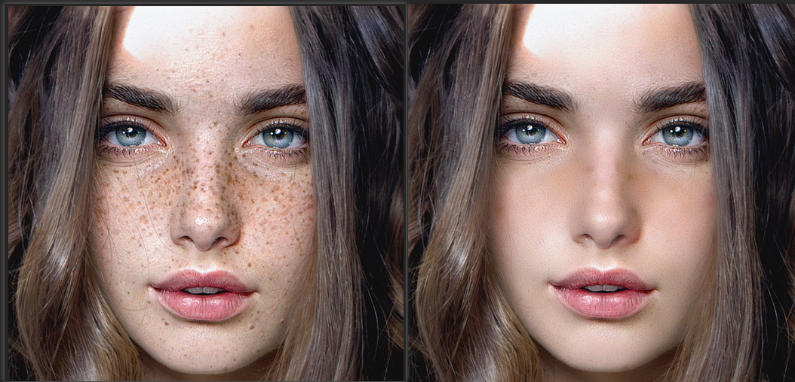

# PS

## 1. ps常用快捷键

## 2. 快速去除人物雀斑

前后对比

- 操作步骤
  1. ctrl +j 复制图层
  2. ctrl +i 反向，将图层模式改为亮光
  3. 滤镜--其他--高反差保留--将半径数值改为9左右
  4. 再次点开滤镜--模糊--高斯模糊---数值调到1.5左右
  5. 按照alt键添加蒙版
  6. 选用白色画笔，降低不透明度，涂抹皮肤有雀斑的地方

