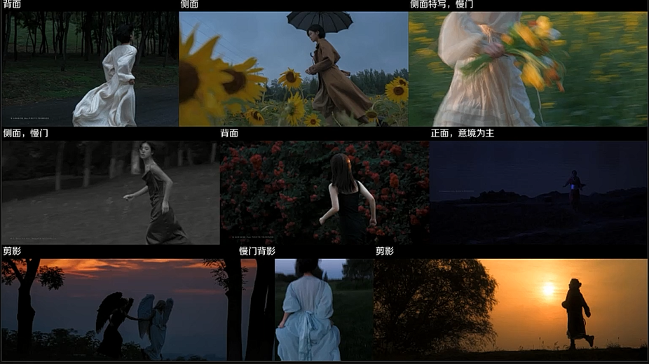
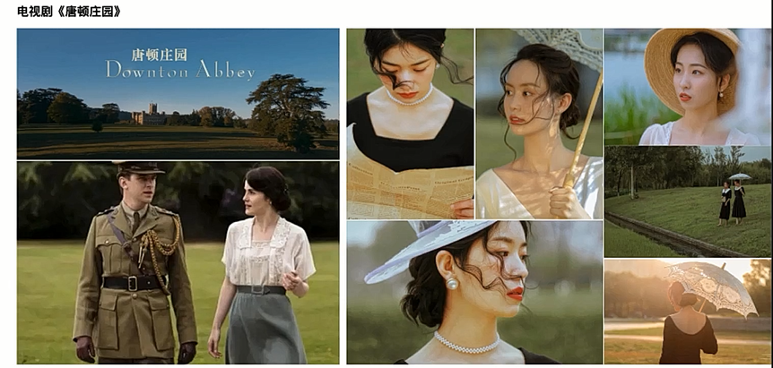

# 人像摄影

## 一 、审美体系构建

## 1 评判照片好坏的标准？

- 好的标准：标准范式？曝光准备？清晰？磨皮精美？模特好看？
- 不好的标准：过曝？晃动？虚焦？粗颗粒？

## 2 照片好看的标准

- 以上都不是，正确的应该是
  - 情感的相通：平静、心灵震撼一击
  - 好看的照片不等于好照片
  - **好的作品是技术+审美的综合呈现**

## 3 审美的重要性和特点

- 审美具有主观性
  - 审美不是简单的固定结果，而是多方面因素的共同作用
  - 它包含了一个人的学识、经历、阅历、心态、积累、生活习惯等
  - 一个人的审美是会随着时间、年龄、阅历、心态、积累、生活习惯的变化而变化的
- 想要学习一种风格，要先了解摄影师传递的情绪或个人观点
- 一切表现手法都是服务于想传递的情绪及状态
  - 表现：自由、热情、慵懒、安静、孤独...
  - 表现手法：影调、服装、妆容、情绪状态、色彩、道具、场景设定、人物动作...

- 艺术就是把美好的东西毁灭给人看
- 情绪内核决定了画面构成元素
- 避免繁琐的外在，强化人的情感
  - 并非将所有看到的事物都拍下来
  - 而是有意识的进行画面组织

## 4. 个人风格的建立

- 情绪内核+表现形式
- 审美必须要有挑剔和包容的目光
  - 挑剔自我，包容他人

## 5. 如何培养自己的审美？

### 1. 培养自己的观察力，放大自己的感受力

   - 对生活、对外界，对人内心变化的观察力，对美的感知力
   - **好的摄影师一定是极度敏感的人**
   - 注意力和观察力可以放在
     - 光、音乐、生命、美好
     - 四季更迭、凋零
     - 孤独、死亡
     - 文化、自由
     - 物哀

### 2. 看电影

   - 故事结构

   - 整体基调

   - 色彩

   - 用光、机位、构图

   - 情绪表达、拍摄手法

   - 电影清单

     

### 3. 大量阅片
   - 审美网站推荐
     - Filmgrab
     - 豆瓣
     - CNU视觉联盟
     - pinterest
     - Instagram
   - 如何正确的学习一组/z张照片
     - 一张照片最直接的感受
       - 情绪传递
     - 一组好照片的配方
       - 主题/情绪表达/事件/影调/风格/服装
       - 妆造/动作/肢体语言/构图/光线/隐喻/细节
       - 机位/配色/景深/焦段/虚实/景别/人物关系/人物环境关系
### 4. 建立审美图库--照片分类
   - 风格分类
   - 构图分类
   - 色彩分类
   - 道具使用
   - 图片管理器
     - Billfish
### 5. 收集同一风格不同作者的作品
### 6. 记录自己的灵感和情绪

- 当下的情绪
- 自我表达的欲望
- 阶段性的状态
- 瞬间的灵感

### 7. 一切艺术和生活都可以是灵感来源

- 生活
- 广告
- 文学
- 杂志
- 建筑
- 设计
- 经历
- 故事
- 音乐


## 6 如何建立自己的摄影风格

### 1. 收集1000张自己喜欢的照片

- 出现最多的就是你现阶段喜欢的风格

### 2. 尝试各种风格

- 在进步和变化中确定自己的喜好

### 3. 大量拍摄自己喜欢风格的创作

- 尝试融入自我表达
- **重复的刻意练习，才会逐渐取得进步**

### 4. 基于视觉的统一

- 视觉的统一即形式的统一
  - 影调-色彩-服装-场景-拍摄手法-道具

### 5. 对文化的理解和再创作

- 国内
  - 传统文学、服装文化
  - 节日文化、传统文化
- 国外
  - 希腊神话
  - 动漫

### 6. 内在情感的统一

- 照片传达处同样的情感内核
- 高级感建立的第一步不是模仿风格，而是自我内心情感的探索


## 二、构图美学

## 1、摄影角度/机位

### 1 视点

- 视点

  - 摄影师所处的位置，该点称之为视点

- 画面可以同时包含仰俯关系，距离关系

  - 改变视点可以改变照片的视觉效果
    - 改变距离(景别)，俯仰高度，角度

- 俯仰关系

  - 90度角度拍摄

    - 上帝视角，局外人的视角
    - 压迫感，脆弱，无力

    

  - 30度角度拍摄

    - 恋人，朋友，亲人的视角

    - 平和，宁静，美好

      

- 距离关系

  - 门框的遮挡，偷窥，远距

    

  - 走进，朋友，亲人视角

    

  - 上面两种图片展现了情绪的递进

### 2. 角度、机位

- 水平方向的角度

  - 正面

    - 与镜头交流感强，直视镜头时，对眼神，表情的要求更高
    - 正面镜头并非要直视镜头，模特眼神不到位时视线可以看向其他方向，也可以使用道具

    

  - 正侧面(斜侧面)

    - 被摄主体与镜头的交流感减弱，但可以记录人的面部表情，相对正面镜头人在画面中的立体感更强
    - 拍摄斜侧面镜头注意模特两边面部比例不要过大。高颧骨模特尽量少拍正侧脸

    

  - 侧面（正侧面/背侧面）

    - 更容易体现人物轮廓，情感更含蓄，画面更自然，人物与环境的交流感加强，与观众的交流感减弱
    - 更是恶化拍摄面部轮廓相对立体的模特

    

  - 背面

    - 人的面部容貌及表情被忽视，融入环境，留下更多情绪想象空间

    

- 垂直高度的角度

  - 平角

    - 机位高度始终与被摄主体高度相同，更为真实。平和，常用镜头

    

  - 仰角（仰拍镜头）

    - 构图的简洁化及不同寻常的视角
    - 交代被摄主体与环境的空间，位置关系
    - 情感表达
    - 仰拍镜头同样具有强烈的主观色彩，被拍摄主体显得高大，或坚定，观众弱小等心里感受
    - 仰拍的机位越低，塑造的情绪越浓，更多的时候使用高度较高的仰拍镜头来获得不同寻常的构图
    - 同样，超低机位的仰拍镜头要结合具体拍摄风格，情绪，人物性格等表达使用
    - **拍侧脸为主**

      

  - 俯角（俯拍镜头）

    - 构图的简洁化及不同寻常的视角
    - 交代被摄主体与环境的空间，位置关系
    - 情感表达
    - 不同于平角镜头，俯拍镜头具有强烈的主观色彩，抽离故事之外观看被摄主体，交代整体环境，情绪上俯视，轻蔑，人物的渺小
    - 俯拍的角度越大，高度越高，氛围越浓
    - 小角度的俯拍镜头更多的是简化构图及获得不同寻常的视角（常用）
    - 上帝视角的镜头要结合具体拍摄风格及情绪表达使用（谨慎使用）

    

    - 效果图

      

      

      

      

### 3. 总结

- 角度于景别无关
- 同个角度可拍摄不同景别
- 学会分析照片的视点，角度，俯仰高度
- 学会使用俯仰拍镜头，可以保证即使你所在的城市很少有好看的景，依旧可以出片
- **同一场景内：不同景别+不同角度+不同动作**
- **不要频繁切换场地**
- **一组作品中，要保证拍摄角度的多样性**


​        

## 2、景别(景别和焦段无关)

### 2.1 全景系列

- 分类
  - 远景
  - 大全景
  - 全景
  - 小全景（人物全景）

- 以景为主，交代故事发生的环境，以景来烘托情绪，表达宏观视野上的，意境上的审美，人只是很小的信息，表情相对不重要，注意形体


- 人物全景

  - 主要决定了人在场景中位置，人与空间的关系，明确的表现人物的形体动作是全景画面的重要作用，需要注意人在空间中的动态，人的情绪状态

  

### 2.2 近景系列

#### 1. 中景

- 取到膝盖以上的景别

- 注意力不仅在人物身上，也集中在人和环境的关系上

- 中景更为平稳和客观，但缺少情绪渲染和视觉冲击力，不似远景开阔宏大，也不似近景特写镜头有强烈的情感色彩

  

#### 2. 中近景

- 腰以上
- 中景可以刻画人物面部神态和情绪，表达内心情感，心理，性格，与观众有很强的交流感
- 人的动作，表情，眉毛。眼神方向，嘴角抽动，都会影响画面的整体效果
- 长焦镜头下，竖构图的中景中，周围的环境相对不重要。着重刻画人物
- 广角镜头则在刻画人物的同时，兼顾一部分环境，与环境交流感更强
- 同样的景别，横构图交代的环境信息比竖构图相对更多

#### 3.近景

- 胸以上的景别

  

#### 4.特写


#### 5. 大特写

- 人物面部几乎占满画面，或人物肢体局部占据整个画面，表现人物的神态特征，情绪和内心状态，或用来拍摄重要的物件细节
- 特写镜头具有极强的视觉冲击力，放大细微的情感

- 面部五官特写
  - 眼睛、嘴巴、耳朵、下巴
- 肢体特写
  - 手部、脚、锁骨、腰、背部线条


#### 6. 景别的完整序列

远景--大全景--全景--人物全景--中景--中近景--近景--特写--大特写

#### 7. 总结

- 一组不同景别镜头的组合相当于对这个人物或场景仔细，完整描述的修辞手法
- 景别和景深决定了让观众看到什么，角度则引导观众如何让观众看待画面中的人物和事物


- 多景别，多角度，组合拍摄
  - 全景10% 中景60% 近景10% 特写10% 大特写 空景 细节 10%

#### 8. 采用什么样角度、焦段和景别？

1. 观察环境，环境简洁程度，开阔或狭小，是否需要俯仰机位来规避杂乱的环境
2. 观察模特，观察人物的五官适合正脸或侧脸，人物情绪表达是否适合俯仰镜头
3. 拍摄策划中分镜头脚本的描写
4. 多个景别，多拍几张观察区别

## 3、基本构图法

### 1. 画幅比例

- 常见比例
  - 4:3
  - 3:2
  - 16:9
- 电影荧幕的宽高比通常为
  - 1.85:1
  - 2.35:1
- 竖构图除发布抖音等自媒体外避免使用9:16的构图


### 2. 影像成分

- 主体、陪体、背景
  - 人、物、光影、线条、几何关系、色彩、抽象化的氛围、情绪
  - 情绪人像：情感的表达是主体

### 3. 什么是构图

- 定义
  - 一副作品中，光影、明暗、线条、色彩、主体与陪体在画面中的结构和组成关系
  - 有意识的突出主体，引导观看顺序

### 4. 构图的基本原则

1. 简洁明确

   - 排除，做减法
   - 主体明确，主次鲜明
   - 构图元素少一些
   - 背景纯粹，干净
   - 排除不好看的，留下好看的
   - 排除与主题无关的事物
   - 排除没有相似性物体
   - 排除杂乱无章的环境
   - 排除到只剩下主体和干净的背景

   - 控制方法
     - 景别控制
     - 焦段控制
     - 改变俯仰角度
     - 前景遮挡
     - 道具遮挡
     - 改变物体空间排布（室内）
     - 二次构图
   - 总结
     - 当照片中出现杂乱需要避免的物体时，要么用排除法给出的上面7个方法解决，要么换景

2. 均衡上下，左右呈现的元素在视觉重量上势均力敌

   - 视觉重量

     - 画积大小。色彩，明暗，虚实，方向等

   - 视觉均衡

     - 上轻下重，上小下大，上浅下深

     - 错误案例

       - 下重上轻

         

   - 视线的力量

   - 模特的位置，服装色彩搭配/材质，光影，空间排布影响照片的平衡


  ### 5 . 构图方法

#### 1. 居中构图

- 常见构图，主体突出明确，但构图不易出彩
- 氛围感的构建方法：道具/肢体/色彩/层次感

  

#### 2. 三分构图

- 人物处在上下或左右的三分线处，视线相对具有明确的方向性

 

- 黄金分割点，视觉中心（常用于拍特写）

  

#### 3. 前景构图

- 在纵向空间上构建前中后景的关系，更多的交代环境
- 环境中植物矮小时，可利用仰拍用植物做前景构图丰富画面层次

  

#### 4. 框架构图

- 框中框，利用环境中的建筑、门框、门缝、亭廊等建筑进行构图

 

#### 5. 对称构图

- 双人，或者利用镜子拍摄
- 平衡、和谐、稳定、对话


#### 6. 引导线构图


#### 7. 对角线构图


#### 8. 倒置构图

- 俯拍人物，使模特头部置于画面底部，非常规构图，极易出彩
- 使用该种构图方式应注意风格及情绪表达，上帝视角的主观镜头

 

#### 9. 留白构图

- 留白并非指空白，一种宏观意向的简化和省略，更有想象空间，突出主体

  

#### 10. 曲线构图

- 利用人的形体制造曲线，或利用环境当中的曲线线条

 

## 4、高级构图法

### 1. 视线的力量-视线的平衡

- 人的视线具有方向性引导性，力量性，可以平衡画面，同样可以使画面失衡
- 该种构图方式人物看向画外，人物与环境更具有互动性，容易塑造故事感


### 2. 视线的力量-打破平衡

- 人物处在照片的三分之一或边缘处，同时面部朝向画面更窄的一边，视线的力量引起失衡，人物情绪被失衡感放大


### 3. 画面失衡构图法

- 在电影、恐怖片较多
- 画面呈现一定的倾斜，不安，不稳定，躁动，人内心的迷茫（荷兰角）

 

### 4. 利用镜子构图


### 5. 利用光影构图

- 寻找/人为制造可以投射影子的平面、树影，人影.....
- 当拍摄背景为墙面时，利用光影增加照片中的层次感，否则离墙太近不透气

- 

### 6. 人虚景实

- 观众注意力集中在景上，人物五官被弱化，环境氛围感加强

- 注意实的背景要具有一定的观赏性，小光圈拍摄

  

### 7. 运动模糊--快门控制

- A: 动静对比

  - 人或者背景或陪体，其中的一个处在静止状态，另一个在运动状态
  - 静态的二维照片由于快门的控制具有了时间的流动感

  

- B:低速快门+高速运动

  - 人和背景都处在运动之中，画面具有不同寻常的张力

    

### 8. 主体与陪体构图法

- 陪体本身要具有一定的观赏性或象征意味

- 保证人物及陪体清晰

  

### 9.  双重曝光


### 10 遮挡构图法

- 遮挡构图让画面更具有想象空间和故事感


## 5. 总结

- 构图是在有意识地通过镜头组织画面中出现的要素，而非将看到的一切都拍下来
- 构图是有意识地突出主体，规避繁杂，无关，或影响主体的要素
- 构图是表达情绪的一种手段


## 三、光线

- 光影的分布一定程度上影响画面影调
- 光影响画面整体质感
- 不同的光塑造不同的情绪
- 光影响人物皮肤质感

## 1. 光的方向

- 7种常见的光位

  - 水平方向

    - 顺光（正面光）--初学者常用

      - 光线特点
        - 光线投射方向与拍摄方向一致，灯光高度与相机高度相近，阴影在物体的背后
      - 优点
        - 顺光拍摄脸部明亮受光均匀，可修饰面部瑕疵
      - 缺点
        - 面部立体感不强，空间纵深感减弱

      - 拍摄tips
        - 利用色彩对比拉开背景层次
        - 利用前景制造画面纵深感
        - 利用光影制造氛围感
        - 利用光影制造空间感

      

    - 全侧光

      - 光线特点
        - 脸部明暗对比明显，光比较强，人物面部立体感强；当光比非常强时，会形成阴阳脸，易于塑造深不可测的性格，冲突感，戏剧感
      - 优点
        - 明暗分明，光影感强，容易塑造具有层次感的画面
      - 缺点
        - 当光比过大时，容易暴露人脸上的瑕疵

      - 拍摄Tips
        - 选择柔光时间段或打柔光
        - 对背光面进行补光减少光比

      

    - 前侧光

      - 光线特点

        - 光源位于被摄主体的左侧或右侧，光源与人形成的夹角为锐角
        - 使用最多的光线，日出后1-2小时，日落前2-3小时
        - 特点：形成明显的受光面，背光面和投影

      - 优点

        - 光比适中，立体感强

        

    - 侧逆光

      - 光线特点
        - 光源位置在被摄物体的左后方或右后方，与相机形成钝角夹角
        - 人物受光面小，背光面大，极易塑造立体感氛围感

      - 拍摄Tips
        - 选择光线相对柔和时进行拍摄，日出后半小时/日落前半小时左右
        - 必要时需要对人物背光面部进行补光

      

      - 伦脖郎光

        - 光源处在人物一侧的45度位置，距离光源远的面部形成倒三角的亮部

          

    - 逆光

      - 光线特点

        - 相机的拍摄方向与光源方向相反，与被摄主体处于同一直线上，可以作为被摄物体的轮廓光比，形成明显的明暗对比
        - 勾勒轮廓和身体线条

      - 拍摄Tips

        - 多拍侧脸轮廓

        - 如果要拍摄正面时注意人物面部补光

        - 拍摄逆光时注意背景是否过曝，可以通过改变高低机位控制

          

  - 垂直方向

    - 顶光（人像摄影少用）
    - 底光

- 总结

  - 改变光位实际是在改变照片的明暗配比
  - 改变照片的影调
  - 光位不是决定影调的唯一要素

## 2. 光的质感

### 1. 硬光

- 分类
  - 直射光：直射的太阳光；人工直射光
  - 大晴天：正午的光线
- 特点
  - 物体线条分明，强硬，强调亮部和暗部的光比，明暗间缺少过渡；毛边感
- 拍摄Tips
  - 自然光
    - 一般在正午时分，11：00-15：00 脸部尽量朝上，避免人脸形成过于明显的难看阴影
    - 在阴影下拍摄，对人脸进行单独补光
    - 使用柔光镜或欧根纱拍摄
    - 使用窗帘，纱等透光材质对光线进行柔和处理--遮挡
    - 透光的帽子等进行遮挡
  - 人造光
    - 使用漫反射
    - 柔光伞
    - 控制灯光与拍摄主体的距离
    - 反光伞+柔光屏
    - 透光材质遮挡柔光

### 2. 柔光/软光

- 散射光；阴天光线 / 加了柔光设备的灯光
- 特点
  - 室外拍摄时，没有明显的明暗交接，阴影轮廓模糊，光线柔和，物体显得柔软，细腻
  - 室内拍摄不补光，靠近光源位置，逆光或侧逆光拍摄的情况下，照片依旧有明显的明暗对比
  - 要注意人物和光线的位置

- 拍摄Tips
  - 外景拍摄
    - 直接使用自然光拍摄，拍摄时尽量脸朝上让人物面光
    - 使用反光板对人脸进行补光
    - 使用补光灯对人脸进行补光
    - 曝光控制
  - 室内拍摄
    - 直接自然光拍摄
    - 人物尽量靠近光源位置（窗户/门口），通过控制距离关系控制光比
    - 使用补光设备


## 3. 认识自然光

### 1.晴天光线的利用

- 不同时间内，太阳光的高度，角度，光色，强弱都会发生变化
- 不同时间段内，室内外的光线所呈现的氛围感也不相同

- 日出之前

  - 蓝调时刻

  - 太阳升起之前的20-30分钟、

  - 天空呈现蓝紫色，此时和日落之后的二十分钟称为“蓝调时刻”，气氛静谧，极易塑造氛围感

  - 拍摄tips

    - 注意日出时间

    - 选择开阔的场地拍摄

    - 逆光拍摄时注意面部补光

      

- 日出前后

  - 黄金时刻

  - 日出前的15分钟左右至日出1小时左右，此时光色偏橙黄色，光线朦胧柔和，太阳角度低

  - 拍摄tips

    - 注意补光
    - 控制光比

     

- 早晨

  - 太阳升起之后的2-3小时，光线清透，光色偏暖，太阳高度较低

  - 拍摄tips
    - 此时光线相对较硬，需注意背景的选择及光比，光圈控制，光位选择

   

- 中午（11:00-15:00左右）

  - 正午时刻，光线为顶光，强硬光，光线穿透力强，光色偏白
  - 此时的光线直射会形成明显的影子，但影子长度短

   

- 太阳下山前1-2小时

  - 此时光线较为柔和，人射角度低，光色较暖，柔和，适合大多数风格的照片拍摄
  - 阴影相对柔和，使用前侧光，侧逆光拍摄时面部光影相对柔和
  - 控制好角度和光线可以拍到伦勃朗光

   

- 日落前30分钟

  - 日落时的光线较日出更为柔和，光色偏暖，相对来说光比较小

  - 此时拍摄侧逆光及逆光，极易塑造氛围感和故事感

    

- 日落后半小时

  - 太阳落山之后，残余大气折射的光线，此时呈现静谧温柔的蓝色，东方的天空变成浅紫色，浅蓝色，此时光线较暗，可额外对画面进行补光，或提高iso

    

- 夜晚

  - 灯光，车灯，路灯都是常见的光源，适合拍摄都市故事感，电影感的照片

  - 拍摄tips

    - 夜晚光源较为复杂，需注意周边光源的色彩和方向，同时注意选景，注意人物面部补光

    

### 2. 丁达尔光

- 必备条件

  - 1. 相对较强的强光环境，直射光线
    2. 空间介质（烟雾、水滴、灰尘）
    3. 逆光拍摄
       - 道具：烟饼

    

### 3.阴雨天

- 阴天光线均匀，各个时刻光线变化不大，除天黑拍摄不受时间影响

- 立体感消弱，光比小，没有明显的高光和阴影，空间纵深感减弱

- 拍摄tips

  - 1. 尽量避免大面积的白色天空，利用前景制造画面纵深感
    2. 利用道具制造氛围感，纵向增加空间感
    3. 不补光的情况下人脸尽量面向天空，面部受光均匀
    4. 着重色彩搭配，融入环境或冲破平淡
    5. 带补光设备 
    6. 人物面部补光，冷暖对比制造氛围感 

    

## 4. 十大影调

- 影调指画面的明暗基调和层次，影调的建立与光线布置，场景中的色彩密切相关

- 调子：画面的影调直接影响到情绪的表达

- 影调

  - 黑白影调
    - 画面中黑白灰的组成层次
  - 彩色影调
    - 色调：冷调；暖调；蓝调；绿调；红调

- 光比

  - 被摄物体亮面与暗面的受光比例

- 黑白灰在画面中的占比

  - 黑白灰相对均衡分布
    - 全调
  - 黑色主导
    - 低调
  - 白色主导
    - 高调
  - 灰色主导
    - 软调（低反差）
  - 黑白主导挤压灰色 
    - 硬调（高反差）

  

  

  - 长调
    - 明暗相差5个层级以上
  - 中调
    - 明暗相差3-5个层继以上
  - 短调
    - 明暗相差3个或3个层级以内

- 高调

  - 画面中受光面大于阴影面，适合表达欢乐，明亮，梦幻，美好的氛围。
  - 青春片常用的影调效果
  - 

- 中间调

  - 处于高调和低调之间，反差比较小，层次丰富
  - 平和，平淡，舒适，安静

- 低调

  - 浅灰色至黑色，亮度等级偏低的色彩为主构成画面影调

- 硬调（高反差）

  - 画面有明显区分的着光区和背光区，最亮和最暗部分对比大

  

## 5. 常用补光工具

- 反光板：推荐80cm
  - 银色-- 小清新，日系，汉服，情绪等清透，皮肤透亮的风格
  - 金色--复古，欧美等人物肤色厚重的风格
  - 黑色--吸色，塑造立体感
  - 白色--比起银色反光板更为柔和
  - 柔光版--柔和光线
  - 推荐购买二合一反光板（金色+银色）
  - 打光从上面和平视打光更为合适
- rgb变焦手电筒
  - 推荐黄光+白光
  - 店铺：暴龙户外照明
- led补光灯
  - 永诺YN300AIR +F970 (18W)
- 闪光灯
- 其他补光工具
  - 蜡烛、台灯、车灯、火源


##  四、色彩

## 1. 定义

- 色彩是由光线照射在物体上呈现出的颜色
  - 阴天所看到的物体的色彩是固有色
  - 晴天不同时段下物体呈现出的色彩不同
- 画面中的色彩组成
  - 固有色/光源色/光源叠加固有色/技术控制
- 控制色彩的因素
  - 固有色/光线的明暗/曝光/白平衡/环境色/后期
  - 通过改变外在的因素来控制色彩的变化
    - 场地选择/服装选择/天气/拍摄时段/道具.....

## 2. 光的三原色

- 色彩三原色

  - 红黄蓝

- 光的三原色

  - 红 绿 蓝

- 三原色的叠加

  - 红 + 绿 + 蓝 = 白色

- 互补色

  - 红色 互补色 是青色
  - 蓝色 互补色 是黄色
  - 绿色 互补色 是洋红色

   

## 3. 色彩的三种属性

### 1. 色相

- 色彩呈现出来的相貌
- 眼睛所看到的物体的色相并非一成不变，受光线的影响
- 色相是不同波长的光在物理上的视觉反映

  

### 2. 明度 （色值，亮度）

- 色彩的明暗程度，也称为色彩的亮度
- 明度是光线强度的表现，光线强度高，色彩的高度值高，反之亦然
- 改变明度的同时，其实也是改变了色彩的饱和度，色相并未发生改变


### 3. 饱和度

- 彩度，色彩呈现出来的鲜艳程度，色彩的浓度原色的饱和度最高，称为纯色

- 饱和度取决于该色中含色成分和消色成分（灰色）的比例，含色成分越高，饱和度越高;消色成分越高，饱和度越低

- 高饱和度

  - 体现：明快，热情，浓烈，更有活力或戏剧性

  

- 中饱和度

  - 平静 冷静

  

- 低饱和度

  - 颓废 萧瑟 隐退感 孤独

  

- 无色彩，黑白

  - 色彩不再重要，画面的影调关系，情绪成为照片的重点

- 总结
  - 不同饱和度的色彩，呈现出的视觉感受，心里感受不同
  - **情绪片为主基调的照片，通常具有饱和度相对较低，低明度的特点**
  - 反之，青春片具有相对高饱和或高明度的特点
  - 影调+色调
  - 色彩的明度与饱和度，也是影响照片影调的因素之一 

- 色彩环境
  - 色彩环境很少单独存在，而是在一定的光照条件下，与其他色彩相比较的环境中
  - 阴天的色彩相较晴天的色彩更为灰暗，缺少光泽和明亮的调子
  - 色彩环境，很大程度上决定了画面的情绪

## 4. 色彩的情绪性

- 色彩的冷暖
  - 暖色
    - 波长长，红色，黄色，橙色
  - 冷色
    - 波长短，蓝色，绿色，青色
- 暖色调
  - 视觉冲击感强，画面有扩张感；热情，温暖，阳光，温柔，明快，热烈
- 冷色调
  - 使视网膜收缩，感到压抑或安静；内敛，回避，孤独，退缩，封闭，距离感，疏离感

- 色彩是塑造风格的手段之一，不能决定风格
- 风格的内核是情绪统一
  - 情绪的统一： 人物状态，场景的构建，细节情绪，道具意向，眼神表情


- 色彩的情感
  - 红色
    - 爱情，暧昧，热情，奔放，视觉中心，喜庆，危险，血腥，恐怖，压抑，疯狂，暴力，死亡
  - 黄色
    - 明快，轻松，活泼，幸福，权威
  - 绿色
    - 生命力，平静，安静，健康  深沉，深不可测，沉默，冰冷，病态，腐烂
  - 蓝色
    - 冷静，清爽，专业，忧郁，抗拒，寒冷，冷漠，坚定，深沉，后退，距离感
  - 白色
    -  清新，纯净，洁白，素雅，干净，无暇，不可靠近
  - 黑色
    - 压抑，深沉，暗黑，庄重，严肃，死亡
  - 灰色
    - 沉着，冷静，平和，中立

## 5. 色彩秩序构建

### 1. 画面要有主色调

   - 以某个颜色为主导，使画面呈现一定的色彩倾向，色调的建立是视觉材料组织的结果
   - 视觉材料：环境，天气，光源，服装，化妆，道具...这些元素的色彩属性，决定了画面整体色彩趋势
   - 主色调：一般表现为背景色，环境色/空间色，服装色(特殊)
   - 需要注意选景的重要性，道具的选择

   

### 2. 在画面中构建色彩的和谐

   - A. 单色和谐关系

     - 同一色相的不同明度和饱和度的组合，如：浅绿色，绿色，深绿色；浅红色，红色，深红色，褐色...
     - 需要注意画面色彩层次感，避免明度饱和度过于相近导致的主体背景不分

     

   - B. 相似色和谐关系

     - 相似色

       - 色环中相距90度的色彩称为相似色

         

         

   - C.补色和谐关系

     - 互补色

       - 色环上位置相对的两个色相叫做互补色

       - 如：黄色，蓝色；红色，青色；绿色，品红；

         

   - D. 三色和谐关系

     - 色环上位置等距的三种色彩组合构成三色和谐关系
     - 如：红绿蓝

### 3. 在画面中构建色彩的对比

   - 对比色

     - **色相环上相距甚远120度-180度之间的两种颜色**
     - 对比色所产生的视觉冲击力往往很强烈
     - 对比色更容易吸引人的视线，视觉冲击力强
     - 色彩的对比可以突出主体，构建纵向上的空间关系

   - 红+绿（用得多）

     - 明度的相似性

     - 背景选择绿色的草地或树林，以红色为主色的服装进行配色，或用红色的道具作为点缀

       

   - 橙+蓝（用得多）

     - 极端的冷暖对比

       

       

   - 橙 + 绿（用的多）

     - 冷暖对比

       

   - 黄 + 紫

     - 极端的明度对比

   - 色彩的对比存在于

     - 环境色和服装色的对比
     - 环境色和道具的对比
     - 服装色和道具色的对比
     - 背景色和肤色的对比

### 4. 主色 + 无色搭配

   - 主色+白色/黑色/灰色

     

### 5. 在画面构建色彩明暗关系

   - 色彩关系--明暗关系
     - 色彩的明暗构建空间关系
     - 光线构建不同的光区，不同的光区构建不同的空间色彩和情感

### 6. 局部色彩对比/点缀

   - 画面整体色彩统一，局部道具/配饰等鲜明色彩点缀

### 7. 色彩的主观还原和控制

   - 前期参数调整+后期调色
     - 白平衡偏移
     - 调整相机K值

## 6. 常用色彩搭配

### 1. 单色 +白色

   

### 2. 单色 + 黑色

   

### 3. 红色+蓝色

   

### 4. 红 + 绿

   

### 5. 低饱和配色（常用）

   

### 6. 同色系配色

   

   

## 7. 服装的属性

1. 身份和情绪

   - 服装本身具有身份属性及年龄属性，根据风格确定服装,以及确定该服装身份下合适的美姿和状态

   


##  五、有效拍摄策划

## 1. 为什么要做拍摄策划？

- 策划是决定我们创作行为的指导方针
- 掌控拍摄、保证出片

## 2. 拍摄灵感从哪来？

- 1. 审美积累，优秀摄影作品，绘画
  2. 电影
  3. 音乐，旋律，歌词，文字
  4. 文化
  5. 时事热点
  6. 场地
  7. 情绪状态，生活阶段，个人经历
  8. 季节

## 3. 如何确定创作流程

 ### 1. 主题/风格

- 风格
  - 日系/小清新
  - 复古
    - 港风复古、昭和复古、怀旧复古
  - 情绪
    - 安静的、具有张力、暗黑...
  - 电影感
    - 日系电影感，港风电影感、文艺电影感
  - 私房
    - 少女私房、情绪私房、法式私房
  - 时尚
- 确定了创作主题及风格，相当于确定了整组照片的基调

### 2. 模特

### 3. 场地

### 4. 样片

### 5. 服装

### 6. 道具


## 4. 拍摄策划

- 拍摄策划要包含
  - 主题/风格
  - 拍摄时间
    - 阴/晴？不同时间光的高度不同，光质不同，色彩不同，光影效果不同
  - 场地
    - 提前踩点，确定拍摄机位及构图，排除法，基础构图法，高级构图法
  - 模特
    - 身高体重，五官特点，适合风格
  - 道具
    - 是否与服装匹配，怎么和人物产生互动
  - 服装/配饰参考
    - 场景参考，动作参考，构图参考，色彩参考，光线参考
  - 妆容参考
  - 样片
  - 拍摄脚本（最重要）
    - 根据实际拍摄场地及主题风格确定拍摄脚本
    - 构图/角度，氛围，道具使用，肢体语言，情绪表达式手法...

## 5. 如何确定拍摄场地

- 社交平台关键词搜素
  - 小红书/抖音
    - xx约拍/xx拍照/xxx网红拍照打卡
    - xx周末游/xx近郊游
    - xx天台拍照/xx公园拍照/xxx铁轨拍照
    - xx摄影工作室/xxx摄影场地/xx民宿
- 多观察
  - 外出游玩或坐车多观察
  - 地图app,公园/河流等
- 提前踩点
  - 环境中可利用的元素
  - 环境中要规避的元素
  - 光线方向
  - 光照时间
  - 光影
  - 拍摄机位/构图
  - 开园/闭园时间
  - 是否开放
- 选景原则
  - 1.符合拍摄主题及风格
  - 2.本身具有一定情感色彩
    - 轻松的，明媚的，向上的..... 宏大，寂寥，孤独的....
  - 3. 光线充足/符合拍摄需求
  - 4. 城市化元素少，原生
  - 不同的拍摄场地具有不同的情绪和调性，选景决定了照片的基调和呈现效果

## 6. 模特选择-找模特

- 新手如何约到合适的模特？
  - 线上约模特
    - 微博-- 超级话题：xx约拍
    - 小红书：xx约拍，xx拍照，xx模特，发互勉贴
    - 抖音：xx约拍，xx拍照，xx模特，发互勉贴
  - 线下约模特
    - 线下活动：cos/汉服 ....
    - 大学城：音乐学院/美院/师范/医学院
    - 路遇直接加微信或者征求意见拍照加微信
    - 不要害羞，大胆一点
  
- 素人模特互勉约拍规则模板

  ```text
  1.互勉约拍建立在双方互相认可，对共同拍摄风格认可的前提下
  （备注：提前告知模特你想拍的风格，多备选2-3个选择）
  
  2. 拍摄创作筹备不易，请互相尊重，如有事推迟请至少提前1天告知
  （备注：拍摄前一天，当前早晨确认时间）
  
  3.请勿迟到，迟到没有下次合作
  
  4.模特对拍摄内容有想法可随时构图，以摄影师想法为主导
  （备注：这点很重要，摄影师要学会控场，在确定主题和风格的前提下，模特可以有想法沟通，适合拍摄风格的可以尝试，不适合以摄影师想法主导）
  
  5.摄影师提供拍摄/修图，模特自备妆造，因拍摄场地/服装/交通/道具及其他费用AA
  (备注：提前说明交通等费用，有一个承担还是AA)
  
  6.摄影师会对本次拍摄精修返图给模特，返图6张以上，无上限，视拍摄成败而定，请勿催片，底片不送
  
  7.拍摄作品版权归摄影师所有，摄影师有权对拍摄作品进行印刷，展出和发表
  
  8.模特收到返图后，不允许进行二次更改，发布朋友圈/微博/小红书等，需要注明摄影师
  （备注：关于修片，可以和模特商量共同修改（液化），但不可以自行修图）
  
  9.模特可对照片进行社交平台宣传，个人印刷等，如进行衍生，售卖等商业行为需征得摄影师同意
  （备注：早期可以不用写）
  
  10. 拍摄的照片会作为摄影师作品在社交平台进行宣传
  （备注：避免有人白嫖照片，不允许摄影师删除）
  
  
  11. 有眼缘能合得来的模特会长期合作
  
  ```

- 模特协同摄影师完成以摄影师为主导的创作，摄影师必须控场

## 7. 模特选择-定模特

- 模特适合哪种风格？
  - 日系/小清新/甜美/高冷/优雅/气质
  - 身高/体重/脸型/五官/肤色/适合的发型
  - 妆容/眉毛/肤色/纯色/发型/瞳色
  - 都会改变模特的性格和风格
  - 不确定模特适合什么风格时，多要几张日常的照片，根据拍摄状态及发型等判断人物性格
  - 初次合作的模特根据长相判断适合的风格，合作久了多尝试换风格拍摄
- 大量收集样片
  - 参考场地、妆造、服装、动作、表情、机位、构图、光线、道具、影调
  - 结合自己的拍摄---创新，模仿不是一成不变的抄袭
  - 融入自己的主题/场地情感表达

## 8. 化妆及造型

- 合作化妆师/摄影师兼职化妆师
- 学校/小红书/微博/抖音寻找化妆师
- 根据不同的风格确定不同的妆造
- 日常妆要求
  - 裸妆，野生眉，遮瑕，轻薄粉底或素颜，不要粗浓黑眼线和一片式假睫毛
  - 口红颜色: 避免玫红，紫红，暗红，避免嘴唇边缘太锋利
  - 发型：根据风格的不同可选择直发/卷发/盘发，可以根据需求购买假发片/假刘海/发包等，基本要求：头发不油，蓬松，垫发根
  - 美瞳：浅咖/咖色/棕色，直径避免过大

## 9 .服装的质感

- 服装的质感

  - 硬
    - 绝大多数衬衫/西装/冬天的外套/卫衣/牛仔裤....
    - 体现冷峻，距离感，酷，高级
  - 软
    - 软糯的连衣裙/针织衫/田园碎花裙/绸质感吊带裙/大裙摆设计感裙子.....
    - 温柔，舒适，慵懒，可以靠近的....

  - 服装的质感一定程度上可以反映人的性格，或与观众的距离.

- 服装搭配原则

  - 选择适合该风格该主题的服装
  - 避免过于日常的服装
  - 利于模特做肢体动作
  - 服装质感和色彩相近或统一
  - 具有一定设计感或舒适，避免包裹性较强或过于宽松

- 服装问题

  - 购买
    - 店铺
      - Lidia 莉蒂亚度假裙
      - pdd 神北jk
  - 租借
    - 不推荐
  - 商家/品牌合作
    - 有一定量优质作品及粉丝量，私信小红书或者淘宝店铺借拍

## 10 道具选用

- 道具本身具有情绪色彩，具有渲染气氛的功能，根据拍摄主题和风格确定道具

- 道具具有一定的信息指向性，使用需符合拍摄主题

- 避免道具过多过砸，导致照片色彩复杂

- 多种道具结合使用时需场景匹配，或具有共同的叙事能力

- 拍摄较为日常场景，道具使用符合行为习惯，避免摆拍痕迹太重

- 就地取材，融入自然

- 道具并非只是让模特有事可做，更多时候辅助构图，光影表现和情绪传达

- 常用道具

  - 鲜花

    - 不要用假花
    - 就地取材（花，树叶，芦苇）

    - 店铺
      - pdd: 花同送官方旗舰店
      - 淘宝：若拉花馆

  - 烟饼

  - 烟

  - 镜子

  - 书/琴谱

    - 封面色彩单色，低饱和
    - 名字不能过于明显，内容不要彩页或图案

    

  - 折叠椅子，水果，雨伞，透明水杯，气球，拉闸，马灯....

- 充分利用场地与环境互动

  - 即时场景也同样可以抽取道具


## 11. 拍摄策划

- 案例一：主题导向型

  - 场景/道具/人物肢体语言等为主题表达服务

  - 概念

    - 挣扎，束缚，自我隔绝
    - 每个人都是一座孤岛
    - 沉默，窒息
    - 怀疑，不安，恐惧，脆弱像残花
    - 逃脱，寻找
    - 抓住光之花
    - 盛放的欲念之花

  - 场地及元素解读

    - 场地选择河边，水给人以冰冷，孤岛，隔绝感，辽阔感。环境的大而空与人物的小和实形成对比，烘托整体氛围和定调。河岸上的石头同样给人以坚硬，冷酷的疏离感
    - 元素解读：绳子即束缚，痛苦，窒息，负面的黑色情绪；花代表平和，爱与希望，是人物想与外界产生对话的重要媒介

  - 主题阐释与拍摄手法

    - 重点表现外界对个体的束缚，个体的自我束缚和隔绝，个体想要与外界对话
    - 外在的束缚
      - 绳子捆着，躺在地上
      - 绑住手，伸手想要去碰触花
    - 内在束缚-自我封闭与隔绝
      - 一个人，躺在一座孤岛，四周是水面，隔绝感
      - 躺在水边，面朝水面，孤独的自我背离
    - 挣脱
      - 助理用绳子勒住模特脖子，想要挣脱
      - 捂住嘴巴，流泪
    - 与外界的对话-花作为媒介
      - 自我隔绝，束缚，但依旧留有希望，与外界对话的欲望，抓住光之花，欲念之花
        - 趴在地上，盛开的鲜花放在手边
        - 背对镜头，将花放在衣服里
    - 局部特写

  - 地点

    - 河边

  - 风格

    - 情绪

  - 整体基调

    - 冷调，孤独感与束缚感

  - 道具

    - 绳子和花

  - 装造要求

    - 干净，清爽

  - 样片展示

  - 部分成片

    

- 案例二：风格导向型（用得多）

  - 拍摄手法+道具使用+情绪状态

  - 服装：开衫长毛衣 + 白衬衫 + 深色裙子
  - 场地： 桥
  - 道具：蜡烛/笔记本/笔
  - 拍摄脚本
    - 蜡烛点烟拍半身拍特写（侧面正面）
    - 蜡烛在前作前景拍摄
    - 火焰在人的前方做前景拍摄
    - 拿着蜡烛借助微弱的光看书（或者写信）
    - 使用慢门拍摄人物奔跑（大景）
    - 坐在椅子上抽烟看远方拍半身
    - 躺在地上，人物看向天空，慢门拍摄
    - 坐在凳子上正面拍摄，头向后仰用书盖住脑袋

  - 成片展示

    

  

 ## 12. 如何和模特快速建立信任进入拍摄状态

1. 写好拍摄策划，可以给模特看
2. 聊对方感兴趣的话题
3. 适当真诚的夸赞
4. 放点适合拍摄风格的音乐
5. 自己放松一点，不要紧张
6. 正向反馈，拍好看的照片给对方看，建立信心
7. 遇到难度大或者相对危险的动作自己先示范


## 13 .如何引导模特

1. 做好拍摄策划准备，提前准备样片参考动作
2. 在设定的剧情内，做合适的动作和事情
3. 设定小剧场模特和道具场景互动抓拍
4. 让模特面部放松，紧张时尽量不看镜头
5. 取景器里让模特抬头/低头/左右转，取好看的角度
6. 经验不足可以将样片存储在sd卡内

**生活状态+情绪状态**


 ##  六、人像美姿

## 1. 问题？

- 不知道是什么样的情绪状态？
- 眼神不知道看向哪里？
- 不知道怎么让自己的美姿看起来更加多样化？
- 不知道怎么做什么样的动作合适或者好看？
- 不知道怎样让自己的照片看起来自然？
- 只会拍模特不会拍客人？
- 遇到不同五官的模特/客人不知道该怎么拍？


## 2. 美资的基本原则

### 1. 舒展性

- 服装搭配
  - 避免臃肿或过于修身，避免过于宽松和长的服装遮住手腕及脚腕；服装面料柔软，自由感舒适感
- 人体结构
  - 遵循人体结构，遵循正常生活行为方式（拿道具的方向，手势，会做的动作等等）
- 线条感
  - 除需要表现局促/压抑等情感时，尽快保证模特的形体修长，舒展，脖子/胳膊/手腕/腿/脚腕

### 2. 符合故事情境

- 不同主题和风格的照片情绪不同，人物的面部表情，心理状态，行动状态也会不同
- 摄影师给该组作品中的人物赋予人设，模特按照人设来“演剧本”，所有的行为都需要符合人物性格

### 3. 自然

- 几乎所有的动作都是经过精心设计的，但拍摄弱化摆拍感，强调抓拍感
- 避免过于明显的摆拍感，设定场景进行演绎，摄影师抓拍
- **在情绪统一的环境下，做符合当下情境的事情，演绎某种生活状态**


### 4. 扬长避短

- 规避人的五官或身材缺点，放大优点
- 角度/服装搭配/道具、前景、发丝、等遮挡-----不同五官人群拍摄技巧

### 5. 融入环境

- 充分利用身边的道具和环境，让人与环境互动

## 3. 基础人像摆姿

### 1. 确定美姿的基本方法

#### 1.1 确定风格及人物情绪

- 不同风格不同主题的拍摄，人物的摆姿和情绪不同
- 选择的着装，妆造不同
- 服装尤其影响到人物摆姿

##### 1.1.1 常见风格

##### 1. 日系少女

- 表现：清新自然，可爱活力

- 面部：眉毛扬起，微笑，眼神温柔，治愈

- 肢体动作：张扬，自由，活泼，青春，俏皮，可爱，大幅度动作

  

##### 2. 法式氛围感私房

- 表现：慵懒、放松

- 面部：眼神慵懒、半睁眼，从容，心事

- 肢体动作：惬意的，慵懒的，颓废，动作幅度相对前者较小，安静

  


##### 3. 汉服/旗袍

- 表现：安静，清冷，温柔，武侠....

- 肢体动作：动作幅度相对较小，仪态相对讲究；武侠类除外

  


##### 4. 安静的情绪流淌

- 表现：平静，安静，冷静
- 面部：放松，眼睛微抬起，不经易感/坚定... 疏离感，**很少与镜头产生互动**（拍摄可以尝试多使用）
- 


##### 5. 强烈的情绪表达

- 表现：动作，幅度较大的肢体动作

- 利用肢体语言表达较为强烈的人物情绪状态或某种氛围；照片具有运动感或夸张的肢体表达

  

##### 6. 观念摄影

- 表现：人的面部表情不再重要，重要的是人与环境，人与道具的互动所传递的情绪及心理感受
- 人的摆姿服务表达主题，通过肢体语言表达作者的意图

  


- 总结
  - 不同风格不同主题的拍摄，人物的摆姿不同，表达情感不同，眼神，面部肌肉调动不同
  - 服装本身具有情绪和身份属性，某种意义上决定了美资

#### 1.2 确定构图和视点

- 确定构图及视点后，人物在框定的画面中行动
- 元素的组织和整体视觉呈现
  - 做减法
    - 初期阶段，做到背景的绝对干净
    - 道具使用1-2个即可，道具之间具有相关性而非堆砌
    - 减少色彩：场景中出现的元素色彩的和谐

#### 1.3 摆拍or抓拍

- 模特并不刻意迎合摄影师，而是处在设计好的情境当中表演
- 摄影师以旁观者的视角，恋人视角，偷窥视角....记录
- 摆拍：大多数静态的照片，看起来非常自然的抓拍，也都是精心设计过的
- 摆拍Tips: 人物放松，避免刻意看镜头，人物处在整个环境和设定的情绪中，与周围环境或道具互动，或有运动趋势


- 抓拍：旋转，奔跑等瞬间性动作需要抓拍

- 抓拍tips: 构图找好机位，模特在固定范围内重复同一活动，不要超出画框外，注意控制面部表情，服装等

  

#### 1.4 确定美姿

- 基本形体动作
  - 站、坐、躺、趴、侧卧、走、靠、跳、转圈、跑.....
- 面部表情
  - 大笑，微笑，不笑，悲伤，无表情....
- 肢体的摆放
  - 手，脚


#### 1.5 拍摄角度

- 确定动作的同时，构思好拍摄角度，并采用多机位方式，表达同一场景和动作
- 正面、侧面，正侧面，背面，平拍，俯拍，仰拍
- 来回走到，观察取景器里的成像


#### 1.6 调动情绪

- 人物做好以上准备后，摄影师根据拍摄风格，机位角度等，调动模特的面部情绪或肢体情绪
- 面部情绪多由眼睛/眉毛/嘴唇来表达
- 眉毛：前期化妆，眉形可以改变人物性格
- 人物的妆容影响到整体情绪状态


#### 1.7 眼神的方向

- 眼睛是人像摄影中非常关键的部分，眼神饱含的情绪和眼神的方向，都向观众传递了某种信息

- 电影感，情绪的塑造中，减少模特与镜头的交流感，强化与环境，道具的交流，弱化镜头存在

  

​	


#### 1.8 总结

- 人物的面部，肢体避免在照片中以直线或直面形式出现
- 利用道具/场景/形体动作制造三角
- 服装设计/道具选用/发丝/形体等制造曲线
- 美姿不仅是人物形体的引导，不能拆分其他内容，单独看美姿

### 2. 站姿

#### 2.1 站姿--人物正面/正侧面

- 面部方向
  - 丰富化，可以正面看镜头，上下左右，低头...抬头时角度不能过大
- 脸的比例
  - 拍正侧脸时注意两边脸比例，远离镜头一侧的脸不能占比太小，拍正脸，3/4脸
- 脑袋方向
  - 垂直面直视镜头或偏向一侧，偏向一侧时更为自然
- 眼神方向
  - 直视镜头时对眼神表达要求高
- 肢体
  - 注意四肢的协调和道具配合使用，**尽量避免双手垂直站立**，放松，肩下沉，避免含胸驼背。
  - **脸面/胸面/腿面避免同时正对镜头，美姿的自然保证不在同一个平面上**
  - **大臂与小臂之间呈一定角度而非直线**

 


#### 2.2 站姿--侧面

- 侧面镜头增大人物与环境的交流感，平视，低头，抬头，此时应注意眼睛看向物体的角度和方向
- 眼神寻找焦点，或与环境/道具互动


### 3. 坐姿

- 一切可以坐的地方，地面，台阶，椅子，窗边，石头，树干.....

- 拍摄Tips

  - 拍摄正面时，尽量避免关节位置正对镜头，侧向一边，注意腿的延伸感

  - 拍摄侧面时，膝盖高度平齐或增加层次感，一高一低，一前一后，脚尖不能歪曲，肢体形成三角形

  - 拍背影脚的摆放，正面向前或向侧面摆放

  - 脸的方向：低头，正面向前，脑袋微侧看一边

  - 手的摆放：放在腿上；手掌/手肘撑地；抬起和环境道具互动....

    

    

### 3. 躺姿

- 一切可以躺的地方，地面，石头，台阶，床...

- 一般为平躺，侧躺

- 拍摄tips

  - 脑袋不能陷下去会突出脸大，窒息感
  - **除倒置构图外，其余角度构图避免拍摄模特正脸，多拍侧脸**（重力作用面部塌陷）
  - 轮廓不清晰的模特，圆脸，双下巴...避免躺姿，或者使用道具遮挡下巴或面部

- 手部姿势

  - 张开平放或打三角，放在腰部，根据具体拍摄选择

- 腿部姿势

  - 侧躺时，一高一低，一条腿压在另外一条腿上，折三角制造曲线，注意藏小腿肉；或打直或弯曲形成三角形

- 拍躺姿时，可适当使用对角线构图

- 高机位俯拍，平拍

  


### 4. 靠姿(用得多)

- 一切可以靠的地方：树，窗边，门框，墙，柱子，石头....

- 拍摄tips

  - 身体支点
    - 头靠，肘靠，肩靠，背靠，腰靠，屁股靠，坐靠，站靠.....
  - 肩靠：身体与墙面形成锐角，微微挺胸挺腹，靠太紧形体相对拘谨
  - 胳膊肘靠：单手靠墙靠桌等
  - 肢体放松，配合道具使用

  

​       


### 5. 趴姿

- 草地，窗台，窗户，床，桌子

- 拍摄tips

  - 趴姿从侧面可以突出人体背部的曲线，正面拍会露，尽量避免，道具遮挡
  - 上半身不能太贴近地面（特殊题材除外）
  - 脚部动作，拍摄全身时，可以双脚离地翘起，也可以身体微侧一只脚在上另一只在下制造线条层次感

  


### 6. 走/跑

- 运动镜头本身具有律动感，情绪张力
- 拍摄tips
  - 走姿可摆拍，但要揣摩运动趋势调整形体
  - **拍摄背面及侧面，剪影更容易出效果**，正面需要模特控制面部表情和眼神方向等难度高
  - 小范围内重复动作，观察调整模特形体，表情，轮廓，服装等，重复拍摄获取最佳画面
  - 连拍模式
  - 结合慢门拍摄
- 跑姿基本都是抓拍，人物表情及面部不是重点，但拍摄到面部依旧要注意面部表情
- 


### 7. 旋转

- 运动镜头本身具有律动感，情绪张力

- 拍摄tips

  - 可平拍，尝试低机位或高机位拍摄，视觉张力较强
  - 保证形体的舒展，胳膊一高一低有层次感，避免手伸的过直或过高
  - 找好动作及角度可摆拍

  


## 4. 不同五官人群拍摄技巧

### 1. 三庭五眼

脸长与脸宽的一般标准比例

三庭

- 将头部上下分为三等分

- 从前额发际线至眉骨，从眉骨至鼻底，鼻底至下颌，各占脸长的1/3


五眼

- 脸的宽度比例
- 以眼睛长度为单位，把脸的宽度分为五等分，从左侧发际线到右侧发际线为无知眼睛，各占脸宽的1/5


### 2. 人脸的凹凸面

- 人脸的凸面
  - 额头，眉骨，鼻梁，颧骨
- 人脸的凹面
  - 眼窝、眼球与鼻梁之间的凹面、鼻梁两侧、面中、人中沟、颏唇沟
- 了解三庭五眼和人脸的骨骼结构，可以帮助我们在前期化妆和修图的时候对人物的面部进行调整，使人的脸更加立体，但要尊重个体的差异化


### 3. 不同五官人群前期化妆&拍摄技巧

#### 1. 三庭比例

- 上庭过长
  - 加刘海，发丝
- 上庭过短
  - 不能露发际线，刘海不能太长，蓬松头顶视觉上拉长上庭
- 中庭过长
  - 中庭过长时刘海不能太长，眉峰不能挑太高，可以加卧蚕弱化人物中庭的比例
- 下庭过长
  - 拍摄时可让被摄者低头，避免仰拍视角
- 下庭过短
  - 人中短，可以化咬唇妆，嘴巴不要化太满；下巴短，遮下唇，高光提亮下庭，延伸下巴长度


#### 2. 轮廓

- 轮廓鲜明

  - 拍摄时可使用柔光将五官柔化，利用发丝修饰脸型

- 脸宽/圆

  - 用头发挡脸，视觉上让人脸看起来更小更瘦

  - 仰拍时下颌线看起来是方形，尽量避免

  - 低头容易出双下巴，微微颔首或15-45度抬头（下颌线拉伸）

- 轮廓圆润

  - 微笑/露齿笑可以提升面部让下颌线明显，少拍仰拍镜头下巴圆润

- 月牙型脸

  - 少拍侧脸或道具遮挡

- 面部扁平

  - 多拍正脸正侧脸，借助光线塑造面部立体感；使用道具

#### 3. 发丝修饰脸型

- 拍摄tips
  - 发根蓬松（假发片/玉米夹/卷棒）
  - 头发不能贴头皮，头发多视觉上显脸小
  - 刘海或鬓角的碎发用来修饰脸型，避免头发丝过长，不能长过下巴；修饰脸型的发丝需要有层次感
  - 修饰脸型的头发之间，不能过于结块，两缕头发之间不能有大面积留白
  - 发丝让照片更有风吹过的感觉，照片更灵动


#### 4. 额头和眼睛

- 额头过于饱满
  - 刘海遮挡，颅顶蓬松，没有刘海避免拍太多正脸, 可仰拍弱化额头存在感
- 额头扁平
  - 刘海遮挡，没有刘海避免拍摄太多侧面后期液化
- 眼睛外凸
  - 哑光眼影视觉收缩，画卧蚕提亮卧蚕，画眼线拉长眼睛视觉上看起来不鼓
- 大小眼
  - 前期化妆/双眼皮贴，眼睛小的一边可以靠近镜头
- 眼睛太小
  - 尽量避免过多看下方的镜头，平视或往上看15度左右
- 眼睛太大
  - 尽量避免过多看上方的镜头，眼睛不能睁太大，往下看15-30度左右
- 肿眼泡
  - 不用粉色系眼影，大地色消肿
- 眼距过宽
  - 眼头用哑光高光点一下，视觉上缩短眼距，后期
- 眼距过短
  - 着重加重眼尾，视觉上拉长眼距，后期
- 美瞳
  - 瞳色自然，褐色/咖色/浅棕，直径不能过大


#### 5. 鼻子

- 鼻基底塌陷
  - 前期提亮鼻基底
- 鼻梁塌陷
  - 前期化妆使鼻子更立体，可以使用前侧光侧光光位拍摄让面部更立体
- 鼻梁不正
  - 鼻子歪很严重的时候尽量避免拍正脸，多拍正侧脸侧脸
- 鼻孔大/朝天
  - 少拍正面或微低下巴，弱化缺陷


 #### 6. 嘴巴

- 嘴凸下巴短
  - 少拍正侧面或微低下巴，弱化缺陷，多拍正面，少拍侧面正侧面，拍时可以使用道具遮挡
  - 下巴刻意前倾，上下牙齿对齐，嘴巴放松，可以微笑拍侧脸，露齿笑拍侧脸，嘴巴后缩下巴往前伸露齿笑加仰头，下颌线更加清晰
- 嘴唇很丰满
  - 遮瑕遮上下唇,口红不能涂满，咬嘴唇
- 牙套/牙齿不整齐
  - 戴牙套也会嘴凸，牙齿不整齐少露牙齿，闭嘴巴
- 适合大多数模特的tips
  - 嘴呼吸，嘴巴张一道缝，舌头抵上颚，抿嘴时嘴角的纹路加深

### 4. 胖

- 不能穿过于宽松的衣服，不能显胸太大，服装选择要相对收腰
- 拍摄时注意四肢形体的舒展，肢体不能挤在一起，否则后期液化难度高
- 拍摄时要给后期留够空间，构图不能太紧
- 拍半身或特写时可以使用前景构图或道具遮挡，尽量少拍大特写
- 利用光线，光影制造氛围感
- 选择尺码合适的衣服，太紧会放大缺点后期困难


 斜方肌太厚

- 可穿挂脖裙，挂脖吊带，宽肩带遮挡


### 5. 瘦

- 过于瘦的人，大多数会溜肩，前期准备垫肩神器
- 穿吊带拍摄时可以肩部外旋，使肩部变高
- 太瘦的人尽量少俯拍，否则会显得头过大
- 可以多拍背和锁骨，凹出背后脊柱骨感


## 5. 丰富美姿，弱化摆拍感技巧

### 1. 拍摄景别/角度的多样性

- 多景别拍摄
  - 远全中近特
- 同一场景同一动作的不同角度拍摄
  - 结合横竖构图
- 同一角度不同动作


### 2. 拍摄机位的多样性

- 平拍/仰拍/俯拍
- 俯仰角度的变化
- 大角度小角度


### 3. 变化姿势/眼神方向

- 站+坐+靠+躺+趴+走+跑+转圈+跳舞....
- 让人物充分与环境互动而非一直站着或坐着


- 手的位置和姿势变换
- 同一动作眼神方向不同（结合构图）
- 抬头，低头，侧视，闭眼，正视镜头.....


### 4. 与画外空间互动

### 5. 动作的组合叠加

- 人的五官四肢形体配合完成一件事情或一个动作

  - 书

    - 看书
    - 看书+走路
    - 看书+走路+抽烟
    - 看书+走路+抬头看远处+陪体

     .......

### 6. 同一道具的多样性使用

- 花
  - 手拿花
  - 嘴巴咬着花
  - 头发里编花
  - 手捧着花瓣
  - 花瓣洒在空中
  - 放在锁骨上/背上
  - 作为陪体放在环境中
  - 作为前景

总结

- 摆姿绝不是为了单纯的好看，为了取悦于人，它更是摄影者与被拍摄者的艺术素质、文化层次的最客观、最直接的反映


## 七、电影氛围感构建

## 1. 什么是情绪风

- 任何一种照片都包含了情绪表达
- 默认的情绪风，弱化了人的五官在画面中的重要程度，要注重人与环境的关系，人的情绪状态
- 即：构图，光影，道具的使用及画面呈现出来的整体氛围及观众心理距离
- **拍摄者的观点，态度传递**
- 人是主体，也不是主体
- 主体是人与环境的关系/情绪/甚至光影


## 2. 情绪的表达

- 统一的情绪表达
  - 某种情绪贯穿照片始终
- 多样的情绪表达
  - 由一种情绪转向另一种情绪（环境，光线，道具，动作，表情道具....的变化）


## 3. 电影氛围感的构建

### 1. 什么是电影感

- 电影感并非一种风格，而是一种感觉。故事感，整体基调，或者说叙事手段，日系，法式，港风，文艺，科幻，悬疑....
- 电影网站：flimgrab




### 2. 一部电影的记忆点

- 一个完整的故事，一个小故事，某个瞬间，单个镜头的呈现

- 整体基调（色调，影调，情绪）


### 3. 如何策划一场特定情绪拍摄

1. 明确情绪状态
   - 孤独，自由，疏离，慵懒....
2. 服装，场景，影调
3. 如何表达
   - 联想法
     - 设定故事情境---讲故事
     - 如何通过人与环境/道具的结合表达
     - 人在这种状态下会做什么事情，什么动作
       - 分镜，动作拆解
       - 保证基本人好看的前提下，每一个镜头的出现都是为情绪主题服务
       - **不要为了拍而拍**

### 4. 如何讲故事

- 叙事六要素
  - 时间---拍摄时间
  - 地点---拍摄场地
  - 人物----模特
  - 起因
  - 经过
  - 结果 ----- 讲故事，代入情境


### 5. 电影感风格拍摄tips

1. 分镜头梳理
   - 人物镜头
   - 空镜头
     - 交代环境
     - 丰富内容
     - 烘托情绪--- 不同空镜头交代人物所处的环境，代表不同的情绪和心理变化
2. 人物动作分镜拆解
   - 动作拆解
     - 连贯动作拆解
     - 同一动作，多机位，多景别拍摄
   - 脸部
     - 眼睛，嘴巴，耳朵...特写
   - 身体特写
     - 手，锁骨，脚，背......
   - 衣着特写
     - 衣口，袖口，领口，裙摆，配饰
   - 道具特写
     - 传达信息，暗示人物命运，心理活动，隐喻

3. 景别

   - 多景别拍摄
     - 想要强调情绪，强化观众心理感受的重要手段之一：增加镜头数量
     - 画面涵盖全景，中景，近景，特写，空镜头

4. 案例

   - 同一动作不同角度构图拆解

   

- 连贯动作拆解

  

- 同一/连贯动作多机位/景别拆解

  

  

- 肢体动作拆解

  - 全景+中近景+肢体特写

    

    

5. 焦段的选择对表达主体的影响
   - 广角镜头可以代入环境，交代更多的元素，长焦镜头在横向空间上取景元素少，更利于表达人物主体
   - 同一组拍摄中使用不同焦段镜头来强化视觉/心理感受

6. 影调

   - 大多数的电影影调为低调和中调，强调明暗对比，画面的层次感

7. 画幅

   - 以横屏拍摄为主
     - 横屏包含的画面信息更多，强化空间，便于整体氛围构造
   - 画幅也包含了情绪
     - 人物和观众之间的距离，疏离感

   - 1.85：1（推荐）
     - 主流电影画幅，接近16：9

## 4. 氛围感构建

### 1. 宏大场景构建


### 2. 光影丰富空间层次


### 3. 剪影


### 4. 风的自由感


### 5. 发丝塑造的自由感


### 6. 细枝末节的情绪感受


### 7. 空间介质的利用

- 烟、雾、雨丝、水滴、雪、灰尘、飞鸟、树叶、花瓣....

  


### 8. 留出想象空间


### 9. 道具的隐喻与象征


### 10. 让画面动起来


### 11.总结

氛围感构建手法可多种叠加使用


## 5. 画面张力构建

### 1. 焦段和视点

- 焦段
  - 短焦更容易形成畸变塑造画面张力----视觉冲击力强
  - 长焦镜头----平静水面下的暗涌
- 视点
  - 俯仰关系/距离关系
  - 俯角和仰角的角度越大，高低越高或越低，越具有画面张力

#### 1. 平拍视角

- 中焦/长焦镜头平拍时，构图上相对平稳，难以单纯使用焦段突出画面张力
- 需要道具，肢体或环境的配合构建画面张力


#### 2. 俯拍视角

- 俯拍视角区别于平拍视角，且本身具有主观色彩

- 高机位俯拍人物时，一般使用短焦段镜头或中焦镜头

- 使用短焦镜头时，需注意人脑袋的比例和形体的比例，避免失调

- 注意注重人脸的角度和肢体的摆放

  

#### 3. 仰拍视角

- 仰拍视角区别于平拍视角，且本身具有主观色彩
- 仰拍人物角度过低时，避免拍摄正面脸或低头，注意人物轮廓及光线，尽量拍摄侧脸
- 适合下颌线比较明显的对象拍摄，下颌线轮廓不够突出时，可以使用道具遮挡的方式进行拍摄
- 镜头的选择：标准镜头/小广角/广角

  


### 2. 肢体语言的力量

- 肢体所展现的是精神的外化，我们可以通过人的肢体动作，感知到人的情绪状态及性格
- 信息传递：人物状态及性格（自由，孤独，挣扎，欲望，孤离）
- 人与自然的关系


#### 1. 手部动作---感染力的释放


### 3. 面部情绪

- 面部情绪不仅只是单纯的笑或不笑，眉毛，眼神，嘴巴都可以用来表达复杂的情绪


### 4. 在照片中制造冲突

- 场景情绪与人物情绪的冲突/环境状态与人物状态的冲突
- 环境的美好/破败--人的颓败/新生
- 不符合人物性格/身份或场景的道具
- 反季拍摄


### 5. 物哀美学

- 人类本身对死亡，美好事物，凋零，破碎，带有悲悯之心


##  拍摄

## 1.构图方法

### 1.1 中心构图法

- 主体放在画面中心
- 优点
  - 主图突出
  - 画面左右平衡


### 1.2 水平线构图法

- 已地平线和水平线构图为基准
- 通常应用在地平线、水面、建筑等场景拍摄
- 优点
  - 能够表现出宽阔稳定

 


### 1.3 垂直线构图法

- 画面中以垂直的线条为主
- 被拍摄物体自身就符合垂直线特征
- 例如树、柱头
- 能够体现景物的高大和深度


### 1.4 三分构图法

- 将被摄人物放在三分线四个交汇点中的任意一个

  

- 横排、竖排都是一种三分构图法


### 1.5 对称构图法

- 按照一定的对称轴或对称中心，使画面中的景物形成轴对称或者中心对称


### 1.6 对角线构图法

- 主体沿画面对角线的方向排列
- 体现出动态不稳定性或生命力的感觉
- 会让画面有一种舒展感，同时让画面饱满，视觉体验更加强烈


### 1.7 引导线构图法   

- 利用线条引导观者的目光，使之汇聚到画面的焦点
- 引导线不一定是具体的线，但凡是有方向连续性的东西，都可以称作引导线
- 现实中道路河流颜色阴影，甚至人的目光都可以当作引导线使用

 


### 1.8 框架式构图法

- 将画面重点利用框架，框起来的构图方式
- 会引导观者注意框内的景象，产生跨过门槛进入画面的感受
- 也能够让画面更加的干净，更加的有层次感

 	

## 2. 如何进行高效的美姿和引导

1. 在拍摄的时候多变化模特的状态
   - 比如在场景拍摄过程中，可以让模特做抬头、低头、睁眼、闭眼、看镜头
   - 看远方、撩头发、左右看、脚步动起来、走起来等等状态的改变
2. 自己的拍摄机位也需要不断的做改变
   - 同一个场景可以近距离、远距离、高机位、低机位
   - 可以拍特写、也可以拍全身
3. 在进行美姿的时候，要根据现场光线情况和环境情况，进行对应的呼应
4. 拍摄时需要有很好的节奏，以及对拍摄者的鼓励
   - 在拍摄过程中不断的对模特进行鼓励，和夸奖

 

- 总结

  - 我们在拍摄全身的时候无论是站姿还是坐姿我们都要将脚向画面的边缘延伸一点才能拍出大长腿

  - 在美姿引导过程我们不要生拉硬套更大的是发现没，发现适合这人美的一面边拍边去做调整

  - 室内拍摄我们也要遵循人物迎合光线，在拍摄的过程中多注意细节的调节

    

  


## 3. 我们到底该拍什么

- 一张好照片应该具有的元素
  - 光影
    - 摄影的底层逻辑就是光影的艺术
    -  随时发现阳光照射到各种环境后产生的美妙的光影的变化
  - 情绪
    - 避免呆板的人物摆拍
    - 多引导人物和环境进行自然的互动
    - 抓拍人物的动感和情绪，拍出自然流露的照片
  - 人景结合
  - 成组性思维
    - 兼顾不同的光线，不同的内容
  - 拍构图
    - 掌握常见的构图技巧

## 4. 场景实操

### 4.1 旅游打卡宽窄巷子一

- 背景：人太多

- 思路： 长焦+低角度+同一元素的背景
  - 长焦：可以有效的减少到背景拍到的内容，使得画面更加干净
  - 低角度：可以有效的避开人群和杂乱
  - 让模特找到高位置地方站立
  - 构图上：采用竖构图的三分构图法，头部放在画面的三分之一处，做到很平竖直
- 总结
  - 在特色景区拍照我们最重要就是要做到规避杂乱
  - 在选景这块我们更多的是找干净的门店做背景
  - 采用长焦+低角度+统一元素的背景
  - 构图做到横平竖直

  


### 4.2 旅游打卡宽窄巷子二

- 总结
  - 我们在一些特色建筑内部拍摄的时候，在选景上我们一定要选择暗部背景
  - 或者选择有纵深感的通道作为背景
  - 人物的面部一定要去迎合光源方向
  - 在构图上不要带到一些高亮的区域

### 4.3 红绳许愿墙

- 拍摄思想
  - 进入到红绳里面，拍摄人景合一的感觉
  - 第一种：红绳都是挂在高出的，构图采用横构图+低角度拍摄
  - 第二种：侧面+前景+长焦镜头拍摄，拍出虚化和纵深感
  - 

​              


### 4.4 小拱桥

- 拍摄思路

  - 错误示范：如果随手一拍，画面非常杂乱，游客太多背景不统一

  - 正确思路

    - 人物站在拱桥的最高点
    - 机位来到拱桥的最低处，形成低角度仰拍
    - 利用长焦+横构图

    


### 4.5 红墙拍摄

- 拍摄思路1

  - 需要让人物靠近背景，尽量来到一个平面再进行拍摄（近大远小）
  - 利用长焦拍摄
  - 适当做一些前景

  

- 拍摄思路2

  - 寻找红墙旁边有大树或者竹林的位置，阳光通过大树就能产生斑波的光影感

  - 统一的红墙有了光影感后，就会显得非常有层次，有氛围，有视觉重心

  - 让人物面部受到光的照射，适当做一些低头抬头、撩头发

  - 构图上可以只拍到红墙加光影半身构图

  - 也可以拍到一些顶部的屋檐做前景

  - 地面最好不要拍摄到

    

- 拍摄思路3

  - 寻找距离墙比较近，比较矮的前景树枝或花枝做前景

  - 构图上可以把上半部分留空多一些

    

- 总结

  - 遇到统一且干净的背景，这个时候直接拍摄的画面会很普通
  - 我们可以观察现场环境看看有没有阳光通过树林，竹林洒下斑驳的光影
  - 让人物的面部去迎合光线
  - 如果没有阳光就寻找前景

### 4.6 金合欢花

- 背景

  

- 拍摄思路

  - 长在高出的花的时候，基本都是要考虑局部取景

  - 只拍摄人物的半身和特写

  - 构图上背景只带到树木的上半截

  - 利用中长焦

  - 人物站在高处，低机位仰拍

  - 也可以利用顺光+侧顺光拍摄

  - 拍摄特写时，找花比较低的位置，让人物站在花丛中，形成前景的虚化感

  - 也可以从侧面拍摄

  - 也可以利用花丛做前景

    

​             

​             

​             


### 4.7 阴天拍梅花

- 背景

  - 人非常多

    

- 思路

  - 利用长焦，进行背景压缩
  - 构图上，只能拍摄人物的半身和特写

- 拍摄场景

  - 场景一：楼梯+旁边有一处花束

    - 让人物站在楼梯下

    - 横构图或者竖构图的半身拍摄

    

    

  - 场景二：和人物在同一个地平线+低机位仰拍拍摄

    

  - 场景三：前景、背景都比较远

    - 人物站在中间的位置

      

  - 场景四：靠近湖边的低矮梅花

    - 利用水面做背景

    - 人物坐在花下进行拍摄

      

  - 场景五：花在上层

    - 相机站在地处，形成落差

    

    

- 总结

  - 阴天拍摄多选景，选景思路上尽量寻找从高到低的落差
  - 或者从低到高的仰拍
  - 保证背景元素的少和统一
  - 阴天的光线比较平淡，拍照的照片色彩光感都会比较普通
  - 但是优点我们不需要考虑人物和光线的方向，构图取景上更加灵活


### 4.8 一株小杏花

- 背景

  

- 拍摄思路

  - 特写和局部来表现意境

  - 不能想着拍大拍全

  - 正面拍摄或者高机位拍摄都会带到杂乱的背景

    

  - 需要让人物进入到花枝中，形成人景结合感

  - 然后从侧面+低机位拍摄，让树枝的背后呈现蓝天白云的元素

    

  - 拍正脸的时候，想要不拍到地面的杂乱，焦段用的长一些，让人物的头部充满画面，挡住后面的杂乱，利用前景的杏花形成虚化和氛围感，高机位拍摄，三分构图法

    、

- 总结

  - 小景致，采用局部思维，考虑好背景的呈现内容，规避杂乱
  - 多采用相机的长焦，人物站位靠近花束
  - 构图上多采用竖构图，把人物的眼睛放在画面上部1/3的位置


### 4.9 逆光芦苇的拍摄

- 拍摄目的

  - 拍出温暖柔和的逆光芦苇氛围感

- 拍摄背景

  - 正午的阳光

- 拍摄思路

  - 光线的选择
    - 逆光面拍摄角度
  - 色温的控制
    - 调整相机白平衡k值为6000k

- 成片欣赏

  

- 总结

  - 在正午的时刻是不太适合拍摄的，如果这个适合我们不得不拍摄，可以多选择拍摄大场景
  - 拍摄特写的时候我们多选择暗部背景，并逆光拍摄，并通过调整相机白平衡色温，来做一些颜色上的偏色
  - 正午时刻光线太强对比比较大，顺光侧顺光都不适合拍摄，多利用逆光和侧逆光拍摄


### 4.10 海边拍摄-洱海逆光

- 拍摄背景1

  - 树林

- 拍摄思路

  - 密集不透光的树林，不会拍到背后的高亮区域
  - 保证背景是暗部，人物才能凸显亮
  - 寻找有通道感有纵深的位置
  - 远距离+长焦拍摄人物的全身
  - 让人物站在有光线照亮的地方
  - 引导人物在通道内进行左右交叉步的运动
  - 走动的过程中人物可以抬头、低头、撩头发，拍出自然感

  ​    


- 拍摄背景2

  - 海边

- 拍摄思路

  - 侧光位置拍摄，人物迎合光线

  - 低机位仰拍

  - 如果光线太强，可以利用衣袖进行遮挡

    

- 总结

  - 海边拍摄要注意水平线的横平竖直
  - 广角拍摄将机位降到腰部，同时靠近模特拍出大长腿
  - 利用身边的道具让强光光线柔和，拍摄特写
  - 强光找阴影，暗部做背景，人物迎合光线，多拍侧面


### 4.11 海边夕阳拍摄

- 拍摄思路

  - 让人物走到夕阳照射海面的高光区域
  - 多拍摄侧面和半身的照片

  

- 总结

  - 夕阳多拍逆光，和侧逆光，让人物呈现剪影和半剪影
  - 改变相机的色温和白平衡偏移让画面更加温暖
  - 拍摄剪影时，将任务放在高亮区域挡住太阳，也可以让光线漏出一点拍摄星芒效果，增加氛围


 ### 4.12 海边顺光拍摄

- 拍摄思路

  - 顺光拍摄由远到近，长焦远距离拍摄大景，中长焦拍摄特写

  - 利用环境拍摄大长腿，也可以降低机位，多拍水面

  - 注意水平线的对齐，人物和树干不要重叠

  - 多拍大景，多改变构图

    


 ### 4.12 油菜花拍摄

- 拍摄思路

  - 人物需要进入花丛中央
  - 侧面低机位拍摄
  - 人物面部迎合光线
  - 也可以利用近处的花朵作为前景，利用道具制造光影

    


 

### 4.14 廊桥拍摄

- 拍摄思路

  - 选择背景干净好看，没有杂乱，没有遮挡的桥洞进行画框构图拍摄
  - 调低色温的k值，让画面呈现冷调的感觉
  - 人物坐到桥洞的最里面
  - 利用中长焦进行画框构图

  

### 4.15 大树拍摄

- 拍摄思路
  - 多变化构图和视角
  - 顺光、逆光不同光线的尝试
  - 可以拍剪影

​        


### 4.16 欧式大桥拍摄

- 拍摄思路
  - 由远到近，拍摄不同焦段不同构图不同的空间感
  - 人物尽量不要和桥重叠
  - 注意水平面的对齐

​          


- 总结
  - 以后遇到这种特色建筑时候，整体拍摄思路是由远到近拍摄不同焦段不同构图，不同的空间感
  - 每个地方都要拍摄全身，半身，特写，构图上规避杂乱，同时保持水平线的横平竖直，有前景就带前景
  - 在拍摄中遇到有阳光的时候人物都要去迎合光线的方向，拍摄特写的时候我们记得找身后是暗部的桥洞

 ### 4.17 阴天拍樱花

- 错误示范

  

- 拍摄思路

  - 低机位仰拍

  - 半身拍摄

    

    


### 4.18 如何正确驾驭广角

- 拍摄思路

  - 拍全身，机位需要低机位
  - 腿放到镜头边缘位置。也可以从侧面延伸
  - 让头距离拍摄顶部留出一些空间
  - 手要有弧度，另外一只手做变化
  - 广角拍摄，减少横构图
  - 拍摄半身的时候要随时改变拍摄角度，人物多做一些夸张的姿势，让画面更有冲击力
  - 拍摄特写的时候人物的手势多和镜头互动

  


## 后期lr


## 后期ps


## 1. 修图前准备

- 减少色彩损失操作

1. 图片ps打开
2. 图像->模式->先调整为lab
3. 然后图像->模式->将lab调整为rgb

- 修补工具
  - 修复瑕疵
- 


## 2. 快捷键

### 2.1 图层

- 创建图层组
  - Ctrl +g
- 盖印图层
  - Ctrl+shift+alt+e

### 2.2 裁剪工具

- 快捷键
  - C

### 2.3 液化

- 调整画笔大小快捷键
  - 按住shift+[放大
  - 按住shift+]缩小
  - 或者按照alt +鼠标右键+鼠标左右滑动
  - 刚开始练习压力调到15或者12左右


## 3. 修图步骤

### 3.1 观察照片

- 观察照片，分析画面内容
- 修饰瑕疵
- 背景穿帮
- 做减法
- 分析人物五官形体

### 3.2 修图步骤

1. 瑕疵修复
   - 修补环境中的瑕疵、穿帮等
   - 保留人物面部比较有特色的痣
   - 修瑕
2. 均衡光影
   - 面部光影重塑
   - 亮部、高光、暗部、阴影
   - 基础参数调整，控制整体影调
   - 中性灰/双曲线/高低频---人物面部光影修饰
   - 根据不同的风格进行面部修饰，注意前期用光
   - 注意：遵循人的骨骼结构，光线方向，光影
3. 磨皮
   - 全部磨皮
   - 局部磨皮
   - 方法：高低频/画笔/插件
   - 原则：不需要整张脸磨皮，只磨瑕疵明显的部位
   - 保证五官边缘清晰
   - 保证皮肤质感
   - 除面部外、其余露出皮肤需要磨皮的地方也应该磨皮
4. 分区调色
   - 环境色局部调色
   - 统一肤色
   - 观察照片主要颜色/人物肤色
   - 基础定调，调整曝光对比度等，大方向的色调调整
   - 分区调色：肤色/口红色/背景色/服装色/道具色
5. 液化
   - 五官
   - 形体
   - 服装
   - 观察人物面部特点
   - 三庭五眼，弱化缺点
   - 尽可能按照人物本身的面部特点进行液化，不要进行太大幅度的改动
6. 二次构图
   - 拉长画布
   - 做减法
   - 横竖构图变化
   - 裁剪特写


  ## 4. 中性灰修图

- 整体思路
  - 提亮该提亮的地方
  - 压暗该压暗的地方

1. 图层新建黑白蒙版

2. 图层新建曲线蒙版，把暗部往下压，亮部往上提，便于观察面部黑白灰的关系

3. ctrl+g 将新建的创建新组

4. 按住alt然后点击图层+号，选择模式为柔光，勾选填充柔光中性灰色

   

5. 切换到画笔工具，快捷键b, 然后将不透明度和流量调整到10%左右

   

6. 比如要对人物的眼圈进行提亮，将前景色改为白色，快捷键X,然后用画笔工具在黑眼圈上涂抹


## 5. 高低频修图

- 解释
  - 高频：人物的瑕疵、痘痘
  - 低频:   人物的光影、色彩过渡

1. 复制两个图层，分别命名高频、低频

2. 先将高频关闭，选择低频，点击滤镜-->模糊-->高斯模糊-->将半径调整到看不到皮肤纹理为止，一般都是3的倍数

3. 打开高频图层，选中高频图层，点击图像-->应用图像

   - 图层选择：低频(之前命名的图层)
   - 混合：减去
   - 缩放：2
   - 补偿值：128

   

4. 在图层上方将正常改为线性光

   

5. 将高频和低频加入一个分组，命名高低频组，快捷键ctrl+g


6. 修复瑕疵，在高频图层进行

7. 选择低频，选择混合器画笔工具，在工具顶部选择

   - 正方形点击清理画笔

     

   - 将右侧参数：潮湿、载入、混合、流量先调到20%左右

     

## 6 .双曲线修图

- 思路

  1. 借助dr5插件的d/b处理

     

     2. 点击D/B处理，勾选1、3选项

        

       3. 点击完成后会生成四个图层

          - 一个黑白观察层
          - 一个加深，一个减淡图层

          

       4. 点击减淡图层（减淡图层最右边的那个），选择画笔，选择柔边缘，适当调整不透明度和流量，流量一般调到15%，画笔尽量调小一点

          ​     

​		5. 如果涂的太亮，想擦擦一点，选择橡皮擦工具，快捷键E

## 7. 调色

### 7.1 前期定调

1. 风格及情绪表达
   - 色彩的情绪性，风格某种意义上决定了照片的基调
   - 主要有：亮调、暗调、冷调、暖调
2. 前期影调的建立
   - 拍摄时间：日出之前及太阳下山后前后更容易拍出暗调的片子
   - 自然光条件下，同一时刻内，内景较外景更容易拍出暗调的片子
   - 光位的选择
   - 深色的背景相较亮色的背景更容易拍出暗调的片子
3. 前期色调的建立
   - 色调：场景选择、服装色彩、色彩环境、光色、道具色

### 7.2 调色步骤

1. lr基础定调
   - 整体色调偏好（冷暖明暗）
   - 基础曝光调整，主色调
2. ps精细调色
   - 背景色/道具色/肤色/口红色/服装色
3. 分区调色


## 8 .修图小技巧

### 8.1 均衡肤色

- 背景
  - 人物脸部亮，肩膀暗，肤色不统一
- 思路
  - 使用曲线，将肩膀暗部提亮
- 操作步骤
  - 新建曲线，调亮
  - 选择新建图层，ctrl + i 反选 
  - 然后用画笔工具将暗处涂亮，不透明度和流量开到100%


##  四 学习方法

## 1 审美提高

- 每天至少10分钟审美提升
  - 技术决定下限、审美决定上限
- 分类总结
  - 不同道具的使用
  - 光影
  - 色彩搭配
  - 构图
- 建立阅片思维


## 2 多拍摄实战

- 拍摄策划，不要盲目凭感觉拍摄
  - 有目的的进行拍摄
  - 服装+场地
  - 样片
  - 分镜头
- 更看重质量而非量，在保证质量的前提下，提高数量
- 保证每周至少1-2组

## 3 复盘拍摄

- 翻车的照片需要进行总结
- 分析自己做的不好和好的地方
- 分析别人的作品和自己的相比到底好在哪里


## 4 思考

- 当下最需要解决的问题是什么
- 自己的学习和成长节奏是否需要调整  
