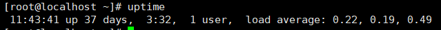

# linux

# linux命令

## 1.目录操作

### 1.1 ls

### 1.2 ll

### 1.3 mkdir

### 1.4 find

- find

  - find [路径] [表达式]
  - find /home -name "*.txt"

### 1.5 cp

- cp

  - cp 源文件 目标文件
  - cp file.txt /home/file.txt


### 1.6 mv

- mv

  - mv 源文件 目标文件

  - mv file.txt /home/file.txt

  

## 2 .文件操作

### 2.1 touch

### 2.2 cat

### 2.3 vim


## 3. 文件压缩

### 3.1 tar

- 解压文件
  - z：表示使用gzip进行压缩或解压
  - x: 表示提前(解压)文件
  - v: 表示显示详细的操作过程，即输出解压/压缩的文件列表
  - f: 表示指定归档文件的名称
  - c: 表示创建新的.tar文件
  
  常规解压
  ```linux
      tar -zxvf test.tar.gz
  ```
  
  解压到指定目录
  ```linux
      tar -zxvf test.tar.gz -C /home/test
  ```

- 压缩文件(压缩名称在前，后面是具体要压缩文件)
```linux
    tar -zcvf test.tar.gz test.txt
```

## 4. 系统状态

### 4.1 top

- 用于实时查看系统的 CPU 使用率、内存使用率、进程信息等
- 常用命令
  - top：显示系统整体运行状况，包括CPU、内存、进程等信息
  - top -n 10：显示前10个CPU占用率最高的进程
  - top -hp 11111：按进程的优先级对进程进行排序并显示

### 4.2 uptime

- 用于查看系统总共运行了多长时间、系统的平均负载等信息

- 常用命令

  - uptime

    

  - 包含以下信息
    - 当前时间：11:43:41
    - 系统已经运行的时间: 37天3小时32分
    - 当前登录用户数：1个
    - 系统平均负载情况，分别表示过去1分钟、5分钟和15分钟的平均负载

### 4.3 free

- 用于查看系统的内存使用情况，包括已用内存、可用内存、缓冲区和缓存等
- 常用命令
  - free -m: 显示内存使用情况（以MB为单位）
  - free -h: 以人类可读的方式显示内存使用情况(推荐)

### 4.4 df

- 用于查看系统的磁盘空间使用情况
- 常用命令
  - df -h: 以人类可读的方式显示磁盘空间利用情况
  - df -h /path/to/directory: 显示指定目录的磁盘空间利用情况

### 4.5 du

- 用于查看指定目录或文件的磁盘空间使用情况
- 常见命令
  - du -h
    - 显示当前目录及其子目录的磁盘使用情况
  - du -sh
    - 仅显示当前目录的总大小（以人类可读的方式）
  - du -h | sort -h
    - 显示当前目录及其子目录的磁盘使用情况，并按大小排序
  - du -h /path/to/directory
    - 显示指定目录的磁盘使用情况

### 4.6 ps

- ps -ef | grep


## 5. java相关

### 5.1 jps

### 5.2 jstack

### 5.3 jinfo


