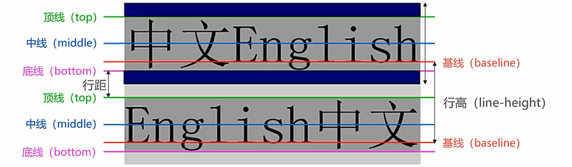
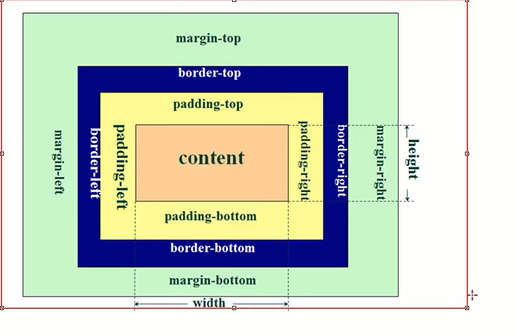

# css

## SEO
SEO（search engine optimization）: 搜索引擎优化

## css样式优先级

  - 优先级规则：行内样式 > 内部样式 = 外部样式
  注意
  1. 内部样式、外部样式这两者优先级相同，且后面的会覆盖前面的 （后来者居上）
  2. 同一个样式表中，优先级也和编写顺序有关，且后面的会覆盖前面的


  ## css 选择器
  - 标签选择器
  
  ```
   div{
    color: red;
    font-size: 30px;
    background-color: orange;
   }
   .div-one{
    color: green;
    font-size: 40px;
   }
  ```

  ## css 常见属性
  - font-size 文字大小
  - color 前景色(文字颜色)
  - background-color 背景色
  - width 宽度
  - height 高度

不让div独占一行
```
display: inline-block;
```


div顶部对齐
```
vertical-align: top;
```


## 额外知识补充
  ### Link元素
  - link元素是外部资源链接元素，规范了文档于外部资源的关系（通常在head元素中）
  - 最常用的链接是样式表css,此外也可以被用来创建站点图标
  - link元素常见属性
    1. href: 此属性指定被链接资源的url, url可以是绝对的，也可以是相对的
    2. rel: 指定链接类型
       icon: 站点图标
       stylesheet: css样式
  ```
  <link rel="stylesheet" href="./css/style.css">
  <link rel="icon" href="../images/favicon.ico">
  ```
 
  ### Chrome浏览器开发者工具
  - 打开
   1. F12打开
   2. 右键->检查
   
  - 其他技巧
  1. 快捷健：ctrl+ 可以调整页面或者调试工具的字体大小
  2. 可以通过删除某些元素来查看网页结构
  3. 可以通过增删css来调试网页样式


 ### 浏览器渲染流程
 Load Html -> Parse Html -> Create Dom tree -> dispaly
              parse Html -> load css -> parse css -> display

## CSS文本属性
 ### text-decoration（常用）
 作用：设置文本的装饰线
 有如下取值
   - none: 无任何装饰线（也可以去掉a元素默认的下划线）
   - underline: 下划线
   - overline: 上划线
   - line-through: 中划线
  


 ### text-transform(了解)
 作用： 文本变形
 有如下取值
  - capitalize: 文本中的每个单词以大写字母开头
  - uppeercase: 全部字母大写
  - lowercase: 全部字母小写

 ### text-indent(了解)
 作用： 文本缩进
 eg: 将段落的第一行缩进2em
 div {text=indent:2em;}

 ### text-align(重要)
 直接翻译：文本对齐的方式（**图片也可以居中**）
 mdn: 定义行内内容，例如文字如何相对它的块父元素对齐
 常见的值
  - left: 左对齐
  - right: 右对齐
  - center: 正中间显示
  - justify: 两端对齐（基本用不到）：文字放不上默认换行，设置此属性中间空格，两端对齐显示

官方：text-align 只能**让行内元素居中，块级元素无法居中**，要想让块级元素居中，需要将块级元素转换为行内元素 display: inline-block 或者设置margin: 0 auto;

```css
<!DOCTYPE html>
<html lang="en">
<head>
    <meta charset="UTF-8">
    <meta name="viewport" content="width=device-width, initial-scale=1.0">
    <title>Document</title>
</head>
<style>
    .main{
        background-color: #ff0;
        height: 300px;
        text-align: center;
        
    }
    .body{
        background-color: skyblue;
        width: 200px;
        height: 200px;
        /* 方式一：只有加上这个才能居中 */
        /* display: inline-block; */
        /* 方式二 */
        margin: 0 auto;
    }
</style>
<body>
   <div class="main">
    <div class="body"></div>
   </div>
</body>
</html>
```


 ### word-spacing/letter-spacing(了解)
 作用：修改文字默认缝隙
 ```css
 word-spacing: 30px;
 ```
 

 ## CSS字体属性
 ### font-size(重要)
 作用：决定文字的大小
 常用设置
  - 具体数值+单位
   1. 比如100px
   2. 使用em单位(不推荐)：1em代表100%，2em代表200%
   
  - 百分比
    1. 基于父元素的font-size计算，比如50%表示等于父元素font-size的一半
 ### font-family(重要，不过一般仅设置一次)
 作用：设置文字的字体名称
 - 可以设置1个或者多个字体名称
 - 浏览器会选择列表中第一个该计算机上有安装的字体
 - 或者是通过@font-face 指定的可以直接下载的字体

 ```css
 <style>
    body{
      font-family: "xxx",xxx1,xxx2
    }
 </style>
 ```

 ### font-weight(重要)
 作用：设置文字的粗细
 常见的取值
  - 100| 200 | 300 | 400 |500| 600|700 |800 |900 每一个数字表示一个重量
  - normal: 等于400
  - bold: 等于700

 ### font-style(一般)
 作用: 用于设置文字的常规、斜体显示
 - normal: 常规显示
 - italic: 用文字的斜体显示（字体本身支持斜体时，显示的斜体）
 - oblique: 文本倾斜显示（让文本倾斜）

 ### line-height（常用）
 作用：用于设置文本的行高
 行高可以先简单理解为一行文字所占据的高度
 严格定义：两行文字**基线**之间的距离

 基线：与小写字母x最底部对齐的线
 

 应用场景：假设div中只有一行文字，如何让这行文字在div内部垂直居中？
 答案： **让line-height 等于height**


 ### font
 是一个缩写属性
 ```css
 font: italic small-caps 700 30px/1.5 serif;
 
 ```
 默认顺序： font-style font-variant font-weight font-size/line-height font-family

 规则：
  - font-style,font-variant,font-weight 可以随意调换顺序，也可以省略
  - /line-height 可以省略，如果不省略，必须跟在font-size后面
  - font-size, font-family 不可以调换顺序，不可以省略

 ## CSS常见选择器
 按照一定的规则选出符合条件的元素，为之添加css样式

 ### 简单选择器(重要)
 - 元素选择器，使用元素的名称
 - 类选择器，使用.类名
 - id选择器，使用 #id

 ### 属性选择器（了解）
 ```css
 <div title="div">我是div</div>
 <h2 title="h2">我是h2元素</h2>

 <style>
  [title] {
    color: red;
  }

  [title=div] {
    background-color: blue;
  }
 </style>
 ```

 ### 后代选择器（重要）
 - 选择器一：所有的后代(直接/间接的后代)
 选择器以**空格**分割

 ```css
  .box span{
    color: red;
  }
 ```

 - 选择器二：直接子代选择器（必须是直接子代）
 选择器以>分割

  ```css
  .box > span{
    color: red;
  }
 ```

 ### 兄弟选择器（理解）
 - 选择器一：相邻兄弟选择器
  使用 + 连接
  ```css
  <div class="one">哈哈</div>
  <div>嘿嘿</div>
  <div>呵呵</div>
  <div>嘻嘻</div>

  <style>
  .one + div {
    color: red;
  }
  </style>
  ```

  - 选择器二：普通兄弟选择器
  使用 ~ 连接
  ```css
  <div class="one">哈哈</div>
  <div>嘿嘿</div>
  <div>呵呵</div>
  <div>嘻嘻</div>

  <style>
  .one ~ div {
    color: red;
  }
  </style>
  ```


 ### 选择器组（重要）
 - 交集选择器-**两个选择器紧密连接**
 需要同时符合两个选择器条件，在开发中通常为了精准选择某一个元素

 ```css
<div class="box">我是div</div>
<p class="box">我是p</p>


div.box{
  color: red;
  font-size: 30px;
}

 ```

 - 并集选择器：符合一个选择器条件即可，**两个选择器以，号分割**
 在开发中通常为了给元素设置相同的样式

 ```css
body,p,h1{
  margin: 0;
}

 ```

 ### 伪类选择器
 是选择器的一种，它用于选择处于特定状态的元素
 常见的伪类有
 1. 动态伪类
 - :link :visited :hover :active :focus

 使用举例
 - a:link 未访问的链接
 - a:visited 已访问的链接
 - a:hover 鼠标挪动到链接上(重要)
 - a:active 激活的链接(鼠标在链接上长按住未松开)

 **除了a元素，:hover :active也能用在其他元素上**

 使用注意
 - :hover必须放在:link和:visited后面才能完全生效
 - :active必须放在:hover后面才能完全生效
 - 建议顺序 :link :visited :hover :active

 2. 目标伪类(少用)
 - :target

 3. 语言伪类（少用）
 - :lang()

 4. 元素状态伪类

 - :enabled :disabled :checked

 5. 结构伪类
 - :nth-child() :nth-of-type()

 6. 否定伪类
 - :not()

 ### 伪元素(了解)
 选择特定的一个元素

 常见的伪元素
 - :before ::before
 在元素前面插入内容

 ```css
 <div class="box item"></div>
 <div class="box1 item"></div>


 <style>
  .item::before {
    content: "123",
    color: red;
  }

  .item::after {
    content: url("../images/icon.svg");
    position: relative;
    left: 105px;
    top: 2px;
  }

  .box2::after{
    /* 使用伪元素的过程中，不要将content省略 */
    content: "",
    display: inline-block;
    width: 8px;
    height: 8px;
    background-color: #f00;
  }
 </stylle>
 
 ```

 - :after ::after
 - :first-line ::first-line
 选择某个元素的首行
 - :first-letter ::first-letter
 可以争对首字母设置属性

 **一般开发中用两个冒号** 


 ## CSS属性的特性

 ### CSS属性的继承
 css的某些属性具有继承性
 - 如果一个属性具备继承性，那么在该元素上设置后，它的后代元素都可以继承这个属性
 - 当然，如果后代元素自己有设置该属性，那么优先使用后代元素自己的属性（不敢继承过来的属性权重的多少）

 如何知道一个属性是否具有继承性

 - 常见的font-size/font-family/font-weight/line-height/color/text-align都具有继承性

 ### CSS属性的层叠
 什么是层叠呢？
 - 对于一个元素来说，相同一个属性我们可以通过不同的选择器给它进行多次设置
 - 那么属性会被一层层覆盖上去
 - 但是最终只有一个会生效

 那么多个样式覆盖上去，哪一个生效呢？
 - 判断一：选择器的权重，权重大的生效，根据权重可以判断出优先级

 - 判断二：先后顺序，权重相同时，后面设置的生效

 ```css
<div class="box one first content">我是box</div>
<style>
.box{
  color:red;
}
.one{
  color:green;
}
.first{
  color:purple;
}
.content{
  color: orange;
}
</style>

 ```

 那么如何知道权重呢？
 权重如下
 - !important: 10000

 ```css
 .box{
  color: red !important;
 }
 ```

 - 内联样式： 1000

 - id选择器： 100

 - 类选择器、属性选择器、伪类： 10

 - 元素选择器： 1

 - 通配选择器： 0

 ### CSS属性的类型

什么是块级元素，什么是行内元素？

html在设计时考虑一个问题：每个元素在页面当中到底占据多大的空间

某些元素非常重要：独占一行-> 块级元素：h/p/div
某些元素属于内容的一部分，没必要独占一行，其他内容在同一行显示， 类型->行内级元素 span/a/img

块级元素：独占父元素的一行
行内级元素：多个行内级元素可以在父元素的同一行中显示


 ### display属性（非常重要）
CSS中有个display属性，能修改元素的显示类型，有4个常用值
- display:block;
 让元素显示为块级元素，**可以设置宽度和高度**
- display:inline;
让元素显示为行内级元素，**不可以设置宽度和高度，由内容决定**
为啥img可以设置宽高？
答：img是行内元素同时也是行内替换元素

行内替换元素
- 和其他的行内级元素在同一行显示
- 可以设置宽度和高度

- display: inline-block
让元素同时具备行内级、块级元素的特征
**在同一行显示，也可以设置宽度和高度**

- display: none
隐藏元素

编写html注意事项
- 块级元素，可以包含其他任何元素，但是p元素不能包含其他块级元素
- 行内级元素，一般只能包含行内级元素

 ### 元素的隐藏
 - display:none
 元素不显示出来，并且也不占据位置，和不存在一样

 - visibility:hidden
 设置hidden,虽然元素不可见，但是会占据空间

 - rgba设置颜色，将a的值设置为0
 rgba的a设置alpha值，可以设置透明度，不影响子元素

 ```css
 .box{
  color: rgba(0,0,0,0)
 }

/* 设置透明度，并且会携带所有的子元素都有一定的透明度 */
 .box2{
  opacity: 0
 }
 ```

- opacity设置透明度，设置为0
设置整个元素的透明度，会影响所有的子元素

```css

/* 设置透明度，并且会携带所有的子元素都有一定的透明度 */
 .box2{
  opacity: 0
 }
 ```

 ### overflow属性


 ## CSS的盒子模型

 
 ### 认识盒子模型

 html的每一个元素都可以看作一个盒子，主要包含
 - 内容(content)
   - 元素的内容width/height

 - 内边距（padding）
   - 元素和内容之间的间距

 - 边框(border)
   - 元素自己的边框

 - 外边距(margin)
   - 元素和其他元素之间的间距

  

  **因为盒子有四边，所以margin/padding/border都包括top/right/bottom/left四个边**
  


 ### 内容width/height

 宽度设置：width
 高度设置：height

 未设置width,默认auto

 另外我们还可以设置如下属性
 - min-width: 最小宽度，无论内容多少，宽度都大于或等于min-width
 - max-width: 最大宽度，无论内容多少，宽度都小于或等于max-width
 - 移动端适配时，可以设置最大宽度和最小宽度

 


 ### 内边距padding

 padding属性用于设置盒子的内边距，通常用于设置边框和内容之间的间距

 padding包括四个方向，有如下取值

 - padding-top :   上内边距
 - padding-right : 右内边距
 - padding-bottom: 下内边距
 - padding-left: 左内边距

 padding单独编写是一个缩写属性
 **从0点钟方向开始，沿着顺时针转动，也就是上右下左**


 ### 边框/圆角border

 ### 外边距margin

 ### 盒子和文字阴影

 ### box-sizing


