# css

## SEO
SEO（search engine optimization）: 搜索引擎优化

## css样式优先级

  - 优先级规则：行内样式 > 内部样式 = 外部样式
    注意
  1. 内部样式、外部样式这两者优先级相同，且后面的会覆盖前面的 （后来者居上）
  2. 同一个样式表中，优先级也和编写顺序有关，且后面的会覆盖前面的


  ## css 选择器
  - 标签选择器

  ```
   div{
    color: red;
    font-size: 30px;
    background-color: orange;
   }
   .div-one{
    color: green;
    font-size: 40px;
   }
  ```

  ## css 常见属性
  - font-size 文字大小
  - color 前景色(文字颜色)
  - background-color 背景色
  - width 宽度
  - height 高度

不让div独占一行
```
display: inline-block;
```


div顶部对齐
```
vertical-align: top;
```


## 额外知识补充
  ### Link元素
  - link元素是外部资源链接元素，规范了文档于外部资源的关系（通常在head元素中）
  - 最常用的链接是样式表css,此外也可以被用来创建站点图标
  - link元素常见属性
    1. href: 此属性指定被链接资源的url, url可以是绝对的，也可以是相对的
    2. rel: 指定链接类型
       icon: 站点图标
       stylesheet: css样式
  ```
  <link rel="stylesheet" href="./css/style.css">
  <link rel="icon" href="../images/favicon.ico">
  ```

  ### Chrome浏览器开发者工具
  - 打开
   1. F12打开
   2. 右键->检查

  - 其他技巧
  1. 快捷健：ctrl+ 可以调整页面或者调试工具的字体大小
  2. 可以通过删除某些元素来查看网页结构
  3. 可以通过增删css来调试网页样式


 ### 浏览器渲染流程
 Load Html -> Parse Html -> Create Dom tree -> dispaly
              parse Html -> load css -> parse css -> display

## CSS文本属性
 ### text-decoration（常用）
 作用：设置文本的装饰线
 有如下取值
   - none: 无任何装饰线（也可以去掉a元素默认的下划线）
   - underline: 下划线
   - overline: 上划线
   - line-through: 中划线


 ### text-transform(了解)
 作用： 文本变形
 有如下取值
  - capitalize: 文本中的每个单词以大写字母开头
  - uppeercase: 全部字母大写
  - lowercase: 全部字母小写

 ### text-indent(了解)
 作用： 文本缩进
 eg: 将段落的第一行缩进2em
 ```css
   div {text=indent:2em;}
 ```
 注意事项
  - text-indent 只应用于**块级元素**
  - text-indent 设置负值可以将文本向左移动


 ### text-align(重要)
 直接翻译：文本对齐的方式（**图片也可以居中**）
 mdn: 定义行内内容，例如文字如何相对它的块父元素对齐
 常见的值
  - left: 左对齐
  - right: 右对齐
  - center: 正中间显示
  - justify: 两端对齐（基本用不到）：文字放不上默认换行，设置此属性中间空格，两端对齐显示

官方：text-align 只能**让行内元素居中，块级元素无法居中**，要想让块级元素居中，需要将块级元素转换为行内元素 display: inline-block 或者设置margin: 0 auto;

**注意是给父元素设置text-align，而不是给子元素设置**

```css
<!DOCTYPE html>
<html lang="en">
<head>
    <meta charset="UTF-8">
    <meta name="viewport" content="width=device-width, initial-scale=1.0">
    <title>Document</title>
</head>
<style>
    .main{
        background-color: #ff0;
        height: 300px;
        text-align: center;
        
    }
    .body{
        background-color: skyblue;
        width: 200px;
        height: 200px;
        /* 方式一：只有加上这个才能居中 */
        /* display: inline-block; */
        /* 方式二 */
        margin: 0 auto;
    }
</style>
<body>
   <div class="main">
    <div class="body"></div>
   </div>
</body>
</html>
```


 ### word-spacing/letter-spacing(了解)
 作用：修改文字默认缝隙
 ```css
 word-spacing: 30px;
 ```


 ## CSS字体属性
 ### font-size(重要)
 作用：决定文字的大小
 常用设置
  - 具体数值+单位
   1. 比如100px
   2. 使用em单位(不推荐)：1em代表100%，2em代表200%

  - 百分比
    1. 基于父元素的font-size计算，比如50%表示等于父元素font-size的一半
 ### font-family(重要，不过一般仅设置一次)
 作用：设置文字的字体名称
 - 可以设置1个或者多个字体名称
 - 浏览器会选择列表中第一个该计算机上有安装的字体
 - 或者是通过@font-face 指定的可以直接下载的字体

 ```css
 <style>
    body{
      font-family: "xxx",xxx1,xxx2
    }
 </style>
 ```

 ### font-weight(重要)
 作用：设置文字的粗细
 常见的取值
  - 100| 200 | 300 | 400 |500| 600|700 |800 |900 每一个数字表示一个重量
  - normal: 等于400
  - bold: 等于700

 ### font-style(一般)
 作用: 用于设置文字的常规、斜体显示
 - normal: 常规显示
 - italic: 用文字的斜体显示（字体本身支持斜体时，显示的斜体）
 - oblique: 文本倾斜显示（让文本倾斜）

 ### line-height（常用）
 作用：用于设置文本的行高
 行高可以先简单理解为一行文字所占据的高度
 严格定义：两行文字**基线**之间的距离

 基线：与小写字母x最底部对齐的线
 

 应用场景：假设div中只有一行文字，如何让这行文字在div内部垂直居中？
 答案： **让line-height 等于height**

 注意
  - 行高是可以继承的
  - **行高对行内非替换元素是无效的**


 ### font
 是一个缩写属性
 ```css
 font: italic small-caps 700 30px/1.5 serif;
 
 ```
 默认顺序： font-style font-variant font-weight font-size/line-height font-family

 规则：
  - font-style,font-variant,font-weight 可以随意调换顺序，也可以省略
  - /line-height 可以省略，如果不省略，必须跟在font-size后面
  - font-size, font-family 不可以调换顺序，不可以省略

 ## CSS常见选择器
 按照一定的规则选出符合条件的元素，为之添加css样式

 ### 简单选择器(重要)
 - 元素选择器，使用元素的名称
 - 类选择器，使用.类名
 - id选择器，使用 #id

 ### 属性选择器（了解）
 ```css
 <div title="div">我是div</div>
 <h2 title="h2">我是h2元素</h2>

 <style>
  [title] {
    color: red;
  }

  [title=div] {
    background-color: blue;
  }
 </style>
 ```

 ### 后代选择器（重要）
 - 选择器一：所有的后代(直接/间接的后代)
 选择器以**空格**分割

 ```css
  .box span{
    color: red;
  }
 ```

 - 选择器二：直接子代选择器（必须是直接子代）
 选择器以>分割

  ```css
  .box > span{
    color: red;
  }
  ```

 ### 兄弟选择器（理解）
 - 选择器一：相邻兄弟选择器
    使用 + 连接
  ```css
  <div class="one">哈哈</div>
  <div>嘿嘿</div>
  <div>呵呵</div>
  <div>嘻嘻</div>

  <style>
  .one + div {
    color: red;
  }
  </style>
  ```

  - 选择器二：普通兄弟选择器
    使用 ~ 连接
  ```css
  <div class="one">哈哈</div>
  <div>嘿嘿</div>
  <div>呵呵</div>
  <div>嘻嘻</div>

  <style>
  .one ~ div {
    color: red;
  }
  </style>
  ```


 ### 选择器组（重要）
 - 交集选择器-**两个选择器紧密连接**
 需要同时符合两个选择器条件，在开发中通常为了精准选择某一个元素

 ```css
<div class="box">我是div</div>
<p class="box">我是p</p>


div.box{
  color: red;
  font-size: 30px;
}

 ```

 - 并集选择器：符合一个选择器条件即可，**两个选择器以，号分割**
 在开发中通常为了给元素设置相同的样式

 ```css
body,p,h1{
  margin: 0;
}

 ```

 ### 伪类选择器
 是选择器的一种，它用于选择处于特定状态的元素
 常见的伪类有
 1. 动态伪类
 - :link :visited :hover :active :focus

 使用举例
 - a:link 未访问的链接
 - a:visited 已访问的链接
 - a:hover 鼠标挪动到链接上(重要)
 - a:active 激活的链接(鼠标在链接上长按住未松开)

 **除了a元素，:hover :active也能用在其他元素上**

 使用注意
 - :hover必须放在:link和:visited后面才能完全生效
 - :active必须放在:hover后面才能完全生效
 - 建议顺序 :link :visited :hover :active

 2. 目标伪类(少用)
 - :target

 3. 语言伪类（少用）
 - :lang()

 4. 元素状态伪类

 - :enabled :disabled :checked

 5. 结构伪类
 - :nth-child() :nth-of-type()
   
   :nth-child(1): 是选择父元素中的第一个子元素
   ```css
    <style>
      ul li:nth-child(1) {
        color: red;
      }
    </style>
   
    <ul>
      <li>列表元素1</li>
      <li>列表元素2</li>
      <li>列表元素3</li>
    </ul>
   ```
   :nth-child(2n)
     - n代表任意正整数和0
     - 是父元素中的第**偶数**个子元素(第2、4、6、8...个)
     - 跟:nth-child(even)同义
  
   :nth-child(2n+1)
     - n代表任意正整数和0
     - 是父元素中的第**奇数**个子元素(第2、4、6、8...个)
     - 跟:nth-child(odd)同义
  
   :nth-child(-n + 2)
    - 代表前2个子元素

   ```css
    <style>
     <!-- 设置偶数被选中 -->
      ul li:nth-child(2n) {
        color: green;
      }
   
      <!-- 设置奇数被选中 -->
      ul li:nth-child(2n+1) {
        color: blue;
      }
   
      <!-- 选中前三个 -->
      ul li:nth-child(-n + 3) {
        color: red;
      }
   
      </style>
    
    <ul>
      <li>列表元素1</li>
      <li>列表元素2</li>
      <li>列表元素3</li>
      <li>列表元素4</li>
    </ul>
   ```


   :nth-of-type() 用法跟:nth-child()类似
   不同点是：nth-of-type()计数时只计算同种类型的元素

   ```css
    <!-- 需求：选择box中div的元素，并且是第三个子元素 -->

    .box > div:nth-of-type(3) {
      color: blue;
    }

    <div class="box">
      <div>我是列表一</div>
      <p>我是p元素</p>
      <div>我是div1</div>
      <div>我是div2</div>
      <div>我是div3</div>
      <span>我是span</span>
      <div>我是div4</div>
      <div>我是div5</div>
      <div>我是div6</div>
    </div>
    

   ```

 1. 否定伪类
 - :not()

   格式是：not(x)
   x是一个简单选择器

   ```css
    .box :not(.why){
      color: blue;
    }
   
    <div class="box">
      <div class="item">列表</div>
      <div class="why">列表</div>
      <div class="item">列表</div>
      <div>列表</div>
    </div>
   ```

 ### 伪元素(了解)
 选择特定的一个元素

 常见的伪元素
 - :before ::before
 在元素前面插入内容

 ```css
 <div class="box item"></div>
 <div class="box1 item"></div>


 <style>
  .item::before {
    content: "123",
    color: red;
  }

  .item::after {
    content: url("../images/icon.svg");
    position: relative;
    left: 105px;
    top: 2px;
  }

  .box2::after{
    /* 使用伪元素的过程中，不要将content省略 */
    content: "",
    display: inline-block;
    width: 8px;
    height: 8px;
    background-color: #f00;
  }
 </stylle>
 
 ```

 - :after ::after
 - :first-line ::first-line
 选择某个元素的首行
 - :first-letter ::first-letter
 可以争对首字母设置属性

 **一般开发中用两个冒号** 


 ## CSS属性的特性

 ### CSS属性的继承
 css的某些属性具有继承性
 - 如果一个属性具备继承性，那么在该元素上设置后，它的后代元素都可以继承这个属性
 - 当然，如果后代元素自己有设置该属性，那么优先使用后代元素自己的属性（不管继承过来的属性权重的多少）

 如何知道一个属性是否具有继承性

 - 常见的font-size/font-family/font-weight/line-height/color/text-align都具有继承性

 ### CSS属性的层叠
 什么是层叠呢？
 - 对于一个元素来说，相同一个属性我们可以通过不同的选择器给它进行多次设置
 - 那么属性会被一层层覆盖上去
 - 但是最终只有一个会生效

 那么多个样式覆盖上去，哪一个生效呢？
 - 判断一：选择器的权重，权重大的生效，根据权重可以判断出优先级

 - 判断二：先后顺序，权重相同时，后面设置的生效

 ```css
<div class="box one first content">我是box</div>
<style>
.box{
  color:red;
}
.one{
  color:green;
}
.first{
  color:purple;
}
.content{
  color: orange;
}
</style>

 ```

 那么如何知道权重呢？
 权重如下
 - !important: 10000

 ```css
 .box{
  color: red !important;
 }
 ```

 - 内联样式： 1000

 - id选择器： 100

 - 类选择器、属性选择器、伪类： 10

 - 元素选择器： 1

 - 通配选择器： 0

 ### CSS属性的类型

什么是块级元素，什么是行内元素？

html在设计时考虑一个问题：每个元素在页面当中到底占据多大的空间

某些元素非常重要：独占一行-> 块级元素：h/p/div
某些元素属于内容的一部分，没必要独占一行，其他内容在同一行显示， 类型->行内级元素 span/a/img

块级元素：独占父元素的一行
行内级元素：多个行内级元素可以在父元素的同一行中显示


 ### display属性（非常重要）
CSS中有个display属性，能修改元素的显示类型，有4个常用值
- display:block;
 让元素显示为块级元素，**可以设置宽度和高度**
- display:inline;
让元素显示为行内级元素，**不可以设置宽度和高度，由内容决定**
为啥img可以设置宽高？
答：img是行内元素同时也是行内替换元素

行内替换元素
- 和其他的行内级元素在同一行显示
- 可以设置宽度和高度

- display: inline-block
让元素同时具备行内级、块级元素的特征
**在同一行显示，也可以设置宽度和高度**

- display: none
隐藏元素

编写html注意事项
- 块级元素，可以包含其他任何元素，但是p元素不能包含其他块级元素
- 行内级元素，一般只能包含行内级元素

 ### 元素的隐藏
 - display:none
 元素不显示出来，并且也不占据位置，和不存在一样

 - visibility:hidden
 设置hidden,虽然元素不可见，但是会占据空间

 - rgba设置颜色，将a的值设置为0
 rgba的a设置alpha值，可以设置透明度，不影响子元素

 ```css
 .box{
  color: rgba(0,0,0,0)
 }

/* 设置透明度，并且会携带所有的子元素都有一定的透明度 */
 .box2{
  opacity: 0
 }
 ```

- opacity设置透明度，设置为0
设置整个元素的透明度，会影响所有的子元素

```css

/* 设置透明度，并且会携带所有的子元素都有一定的透明度 */
 .box2{
  opacity: 0
 }
```

 ### overflow属性


 ## CSS的盒子模型


 ### 认识盒子模型

 html的每一个元素都可以看作一个盒子，主要包含
 - 内容(content)
   - 元素的内容width/height

 - 内边距（padding）
   - 元素和内容之间的间距

 - 边框(border)
   - 元素自己的边框

 - 外边距(margin)
   - 元素和其他元素之间的间距

  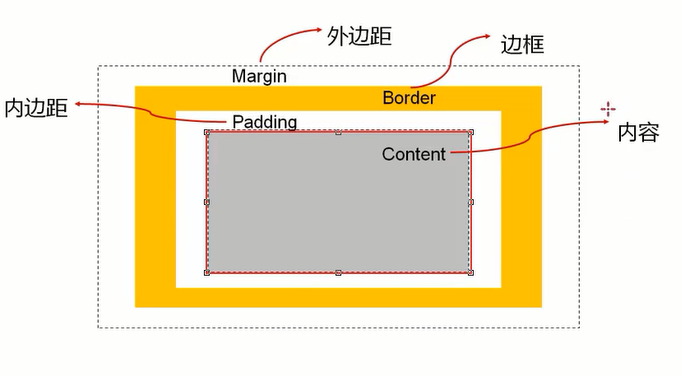

  **因为盒子有四边，所以margin/padding/border都包括top/right/bottom/left四个边**
  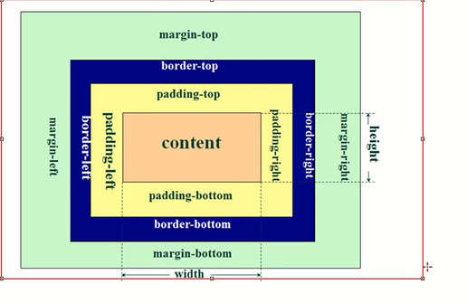


 ### 内容width/height

 宽度设置：width
 高度设置：height

 未设置width,默认auto

 另外我们还可以设置如下属性
 - min-width: 最小宽度，无论内容多少，宽度都大于或等于min-width
 - max-width: 最大宽度，无论内容多少，宽度都小于或等于max-width
 - 移动端适配时，可以设置最大宽度和最小宽度

 


 ### 内边距padding

 padding属性用于设置盒子的内边距，通常用于设置边框和内容之间的间距

 padding包括四个方向，有如下取值

 - padding-top :   上内边距
 - padding-right : 右内边距
 - padding-bottom: 下内边距
 - padding-left: 左内边距

 padding单独编写是一个缩写属性
 **从0点钟方向开始，沿着顺时针转动，也就是上右下左**

 padding的其他值

| padding值的个数 | padding的例子 |代表的含义
| ---- | ---- | ----|
|4|padding: 10px;20px;30px;40px;|top:10px;right: 20px;bottom:30px;left:40px;
|3|padding: 10px 20px 30px;|缺少left,left使用right的值
|2|padding:10px 20px;|缺少left,使用right的值，缺少bottom,使用top的值
|1|padding:10px;|top/right/bottom/left都使用10


 ### 边框/圆角border

 boder用于设置盒子的边框
 边框相对与content/padding/margin来说特殊一点
 - 边框具备宽度width
 - 边框具备样式style
 - 边框具备颜色color

 边框宽度
 - border-top-width、border-right-width、border-bottom-width、border-left-width
 - border-width是上面4个属性的简写属性

 边框颜色
 - border-top-color、border-right-color、border-bottom-color、border-left=color
 - border-color是上面4个属性的简写属性

   ```css
    border-right-color: transparent;
   ```

 边框样式
 - border-top-style、border-right-style、border-bottom-style、border-left-style
- border-style是上面4个属性的简写属性

可以简写border: 1px solid red;

 ### 外边距margin
margin属性用于设置盒子的外边距，通常用于元素和元素之间的间距

margin包括四个方向
- margin-top: 上内边距
- margin-right: 右边距
- margin-bottom： 下内边距
- margin-left: 左内边距

缩写属性
margin: 10px 20px 30px;

小练习：两个div盒子为父子关系，让子盒子向左移动10px
- 方式一： 设置父盒子的paddding-left值10px,需要注意的是padding-left值过大时，会导致父盒子宽度变大，如何解决呢？
  可以设置父盒子的box-sizing: border-box
```css
<!DOCTYPE html>
<html lang="en">
<head>
    <meta charset="UTF-8">
    <meta name="viewport" content="width=device-width, initial-scale=1.0">
    <title>Document</title>
</head>
<style>
    .box{
        width: 300px;
        height: 300px;
        background-color: #ff0;
        padding-left: 100px;
        box-sizing: border-box;
    }
    .main{
        width: 100px;
        height: 100px;
        background-color: skyblue;
    }
</style>
<body>
    <div class="box">
        <div class="main">
    </div>
</body>
</html>

```

- 方式二：设置子盒子的margin-left为10px, 不过需要注意的是，margin-top过大时，父盒子会跟着向下移动，怎么解决呢？
  可以设置父盒子的overflow:auto

```css
<!DOCTYPE html>
<html lang="en">
<head>
    <meta charset="UTF-8">
    <meta name="viewport" content="width=device-width, initial-scale=1.0">
    <title>Document</title>
</head>
<style>
    .box{
        width: 300px;
        height: 300px;
        background-color: #ff0;
        overflow: auto;
    }
    .main{
        width: 100px;
        height: 100px;
        background-color: skyblue;
        margin-left: 20px;
        margin-top: 100px;
    }
</style>
<body>
    <div class="box">
        <div class="main">
    </div>
</body>
</html>

```

**总结**：**对于父子元素来说，设置父元素的padding-left让子盒子向左移动是比较推荐的方式**


- margin的传递
  1. margin-top传递
  如果**块级元素的顶部线和父元素的顶部线重叠**，那么这个块级元素的margin-top值会传递给**父元素**

  1. margin-bottom传递
   如果**块级元素的底部线和父元素的底部线重写**，并且父元素的高度是auto,那么这个块级元素的margin-bottom的
      值会传递给父元素

   那么如何防止出现传递问题？
   - 给父元素设置padding-top\padding-bottom
   - 给父元素设置border
   - 触发bfc: 设置父元素overflow为auto

 建议：
  - margin一般是用来设置兄弟元素之间的间距
  - padding一般是用来设置父子元素之间的间距

 - 上下margin的折叠
  1. 垂直方向上相邻的2个margin(margin-top、margin-bottom)有可能会合并为1个margin,这种现象叫做
      collapse（折叠）
  2. 水平方向上的margin(margin-left,margin-right)永远不会collapse

  折叠后最终值得计算规则？
  两个值进行比较，取较大得值

  如何防止margin collapse?
  答：只设置其中一个元素得margin

  案例演示：
  ```css
  <!DOCTYPE html>
<html lang="en">
<head>
    <meta charset="UTF-8">
    <meta name="viewport" content="width=device-width, initial-scale=1.0">
    <title>Document</title>
</head>
<style>
    .box{
        width: 300px;
        height: 300px;
        background-color: #ff0;
        margin-bottom: 20px;
    }
    .main{
        width: 100px;
        height: 100px;
        background-color: skyblue;
        margin-top: 50px;
        
    }
</style>
<body>
    <div class="box">
    </div>
    <div class="main"></div>
</body>
</html>
  ```

 元素水平居中方案（重要）
 - 行内级元素
   - 水平居中：在父元素中设置text-align: center

 - 块级元素
    - 水平居中： margin: 0 auto;


### outline
外轮廓
- 不占用空间
- 默认显示在border的外面

```css
 .box{
    outline: 10px solid #0f0;
    outline: none
  }
```

### 盒子和文字阴影
### 盒子阴影- box-shadow
设置盒子阴影，有四个值
- 第一个值，offset-x,水平方向的偏移，正数往右偏移
- 第二个值，offset-y,垂直方向的偏移，正数往下偏移
- 第三个值，blur-radius, 模糊半径
- 第四个值，spread-radius，延伸半径
- color: 阴影的颜色

```css
.box{
  box-shadow: 5px 5px 10px orange, 10px 10px 10px green;
}
```

### 文字阴影 text-shadow
设置文字阴影

```css
.box{
  text-shadow: 5px 5px 5px orange, 10px 10px 5px blue, 15px 15px 5px green;
}

```

### 行内非替换元素的注意事项
span/a/strong/i
- 内容： width/height(压根不生效)
- 内边距：上下会被撑起来，但是不占据空间
- 边框： 上下会被撑起来，但是不占据空间
- 外边距：上下的margin是不生效的


 ### box-sizing
 用来设置盒子模型中宽高的行为
 - content-box
   - padding、border都布置在width、height外边
    元素实际占用宽度 = border + padding + width

 - **border-box(经常用)**
   - padding、border都布置在width、height里边

 ### 网站常用背景色
 - #f5f5f5

 ### 单行文字显示省略号
 ```css
  .item{
    white-space: nowrap;
    overflow: hidden;
    text-overflow: ellipsis;
  }
 ```

 ## 多行文字显示省略号
 ```css
 .box{
  text-overflow: ellipsis;
  display: -webkit-box;
  -webkit-line-clamp: 2;
  -webkit-box-orient: vertical;
 }

 ```

## CSS的背景设置
作用：为了让网页更加美观
### background-image
作用：用于设置元素的背景图片
- 会盖在background-color上面
- 也可以设置多张,第一张显示在最前面
```css
.box{
  background-image: url(../images/1.jpg),url(../images/2.png);
  background-repeat: no-repeat;
}
```

### background-repeat
用于设置背景图片是否要平铺
有如下几个值：
- repeat: 平铺
- no-repeat: 不平铺
- repeat-x: 只在水平方向平铺
- repeat-y: 只在垂直方向平铺

### background-size
用来设置背景图片的大小
有如下几个值：
- auto: 默认值，以背景图本身大小显示
- cover: 缩放背景图，以完全覆盖铺满元素，可能背景图片部分看不见
- contain: 缩放背景图，宽度或者高度铺满元素，但是图片保持宽高比
- percentage: 百分比，相对于背景区
- length: 具体的大小，比如100px

```css
  .box{
    background-size: 100% 100%;
    background-size: 100px 100px;
    background-size: 100px auto;
  }

```

### background-position
用来设置背景图片在水平、垂直方向上的具体位置
- 可以设置具体的数值，比如20px, 30px
- 水平方向还可以设值：left,center,right
- 垂直方向还可以设值：top,center,bottom
- 如果只设置了1个方向，另一个方向默认center

```css
  .box{
    background-position: 100px 100px;
    background-position: right bottom;
    background-position: center;
  }

```

### background-attachment
作用：决定背景图像的位置是在视口内固定，或者随着包含它的区块滚动
可以设置3个值
- scroll: 此关键属性值表示背景相对于元素本身固定，而不是随着它的内容滚动
- local: 此关键属性值表示背景相对于元素的内容固定。如果一个元素拥有滚动机制，背景将会随着元素的内容滚动
- fixed: 此关键属性值表示背景相对于视口固定。即使一个元素拥有滚动机制，背景也不会随着元素的内容滚动

### background
一系列背景相关属性的缩写属性
语法： [color] [image] [repeat] [attachment] [position] / [size] [origin] [clip];

```css
.box{
  background: url('image.jpg');
  background: url('image.jpg') repeat-x;
  background: #f1f1f1;
}


```

- background-image和img对比
  1. img，作为网页内容的重要组成部分，比如广告图片，logo图片，文章配图，产品图片
  2. background-image,可有可无。有，能让网页更加美观。无，也不影响用户获取完整的网页内容信息 


## 开发案例思路
1. 先完成结构
2. 重置样式(body/a/ul)
3. 先整体，后局部
    - 顺序： 按照从外往里，从上往下
4. 去除重复代码
   - 将重复的逻辑放到一个单独的class中(.icon)
   - 不同的代码抽到不同的class(.new .hot)

## 高级元素的使用

### 1.列表元素
在开发一个网站过程中，很多都涉及列表
事实上现在很多的列表功能采用了不同的方案来实现
- 方案一：使用**div元素**来实现（汽车之家，知乎）
- 方案二：使用**列表元素**，使用元素语义化的方式实现

事实上现在很多的网站对于列表元素没用很强烈的偏好，更加不拘一格，按照自己的风格来布局
主要原因有
- 列表元素的默认的css样式，让它用起来不是非常方便
- 列表元素往往有很多的限制，ul/ol中只能放li,li再存放其他元素，默认样式等
- 虽然我们可以通过重置来解决，但是我们更喜欢自由的div

html提供了3组常见的用来展示列表的元素
- 有序列表：ol(ordered list)、li
     有序列表直接子元素只能是li

     ```css
     <!-- 清除默认样式 -->
      ol,li {
        padding: 0;
        margin: 0;
        list-style: none
      }
     
     <h2>电影排名</h2>
     <ol>
        <li>星际穿越</li>
        <li>盗梦空间</li>
        <li>兰闺喜事</li>
        <li>大话西游</li>
     </ol>
     
     ```
- 无序列表：ul(unordered list)、li
  ```css
      ul,li {
        padding: 0;
        margin: 0;
        list-style: none
      }
  
     <h2>常见编程语言</h2>
     <ul>
        <li>java</li>
        <li>js</li>
        <li>python</li>
        <li>C++</li>
     </ul>
  ```


- 定义列表：dl(definition list)、dt、dd
  定义列表dl，直接子元素只能是dt、dd

  dt(definition term)
  term是项的意思，列表中每一项的项目名

  dd(definition description)
  列表中每一项的具体描述，是对dt的描述，解释、补充
  一个dt后面一般紧跟1个或者多个dd

  ```css
    <h1>前端开发</h1>
    <dl>
      <dt>阶段1</dt>
      <dd>html</dd>
      <dd>css</dd>
    </dl>
  
    <dl>
      <dt>阶段2</dt>
      <dd>框架实战</dd>
      <dd>css</dd>
    </dl>
  
  ```


### 2.常见列表

### 3.表格元素
- table
   表格
- tr
  表格中的行
- td

- thead
  表格的表头

- tbody
  表格的主体

- tfoot
  表格的页脚

- caption
  表格的标题

- th
 表格的表头单元格


### 4.表格合并
 - 跨列合并： 使用colspan
   在最左边的单元格写上colspan属性，并且省略掉合并的td;

 - 跨行合并：使用rowspan
   在最上面的单元格协商rowspan属性，并且省略掉后面tr中的td

   ```css
   <table>
      <tr>
        <td colspan="2">1-1</td>
      </tr>
      <tr>
        <td>2-1</td>
        <td>2-2</td>
      </tr>
   </table>
   
   ```


### 表单元素
 - form
    表单

  form通常作为表单元素的父元素

  常见属性
  1. action ： 用于提交表单数据的请求url
  2. method:   请求方法(get和post)，默认get

  ```css
    <form action="http://www.baidu.com/s">
      <input type="text" name="wd">
      <button type="submit">百度一下</button>
    </form>
  ```

  

- input
 单号文本输入框

  type有很多值：text,password,radio,checkbox,button,reset,submit,file

 常见的布尔属性有disabled、checked、readonly、multiple、autofocus、selected

 ```css
 <form action="">
 	<input type="button" value="普通按钮"/>
 	<input type="reset" value="重置按钮"/>
     <input type="submit" value="提交按钮"/>
 </form>
 ```

  

 input和label的关系

 - label元素一般跟input配合使用，用来表示input的标题

 - label可以跟某个input绑定，点击label就可以激活对应的input变为选中

   ```css
   <div>
   	<label for="username">
   		用户：
    		<input id="username" type="text">
      </label>
   </div>
   ```

   

 

- textarea
  多行文本框

  
  
- select, option
  下拉选择框

  ```css
  <select name="fruits" id="" multiple size="2">
  	<option value="apple" selected>苹果</option>
  	<option value="banana">香蕉</option>
  	<option value="orange">橘子</option>
  </select>
  ```
  
  
  
- button
  按钮

- label
  表单元素的标题


### 表单常见属性


## 常见Emmet语法

### 1.认识Emmet

   Emment 是一个能大幅度提高前端开发效率的一个工具

- 在前端开发过程中，一大部门的工作是写html,css代码，如果手动来编写效果会非常低
- vscode内置了Emmet语法，在后缀为.html/.css中输入缩写后按tab/enter键即可自动生成相应的代码

### 2.常见Emment语法
  - >(子代) 和 + （兄弟）
    div>h1+p
    div+p+ul>li

  - *(多个) 和^(上一级)
      ul>li*5
      div+div>p>span^h1
      div+div>p>span^^^^h1

  - () 分组

  - 属性(id属性，class属性，普通属性){}(内容)
      div#header+div#main>.container>a[href]


  - $ 数字
      ul>li{列表内容$}*10

## 额外知识补充

### border图形
border也可以做图形

```css
<!DOCTYPE html>
<html lang="en">
<head>
    <meta charset="UTF-8">
    <meta name="viewport" content="width=device-width, initial-scale=1.0">
    <title>Document</title>
</head>
<style>
    .box{
        width: 100px;
        height: 100px;
        border: 50px solid orange;

        border-right-color: transparent;
        border-bottom: transparent;
        border-left-color: transparent;

        box-sizing: border-box;

        /* 旋转 */
        transform-origin: center 25%;
        transform: rotate(180deg);
    }
</style>
<body>
   <div class="box">

   </div>
</body>
</html>

```

 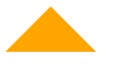

### web网络字体
```css
  @font-face {
    font-family: "hyfont01";
    src: url(./fonts/AaJianHaoTi-2.ttf)
  }

  body{
    font-family: "hyfont01";
  }
```


### web字体图标
字体图标的好处
- 放大不会失真
- 可以任意切换颜色
- 用到很多个图标时，文件相对图片较小

字体图标的使用
- 登录阿里icons(https://www.iconfont.cn/)
- 下载代码，拷贝到项目中


### css精灵图
 将各种小图片合并放在一张图片上，然后利用css的背景定位来显示对应的图片部分

 如何获取精灵图的位置
 http://www.spritecow.com

 ```css
  i.hot-icon{
    background-image: url(../images/topbar_sprite.png);
    background-repeat: no-repeat;

    display: inline-block;
    width: 26px;
    height: 13px;
    background-position: -192px 0;

  }
  
  <i class="hot-icon"></i>
 ```

### cursor属性
 设置鼠标指针在元素上面时显示样式

- auto：浏览器根据上下文决定指针的显示样式，比如根据文本和非文本切换指针样式

- pointer：一只小手

- text: 一条竖线

- none: 没有任何指针显示在元素上面


## css元素定位

### 标准流布局
 默认情况下，元素是按照标准流进行排布
 从左到右、从上到下按顺序摆放好
 默认情况下，互相之间不存在层叠现象

 在标准流中，可以使用margin、padding对元素进行定位
 但是明显的缺点是
 设置一个元素的margin或者padding,通常会影响到标准流中其他元素的定位效果
 不便于实现元素层叠的效果

 如果我们希望一个元素可以跳出标准流，单独对某个元素进行定位呢？
 可以通过position属性来进行设置

 认识元素的定位
  - 定位允许从正常的文档流布局中取出元素，并使它们具有不同的行为
  - 例如放在另一个元素的上面
  - 或者始终保持在浏览器视窗内的同一位置

 认识position属性
 常见值
  - static: 默认值，静态定位
      元素按照标准版布局
      left,right,top,bottom没有任何作用

  - relative: 相对定位
  - absolute: 绝对定位
  - fixed: 固定定位
  - sticky: 粘性定位


### 相对定位
 - **元素依然按照标准流布局，不脱标**
 - **可以通过left,right,top,bottom进行定位**
 - **定位参照对象是元素自己原来的位置**
 - left,right,top,bottom用来设置元素的具体位置，对元素的作用如下图
    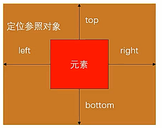
 - 相对定位应用场景
    **在不影响其他元素位置的前提下，当当前元素位置进行微调**

 ```css
  .box{
    position: relative;
    left: 50px;
    top: 50px;
  }
 
 ```

 ```css
 <!DOCTYPE html>
<html lang="en">
<head>
    <meta charset="UTF-8">
    <meta name="viewport" content="width=device-width, initial-scale=1.0">
    <title>Document</title>
</head>
<style>
   div{
    font-size: 20px;
   }

   span{
    font-size: 12px;
    position: relative;
    bottom: 8px;
   }
</style>
<body>
   <div>
    3<span>2</span> + 2<span>3</span> = 17
   </div>
</body>
</html>
 
 ```

### 固定定位

元素脱离标准流(脱标)
可以通过left,right,top,bottom进行定位
定位参照对象是视口（viewport:文档的可视区域）
当画布滚动时，固定不动

```css
 .box{
  position: fixed;
  right: 30px;
  bottom: 30px;
 }
```

### 绝对定位

 **元素脱离标准流，脱标**

可以通过left,right,top,bottom进行定位
- 定位参考对象是**最邻近的定位祖先元素**
- 如果**找不到这样的祖先元素，参考对象是视口**

什么是定位元素？
- position值不为static的元素
- 也就是position值为relative,absolute,fixed的元素

```css
  <!DOCTYPE html>
<html lang="en">
<head>
    <meta charset="UTF-8">
    <meta name="viewport" content="width=device-width, initial-scale=1.0">
    <title>Document</title>
</head>
<style>
   .container{
      width: 800px;
      height: 800px;
      background-color: #f00;
      position: relative;
   }
   .box{
      width: 500px;
      height: 500px;
      background-color: #0f0;
      position: absolute;
      right: 0;
      bottom: 0;
   }
   image{
      width: 100px;
   }
   strong{
      position: absolute;
      left: 0;
      bottom: 0;
   }
</style>
<body>
   <div class="container">
      <div class="box">
         <span>我是span元素</span>
         <strong>我是strong元素</strong>
         
         <div>我是div元素</div>
      </div>
   </div>
</body>
</html>

```

- 子绝父相
绝大多数情况下，子元素的绝对定位都是相对于父元素进行定位

如果希望子元素相对－元素进行定位，又不希望**父元素脱标**，常用的解决方案
- 父元素设置position: relative (让父元素成为定位元素，而且父元素不脱离标准流)
- 子元素设置positive: absolute
- 简称子绝父相


绝对定位元素的特点（absolute/fixed）
- 可以随意设置宽高
- 宽高默认由内容决定
- 不再受标准流的约束
  - 不再严格按照从上到下，从左到右排布
  - 不再严格区分块级，行内级，行内块级的很多特性都会消失
- 不再给父元素汇报宽高数据(父元素如果没有内容，也没设置宽高，子元素设置absolute，父元素会消失)

- 脱标元素内部默认还是按照标准流布局
- 对于绝对定位元素来说
  - 定位参照对象的宽度= left+right+ margin-left +margin-right + 绝对定位元素的实际占用宽度
  - 定位参照对象的高度 = top + bottom + margin-top + margin-bottom + 绝对定位元素的实际占用高度

- 如果希望绝对定位元素的宽高和定位参照对象一样，可以给绝对定位元素设置以下属性
  
- left:0 right:0 top:0 bottom:0 margin:0
  
- 如果希望绝对定位元素在定位参照对象中居中显示，可以给绝对定位元素设置以下属性
  - left:0, right:0, top:0, bottom:0 ,margin: auto
  - 另外，还得设置具体的宽高值（宽高小于定位参照对象的宽高） 

  练习： 让子元素在父元素里面水平和垂直都居中显示

  ```css
    <!DOCTYPE html>
    <html lang="en">
    <head>
        <meta charset="UTF-8">
        <meta name="viewport" content="width=device-width, initial-scale=1.0">
        <title>Document</title>
    </head>
    <style>
      .container {
          width: 800px;
          height: 800px;
          background-color: #f0f;
          position: relative;
      }
  
      .box{
          width: 400px;
          height: 400px;
          background-color: #f00;
          position: absolute;
          right: 0;
          bottom: 0;
          left: 0;
          top:0;
          margin: auto;
      }
    </style>
    <body>
      <div class="container">
          <div class="box">
          </div>
      </div>
    </body>
    </html>
  ```


### 粘性定位
 比起其他定位值要新一些position: sticky
 可以看作是相对定位和固定(绝对)定位的结合体
 它允许被定位的元素表现得像相对定位一样，直到它滚动到某个阈值点
 当达到这个阈值点时，就会变成固定(绝对)定位

 sticky是相对于最近的滚动祖先包含视口的

 ```css
  .box{
    position: sticky;
    top: 0;
  }
 ```

 position值对比

 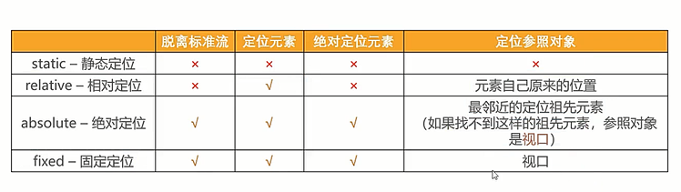

### z-index

作用：用来设置定位元素的层叠顺序，仅对**定位元素有效**

取值可以是正整数，负整数，0

比较原则：
 - 如果是兄弟关系
   - z-index越大，层叠在越上面
   - z-index相等，写在后面的那个元素层叠在上面

 - 如果不是兄弟关系
   - 各自从元素自己以及祖先元素中，找出最邻近的2个定位元素进行比较
   - 而且这2个定位元素必须有设置z-index的具体数值


## CSS的浮动

### 认识浮动
 float属性可以指定一个元素应沿着其容器的左侧或右侧放置，允许文本和内联元素环绕它
 - float属性最初只用于在一段文本内浮动图像，实现文字环绕的效果
 - 早期css标准并没有提供好的左右布局方案，因此在一段时间里面它成为网页多列布局的最常用工具

 绝对定位，浮动都会让元素脱离标准流，以达到灵活布局的效果

 常见取值
 - none: 不浮动，默认值
 - left: 向左浮动
 - right: 向右浮动

### 浮动的规则
= 元素一旦浮动后，脱离标准流
  - 朝着向左或者向右方向移动，直到自己的边界紧贴着包含块（一般是父元素）或者其他浮动元素的边界为止
  - 定位元素会层叠在浮动元素上面
- 如果元素是向左或者向右浮动，浮动元素的左或者右边界不能超出包含块的左或者右边界
- 浮动元素之间不能层叠
  - 左浮找左浮，右浮找右浮
  - 如果水平方向剩余空间不够显示浮动元素，浮动元素将向下移动，直到有充足的空间为止
- 浮动元素不能与行内级内容层叠，行内级内容将会被浮动元素推出
  - 比如行内级元素，inline-block元素，块级元素的文字内容
- 行内级元素、inline-block元素浮动后，其顶部将与所在行的顶部对齐

将多个行内级元素中间的空格(间隙)去除的方法
- 1. 删除换行符（不推荐）
- 2. 将父级元素的font-size设置为0，但是需要子元素设置回来
- 3. 通过子元素(span)统一向一个方向浮动即可
- 4. flex布局（还没学习）


### 浮动的案例
1. 百度页面展示练习

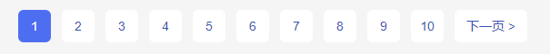

```css
  <!DOCTYPE html>
<html lang="en">
<head>
    <meta charset="UTF-8">
    <meta name="viewport" content="width=device-width, initial-scale=1.0">
    <title>Document</title>
</head>
<style>
   ul,li{
      list-style: none;
      margin: 0;
      padding: 0;
   }

   a{
      text-decoration: none;
      color: #333;
   }

   body{
      background-color: #f2f2f2;
   }

   ul > li {
      float: left;
      background-color: #fff;
      margin-left: 12px;
   }

   ul > li >a {
      display: inline-block;
      width: 36px;
      height: 36px;
      text-align: center;
      line-height: 36px;
      border-radius: 6px;
      background-color: #fff;
      color: #3951b3;
      font-size: 14px;
   }

   ul > li >a:hover{
      background-color: blue;
      color: #fff;
   }

   ul > li.active >a{
      background-color: blue;
      color: #fff;
   }
   
   ul > li.next > a{
      width: 80px;
   }
</style>
<body>
  <ul>
   <li class="item active"><a href="#">1</a></li>
   <li class="item"><a href="#">2</a></li>
   <li class="item"><a href="#">3</a></li>
   <li class="item"><a href="#">4</a></li>
   <li class="item"><a href="#">5</a></li>
   <li class="item"><a href="#">6</a></li>
   <li class="item"><a href="#">7</a></li>
   <li class="item"><a href="#">8</a></li>
   <li class="item"><a href="#">9</a></li>
   <li class="item"><a href="#">10</a></li>
   <li class="item next"><a href="#">下一页 &gt;</a></li>
  </ul>
</body>
</html>

```

2. 模仿京东布局
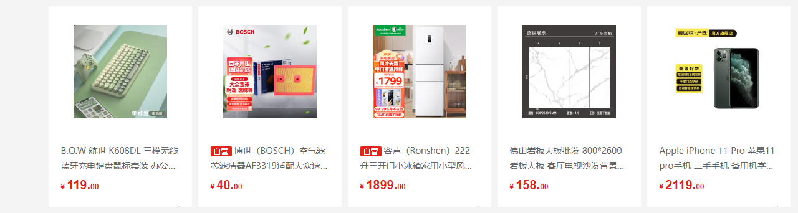

 ```css
  <!DOCTYPE html>
<html lang="en">
<head>
   <meta charset="UTF-8">
   <meta name="viewport" content="width=device-width, initial-scale=1.0">
   <title>Document</title>
</head>
<style>
   /* 公共的class */
   .content {
      width: 1190px;
      margin: 0 auto;
      background-color: orange;
      height: 800px;
   }

   .box{
      margin-right: -10px;;
   }

   /* 布局样式 */
   .item{
      width: 230px;
      height: 322px;
      background-color: purple;
      float: left;
      color: #fff;
      margin-right: 10px;
   }

   /* 存在兼容性 */
   /* .item:nth-child(5n){
      margin-right: 0;
   } */


</style>
<body>
   <div class="content">
      <div class="box">
         <div class="item item1">1</div>
         <div class="item item2">2</div>
         <div class="item item3">3</div>
         <div class="item item4">4</div>
         <div class="item item5">5</div>
      </div>
      
   </div>
</body>
</html>
 
 ```

 3. 模仿京东布局
 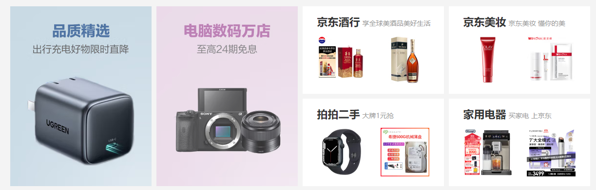

 ```css
  <!DOCTYPE html>
<html lang="en">
<head>
   <meta charset="UTF-8">
   <meta name="viewport" content="width=device-width, initial-scale=1.0">
   <title>Document</title>
</head>
<style>
   /* 公共的class */
   body{
      background-color: #f5f5f5;
   }

   .content {
      width: 1190px;
      margin: 0 auto;
      background-color: #f5f5f5;
      height: 1000px;
      
   }

   .wrapper{
      margin-right: -10px;
   }

   .item {
      width: 290px;
      background: #fff;
      margin-bottom: 10px;;

      float: left;
      margin-right: 10px;
   }

   .item.left {
      height: 370px;
   }

   .item.right{
      height: 180px;
   }

   
</style>
<body>
   <div class="content">
      <div class="wrapper">
         <div class="item left"></div>
         <div class="item left"></div>
         <div class="item right"></div>
         <div class="item right"></div>
         <div class="item right"></div>
         <div class="item right"></div>
         <div class="item right"></div>
         <div class="item right"></div>
         <div class="item right"></div>
         <div class="item right"></div>
         <div class="item right"></div>
         <div class="item right"></div>
         <div class="item right"></div>
         <div class="item right"></div>
         
      </div>
   </div>
</body>
</html>
 
 ```

### 浮动的问题
 高度塌陷
 - 由于浮动元素脱离了标准流，变成了脱标元素，所以不再向父元素汇报高度
   - 父元素计算总高度时，就不会计算浮动子元素的高度，导致了高度坍塌的问题

那么如何解决父元素高度坍塌问题呢，一般叫做清除浮动

清除浮动的目的是
  让父元素计算总高度的时候，把浮动子元素的高度算进去


### 清除浮动

如何清除浮动呢？
答：使用clear属性

clear属性是做什么的呢？
- clear属性可以指定一个元素是否必须移动（清除浮动后）到在它之前的浮动元素下面

clear常见取值
 - left: 要求元素的顶部低于之前生成的所有左浮动元素的底部
 - right: 要求元素的顶部低于之前生成的所有右浮动元素的底部
 - both: 要求元素的顶部低于之前生成的所有浮动元素的底部
 - none: 默认值，无特殊要求

 清除浮动的方法
 - 方法一：给父元素设置固定高度，扩展性不好，不推荐
 - 方法二：在父元素最后增加一个空的块级子元素，并且让它设置clear:both
   会增加很多无意义的空标签，维护麻烦，不推荐
 - 方案三： 给父元素增加::after伪元素，纯css样式解决，结构与样式分离，**推荐**

  ```CSS
    .clear_fix:after{
      content: "";
      clear: both;
      display: block;

      <!-- 浏览器兼容性 -->
      visibility: hidden;
      height: 0;
    }

    .clear-fix{
      <!-- ie6/7兼容性 -->
      *zoom:1; 
    }
  ```

## Flex布局

### 认识flex布局

  认识flexbox

- Flexbox翻译为弹性盒子

  - 弹性盒子是一种用于按行或按列布局元素的一维布局方法
  - 元素可以膨胀以填充额外的空间，收缩以适应更小的空间
  - 通常我们使用flexbox来进行布局的方案称之为flex布局（flex layout）

- flex布局是目前web开发中使用最多的布局方案

  - flex布局（flexible布局，弹性布局）
  - 目前特别在移动端可以说已经完全普及
  - 在pc端也几乎已经完全普及和使用，只有非常少数的网站依然在用浮动来布局

- 为什么需要flex布局？

  - 长久以来，css布局中唯一可靠且跨浏览器兼容的布局工具只有floats和positioning

  - 但是这两种方法本身存在很大的局限性，并且他们用于布局实在是无奈之举

    

 原先的布局存在的痛点？

- 在父内容里面垂直居中一个块内容
- 比如使容器的所有子项等分可用宽度/高度，而不管有多少宽度/高度可用


### flex布局的理解

 flex布局中重要概念

- 两个重要概念
  - 开启了flex布局的元素叫 flex container
  - flex container 里面的直接子元素叫做flex item

- 当flex cntainer中的子元素变成了flex item时，具备以下特点
  - flex item的布局将受**flex container属性的设置来进行控制和布局**
  - flex item **不再严格区分块级元素和行内级元素**
  - flex item**默认情况下是包裹内容**的，但是**可以设置宽度和高度**

- **设置display属性为flex或者inline-flex可以成为flex container**
  - flex:  flex container 以block-level形式存在
  - inline-flex: flex container 以 inline-level 形式存在


代码初体验

```html
<!DOCTYPE html>
<html lang="en">
<head>
   <meta charset="UTF-8">
   <meta name="viewport" content="width=device-width, initial-scale=1.0">
   <title>Document</title>
</head>
<style>
   .box{
      background-color: #f00;
      display: flex;
   }
</style>
<body>
   111
   <div class="box">
      <div class="item">box1</div>
      <div class="item">box2</div>
      <div class="item">box3</div>
   </div>
   2222
</body>
</html>
```

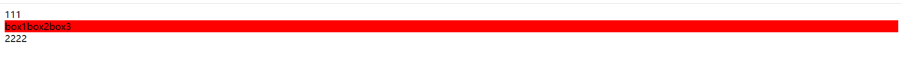


### flex-container属性

### flex-item属性


### Flex布局的模型

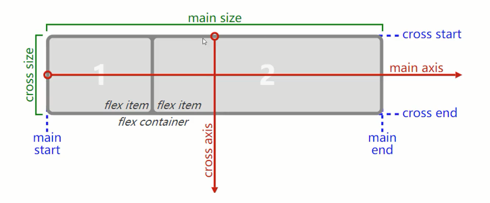

### Flex相关的属性

1. 应用在flex container上的css属性
   - flex-flow
   - flex-direction
   - flex-wrap
   - justify-content
   - align-items
   - align-content
2. 应用在flex items上的css属性
   - flex-grow
   - flex-basis
   - flex-shrink
   - order
   - align-self
   - flex


###  flex-direction

flex items 默认都是沿着main axis（主轴）从main start 开始往 main end 方向排布

- flex-direction 决定了main axis的方向，有4个取值
- row(默认值)、row-reverse、column、column-reverse

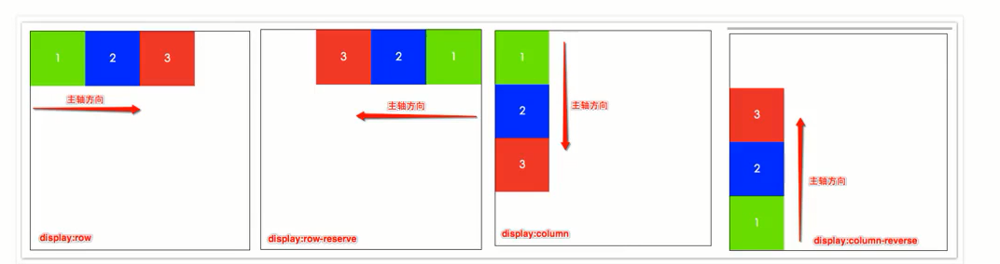

```css
  <!DOCTYPE html>
<html lang="en">
<head>
   <meta charset="UTF-8">
   <meta name="viewport" content="width=device-width, initial-scale=1.0">
   <title>Document</title>
</head>
<style>
   .box{
      background-color: #f00;
      display: flex;
      flex-direction: row-reverse;
   }
   .item{
      width: 200px;
      height: 200px;
   }
   .item1{
      background-color: aquamarine;
   }
   .item2{
      background-color: bisque;
   }
   .item3{
      background-color: skyblue;
   }
</style>
<body>
   <div class="box">
      <div class="item item1">box1</div>
      <div class="item item2">box2</div>
      <div class="item item3">box3</div>
   </div>
</body>
</html>

```

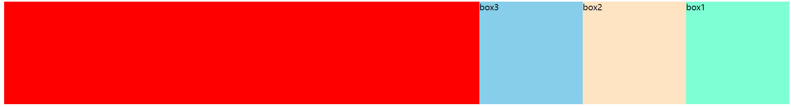


### flex-wrap

flex-wrap 决定了flex container 是单行还是多行

有三个取值

- nowrap(默认)：单行
- wrap: 多行
- wrap-reverse: 多行（对比wrap, cross start 与 cross end 相反）

```html
<!DOCTYPE html>
<html lang="en">
<head>
   <meta charset="UTF-8">
   <meta name="viewport" content="width=device-width, initial-scale=1.0">
   <title>Document</title>
</head>
<style>
   .box{
      background-color: #f00;
      display: flex;
      flex-direction: row;
      flex-wrap: wrap;
      width: 600px;
      height: 800px;
   }
   .item{
      width: 200px;
      height: 200px;
   }
   .item1{
      background-color: aquamarine;
   }
   .item2{
      background-color: bisque;
   }
   .item3{
      background-color: skyblue;
   }
   .item4{
      background-color: gainsboro;
   }
   .item5{
      background-color: cornsilk;
   }
</style>
<body>
   <div class="box">
      <div class="item item1">box1</div>
      <div class="item item2">box2</div>
      <div class="item item3">box3</div>
      <div class="item item4">box4</div>
      <div class="item item5">box5</div>
   </div>
</body>
</html>
  
```

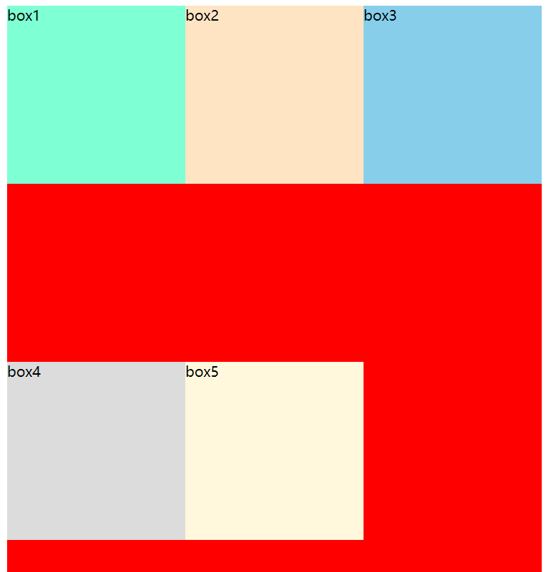


### flex-flow

flex-flow是属性flex-direction 和 flex-wrap 的简写

- 顺序任何，并且都可以省略

```css
.item{
    flex-flow: wrap;
    flex-flow: row wrap;
}
```


### justify-content

justify-content 决定了flex items 在main axis上的对齐方式

- flex-start(默认值)：与main start 对齐

  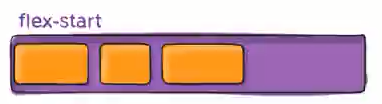


- flex-end: 与main end对齐
  
  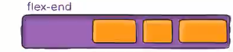


- center: 居中对齐
  
  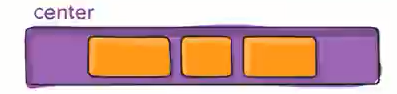


- space-between(两端个放一个元素，其他多余的元素一定要空间等分)
  - flex items 之前的距离相等
  - 与main start 、main end 两端对齐

 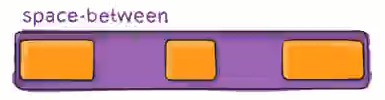


- space-around(两端也有间距，两端的间距是items之间的间距一半)
  - flex items 之间的距离相等
  - flex itmes 与main start、main end 之间的距离是flex items之间距离的一半
  
  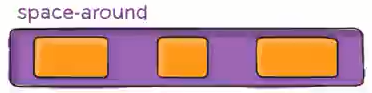


- space-evenly(两端也有空隙，并且所有的空间进行等分)
  - flex items之间的距离相等
  - flex items与 main start、main end之间的距离等于flex items 之间的距离
  
  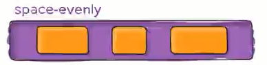


### align-items

align-items决定了flex items 在cross axis(交叉轴：竖线)上的对齐方式

- normal(了解): 在弹性布局中，效果和stretch一样
- stretch(了解): 当flex items 在cross axis方向的size 为auto时，会自动拉伸至填充flex container
- flex-start: 与cross start对齐
- flex-end: 与cross end对齐
- center(重要): 居中对齐
- baseline: 与基准线对齐

### align-content

align-content 决定了多行flex items在cross axis上的对齐方式，用法与justify-content类似

- stretch(默认值)：与align-items的stretch类似
- flex-start: 与cross start对齐
- flex-end: 与cross end对齐
- center: 居中对齐
- space-between
  - flex items之间的距离相等
  - 与cross start、cross end两端对齐

- space-around
  - flex items之间的距离相等
  - flex items 与cross start、cross end之间的距离是flex items之间距离的一半

- space-evenly
  - flex items 之间的距离相等
  - flex items 与 cross start、cross end之间的距离等于flex items之间的距离

--------------------------------------------------

### order(item属性)-了解

order 决定了flex  items的排布顺序

- 可以设置任意整数，**值越小就越排在前面**

- 默认值是0

  ```css
  .item1{
      order:5;
  }
  item2{
      order:3;
  }
  ```


### align-self(item属性)-了解

flex items可以通过align-self 覆盖flex container设置align-items

- auto: 默认值，遵从flex container的align-items设置
- stretch、flex-start、flex-end、center、baseline 效果和align-items一致

### flex-grow(item属性)-掌握

flex-grow 决定了flex items如何扩展（拉伸/成长）

- 可以设置任意非负数字，默认值是0
- 当flex container 在main axis方向上有剩余size时，flex-grow属性才会生效


### flex-shrink(item属性)-掌握

flex-shrink 决定了flex items 如何收缩（缩小）

- 可以设置任意非负数字，**默认值是1**
- 当flex items 在main axis 方向上**超过了flex container 的size, flex-shrink属性才会有效**

### flex-basis(item属性)-了解

flex-basis用来设置flex items 在main axis 方向上的base size

- auto （默认值）
- 具体的宽度数值（100px）


### flex(item属性)-缩小属性-掌握

flex 是flex-grow||flex-shrink||flex-basis的简写，flex属性可以指定1个，2个或者3个值

> none  | flex-grow |flex-shrink?|flex-basis

- 单值语法：值必须为以下其中之一
  - 一个无单位数(number): 它会被当作flex-grow的值
  - 一个有效的宽度(width)值，它会被当作flex-basis的值
  - 关键字none,auto或initial

- 双值语法：
  - 第一个值必须为一个无单位数，并且它会被当作flex-grow的值
  - 第二个值必须为以下之一
    - 一个无单位数：flex-shrink的值
    - 一个有效的宽度值：flex-basis的值

- 三值语法
  - 第一个flex-grow,第二个flex-shrink,第三个flex-basis


### flex布局对齐问题

思考：如下布局如何解决对齐问题

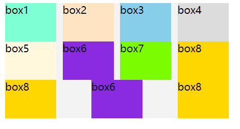

答案： 推荐方式，不用计算

1. 给里面div盒子后面增加i元素，元素个数为一排总数-2，上图对应就是4-2=2

  ```
  <div class="box">
        <div class="item item1">box1</div>
        <div class="item item2">box2</div>
        <div class="item item3">box3</div>
        <div class="item item4">box4</div>
        <div class="item item5">box5</div>
        <div class="item item6">box6</div>
        <div class="item item7">box7</div>
        <div class="item item8">box8</div>
        <div class="item item8">box8</div>
        <div class="item item6">box6</div>
        <div class="item item8">box8</div>      
        <i></i>
        <i></i>
       
     </div>
  ```

2. 给i元素设置和item相同的width

   ```css
   .box i{
         width: 80px;
      }
   ```

完整示例代码

```html
<!DOCTYPE html>
<html lang="en">
<head>
   <meta charset="UTF-8">
   <meta name="viewport" content="width=device-width, initial-scale=1.0">
   <title>Document</title>
</head>
<style>
   .box{
      background-color: #f3f3f3;
      display: flex;
      flex-wrap: wrap;
      width: 350px;
      justify-content: space-between;
   }
   .item{
      width: 80px;
      height: 60px;
   }
   .item1{
      background-color: aquamarine;
   }
   .item2{
      background-color: bisque;
   }
   .item3{
      background-color: skyblue;
   }
   .item4{
      background-color: gainsboro;
   }
   .item5{
      background-color: cornsilk;
   }
   .item6{
      background-color: blueviolet;
   }
   .item7{
      background-color: lawngreen;
   }
   .item8{
      background-color: gold;
   }
   .box i{
      width: 80px;
   }
</style>
<body>
   <div class="box">
      <div class="item item1">box1</div>
      <div class="item item2">box2</div>
      <div class="item item3">box3</div>
      <div class="item item4">box4</div>
      <div class="item item5">box5</div>
      <div class="item item6">box6</div>
      <div class="item item7">box7</div>
      <div class="item item8">box8</div>
      <div class="item item8">box8</div>
      <div class="item item6">box6</div>
      <div class="item item8">box8</div>      
      <i></i>
      <i></i>
     
   </div>
</body>
</html>
```


## transform

css 属性- transform 属性允许对某一个元素进行某些形变，包括旋转，缩放，倾斜或平移等

transform 是形变的意思

并非所有的盒子都可以进行transform的转换（**行内级元素不能进行形变**）

所以transform 对于行内级非替换元素是无效的（比如span, a元素等）


transform属性的语法

常见的函数有

- 平移：translate(x,y)
- 缩放：scale(x,y)
- 旋转：rotate(deg)
- 倾斜：skew(deg,deg)


一. 位移- translate

- 平移：translate(x,y)
  - 这个css函数用于移动元素在平面上的位置

- 值个数
  - 一个值时，设置x轴上的距离
  - 两个值时，设置x和y轴的距离

```css
.box{
    transform: translate(100px);
    transform: translate(100px,100px);
}
```

- 值类型
  - 数字：100px
  - 百分比：参照元素**本身**

注意：translate的百分比是相对于自身的

如果设置x位移：那么参考的是自身的宽度

如果设置y位移：那么参考的是自身的高度


translate的补充

- translate是translateX和translateY函数的简写
- translate的百分比可以完成一个**元素的水平和垂直居中**


二. 缩放-sacle

- 缩放：scale(x,y): 可改变元素的大小

  - 值个数
    - 一个值，设置x轴上的缩放
    - 两个值，设置x轴和y轴上的缩放

  - 值类型
    - 数字
      - 1：保持不变
      - 2：放大一倍
      - 0.5：缩小一半

```css
.box{
    transform: scale(0.6,0.6);
}
```


三、旋转-rotate

- 值个数
  - 一个值时，表示旋转的角度

- 值类型：
  - 常用单位deg: 旋转的角度（degrees）
  - 正数为顺时针
  - 负数为逆时针

```
.box{
	transform: rotate(90deg);
}
```

四、倾斜-skew（了解）

倾斜：skew(x,y)

- 定义了一个元素在二维平面上的倾斜转换
- 值个数
  - 一个值：表示x轴上的倾斜
  - 两个值：表示x轴和y轴上的倾斜

- 值类型
  - deg: 旋转的角度
  - 正数为顺时针
  - 负数为逆时针


```css
.box:hover {
    transform: skew(-10deg,0);
}
```


transform 可以设置多个值

eg

```css
.box:hover{
    transform: translate(50px) scale(1.2) rotate(45deg);
}
```


## 垂直居中总结（重要）

一、回顾让元素水平居中，有如下几种

1.  行内级元素
   - 设置父元素的text-align: center

2. 块级元素
   - 设置当前块级元素的margin: 0 auto;(元素必须有宽度)

3. 绝对定位
   - 元素有宽度的情况下，left:0; right:0；margin: 0 auto;

4. flex
   - justify-content: center

二、垂直居中

1. 绝对定位
   - 元素有高度情况下，top:0; bottom:0; margin: auto 0;
   - 弊端：必须使用定位(脱离标准流)；元素必须设置宽度

2. flex布局
   - 父元素display: flex; align-items: center;
   - 弊端：当前flex局部中所有的元素都会被垂直居中，兼容性差一点点

3. top+translate(推荐，但是不好理解)

   两件事情

   - 需要让元素向下位移父元素的50%
   - 需要让元素向上位移自身的50%

   ```css
   .box{
       position: relative;
       top: 50%;
       transform: translate(0,-50%);
           
   }
   ```

   


## transition 动画

一、认识transition动画

什么是transition动画

- css transition提供了一种在更改css属性时控制动画速度的方法

css transitions 可以决定

- 哪些属性发现动画效果
- 何时开始
- 持续多久
- 如何动画

二、哪些css属性可以做动画呢？

查文档

三、过渡动画-transition

包含四个属性

- transition-property: 指定应用过渡属性的名称

  - all: 所有属性都执行动画
  - none: 所有属性都不执行动画
  - css属性名称：要执行动画的css属性名称，比如width、left、transform等

  

- transition-duration: 指定过渡动画所需的时间

  - 单位可以是秒（s）或毫秒（ms）

- transition-timing-function: 指定动画的变化曲线

- transition-delay： 指定过渡动画执行之前的等待时间

 ```css
.box{
    positon: relative;
    left:0;
    width:200px;
    height:100px;
    background-color: orange;
    
    transition-property: transform,left;
    transition-duration: 1s;
    transition-timing-function: ease-in;
    transition-delay: 2s;
    
    /*简写属性 */
    transition: all 1s ease-in 1s;
    
}

.box:hover{
    left:100px;
    transform: translate(100px);
}
 ```


## animation动画

## vertical-align


