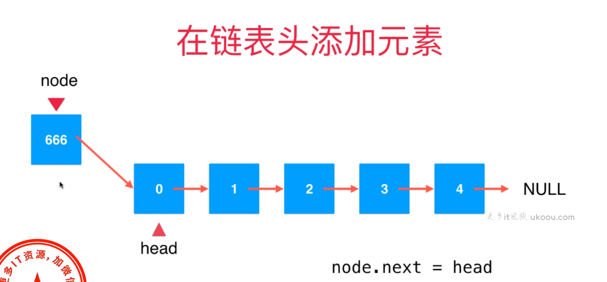

# 数据结构和算法

## 第一章：算法简介

### 1.1 算法的基本概念

#### 1.1.1 什么是算法

​	算法：故名思意，就是指计算方法，指解决一个问题具体的步骤和方法

#### 1.1.2 为什么学习算法

​	提高自己的核心竞争力，提高自己解决问题的能力

### 1.2 算法的特征

- 有穷性：算法必须在能在执行有限个步骤之后终止
- 确切性：算法的每一步骤必须有确切的定义
- 输入项：一个算法有0个或者多个输入
- 输出项：一个算法有一个或多个输出，以反映对输入数据加工后的结果
- 可行性：每个计算步骤都可以在有限时间内完成

### 1.3 算法复杂度

#### 1.3.1 时间复杂度

​	算法的时间复杂度，是指执行算法所需要的计算工作量。

一般来说，计算机算法是问题规模n 的函数f(n)，算法的时间复杂度也因此记做：T(n)=Ο(f(n))。

问题的规模n 越大，算法执行的时间的增长率与f(n) 的增长率正相关，称作渐进时间复杂度（Asymptotic Time Complexity）。

#### 1.3.2 空间复杂度

 算法的空间复杂度，是指算法需要消耗的内存空间。其计算和表示方法与时间复杂度类似，一般都用复杂度的渐近性来表示


#### 1.3.3 时间复杂度的计算

  


## 第二章：数组问题讲解

 数组：会利用索引来记录每个元素在数组中的位置，索引是从0算起的

### 2.1 两数之和

#### 2.1.1 题目

给定一个整数数组 nums 和一个目标值 target，请你在该数组中找出和为目标值的那两个整数，并返回他们的数组下标。

你可以假设每种输入只会对应一个答案。但是，你不能重复利用这个数组中同样的元素

**示例**

给定 nums = [2, 7, 11, 15], target = 9

因为 nums[0] + nums[1] = 2 + 7 = 9

所以返回 [0, 1]


#### 2.1.2 方法一：暴力法

```java
public static int[] twoSum(int[] arr,int target){
        for(int i=0;i<arr.length;i++){
            for(int j=i+1;j<arr.length;j++){
                if(arr[i]+arr[j] == target){
                    return new int[]{i,j};
                }
            }
        }
        return new int[]{};
    }


解释：从结果来说，j也可以从0开始，只不过多遍历了几次，两数之和，两个数，正常的最里面的for循环从第一个数的后面开始
```


#### 2.1.3 方法二：哈希表

```java
public static int[] twoSum(int[] arr,int target){
    //创建一个hashmap存储数组元素和对应的索引
    Map<Integer,Integer> map = new HashMap<>();
    
    //遍历数组元素
    for(int i=0; i<arr.length;i++){
        int complement = target - arr[i];
        //检测是否存在与当前元素配对的差值
        if(map.containsKey(complement)){
            //返回两个数的索引
            return new int[]{map.get(complement),i};
        }
        
        //将当前元素和索引存入hashmap中
        map.put(nums[i],i);
    }
    
    //如果没有找到符合条件的两个数，返回空数组
    return new int[0];
}
```


### 2.2 三数之和

#### 2.2.1 题目说明

给定一个包含 n 个整数的数组 nums，判断 nums 中是否存在三个元素 a，b，c ，使得 a + b + c = 0 ？找出所有满足条件且不重复的三元组。

注意：答案中不可以包含重复的三元组。

**示例**:

给定数组 nums = [-1, 0, 1, 2, -1, -4]，

满足要求的三元组集合为：

[

 [-1, 0, 1],

 [-1, -1, 2]

]


#### 2.2.2 解题（推荐双指针法）

1. 将数组排序：首先，对给定的数组进行排序，以便更方便地使用双指针方法。排序的时间复杂度为O(n log n)，其中n是数组的长度。
2. 遍历数组：遍历排序后的数组，在每个位置上选择一个数字作为第一个数（最左边的指针）。
3. 使用双指针查找另外两个数：在选择的第一个数后面的子数组部分中，使用双指针方法来查找另外两个数，使得它们的和等于0减去第一个数。一个指针从第一个数的右边开始移动，即左指针，另一个指针从数组尾部向左移动，即右指针。
4. 调整指针位置：根据双指针所指的三个数之和与目标和比较的结果，调整指针的位置。如果三数之和小于目标和，将左指针向右移动一位；如果三数之和大于目标和，将右指针向左移动一位；如果三数之和等于目标和，将这三个数添加到结果集中。
5. 继续遍历：重复步骤3和步骤4，直到遍历完整个数组。
6. 返回结果：返回找到的所有满足条件的三个数的组合

```java
public static List<List<Integer>> threeSum(int[] nums) {
		// 对输入数组进行排序
		Arrays.sort(nums);

		// 创建一个 ArrayList 用于存储满足条件的三元组
		List<List<Integer>> result = new ArrayList<>();

		// 遍历数组，略过最后两个元素，因为我们需要至少三个元素来形成一个三元组
		for (int i = 0; i < nums.length - 2; i++) {
			// 排序后的数组，如果当前元素大于0，不可能再找到和为0的三元组，因为left=i+1
			if (nums[i] > 0) {
				break;
			}

			// 跳过重复元素，以避免重复的三元组
			if (i > 0 && nums[i] == nums[i - 1]) {
				continue;
			}

			// 初始化双指针，一个指针从当前元素的下一个开始，另一个指针从数组的最后一个元素开始
			int left = i + 1;
			int right = nums.length - 1;

			// 当左指针小于右指针时，继续寻找满足条件的三元组
			while (left < right) {
				int sum = nums[i] + nums[left] + nums[right];

				// 根据三数之和与0的关系，移动左指针或右指针
				if (sum == 0) {
					// 找到一个满足条件的三元组，添加到结果列表中
					result.add(Arrays.asList(nums[i], nums[left], nums[right]));

					// 跳过重复元素，以避免重复的三元组
					while (left < right && nums[left] == nums[left + 1]) {
						left++;
					}
					while (left < right && nums[right] == nums[right - 1]) {
						right--;
					}

					// 找到一个满足条件的三元组后，同时移动左右指针继续寻找下一个三元组
					left++;
					right--;
				} else if (sum < 0) {
					// 如果和小于0，需要增加和的值，因此将左指针向右移动
					left++;
				} else {
					// 如果和大于0，需要减小和的值，因此将右指针向左移动
					right--;
				}
			}
		}

		// 返回包含满足条件的三元组的结果列表
		return result;
	}
```


### 2.3 下一个排列

####  2.3.1 题目说明

实现获取下一个排列的函数，算法需要将给定数字序列重新排列成字典序中下一个更大的排列。

如果不存在下一个更大的排列，则将数字重新排列成最小的排列（即升序排列）。

必须原地修改，只允许使用额外常数空间。

 

以下是一些例子，输入位于左侧列，其相应输出位于右侧列。

1,2,3 → 1,3,2

3,2,1 → 1,2,3

1,1,5 → 1,5,1


#### 2.3.2 解题：一遍扫描

解题思路：

1. 先排除例外，如果数组是按照降序排列的，就没有升序的子序列了。 下一个排列就是将数组升序排列 比如[9,8,7]，下一个排列就是[7,8,9]
2. 如果数组有一个升序的子序列，那么就一定可以找到它的下一个排列。 也就是说从右往左，找到第一对连续的数字 nums[i] 和 nums[i+1],满足nums[i+1] > nums[i]
3. 比如 [1,5,7,4,2] 满足 nums[i+1] > nums[i] 则 i = 1, (num[2] = 7) > (num[1] = 5), 然后 从i+1到 数组结束，查找比5大，比7小的数字，
4. 找到了6 , 那么就确定了前两个数字1,6 ， 后面的按正序排序就行了
5. 如果没找到，则直接替换5和7的位置即可

```java
public void nextPermutation(int[] nums) {
        if (nums == null || nums.length <= 1) {
            return;
        }
        
        int i = nums.length - 2;
        while (i >= 0 && nums[i] >= nums[i + 1]) {
            i--; // 从右向左找到第一个不满足递减顺序的元素
        }
        
        if (i >= 0) {
            int j = nums.length - 1;
            while (j > i && nums[j] <= nums[i]) {
                j--; // 从右向左找到第一个大于nums[i]的元素
            }
            
            swap(nums, i, j); // 交换找到的两个元素
        }
        
        reverse(nums, i + 1); // 翻转i之后的元素
    }
    
    private void swap(int[] nums, int i, int j) {
        int temp = nums[i];
        nums[i] = nums[j];
        nums[j] = temp;
    }
    
    private void reverse(int[] nums, int start) {
        int i = start, j = nums.length - 1;
        while (i < j) {
            swap(nums, i, j);
            i++;
            j--;
        }
    }
```


## 第三章：二分查找

## 第四章：字符串问题

## 第五章：滑动窗口问题

## 第六章：链表

### 6.1 为什么链表很重要

链表： 真正的动态数据结构，是最简单的动态数据结构，更深入的理解指针，更深入的理解递归；辅助组成其他数据结构

### 6.2 认识链表

- 数据存储在节点(Node)中

  ```java
  class Node {
      E e;
      Node next;
  }
  
  1-->2--->3-->Null
  ```

- 优点：真正的动态，不需要处理固定容量的问题
- 缺点：丧失了随机访问的能力
- 在链表头添加元素图例




  


- 在链表中间添加元素


```java
package com.cx.study.algorithm.linkedlist;

/**
 * @ClassName: LinkedList
 * @Author : chenxin
 * @Date :2023/11/27  20:21
 * @Description: TODO
 * @Version :1.0
 */
public class LinkedList<E> {

    private class Node{
        public E e;
        public Node next;

        public Node(E e,Node next){
            this.e = e;
            this.next = next;
        }

        public Node(E e){
            this(e,null);
        }

        public Node(){
            this(null,null);
        }

        @Override
        public String toString(){
            return e.toString();
        }
    }

    private Node head;
    int size;

    public LinkedList(){
        head = null;
        size = 0;
    }

    //获取链表中的元素个数
    public int getSize(){
        return this.size;
    }

    public boolean isEmpty(){
        return this.size == 0;
    }

    //在链表头添加新的元素e
    public void addFirst(E e){
//        Node node = new Node(e);
//        node.next = head;
//        head = node;
        head = new Node(e,head);
        size ++;
    }

    //在链表的index(0-based)位置添加新的元素e
    public void add(int index, E e){
        if(index <0 || index >0){
            throw new IllegalArgumentException("Add faild");
        }
        if(index == 0){
            addFirst(e);
        }else{
            Node prev = head;
            for(int i=0;i<index -1 ;i++){
                prev = prev.next;
            }
//            Node node = new Node(e);
//            node.next = prev.next;
//            prev.next = node;
            prev.next = new Node(e,prev.next);
            size++;
        }

    }

    public void addLast(E e){
        add(size,e);
    }
}

```


## 第七章：哈希表

## 第八章：栈和队列

### 8.1 栈的介绍

栈也是一种线性结构，相比数组，栈对应的操作是数组的子集，只能从一端添加元素，也只能从一端取出元素，这一端称为栈顶

栈是一种后进先出的结构  LIFO(Last in first out)

栈的实现 Stack

- void push(E) （入栈）
- E pop()  （出栈）
- E peek()   (获取栈顶元素)
- int getSize()  （获取栈的大小）
- boolean isEmpty() （判断栈是否为空）

### 8.2 栈的实现

1. Array类

   ```java
   package com.cx.study.algorithm.array;
   
   /**
    * @ClassName: Array
    * @Author : chenxin
    * @Date :2023/11/14  11:48
    * @Description: TODO
    * @Version :1.0
    */
   public class Array {
   
       private int[] data;
   
       //数组元素的个数
       private int size;
   
       //构造函数，传入数组的容量capacity构造Array
       public Array(int capacity){
           data = new int[capacity];
           size = 0;
       }
   
       //无参数的构造函数，默认数组的容量capation=10
       public Array(){
           this(10);
       }
   
       //获取数组中的元素的个数
       public int getSize(){
           return this.size;
       }
   
       //获取数组的容量
       public int getCapacity(){
           return data.length;
       }
   
       //判断返回数组是否为空
       public boolean isEmpty(){
           return size == 0;
       }
   
       //向所有元素后添加一个新元素
       public void addLast(int e){
           if(size == data.length){
               throw new IllegalArgumentException("AddLast failed. Array is full");
           }
           data[size] = e;
           size ++;
       }
   
       //在第index个位置插入一个新元素e
       public void add(int index,int e){
           /*if(size == data.length){
               throw new IllegalArgumentException("AddLast failed. Array is full");
           }*/
   
           if(index <0 || index > size){
               throw new IllegalArgumentException("Add failed. Require index >=0 and index >size");
           }
   
           //扩容
           if(size == data.length){
               resize(2 * data.length);
           }
   
           //从最后一个元素开始，只要i大于index,i减减，将当前元素的值赋值给后一个元素
           for(int i = size -1; i>= index ; i--){
               data[i + 1] = data[i];
           }
           data[index] = e ;
           size ++;
       }
   
       //在所有元素前添加一个新元素
       public void addFirst(int e){
           add(0,e);
       }
   
       @Override
       public String toString(){
           StringBuilder res = new StringBuilder();
           res.append(String.format("Array: size = %d , capacity= %d\n",size,data.length));
           res.append('[');
           for(int i=0; i<size; i++){
               res.append(data[i]);
               if(i != size -1){
                   res.append(", ");
               }
           }
           res.append(']');
           return res.toString();
       }
   
       //获取index索引位置的元素
       int get(int index){
           if(index <0 || index >= size){
               throw new IllegalArgumentException("Get failed. Index is illegal");
           }
           return data[index];
       }
   
       public int getLast(){
           return get(size-1);
       }
   
       public int getFirst(){
           return get(0);
       }
   
       void set(int index,int e){
           if(index <0 || index >= size){
               throw new IllegalArgumentException("Get failed. Index is illegal");
           }
           data[index] = e;
       }
   
       //查找数组中是否有元素e
       public boolean contains(int e){
           for(int i=0;i<size;i++){
               if(data[i] == e){
                   return true;
               }
           }
           return false;
       }
   
       //查找数组中元素e所在的索引，如果不存在元素e,则返回-1
       public int find(int e){
           for(int i=0;i<size;i++){
               if(data[i] == e){
                   return i;
               }
           }
           return -1;
       }
   
       //从数组中删除index位置的元素，返回删除的元素
       public int remove(int index){
           if(index <0 || index >= size){
               throw new IllegalArgumentException("Remove failed. Index is illegal");
           }
           int ret = data[index];
           for(int i= index +1 ; i<size; i++){
               data[i-1] = data[i];
           }
           size -- ;
   
           if(size == data.length /2){
               resize(data.length /2);
           }
           return ret;
       }
   
       public int removeFirst(){
           return remove(0);
       }
   
       public int removeLast(){
           return remove(size - 1);
       }
   
       public void removeElement(int e){
           int index = find(e);
           if(index != -1){
               remove(index);
           }
       }
   
       private void resize(int newCapacity){
           int[] newData = new int[newCapacity];
           for(int i=0;i<size;i++){
               newData[i] = data[i];
           }
           data = newData;
       }
   
   
       public static void main(String[] args) {
           Array array = new Array();
           for(int i=0; i< 10;i++){
               array.addLast(i);
           }
           System.out.println(array);
   
           array.add(1,100);
           System.out.println(array);
   
           array.addFirst(-1);
           System.out.println(array);
   
       }
   }
   
   ```

   

2. stack 接口

   ```java
   package com.cx.study.algorithm.array;
   
   /**
    * @ClassName: Stack
    * @Author : chenxin
    * @Date :2023/11/20  14:04
    * @Description: TODO
    * @Version :1.0
    */
   public interface Stack {
   
       int getSize();
   
       boolean isEmpty();
   
       void push(int e);
   
       int pop();
   
       int peek();
   }
   
   ```

   

3. ArrayStack类

   ```java
   package com.cx.study.algorithm.array;
   
   /**
    * @ClassName: ArrayStack
    * @Author : chenxin
    * @Date :2023/11/20  14:05
    * @Description: TODO
    * @Version :1.0
    */
   public class ArrayStack implements Stack {
   
       Array array;
   
       public ArrayStack(int capacity){
           array = new Array(capacity);
       }
   
       public ArrayStack(){
           array = new Array();
       }
   
       public int getCapacity(){
           return array.getCapacity();
       }
   
       @Override
       public int getSize() {
           return array.getSize();
       }
   
       @Override
       public boolean isEmpty() {
           return array.isEmpty();
       }
   
       @Override
       public void push(int e) {
           array.addLast(e);
       }
   
       @Override
       public int pop() {
           return array.removeLast();
       }
   
       @Override
       public int peek() {
           return array.getLast();
       }
   
       @Override
       public String toString() {
           StringBuilder res = new StringBuilder();
           res.append("Stack: ");
           res.append('[');
           for(int i=0;i<array.getSize();i++){
               res.append(array.get(i));
               if(i != array.getSize() -1){
                   res.append(",");
               }
           }
           res.append("] top");
           return res.toString();
       }
   
       public static void main(String[] args) {
           ArrayStack stack = new ArrayStack();
           for(int i=0; i< 5; i++){
               stack.push(i);
               System.out.println(stack);
           }
   
           stack.pop();
           System.out.println(stack);
       }
   }
   
   ```

4. 测试结果

   

### 8.3 栈的应用

- undo操作- 编辑器

- 系统调用栈-操作系统

- 括号匹配-编译器

  力扣：20

  题目：给定一个只包括 `'('`，`')'`，`'{'`，`'}'`，`'['`，`']'` 的字符串 `s` ，判断字符串是否有效。

  有效字符串需满足：

  1. 左括号必须用相同类型的右括号闭合。
  2. 左括号必须以正确的顺序闭合。
  3. 每个右括号都有一个对应的相同类型的左括号

    **示例 1：**

  ```
  输入：s = "()"
  输出：true
  ```

  **示例 2：**

  ```
  输入：s = "()[]{}"
  输出：true
  ```

  **示例 3：**

  ```java
  输入：s = "(]"
  输出：false
  ```

​      利用栈解决

     ```java
     import java.util.Stack;
     
     /**
      * @ClassName: Solution
      * @Author : chenxin
      * @Date :2023/11/20  15:44
      * @Description: TODO
      * @Version :1.0
      */
     public class Solution {
     
         public static boolean isValid(String s){
             Stack<Character> stack = new Stack<>();
             for(int i=0; i<s.length();i++){
                 char c = s.charAt(i);
                 if(c == '(' || c == '[' || c == '{'){
                     stack.push(c);
                 }else{
                     if(stack.isEmpty()){
                         return false;
                     }
                     Character topChar = stack.pop();
                     if(c == ')' && topChar != '(' ){
                         return false;
                     }
                     if(c == ']' && topChar != '['){
                         return false;
                     }
                     if(c == '}' && topChar != '{'){
                         return false;
                     }
                 }
             }
             return stack.isEmpty();
         }
     
         public static void main(String[] args) {
             String  s = "()[]{}";
             boolean valid = Solution.isValid(s);
             System.out.println(valid);
         }
     
     }
     ```


### 8.4 队列介绍

 队列也是一种线性结构，相比数组，队列对应的操作是数组的子集

 队列只能从一端（队尾）添加元素，只能从另一端（队首）取出元素

队列是一种先进先出的数据结构（先到先得） FIFO(First in First out)


### 8.5 队列的实现

Queue

- void enqueue
- E dequeue()
- E getFront()
- int getSize()
- boolean isEmpty()


1. Array类

   ```java
   package com.cx.study.algorithm.array;
   
   /**
    * @ClassName: Array
    * @Author : chenxin
    * @Date :2023/11/14  11:48
    * @Description: TODO
    * @Version :1.0
    */
   public class Array {
   
       private int[] data;
   
       //数组元素的个数
       private int size;
   
       //构造函数，传入数组的容量capacity构造Array
       public Array(int capacity){
           data = new int[capacity];
           size = 0;
       }
   
       //无参数的构造函数，默认数组的容量capation=10
       public Array(){
           this(10);
       }
   
       //获取数组中的元素的个数
       public int getSize(){
           return this.size;
       }
   
       //获取数组的容量
       public int getCapacity(){
           return data.length;
       }
   
       //判断返回数组是否为空
       public boolean isEmpty(){
           return size == 0;
       }
   
       //向所有元素后添加一个新元素
       public void addLast(int e){
           if(size == data.length){
               throw new IllegalArgumentException("AddLast failed. Array is full");
           }
           data[size] = e;
           size ++;
       }
   
       //在第index个位置插入一个新元素e
       public void add(int index,int e){
           /*if(size == data.length){
               throw new IllegalArgumentException("AddLast failed. Array is full");
           }*/
   
           if(index <0 || index > size){
               throw new IllegalArgumentException("Add failed. Require index >=0 and index >size");
           }
   
           //扩容
           if(size == data.length){
               resize(2 * data.length);
           }
   
           //从最后一个元素开始，只要i大于index,i减减，将当前元素的值赋值给后一个元素
           for(int i = size -1; i>= index ; i--){
               data[i + 1] = data[i];
           }
           data[index] = e ;
           size ++;
       }
   
       //在所有元素前添加一个新元素
       public void addFirst(int e){
           add(0,e);
       }
   
       @Override
       public String toString(){
           StringBuilder res = new StringBuilder();
           res.append(String.format("Array: size = %d , capacity= %d\n",size,data.length));
           res.append('[');
           for(int i=0; i<size; i++){
               res.append(data[i]);
               if(i != size -1){
                   res.append(", ");
               }
           }
           res.append(']');
           return res.toString();
       }
   
       //获取index索引位置的元素
       int get(int index){
           if(index <0 || index >= size){
               throw new IllegalArgumentException("Get failed. Index is illegal");
           }
           return data[index];
       }
   
       public int getLast(){
           return get(size-1);
       }
   
       public int getFirst(){
           return get(0);
       }
   
       void set(int index,int e){
           if(index <0 || index >= size){
               throw new IllegalArgumentException("Get failed. Index is illegal");
           }
           data[index] = e;
       }
   
       //查找数组中是否有元素e
       public boolean contains(int e){
           for(int i=0;i<size;i++){
               if(data[i] == e){
                   return true;
               }
           }
           return false;
       }
   
       //查找数组中元素e所在的索引，如果不存在元素e,则返回-1
       public int find(int e){
           for(int i=0;i<size;i++){
               if(data[i] == e){
                   return i;
               }
           }
           return -1;
       }
   
       //从数组中删除index位置的元素，返回删除的元素
       public int remove(int index){
           if(index <0 || index >= size){
               throw new IllegalArgumentException("Remove failed. Index is illegal");
           }
           int ret = data[index];
           for(int i= index +1 ; i<size; i++){
               data[i-1] = data[i];
           }
           size -- ;
   
           if(size == data.length /2){
               resize(data.length /2);
           }
           return ret;
       }
   
       public int removeFirst(){
           return remove(0);
       }
   
       public int removeLast(){
           return remove(size - 1);
       }
   
       public void removeElement(int e){
           int index = find(e);
           if(index != -1){
               remove(index);
           }
       }
   
       private void resize(int newCapacity){
           int[] newData = new int[newCapacity];
           for(int i=0;i<size;i++){
               newData[i] = data[i];
           }
           data = newData;
       }
   
   
       public static void main(String[] args) {
           Array array = new Array();
           for(int i=0; i< 10;i++){
               array.addLast(i);
           }
           System.out.println(array);
   
           array.add(1,100);
           System.out.println(array);
   
           array.addFirst(-1);
           System.out.println(array);
   
       }
   }
   
   ```

   

2. Queue接口

   ```java
   package com.cx.study.algorithm.array;
   
   /**
    * @ClassName: Queue
    * @Author : chenxin
    * @Date :2023/11/20  16:44
    * @Description: TODO
    * @Version :1.0
    */
   public interface Queue {
       int getSize();
   
       boolean isEmpty();
   
       void enqueue(int e);
   
       int dequeue();
   
       int getFront();
   }
   
   ```

   

3. ArrayQueue类

   ```java
   package com.cx.study.algorithm.array;
   
   /**
    * @ClassName: ArrayQueue
    * @Author : chenxin
    * @Date :2023/11/20  16:45
    * @Description: TODO
    * @Version :1.0
    */
   public class ArrayQueue implements Queue{
   
       private Array array;
   
       public ArrayQueue(int capacity){
           array = new Array(capacity);
       }
   
       public ArrayQueue(){
           array = new Array();
       }
   
       public int getCapcity(){
           return array.getCapacity();
       }
   
       @Override
       public int getSize() {
           return array.getSize();
       }
   
       @Override
       public boolean isEmpty() {
           return array.isEmpty();
       }
   
       //添加元素是队列尾元素
       @Override
       public void enqueue(int e) {
           array.addLast(e);
       }
   
       //取出元素是队列头的元素
       @Override
       public int dequeue() {
           return array.removeFirst();
       }
   
       @Override
       public int getFront() {
           return array.getFirst();
       }
   
       @Override
       public String toString() {
           StringBuilder res = new StringBuilder();
           res.append("Queue: ");
           res.append("front [");
           for(int i=0; i<array.getSize();i++){
               res.append(array.get(i));
               if(i != array.getSize() -1){
                   res.append(", ");
               }
           }
           res.append("] tail");
           return res.toString();
       }
   
       public static void main(String[] args) {
           ArrayQueue arrayQueue = new ArrayQueue();
           for(int i=0;i< 10;i++){
               arrayQueue.enqueue(i);
               System.out.println(arrayQueue);
   
               if(i % 3 == 2){
                   arrayQueue.dequeue();
                   System.out.println(arrayQueue);
               }
           }
       }
   
   }
   
   ```

4. 测试结果

   

### 8.6 循环队列

定义： 

front == tail 队列为空


tail +1 == front 队列满，即：(tail+1) % c == front 队列满


实现：

- Queue 接口

  ```java
  public interface Queue<E> {
      int getSize();
  
      boolean isEmpty();
  
      void enqueue(E e);
  
      E dequeue();
  
      E getFront();
  }
  ```

  

- LoopQueue类

  ```java
  package com.cx.study.algorithm.queue;
  
  /**
   * @ClassName: LoopQueue
   * @Author : chenxin
   * @Date :2023/11/20  20:22
   * @Description: TODO
   * @Version :1.0
   */
  public class LoopQueue<E> implements Queue<E> {
  
      private E[] data;
  
      private int front,tail;
  
      private int size;
  
      public LoopQueue(int capacity){
          data = (E[])new Object[capacity +1];
          front = 0;
          tail = 0;
          size = 0;
      }
  
      public LoopQueue(){
          this(10);
      }
  
      public int getCapacity(){
          return data.length -1;
      }
  
  
  
      @Override
      public int getSize() {
          return size;
      }
  
      @Override
      public boolean isEmpty() {
          return front == tail;
      }
  
      @Override
      public void enqueue(E e) {
          if((tail +1) % data.length == front){
              resize(getCapacity() * 2);
          }
  
          data[tail] =e;
          tail = (tail +1) % data.length;
          size ++ ;
  
      }
  
  
      private void resize(int newCapacity){
          E[] newData = (E[])new Object[newCapacity + 1];
          for(int i=0;i<size;i++){
              newData[i] = data[(i + front) % data.length];
          }
          data = newData;
          front = 0;
          tail = size;
      }
  
      @Override
      public E dequeue() {
          if(isEmpty()){
              throw new IllegalArgumentException("Cannot dequeue from an empty queue");
          }
          E ret = data[front];
          data[front] = null;
          front = (front +1) % data.length;
          size --;
          if(size == getCapacity() /4 && getCapacity() /2 != 0){
              resize(getCapacity() /2);
          }
          return ret;
      }
  
      @Override
      public E getFront() {
          if(isEmpty()){
              throw new IllegalArgumentException("Cannot dequeue from an empty queue");
          }
          return data[front];
      }
  
      @Override
      public String toString() {
          StringBuilder res = new StringBuilder();
          res.append(String.format("Queue: size = %d , capacity= %d\n",size,getCapacity()));
          res.append(" front [");
          for(int i=0; i != tail; i = (i+1) % data.length){
              res.append(data[i]);
              if((i +1)   % data.length  != tail){
                  res.append(", ");
              }
          }
          res.append("] tail");
          return res.toString();
      }
  
      public static void main(String[] args) {
          LoopQueue arrayQueue = new LoopQueue();
          for(int i=0;i< 10;i++){
              arrayQueue.enqueue(i);
              System.out.println(arrayQueue);
  
              if(i % 3 == 2){
                  arrayQueue.dequeue();
                  System.out.println(arrayQueue);
              }
          }
  
      }
  }
  
  ```


### 8.7 循环队列另一种实现方式(不浪费空间)

```java
public class LoopQueue implements Queue {
private E[] data;
private int front, tail;
private int size;

public LoopQueue(int capacity){
    data = (E[])new Object[capacity]; // 由于不浪费空间，所以data静态数组的大小是capacity
                                      // 而不是capacity + 1
    front = 0;
    tail = 0;
    size = 0;
}

public LoopQueue(){
    this(10);
}

public int getCapacity(){
    return data.length;
}

@Override
public boolean isEmpty(){
    // 注意，我们不再使用front和tail之间的关系来判断队列是否为空，而直接使用size
    return size == 0;
}

@Override
public int getSize(){
    return size;
}

@Override
public void enqueue(E e){

    // 注意，我们不再使用front和tail之间的关系来判断队列是否为满，而直接使用size
    if(size == getCapacity())
        resize(getCapacity() * 2);

    data[tail] = e;
    tail = (tail + 1) % data.length;
    size ++;
}

@Override
public E dequeue(){

    if(isEmpty())
        throw new IllegalArgumentException("Cannot dequeue from an empty queue.");

    E ret = data[front];
    data[front] = null;
    front = (front + 1) % data.length;
    size --;
    if(size == getCapacity() / 4 && getCapacity() / 2 != 0)
        resize(getCapacity() / 2);
    return ret;
}

@Override
public E getFront(){
    if(isEmpty())
        throw new IllegalArgumentException("Queue is empty.");
    return data[front];
}

private void resize(int newCapacity){

    E[] newData = (E[])new Object[newCapacity];
    for(int i = 0 ; i < size ; i ++)
        newData[i] = data[(i + front) % data.length];

    data = newData;
    front = 0;
    tail = size;
}

@Override
public String toString(){

    StringBuilder res = new StringBuilder();
    res.append(String.format("Queue: size = %d , capacity = %d\n", size, getCapacity()));
    res.append("front [");

    // 注意，我们的循环遍历打印队列的逻辑也有相应的更改 :-)
    for(int i = 0; i < size; i ++){
        res.append(data[(front + i) % data.length]);
        if((i + front + 1) % data.length != tail)
            res.append(", ");
    }
    res.append("] tail");
    return res.toString();
}

public static void main(String[] args){

    LoopQueue<Integer> queue = new LoopQueue<>();
    for(int i = 0 ; i < 10 ; i ++){
        queue.enqueue(i);
        System.out.println(queue);

        if(i % 3 == 2){
            queue.dequeue();
            System.out.println(queue);
        }
    }
}
}
```

### 8.8 循环队列另外一种实现方式二（浪费一个空间，但不使用size实现队列）

```java
public class LoopQueue implements Queue {
private E[] data;
private int front, tail;

public LoopQueue(int capacity){
    data = (E[])new Object[capacity + 1];
    front = 0;
    tail = 0;
}

public LoopQueue(){
    this(10);
}

public int getCapacity(){
    return data.length - 1;
}

@Override
public boolean isEmpty(){
    return front == tail;
}

@Override
public int getSize(){
    // 注意此时getSize的逻辑:
    // 如果tail >= front，非常简单，队列中的元素个数就是tail - front
    // 如果tail < front，说明我们的循环队列"循环"起来了，此时，队列中的元素个数为：
    // tail - front + data.length
    // 画画图，看能不能理解为什么？
    //
    // 也可以理解成，此时，data中没有元素的数目为front - tail,
    // 整体元素个数就是 data.length - (front - tail) = data.length + tail - front
    return tail >= front ? tail - front : tail - front + data.length;
}

@Override
public void enqueue(E e){

    if((tail + 1) % data.length == front)
        resize(getCapacity() * 2);

    data[tail] = e;
    tail = (tail + 1) % data.length;
}

@Override
public E dequeue(){

    if(isEmpty())
        throw new IllegalArgumentException("Cannot dequeue from an empty queue.");

    E ret = data[front];
    data[front] = null;
    front = (front + 1) % data.length;
    if(getSize() == getCapacity() / 4 && getCapacity() / 2 != 0)
        resize(getCapacity() / 2);
    return ret;
}

@Override
public E getFront(){
    if(isEmpty())
        throw new IllegalArgumentException("Queue is empty.");
    return data[front];
}

private void resize(int newCapacity){

    E[] newData = (E[])new Object[newCapacity + 1];
    int sz = getSize();
    for(int i = 0 ; i < sz ; i ++)
        newData[i] = data[(i + front) % data.length];

    data = newData;
    front = 0;
    tail = sz;
}

@Override
public String toString(){

    StringBuilder res = new StringBuilder();
    res.append(String.format("Queue: size = %d , capacity = %d\n", getSize(), getCapacity()));
    res.append("front [");
    for(int i = front ; i != tail ; i = (i + 1) % data.length){
        res.append(data[i]);
        if((i + 1) % data.length != tail)
            res.append(", ");
    }
    res.append("] tail");
    return res.toString();
}

public static void main(String[] args){

    LoopQueue<Integer> queue = new LoopQueue<>();
    for(int i = 0 ; i < 10 ; i ++){
        queue.enqueue(i);
        System.out.println(queue);

        if(i % 3 == 2){
            queue.dequeue();
            System.out.println(queue);
        }
    }
}
}
```

### 8.9 双端队列的实现

```java
public class Deque {
private E[] data;
private int front, tail;
private int size; // 方便起见，我们的 Deque 实现，将使用 size 记录 deque 中存储的元素数量

public Deque(int capacity){
    data = (E[])new Object[capacity]; // 由于使用 size，我们的 Deque 实现不浪费空间
    front = 0;
    tail = 0;
    size = 0;
}

public Deque(){
    this(10);
}

public int getCapacity(){
    return data.length;
}

public boolean isEmpty(){
    return size == 0;
}

public int getSize(){
    return size;
}

// addLast 的逻辑和我们之前实现的队列中的 enqueue 的逻辑是一样的
public void addLast(E e){

    if(size == getCapacity())
        resize(getCapacity() * 2);

    data[tail] = e;
    tail = (tail + 1) % data.length;
    size ++;
}

// addFront 是新的方法，请大家注意
public void addFront(E e){

    if(size == getCapacity())
        resize(getCapacity() * 2);

    // 我们首先需要确定添加新元素的索引位置
    // 这个位置是 front - 1 的地方
    // 但是要注意，如果 front == 0，新的位置是 data.length - 1 的位置
    front = front == 0 ? data.length - 1 : front - 1;
    data[front] = e;
    size ++;
}

// removeFront 的逻辑和我们之前实现的队列中的 dequeue 的逻辑是一样的
public E removeFront(){

    if(isEmpty())
        throw new IllegalArgumentException("Cannot dequeue from an empty queue.");

    E ret = data[front];
    data[front] = null;
    front = (front + 1) % data.length;
    size --;
    if(getSize() == getCapacity() / 4 && getCapacity() / 2 != 0)
        resize(getCapacity() / 2);
    return ret;
}

// removeLast 是新的方法，请大家注意
public E removeLast(){

    if(isEmpty())
        throw new IllegalArgumentException("Cannot dequeue from an empty queue.");

    // 计算删除掉队尾元素以后，新的 tail 位置
    tail = tail == 0 ? data.length - 1 : tail - 1;
    E ret = data[tail];
    data[tail] = null;
    size --;
    if(getSize() == getCapacity() / 4 && getCapacity() / 2 != 0)
        resize(getCapacity() / 2);
    return ret;
}

public E getFront(){
    if(isEmpty())
        throw new IllegalArgumentException("Queue is empty.");
    return data[front];
}

// 因为是双端队列，我们也有一个 getLast 的方法，来获取队尾元素的值
public E getLast(){
    if(isEmpty())
        throw new IllegalArgumentException("Queue is empty.");

    // 因为 tail 指向的是队尾元素的下一个位置，我们需要计算一下真正队尾元素的索引
    int index = tail == 0 ? data.length - 1 : tail - 1;
    return data[index];
}

private void resize(int newCapacity){

    E[] newData = (E[])new Object[newCapacity];
    for(int i = 0 ; i < size ; i ++)
        newData[i] = data[(i + front) % data.length];

    data = newData;
    front = 0;
    tail = size;
}

@Override
public String toString(){

    StringBuilder res = new StringBuilder();
    res.append(String.format("Queue: size = %d , capacity = %d\n", getSize(), getCapacity()));
    res.append("front [");
    for(int i = 0 ; i < size ; i ++){
        res.append(data[(i + front) % data.length]);
        if(i != size - 1)
            res.append(", ");
    }
    res.append("] tail");
    return res.toString();
}

public static void main(String[] args){

    // 在下面的双端队列的测试中，偶数从队尾加入；奇数从队首加入
    Deque<Integer> dq = new Deque<>();
    for(int i = 0 ; i < 16 ; i ++){
        if(i % 2 == 0) dq.addLast(i);
        else dq.addFront(i);
        System.out.println(dq);
    }

		 // 之后，我们依次从队首和队尾轮流删除元素
    System.out.println();
    for(int i = 0; !dq.isEmpty(); i ++){
        if(i % 2 == 0) dq.removeFront();
        else dq.removeLast();
        System.out.println(dq);
    }
}
}
```

### 8.10 java的stack有什么问题？

- 在java中，不推荐使用stack类？

  答： 是的，java官方说的

  

 简单翻译：一个更加完整，一致的，后进先出的栈相关的操作，应该由 Deque 接口提供。并且，也推荐使用 **Deque** 这种数据结构（比如 ArrayDeque）来实现。

因此，如果你想使用栈这种数据结构，Java 官方推荐的写法是这样的（假设容器中的类型是 Integer）：

下面，我们先来看看 Stack 到底怎么了？再来看看为什么使用 Deque？

- java的stack类到底怎么了？

  答：java的stack最大的问题是继承了Vector这个类，使得子类继承了父类所有公有方法，而vector作为动态数组，是有能力在数组中的任何位置添加或删除元素的，因此，Stack继承了Vector，Stack也有这样的能力，如以下代码在java是正确的

  ```java
  Stack<Integer> stack = new Stack<>();
  stack.push(1);
  stack.push(2);
  
  //在stack的1，2元素中间插入666
  stack.add(1,666);
  ```

  但是很显然，我们不希望对于栈来说，可以在1这个位置插入一个666，这一点也不666，而是破坏了栈这种数据结构的封装

- 问题出在哪里？

  答：它犯了面向设计领域的一个基本错误：Stack和Vector之间的关系，不应该是继承关系，而应该是组合关系

  继承关系描述的是 **is-a** 的关系，即“是一个”的关系。

  猫是一个动物，所以猫这个类可以继承动物类；

  程序员是一个雇员，所以程序员这个类可以继承雇员类。

   

  而组合关系描述的是 **has-a** 的关系，即“有一个”的关系。

  车里有一台发动机，所以发动机这个类和车这个类之间，应该是组合关系，即车中包含一个成员变量，是发动机这个类的对象；

  电脑里有 CPU，内存，显卡。所以 CPU，内存，显卡，这些类和电脑类之间的关系，都应该是组合关系。

  所有一个更好的，基于vector的栈的实现，应该是这样的：

  ```java
  public class Stack<E>{
      private Vector<E> V = new Vector<E>();
      
      //实现栈的方法
  }
  
  ```

- 什么是Deque接口？

  Deque 是双端队列的意思。所谓的双端队列，就是能在线性数据结构的两段，进行插入和删除操作。

  大家可以想象，由于 Stack 的定义是在同一端进，同一端出。所以，如果 Deque 可以满足在两段进行插入和删除，自然也能在同一端进    行插入和删除，也就是可以以此为基础，做成一个 stack。


### 8.11 用队列实现栈

- 方式一（两个队列）: 入栈，出栈，获取栈顶元素时间复杂度都是o(n)

  ```java
  package com.cx.study.algorithm.arrayQueue;
  
  import java.util.LinkedList;
  import java.util.Queue;
  
  /**
   * @ClassName: MyStack
   * @Author : chenxin
   * @Date :2023/11/22  10:28
   * @Description: 队列实现栈
   * 思路：
   * 1.入栈：假设给定的队列入队一端是栈顶，那么自己封装的入栈操作：直接把元素放入队列就好了
   * 2.出栈：如何拿到队列尾的那个元素?
   * 要想拿到队尾的元素，我们就必须先把现在队列中的 n - 1 个元素都取出来。剩下的那一个元素，就是队尾的元素
   * 可是，取出的 n - 1 个元素我们不能扔掉，问题又限制我们必须使用队列这种数据结构，所以，此时，
   * 我们可以使用另外一个队列 q2，来存储从 q 中取出的所有元素。最后，q 里只剩下一个元素，
   * 就是我们要拿出的“栈顶元素”。将这个元素删除后，q2 里的数据就是原始的数据，
   * 我们用 q2 覆盖 q 就好
   * 3. 时间复杂度分析
   * 入栈，出栈，获取栈顶元素都是o(n)
   *
   * @Version :1.0
   */
  public class MyStack {
  
      private Queue<Integer> q;
  
      public MyStack(){
          q = new LinkedList<>();
      }
  
      /**
       * 判断栈是否为空
       * @return
       */
      public boolean isEmpty(){
          return q.isEmpty();
      }
  
      /**
       * 返回栈中元素的数量
       * @return
       */
      public int size(){
          return q.size();
      }
  
      /**
       * 入栈
       * @param x
       */
      public void push(int x) {
          q.add(x);
      }
  
  
      /**
       * 出栈
       * @return
       */
      public int pop(){
          //创建另外一个队列q2
          Queue<Integer> q2 = new LinkedList<>();
  
          //除了最后一个元素，将q中的所有元素放入q2
          while (q.size() > 1){
              q2.add(q.remove());
          }
  
          //q中剩下的最后一个元素就是栈顶元素
          int ret = q.remove();
  
          //此时q2 是整个数据结构存储的所有其他数据，赋值给q
          q = q2;
  
          //返回栈顶元素
          return ret;
  
      }
  
  
      /**
       * 获取栈顶元素
       * @return
       */
      public int peek() {
          int ret = pop();
          push(ret);
          return ret;
      }
  
  
  
  }
  
  ```

- 方式二： 两个队列，push 是 O(1) 的，pop 是 O(n)

  ```java
  package com.cx.study.algorithm.arrayQueue;
  
  import java.util.LinkedList;
  import java.util.Queue;
  
  /**
   * @ClassName: MyStack2
   * @Author : chenxin
   * @Date :2023/11/22  13:45
   * @Description: 用队列实现栈：push 是 O(1) 的，pop 是 O(n)
   * @Version :1.0
   */
  public class MyStack2 {
      private Queue<Integer> q;
  
      //追踪记录栈顶元素
      private int top;
  
      public void push(int x) {
          q.add(x);
          top = x;
      }
  
      public int pop() {
          Queue q2 = new LinkedList<>();
          while (q.size() > 1){
          // 每从 q 中取出一个元素，都给 top 赋值
          // top 最后存储的就是 q 中除了队尾元素以外的最后一个元素
          // 即新的栈顶元素
              top = q.peek();
              q2.add(q.remove());
          }
          int ret = q.remove();
          q = q2;
          return ret;
      }
  
      public int top() {
          return top;
      }
  
      public boolean empty() {
          return q.isEmpty();
      }
  }
  
  ```

- 方式三：两个队列，pop，时间复杂度是 O(1) 的；push，时间复杂度是 O(n)

  ```java
  package com.cx.study.algorithm.arrayQueue;
  
  import java.util.LinkedList;
  import java.util.Queue;
  
  /**
   * @ClassName: MyStack3
   * @Author : chenxin
   * @Date :2023/11/22  13:48
   * @Description: 用队列实现栈： pop，时间复杂度是 O(1) 的；push，时间复杂度是 O(n)
   * @Version :1.0
   */
  public class MyStack3 {
  
      private Queue<Integer> q;
  
      /** Initialize your data structure here. */
      public MyStack3() {
          q = new LinkedList<>();
      }
  
      /** Push element x onto stack. */
      public void push(int x) {
  
          Queue<Integer> q2 = new LinkedList<>();
  
          q2.add(x);
          while(!q.isEmpty())
              q2.add(q.remove());
  
          q = q2;
      }
  
      /** Removes the element on top of the stack and returns that element. */
      public int pop() {
          return q.remove();
      }
  
      /** Get the top element. */
      public int top() {
          return q.peek();
      }
  
      /** Returns whether the stack is empty. */
      public boolean empty() {
          return q.isEmpty();
      }
  }
  
  ```

- 方式四：只使用一个队列

  ```java
  package com.cx.study.algorithm.arrayQueue;
  
  import java.util.LinkedList;
  import java.util.Queue;
  
  /**
   * @ClassName: MyStack4
   * @Author : chenxin
   * @Date :2023/11/22  13:51
   * @Description: 用队列实现栈：只使用一个队列
   * @Version :1.0
   */
  public class MyStack4 {
  
      private Queue<Integer> q;
  
      /** Initialize your data structure here. */
      public MyStack4() {
          q = new LinkedList<>();
      }
  
      /** Push element x onto stack. */
      public void push(int x) {
  
          // 首先，将 x 入队
          q.add(x);
  
          // 执行 n - 1 次出队再入队的操作
          for(int i = 1; i < q.size(); i ++)
              q.add(q.remove());
      }
  
      /** Removes the element on top of the stack and returns that element. */
      public int pop() {
          return q.remove();
      }
  
      /** Get the top element. */
      public int peek() {
          return q.peek();
      }
  
      /** Returns whether the stack is empty. */
      public boolean isEmpty() {
          return q.isEmpty();
      }
  
      /**
       * 返回栈中元素的数量
       * @return
       */
      public int size(){
          return q.size();
      }
  
      public static void main(String[] args) {
          Queue<Integer> q = new LinkedList();
          q.add(1);
          q.add(2);
          q.add(3);
          q.add(4);
          System.out.println(q);
          for(int i = 1; i < q.size(); i ++){
              q.add(q.remove());
              System.out.println(q);
          }
          System.out.println(q);
          System.out.println(q.peek());
      }
  }
  
  ```

- 测试类

  ```java
  public class MyStackTest {
  
      public static void main(String[] args) {
          MyStack4 myStack = new MyStack4();
          myStack.push(1);
          myStack.push(2);
          myStack.push(3);
          myStack.push(4);
          System.out.println(myStack.peek());//4
          System.out.println(myStack.pop());//4
          System.out.println(myStack.pop());//3
          System.out.println(myStack.isEmpty()); //false
          System.out.println(myStack.size()); //2
  
      }
  }
  ```


### 8.11 用栈实现队列

- 方式一

  ```java
  package com.cx.study.algorithm.queueArray;
  
  import java.util.Stack;
  
  /**
   * @ClassName: MyQueue
   * @Author : chenxin
   * @Date :2023/11/25  17:06
   * @Description: 用栈实现队列
   * @Version :1.0
   */
  public class MyQueue {
  
      private Stack<Integer> stack;
  
      public MyQueue(){
          stack = new Stack<>();
      }
  
      public boolean isEmpty(){
          return stack.isEmpty();
      }
  
      public int pop() {
          return stack.pop();
      }
      /** Get the front element. */
      public int peek() {
          return stack.peek();
      }
  
      public int size(){
          return stack.size();
      }
  
      public void push(int x) {
          // 创建一个新的 stack2
          Stack<Integer> stack2 = new Stack<>();
  
          // 将 stack 的元素暂存进 stack2
          while(!stack.empty())
              stack2.push(stack.pop());
  
          // 在 stack 中添加新元素 x
          stack.push(x);
  
          // 把 stack2 中的元素放回 stack
          while(!stack2.isEmpty())
              stack.push(stack2.pop());
      }
  }
  
  ```

  

- 方式二

  ```java
  package com.cx.study.algorithm.queueArray;
  
  import java.util.Stack;
  
  
  /**
   * @ClassName: MyQueue2
   * @Author : chenxin
   * @Date :2023/11/27  9:35
   * @Description: TODO
   * @Version :1.0
   */
  public class MyQueue2 {
  
      private Stack<Integer> stack;
      int front;
  
      public MyQueue2(){
          stack = new Stack<>();
      }
  
      public void push(int x) {
          if(isEmpty()) front = x;
          stack.push(x);
      }
  
      public int peek() {
          return front;
      }
  
      public int pop() {
          Stack<Integer> stack2 = new Stack<>();
  
          while(stack.size() > 1) {
              front = stack.peek();
              stack2.push(stack.pop());
          }
  
          int ret = stack.pop();
  
          while(!stack2.isEmpty())
              stack.push(stack2.pop());
  
          return ret;
      }
  
      public boolean isEmpty(){
          return stack.isEmpty();
      }
  
  
  }
  
  ```

  

- 方式三

  ```java
  package com.cx.study.algorithm.queueArray;
  
  import java.util.Stack;
  
  /**
   * @ClassName: MyQueue3
   * @Author : chenxin
   * @Date :2023/11/27  9:44
   * @Description: TODO
   * @Version :1.0
   */
  public class MyQueue3 {
  
      private Stack<Integer> stack1;
      private Stack<Integer> stack2;
  
      int front;
  
      public MyQueue3(){
          stack1 = new Stack<>();
          stack2 = new Stack<>();
      }
  
      public void push(int x){
          if(stack1.isEmpty()){
              front = x;
          }
          stack1.push(x);
      }
  
      public int pop(){
          if(!stack2.isEmpty()){
              return stack2.pop();
          }
          while (stack1.size() >1){
              stack2.push(stack1.pop());
          }
  
          return stack1.pop();
      }
  
      public int peek(){
          if(!stack2.isEmpty()){
              return stack2.peek();
          }
          return front;
      }
  
      public boolean isEmpty(){
          return stack1.isEmpty() && stack2.isEmpty();
      }
  }
  
  ```

- 测试类

  ```java
  public class MyQueueTest {
      public static void main(String[] args) {
          MyQueue3 myQueue = new MyQueue3();
          myQueue.push(1);
          myQueue.push(2);
          myQueue.push(3);
          myQueue.push(4);
  
          System.out.println(myQueue.peek());//1
          System.out.println(myQueue.pop());//1
          System.out.println(myQueue.pop());//2
          System.out.println(myQueue.isEmpty()); //false
      }
  }
  ```

  

## 第九章：排序算法

### 9.1 选择排序法

#### 9.1.1 算法思路

算法思路

- 先把最小得拿出来
- 剩下的，再把最新的拿出来
- 剩下的再把最小的拿出来
- 每次选择还没处理的元素里最小的元素

如数组 6 4 2 3 1 5

每次找数组最小的：1 2 3 4 5 6

发现排序过程中占用了额外的空间

可否原地完成？ 原地排序呢？可以

#### 9.1.2  标准版（int类型）

```java
public static void selectSort(int[] arr){
        for(int i=0;i<arr.length;i++){
            //定义最小得值得索引
            int minIndex = i;
            for(int j=i; j<arr.length;j++){
                if(arr[j]<arr[minIndex]){
                    //如果比最小得索引小，则赋值最小索引
                    minIndex = j;
                }
            }

            //每次外层循环找到最小的，将i和最小的值交换位置
            swap(arr,i,minIndex);
        }
    }

    public static void swap(int arr[],int i,int j){
        int t = arr[i];
        arr[i] = arr[j];
        arr[j] = t;
    }
```


#### 9.1.3 泛型版（兼容所有数据类型）

```java
public static  <E extends Comparable<E>> void selectSort1(E[] arr){
        for(int i=0;i<arr.length;i++){
            int minIndex = i;
            for(int j=i; j<arr.length;j++){
                if(arr[j].compareTo(arr[minIndex]) < 0){
                    minIndex = j;
                }
            }

            swap1(arr,i,minIndex);
        }
    }

    public static <E> void swap1(E arr[],int i,int j){
        E t = arr[i];
        arr[i] = arr[j];
        arr[j] = t;
    }

    public static void main(String[] args) {
        Integer arr[] = {6,4,1,3,2,5};
        Test.selectSort1(arr);
        System.out.println(Arrays.toString(arr));

    }
```

注意：

1. 接口泛型需要写在void前面，且需要继承Comparable
2. Comparable 和 Comparator的区别


### 9.2 插入排序法

#### 9.2.1 算法思路

插入排序类似生活中把牌按顺序排列

已知数据 

i= 0 

6 4 2 3 1 5

arr[0,i) 已经排好序的，arr[i,n) 未排序的

把arr[i]放到合适的位置


和选择排序的区别

- 选择排序每次遍历i，最前面的元素总是最小的
- 插入排序，对应没遍历完的数据是不会改变其位置，最前面的元素是i前面元素最小的

#### 9.2.2 方式一

```JAV
{
        for(int i=0;i<arr.length;i++){
            for(int j=i; j-1>=0;j--){
                if(arr[j].compareTo(arr[j-1]) < 0){
                    swap1(arr,j,j-1);
                }else{
                    break;
                }
            }
        }
    }

    public static <E> void swap1(E arr[],int i,int j){
        E t = arr[i];
        arr[i] = arr[j];
        arr[j] = t;
    }

```

#### 9.2.3 方式二

```java
public static <E extends Comparable<E>> void insertSort2(E[] arr){
        for(int i=0;i<arr.length;i++){
           E t = arr[i];
           int j;
           for(j= i; j-1 >= 0 && t.compareTo(arr[j-1]) < 0 ;j--){
               arr[j] = arr[j-1];
           }
           arr[j] = t;
        }
    }
```


## 第十章：二叉树及递归

## 第十一章：贪心算法

## 第十二章：动态规划

## 第十三章: 回溯算法

## 第十四章：深度优先搜索和广度优先搜索

## 第十五章：数据结构基础

### 15.1 数据结构基础

- 线性结构：数组；栈；队列；链表；哈希表
- 树结构：二叉树；二分搜索树；红黑数；哈夫曼树
- 图结构：领接矩阵；领接表

自定义封装数组

```java
package com.cx.study.algorithm.array;

/**
 * @ClassName: Array
 * @Author : chenxin
 * @Date :2023/11/14  11:48
 * @Description: TODO
 * @Version :1.0
 */
public class Array {

    private int[] data;

    //数组元素的个数
    private int size;

    //构造函数，传入数组的容量capacity构造Array
    public Array(int capacity){
        data = new int[capacity];
        size = 0;
    }

    //无参数的构造函数，默认数组的容量capation=10
    public Array(){
        this(10);
    }

    //获取数组中的元素的个数
    public int getSize(){
        return this.size;
    }

    //获取数组的容量
    public int getCapacity(){
        return data.length;
    }

    //判断返回数组是否为空
    public boolean isEmpty(){
        return size == 0;
    }

    //向所有元素后添加一个新元素
    public void addLast(int e){
        if(size == data.length){
            throw new IllegalArgumentException("AddLast failed. Array is full");
        }
        data[size] = e;
        size ++;
    }

    //在第index个位置插入一个新元素e
    public void add(int index,int e){
        if(size == data.length){
            throw new IllegalArgumentException("AddLast failed. Array is full");
        }

        if(index <0 || index > size){
            throw new IllegalArgumentException("Add failed. Require index >=0 and index >size");
        }

        //从最后一个元素开始，只要i大于index,i减减，将当前元素的值赋值给后一个元素
        for(int i = size -1; i>= index ; i--){
            data[i + 1] = data[i];
        }
        data[index] = e ;
        size ++;
    }

    //在所有元素前添加一个新元素
    public void addFirst(int e){
        add(0,e);
    }

    @Override
    public String toString(){
        StringBuilder res = new StringBuilder();
        res.append(String.format("Array: size = %d , capacity= %d\n",size,data.length));
        res.append('[');
        for(int i=0; i<size; i++){
            res.append(data[i]);
            if(i != size -1){
                res.append(", ");
            }
        }
        res.append(']');
        return res.toString();
    }

    //获取index索引位置的元素
    int get(int index){
        if(index <0 || index >= size){
            throw new IllegalArgumentException("Get failed. Index is illegal");
        }
        return data[index];
    }

    void set(int index,int e){
        if(index <0 || index >= size){
            throw new IllegalArgumentException("Get failed. Index is illegal");
        }
        data[index] = e;
    }

    //查找数组中是否有元素e
    public boolean contains(int e){
        for(int i=0;i<size;i++){
            if(data[i] == e){
                return true;
            }
        }
        return false;
    }

    //查找数组中元素e所在的索引，如果不存在元素e,则返回-1
    public int find(int e){
        for(int i=0;i<size;i++){
            if(data[i] == e){
                return i;
            }
        }
        return -1;
    }

    //从数组中删除index位置的元素，返回删除的元素
    public int remove(int index){
        if(index <0 || index >= size){
            throw new IllegalArgumentException("Remove failed. Index is illegal");
        }
        int ret = data[index];
        for(int i= index +1 ; i<size; i++){
            data[i-1] = data[i];
        }
        size -- ;
        return ret;
    }

    public int removeFirst(){
        return remove(0);
    }

    public int removeLast(){
        return remove(size - 1);
    }

    public void removeElement(int e){
        int index = find(e);
        if(index != -1){
            remove(index);
        }
    }


    public static void main(String[] args) {
        Array array = new Array(20);
        for(int i=0; i< 10;i++){
            array.addLast(i);
        }
        System.out.println(array);

        array.add(1,100);
        System.out.println(array);

    }
}

```

