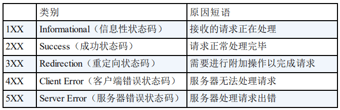

# 计算机基础

## 一、网络

### 1.OSI 七层模型是什么 ？

- 从高到低分别为
  - 应用层：为计算机用户提供服务
  - 表示层：数据处理（编解码、加密解密、压缩解压缩）
  - 会话层：管理（建立、维护、重连）应用程序之间的会话
  - 传输层：为两台主机进程之间的通信提供通用的数据传输服务
  - 网络层：路由和寻址（决定数据在网络的游走路径）
  - 数据链路层：侦编码和误差纠正控制
  - 物理层：透明地传送比特流传输
- 每一层都专注做一件事情，并且每一层都需要使用下一层提供的功能比如传输层需要使用网络层提供的路由和寻址功能，这样传输层才知道把数据传输到哪里去

### 2. TCP/IP 四层模型是什么？

- 从高到低分别为
  - 1. 应用层
  - 2. 传输层
  - 3. 网络层
  - 4. 网络接口层

### 3. 传输层常见的协议

- TCP
  - **Transmission Control Protocol**
  - **传输控制协议**
  - 提供 **面向连接** 的，**可靠** 的数据传输服务
- UDP
  - **User Datagram Protocol**
  - **用户数据协议**
  - 提供 **无连接** 的，**尽最大努力** 的数据传输服务（不保证数据传输的可靠性），简单高效

### 4. Http: 从输入 URL 到页面展示到底发生了什么?

- 总体分为以下几个过程
  - 1. DNS解析
    2. TCP连接
    3. 发送Http请求
    4. 服务器处理请求并返回HTTP报文
    5. 浏览器解析渲染页面
    6. 连接结束

### 5. Http状态码

​		

### 6. Http和Https有什么区别？

- 端口号：http默认80，https默认是443
- url前缀：http  https
- 安全性与资源消耗：http是传输明文，基于tcp协议，https传输加密，基于SSL/TLS之上
- SEO优化：https有天然的优势

### 7. TCP和UDP的区别

- 是否面向连接
  - TCP 提供面向连接的服务，在传送数据之前必须先建立连接，数据传送结束后要释放连接
  - UDP 在传送数据之前不需要先建立连接
- 是否可靠传输
  - TCP 提供可靠的传输服务，TCP 在传递数据之前，会有三次握手来建立连接，而且在数据传递时，有确认、窗口、重传、拥塞控制机制。通过 TCP 连接传输的数据，无差错、不丢失、不重复、并且按序到达
  - UDP 报文后，不需要给出任何确认，并且不保证数据不丢失，不保证是否顺序到达
- 是否有状态
  - TCP 传输是有状态的
  - UDP 是无状态服务
- 传输效率
  -  TCP 的传输效率要比 UDP 低很多
- 传输形式
  - TCP 是面向字节流的
  - UDP 是面向报文的
- 首部开销
  - TCP首部开销20 ～ 60 字节
  - UDP首部开销8 字节
- 是否提供广播或多播服务
  - TCP 只支持点对点通信
  - UDP 支持一对一、一对多、多对一、多对多

### 8. HTTP是基于TCP还是UDP的？

- HTTP/3.0 之前是基于 TCP 协议的，而 HTTP/3.0 将弃用 TCP，改用 **基于 UDP 的 QUIC 协议**
  - 为了解决了 HTTP/2 中存在的队头阻塞问题

### 9. TCP的三次握手和四次挥手（非常重要）

- 建立三次握手流程

  - **一次握手**

    - 客户端发送带有 SYN（SEQ=x） 标志的数据包 -> 服务端，然后客户端进入 **SYN_SEND** 状态，等待服务器的确认

  - **二次握手**

    - 服务端发送带有 SYN+ACK(SEQ=y,ACK=x+1) 标志的数据包 –> 客户端,然后服务端进入 **SYN_RECV** 状态

  - **三次握手**

    - 客户端发送带有 ACK(ACK=y+1) 标志的数据包 –> 服务端，然后客户端和服务器端都进入**ESTABLISHED** 状态，完成 TCP 三次握手

    

- 为什么要三次握手？

  - 三次握手的目的是建立可靠的通信信道，说到通讯，简单来说就是数据的发送与接收，而三次握手最主要的目的就是双方确认自己与对方的发送与接收是正常的

  - **第一次握手**：Client 什么都不能确认；Server 确认了对方发送正常，自己接收正常

  - **第二次握手**：Client 确认了：自己发送、接收正常，对方发送、接收正常；Server 确认了：对方发送正常，自己接收正常

  - **第三次握手**：Client 确认了：自己发送、接收正常，对方发送、接收正常；Server 确认了：自己发送、接收正常，对方发送、接收正常

  - 二次握手为啥不行？

    - 举个现实的例子
      - 你打我电话，电话铃声响起表示请求开始通话
      - 我听到铃声，接电话说您好
      - 但是实际情况可能是，你突然被紧急的事情打断，放下了电话，而我这边只能一直等待你说话，处于一种“悬挂”的状态

    

- 四次挥手

  - **第一次挥手**：客户端发送一个 FIN（SEQ=x） 标志的数据包->服务端，用来关闭客户端到服务器的数据传送。然后客户端进入 **FIN-WAIT-1** 状态

  - **第二次挥手**：服务器收到这个 FIN（SEQ=X） 标志的数据包，它发送一个 ACK （ACK=x+1）标志的数据包->客户端 。然后服务端进入 **CLOSE-WAIT** 状态，客户端进入 **FIN-WAIT-2** 状态

  - **第三次挥手**：服务端发送一个 FIN (SEQ=y)标志的数据包->客户端，请求关闭连接，然后服务端进入 **LAST-ACK** 状态

  - **第四次挥手**：客户端发送 ACK (ACK=y+1)标志的数据包->服务端，然后客户端进入**TIME-WAIT**状态，服务端在收到 ACK (ACK=y+1)标志的数据包后进入 CLOSE 状态。此时如果客户端等待 **2MSL** 后依然没有收到回复，就证明服务端已正常关闭，随后客户端也可以关闭连接了

    

- 三次挥手行不行？
  - 不行，如果少了第三次挥手，因为服务器收到客户端断开连接的请求时，可能还有一些数据没有发完，这时先回复 ACK，表示接收到了断开连接的请求。等到数据发完之后再发 FIN，断开服务器到客户端的数据传送
  - 如果没有第四次挥手（客户端对服务器的FIN的确认），则服务器将无法确认客户端是否已经接收到其发送的FIN消息，导致服务器不确定是否可以安全关闭连接，可能出现资源未释放或数据丢失的风险

