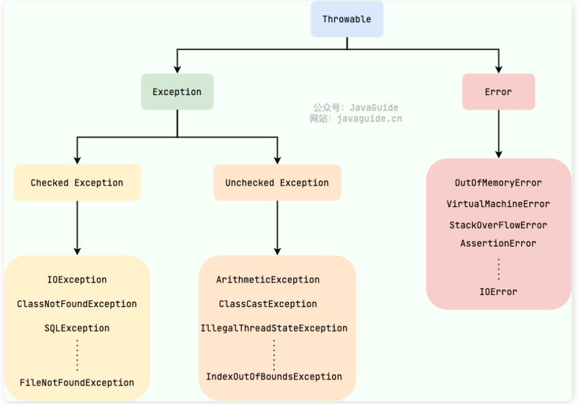

# JAVA进阶

::: tip java进阶总结
这里对java中基础的进阶总结
::: 

## 异常：
Throwable 父类 Exception  Error


Exception: 程序本身可以处理的异常，可以分为Checked Exception(受检查异常，必须处理) 和Unchecked Exception(不受检查异常，可以不处理)
Error: 程序无法处理的错误，如java虚拟机运行错误


不受检查异常： 如空指针异常，数组越界


### 1. finally 里面的代码一定会执行吗
答：不一定，在catch里面执行System.exit(1)

### 2. try-with-resource
使用Java7之后的try-with-resources 语句改造上面的代码

```
try(Scanner scanner = new Scanner(new File("test.txt"))) {
  while(scanner.hasNext()){
    System.out.println(scanner.nextLine());
  }

}catch(FileNotFoundException fnfe){
  fnfe.printStackTrace();
}

备注：语句可以直接写在try后面
```

## 3. 枚举

### 3.1. 枚举作为数据存储标准写法

```java
public enum DeleteEnum {

    YES("1", "已删除"),
    NO("0", "未删除");

    public String code;

    public String name;

    DeleteEnum(String code, String name) {
        this.code = code;
        this.name = name;
    }

    public static String getNameByCode(String code) {
        for(DeleteEnum type : values()){
            if(type.code.equals(code)){
                return type.name;
            }
        }
        return "";
    }


}
```


## 4. 泛型

 ### 4.1 泛型本质是为了将类型参数化

 ### 4.2 作用：

- 泛型可以在编译时对类型进行安全检测，使得所有的强制转换都是自动隐式实现的，保证了类型的安全性；

- 泛型作为”代码模板“，实现了 一套代码对各种类型的套用， 提高了代码的可重用性

  

### 4.3 使用场景：

- 泛型集合

   Collection 的源码

  ```java
  public interface Collection<E> extents Iterable<E>
  ```

  

- 泛型方法

   ```java
   // 泛型方法
   public <T> void printArray(T[] array) {
       for (T element : array) {
           System.out.print(element + " ");
       }
       System.out.println();
   }
   
   public static <E> int seach1(E[] arr,E target){
       
   }
   
   备注：在方法void 或返回值前面需要加泛型<E>
   ```

- 泛型接口

   ```java
   //在接口名称后面紧跟泛型<>
   public interface InterfaceName<T>{
       //接口的方法定义
   }
   
   //可以同时定义多个泛型，多个泛型用“，”逗号分割
   public interface InterfaceName2<M,N>{
       //接口的方法定义
   }
   ```

   

- 泛型类

  ```java
  public class ClassName<T>{
      private T first;
      private T second;
      
      public ClassName(T first,T second){
          this.first = first;
          this.second = second;
      }
      
      public T getFirst(){
          return first;
      }
      
      public T getSecond(){
          return second;
      }
  }
  ```

- 泛型加反射


### 4.4 **泛型字母解释**

- E: Element(表示集合元素，常在集合中使用)
- T：Type(表示java类，常在类和接口中使用)
- K: key(表示健)
- V: value(表示值)
- N: Number(表示数值类型)
- ?: 表示不确定的java类型


### 4.5 **泛型通配符**

1、<?>: 被称作无限定的通配符
2、<? extends T>: 被称作有上届的通配符
3、<? super T>: 被称作有下界的通配符


### 4.6 需求：给定一个数组和目录值要求返回对应下标，兼容所有类型

```java
//int 标准版
public static int seach(int[] arr,int target){
        for(int i=0; i<arr.length;i++){
            if(arr[i] == target){
                return i;
            }
        }
        return -1;
    }

//泛型版
public static <E> int seach1(E[] arr,E target){
        for(int i=0; i<arr.length;i++){
            if(arr[i].equals(target)){
                return i;
            }
        }
        return -1;
    }


public static void main(String[] args) {
        String[] arr1 = {"8","7","9","ss","aa"};
        int ss = Test.seach1(arr1, "ss");
        System.out.println(ss);

    }
```


## 5. java反射

  ### 5.1 序列化和反序列化
 - 序列化：将数据结构或对象转换成二进制字节流的过程
 - 反序列化： 将在序列化过程中所生成的二进制字节流转换成数据结构或者对象的过程
如果有些字段不想被序列化可以用transient 修饰

  ### 5.2 反射优缺点

  - 优点：代码更加灵活
  - 缺点：增加了安全问题

  ### 5.3获取class的四种方式
   - 类.class
   - Class.forName()


     Class class = Class.forName("com.cx.TargetObject")

   - 通过对象实例instance.getClass() 获取


      TargetObject o = new TargetObject();
      Class b = o.getClass();

   - 通过类加载器xxxClassLoader.loadClass()传入类路径获取


      ClassLoader.getSystemClassLoader().loadClass("cn.cx.TargetObject")


## 6. java 值传递
值传递：方法接收的是实参的拷贝，会创建副本
引用传递：方法接收的直接是实参所引用的对象在堆中的地址，不会创建副本，对形参的修改将影响到实参


结论：如果参数是基本类型的话，很简单，传递的就是基本类型的字面量值的拷贝，会创建副本。
         如果参数是引用类型，传递的就是实参所引用的对象在堆中地址值的拷贝，同样也会创建副本

示例
```
public static void main(String[] args) {
    int num1 = 10;
    int num2 = 20;
    swap(num1, num2);
    System.out.println("num1 = " + num1);
    System.out.println("num2 = " + num2);
}
 
public static void swap(int a, int b) {
    int temp = a;
    a = b;
    b = temp;
    System.out.println("a = " + a);
    System.out.println("b = " + b);
}
 
输出
num1 = 10
num2 = 20
a = 20
b = 10 
```

## 7. jdk代理
1. 定义一个接口及其实现类；
2. 自定义 InvocationHandler 并重写invoke方法，在 invoke 方法中我们会调用原生方法（被代理类的方法）并自定义一些处理逻辑；
3. 通过 Proxy.newProxyInstance(ClassLoader loader,Class<?>[] interfaces,InvocationHandler) 方法创建代理对象

例子
1. 定义发送短信的接口
```
public interface SmsService {
    String send(String message);
}
```

2. 实现发送短信的接口
```
public class SmsServiceImpl implements SmsService{
    public String send(String message){
       System.out.println("send message:" +message);
       return message;
   }
}
```

3. 定义一个jdk动态类
```
import java.lang.reflect.InvocationHandler;
import java.lang.reflect.InvocationTargetException;
import java.lang.reflect.Method;
 
public class DebugInvocationHandler implements InvocationHandler {
    /**
     * 代理类中的真实对象
     */
    private final Object target;
 
    public DebugInvocationHandler(Object target) {
        this.target = target;
    }
 
 
    public Object invoke(Object proxy, Method method, Object[] args) throws InvocationTargetException, IllegalAccessException {
        //调用方法之前，我们可以添加自己的操作
        System.out.println("before method " + method.getName());
        Object result = method.invoke(target, args);
        //调用方法之后，我们同样可以添加自己的操作
        System.out.println("after method " + method.getName());
        return result;
    }
}
```

4. 获取代理对象工厂类
```
public class JdkProxyFactory {
    public static Object getProxy(Object target) {
        return Proxy.newProxyInstance(
                target.getClass().getClassLoader(), // 目标类的类加载
                target.getClass().getInterfaces(),  // 代理需要实现的接口，可指定多个
                new DebugInvocationHandler(target)   // 代理对象对应的自定义 InvocationHandler
        );
    }
}
```

5. 实际使用
```
SmsService smsService = (SmsService) JdkProxyFactory.getProxy(new SmsServiceImpl());
smsService.send("java");
```

6.控制台打印
```
before method send
send message:java
after method send
```

### 总结
jdk动态代理(默认)：**运行时创建接口的代理实例，通过接口实现**
cglib代理：**采用底层的字节码技术，当目标对象不存在接口时，创建子类代理的实例，通过继承实现**


## 8. unsafe类

**可以直接操作内存，使用要慎重**

unsafe类左右
内存操作
内存屏障
对象操作
数据操作
CAS 操作
线程调度
Class 操作
系统信息

 


 

 

 

 

 

 


