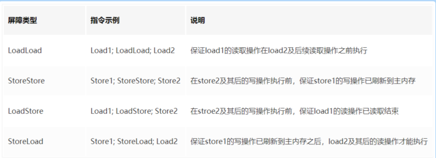
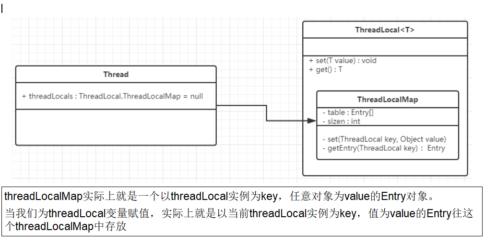

# JUC
## 1 进程和线程的区别
进程可以看作一个正在运行的程序  一个进程包含多个线程

## 2 并发与并行的区别
并发：两个及两个以上的作业在同一时间段内执行，即同一时间段执行多个任务，这些任务可能会交替执行
并行：两个及两个以上的作业在同一时刻执行，即同一时刻同时执行多个任务
最关键的点：是否是同时执行

## 3 java线程的生命周期和状态
new：初始状态，线程被创建出来但没有被调用start()
runnable: 运行状态，线程被调用了start()等待运行的状态
blocked: 阻塞状态，需要等待锁释放
waiting: 等待状态，表示该线程需要等待其他线程做出一些特定动作，如通知或中断
time_waiting: 超时等待状态，可以在指定的时间后自行返回而不是像waiting那样一直等待
terminated: 终止状态，表示该线程已经运行完毕

## 4 死锁
线程A持有资源2，线程B持有资源1，他们同时都想申请对方的资源，所以这两个线程就会互相等待而进入死锁状态

死锁的四个必要条件
1、互斥条件：该资源任意一个时刻只由一个线程占用
2、请求与保持条件：一个线程因请求资源而阻塞时，对已获得的资源保持不放
3、不剥夺条件：线程已获得的资源在未使用完之前不能被其他线程强行剥夺，只有自己使用完毕后才释放资源
4、循环等待条件: 若干线程之间形成一种头尾相接的循环等待资源关系

## 5 sleep() 和wait()对比
共同点：两者都可以暂停线程的执行
区别：
1、sleep() 方法没有释放锁，而wait() 方法释放了锁
2、wait() 通常被用于线程间交互，sleep()通常被用于暂停执行
3、wait()方法被调用后，线程不会自动苏醒，需要调用notify() 或者 notifyAll()方法，sleep()方法执行完成后，线程会自动苏醒，
4、sleep() 是Thread类的静态本地方法，wait() 则是Object类的本地方法

## 6 为什么wait()方法不定义在Thread中?
wait() 是让获得对象锁的线程实现等待，会自动释放当前线程占有的对象锁，每个对象都拥有对象锁，既然要释放当前线程占有的对象锁并让其进入waiting状态，自然是要
操作对应的对象而非当前的线程

## 7 为什么sleep() 方法定义在Thread中？
答：因为sleep()是让当前线程暂停执行，不涉及到对象类，也不需要获得对象锁

## 8 可以直接调用Thread类中的run方法吗？
答：调用 start() 方法方可启动线程并使线程进入就绪状态，直接执行 run() 方法的话不会以多线程的方式执行。


## 9  JMM内存模型
可见性：某个线程要先将变量从主内存拷贝到自己的工作内存空间，然后对变量进行操作，操作完成后
再将变量写回主内存

原子性：不可分割，完整性，即某个线程正在做某个业务时，中间不可以被加塞或者被分割。需要整体完整，
        要么同时成功，要么同时失败
有序性：在 JMM 中，对共享变量的写入和读取应该按照程序的顺序进行，防止出现意外的执行顺序


happens-before原则

- 在JMM中，
  如果一个操作执行的结果需要对另一个操作可见性
  或者 代码重排序，那么这两个操作之间必须存在happens-before关系
- happens-before总原则
  - 如果一个操作happens-before另一个操作，那么第一个操作的执行结果将对第二个操作可见，
    而且第一个操作的执行顺序排在第二个操作之前
  - 两个操作之间存在happens-before关系，并不意味着一定要按照happens-before原则制定的顺序来执行。
    如果重排序之后的执行结果与按照happens-before关系来执行的结果一致，那么这种重排序并不非法

## 10 volatile
volatile 是java虚拟机提供的轻量级同步机制
它基本上遵守了jmm规范,保证可以性和禁止指令重排，但是不保证原子性

如何解决原子性
使用AtomicInteger   i++  ===》 atomicInteger.getAndIncrement();

AtomicInteger 为何能实现原子性
使用了CAS(比较并交换) 底层unsafe类 +自旋锁保证 原子性

CAS 确定会有ABA问题
ABA问题： 线程A修改一个值后再改回原来的值，此次线程B读到值还是原来的值，而线程B是不知道线程A已经修改过的
ABA问题解决： 加版本号

```
AtomicReference 原子引用
AtomicStampedReference 版本号原子引用
 
//100代表初始值 1代表版本号
AtomicStampedReference<Integer> ato = new AtomicStampedReference<>(100,1);
```

问：volatile凭什么可以保证可见性和有序性？

答：内存屏障

### 10.1 内存屏障

定义：内存屏障（也称内存栅栏，内存栅障，屏障指令等，是一类同步屏障指令，是CPU或编译器在对内存随机访问的操作中的一个同步点，使得此点之前的所有读写操作都执行后才可以开始执行此点之后的操作），避免代码重排序。内存屏障其实就是一种JVM指令，Java内存模型的重排规则会要求Java编译器在生成JVM指令时插入特定的内存屏障指令，通过这些内存屏障指令，volatile实现了Java内存模型中的可见性和有序性，但volatile无法保证原子性。

内存屏障之前的所有写操作都要回写到主内存

内存屏障之后的所有读操作都能获得内存屏障之前的所有写操作的最新结果(实现了可见性)

因此重排序时，不允许把内存屏障之后的指令重排序到内存屏障之前。
一句话：对一个 volatile 域的写, happens-before 于任意后续对这个 volatile 域的读，也叫写后读


能干嘛？

- 阻止屏障两边的指令重排序
- 写数据时加入屏障，强制将线程私有工作内存的数据刷回主物理内存
- 读数据时加入屏障，线程私有工作内存的数据失效，重新到主物理内存中获取最新数据


JMM将内存屏障插入策略分为4种

- 写
  - 在每个volatile写操作的前面插入一个StoreStore屏障
  - 在每个volatile写操作的后面插入一个StoreLoad屏障
- 读
  - 在每个volatile读操作的后面插入一个LoadLoad屏障
  - 在每个volatile读操作的后面插入一个LoadStore屏障



## 11 java锁

悲观锁：认为共享资源每次被访问的时候就会出现问题，所以每次在获取资源操作的时候都会上锁，如synchronized 和 ReentrantLock
乐观锁：认为共享资源每次被访问的时候不会出现问题，无需加锁也无需等待， cas算法+版本号实现， AtomicInteger，LongAddr ，有ABA问题
公平锁：锁被释放后，先申请的线程先得到锁
非公平锁：锁被释放后，后申请的线程可能会先获取到锁
可重入锁：也叫递归锁，指的是线程可以再次获取自己内部锁
共享锁：一把锁可以被多个线程同时获得 （读锁）
独占锁：一把锁只能被一个线程获得（写锁）

## 12 synchronized 
- 作用：主要解决的是多个线程之间访问资源的同步性，可以保证被它修饰的方法或者代码块在任意时刻只能有一个线程执行
- 使用：
  修饰实例方法（锁当前对象实例）
    给当前对象实例加锁，进入同步代码前要获得当前对象实例的锁
  
    ```
    synchronized void method(){
           //业务代码
    }
    ```
  修饰静态方法（锁当前类）
  ```
    synchronized static void method(){
       //业务代码
    }
  ```
  修饰代码块 （锁指定对象/类）
  ```
    synchronized(object) 表示进入同步代码库前要获得给定对象的锁
    synchronized(类.class) 表示进入同步代码前要获得给定Class的锁
  ```

构造方法可以用synchronized修饰么
答：不能，因为构造方法本身就属于线程安全，不存在同步的构造方法一说

synchronized底层原理？
修饰代码块情况
  ```
   public class SynchronizedDemo{
           public void method(){
               synchronized(this){
                  System.out.println("synchronized 代码块");
               }
           }
    }
  ```
 底层使用的是monitorenter 和 monitorexit 指令，一个monitorenter指令包含两个monitorexit指令，这是为了保证锁在同步代码块代码正常执行以及出现异常
的这两种情况下都能被正确释放，如果自己加了异常，则只会出现一个monitorenter 和一个monitorexit指令

 修饰方法的情况
 ```
   public class SynchronizedDemo2{
       public synchronized void method(){
           System.out.println("synchronized 方法")
       }
    } 
 ```

底层使用的是ACC_SYNCHRONIZED 访问标识，标记是一个同步方法

1.6之后synchronized底层做了哪些优化？
答：1.6以后对锁的实现引入了大量的优化，如偏向锁、轻量级锁、自旋锁、锁消除、锁粗化.
     锁的四种状态，依次是无锁、偏向锁、轻量级锁、重量级锁，他们会随着竞争激烈而逐渐升级，锁可以升级但不可降级


## 13 synchronized 和 ReentrantLock 的区别
1.原始构成
synchronized 是关键字属于jvm层面
   monitorenter(底层是通过monitor对象来完成，)
   monitorexit
Lock是具体类(java.util.concurrent.locks.lock)是api层面的锁   

2.使用方法
synchronized 不需要用户去手动释放锁，当synchronized代码执行完后系统会自动
让线程释放对锁的占用
ReentrantLock 则需要用户去手动释放锁若没有主动释放锁，就有可能导致出现死锁现象
需要配合lock()和unlock()方法配合try/finally语句块来完成

3.等待是否可中断
synchronized 不可中断，除非抛出异常或者正常运行完成
ReentrantLock 可中断，1.设置超时方法 tryLock(long timeOut,TimeUnit unit)
2.lockInterruptibly()放代码块中，调用interupt()方法可中断

4.加锁是否公平
synchronized 非公平锁
ReentrantLock 两者都可以，默认非公平锁，构造方法可以传入boolean值，
true为公平锁，false为非公平锁

5.锁绑定多个条件Condition
synchronized 没有
ReentrantLock 用来实现分组唤醒需要唤醒的线程们，可以精确唤醒，而不是像synchronized
要么随机唤醒一个线程，要么唤醒全部线程


​    

 ## 14 ThreadLocal

- 作用：每一个线程都有自己的专属本地变量，存放私有的数据

- 方法： get()  set()

```java
private static final ThreadLocal<SimpleDateFormat> formatter = ThreadLocal.withInitial(()->new SimpleDateFormat("yyyyMMdd HHmmm"));
```

- 原理：

Thread类源码

```java
public class Thread implements Runnable {
    //......
    //与此线程有关的ThreadLocal值。由ThreadLocal类维护
    ThreadLocal.ThreadLocalMap threadLocals = null;

    //与此线程有关的InheritableThreadLocal值。由InheritableThreadLocal类维护
    ThreadLocal.ThreadLocalMap inheritableThreadLocals = null;
    //......
}

```


**最终的变量是放在了当前线程的 `ThreadLocalMap` 中，并不是存在 `ThreadLocal` 上，`ThreadLocal` 可以理解为只是`ThreadLocalMap`的封装，传递了变量值**

 **每个`Thread`中都具备一个`ThreadLocalMap`，而`ThreadLocalMap`可以存储以`ThreadLocal`为 key ，Object 对象为 value 的键值对**


- Thread ThreadLocal ThreadLocalMap关系



 

- 内存泄露问题

  什么是内存泄漏？

  不再会被使用的对象或者变量占用的内存不能被回收，就是内存泄露

  

`ThreadLocalMap` 中使用的 key 为 `ThreadLocal` 的弱引用，而 value 是强引用。所以，如果 `ThreadLocal` 没有被外部强引用的情况下，在垃圾回收的时候，key 会被清理掉，而 value 不会被清理掉 

使用完 `ThreadLocal`方法后最好手动调用`remove()`方法

补充：

- 强引用：死都不收

- 软引用：系统内存充足不会被回收，不足会被回收

  ```java
  class MyObject
  {
      //一般开发中不用调用这个方法，本次只是为了讲课演示
      @Override
      protected void finalize() throws Throwable
      {
          System.out.println(Thread.currentThread().getName()+"\t"+"---finalize method invoked....");
      }
  }
  
  
  public class ReferenceDemo
  {
      public static void main(String[] args)
      {
          //当我们内存不够用的时候，soft会被回收的情况，设置我们的内存大小：-Xms10m -Xmx10m
          SoftReference<MyObject> softReference = new SoftReference<>(new MyObject());
  
          System.gc();
          try { TimeUnit.SECONDS.sleep(1); } catch (InterruptedException e) { e.printStackTrace(); }
          System.out.println("-----gc after内存够用: "+softReference.get());
  
          try
          {
              byte[] bytes = new byte[9 * 1024 * 1024];
          }catch (Exception e){
              e.printStackTrace();
          }finally {
              System.out.println("-----gc after内存不够: "+softReference.get());
          }
      }
  
      public static void strongReference()
      {
          MyObject myObject = new MyObject();
          System.out.println("-----gc before: "+myObject);
  
          myObject = null;
          System.gc();
          try { TimeUnit.SECONDS.sleep(1); } catch (InterruptedException e) { e.printStackTrace(); }
  
          System.out.println("-----gc after: "+myObject);
      }
  }
  
  ```

  

- 弱引用：都会回收

  ```java
  public class ReferenceDemo
  {
      public static void main(String[] args)
      {
          WeakReference<MyObject> weakReference = new WeakReference<>(new MyObject());
          System.out.println("-----gc before内存够用: "+weakReference.get());
  
          System.gc();
          try { TimeUnit.SECONDS.sleep(1); } catch (InterruptedException e) { e.printStackTrace(); }
  
          System.out.println("-----gc after内存够用: "+weakReference.get());
      }
  
      public static void softReference()
      {
          //当我们内存不够用的时候，soft会被回收的情况，设置我们的内存大小：-Xms10m -Xmx10m
          SoftReference<MyObject> softReference = new SoftReference<>(new MyObject());
  
          System.gc();
          try { TimeUnit.SECONDS.sleep(1); } catch (InterruptedException e) { e.printStackTrace(); }
          System.out.println("-----gc after内存够用: "+softReference.get());
  
          try
          {
              byte[] bytes = new byte[9 * 1024 * 1024];
          }catch (Exception e){
              e.printStackTrace();
          }finally {
              System.out.println("-----gc after内存不够: "+softReference.get());
          }
      }
  
      public static void strongReference()
      {
          MyObject myObject = new MyObject();
          System.out.println("-----gc before: "+myObject);
  
          myObject = null;
          System.gc();
          try { TimeUnit.SECONDS.sleep(1); } catch (InterruptedException e) { e.printStackTrace(); }
  
          System.out.println("-----gc after: "+myObject);
      }
  }
  
  ```

  

- 虚引用：在任何时候都可能被回收


  为什么要用弱引用，不用如何？弱引用就万事大吉了么


 ## 15 线程池

1. 为什么要使用线程池

   - 池化技术思想，如数据库连接池，Http连接池
   - 减少每次获取资源的消耗，提高对资源的利用率
   - 提高线程的可管理性

2. 如何创建线程池

   - 通过ThreadPoolExecutor 构造函数来创建（推荐）

     ```java
     //推荐使用spring的
     @Bean("commonServiceExecutor")
         public ThreadPoolTaskExecutor commonServiceExecutor() {
             ThreadPoolTaskExecutor executor = new ThreadPoolTaskExecutor();
             executor.setCorePoolSize(30);
             executor.setQueueCapacity(60);
             executor.setMaxPoolSize(100);
             executor.setKeepAliveSeconds(60);
             executor.setRejectedExecutionHandler(new ThreadPoolExecutor.CallerRunsPolicy());
             executor.setThreadNamePrefix("common-task-worker-");
             executor.initialize();
             return executor;
         }
     ```

     

   - 通过Executor框架的工具类Executors来创建（不推荐）

     - 里面默认的任务队列是Integer.MAX_VALUE,容易导致oom

       ```java
       Executors.newFixedThreadPool(int)   固定数线程
       Executors.newSingleThreadExecutor()  一池一线程
       Executors.newCachedThreadPool()      一池多线程
       
       Executors.newScheduledThreadPool() 了解
       
       jdk1.8后
       Executors.newWorkStealingPool(int)
       ```

     
     ```java
     //代码示例
     ExecutorService executor = Executors.newFixedThreadPool(20);
             for (int i = 0; i < 20; i++) {
                 executor.submit(() -> {
                       dosome();
                     }
                 });
             }
             executor.shutdown();
     ```
     
     

3. 线程池常见的参数

   - corePoolSize: 线程池的核心线程数量
   - maximumPoolSize: 线程池的最大线程数
   - keepAliveTime: 当线程数大于核心线程数时，多余的空闲线程存活的最长时间
   - unit: 时间单位
   - workQueue：任务队列，用来储存等待执行任务的队列
   - threadFactory： 线程工厂，用来创建线程，一般默认即可
   - RejectedExecutionHandler： 拒绝策略

   ```java
    public ThreadPoolExecutor(int corePoolSize,
                                 int maximumPoolSize,
                                 long keepAliveTime,
                                 TimeUnit unit,
                                 BlockingQueue<Runnable> workQueue,
                                 ThreadFactory threadFactory,
                                 RejectedExecutionHandler handler
                                  ) 
   
   ```

4. 线程池的拒绝策略
   - **`AbortPolicy`**：抛出异常来拒绝新任务的处理
   - **`CallerRunsPolicy`**： 调用执行自己的线程运行任务，也就是直接在调用`execute`方法的线程中运行(`run`)被拒绝的任务，如果执行程序已关闭，则会丢弃该任务 （推荐使用）
   - **`DiscardPolicy`**：不处理新任务，直接丢弃掉
   - **`DiscardOldestPolicy`**：此策略将丢弃最早的未处理的任务请求

5. 线程池工作流程？

​    工作流程： 

- 核心数，能干活的 

- 核心数满了，阻塞队列待着 

- 阻塞队列满了，扩容，扩到线程池所能达到的最高极限 

- 两种情况：线程数大多启动拒绝策略；无事可做超过一定时间就会收缩到corePoolSize大小    

6.  如何设置最大线程数？
   - **CPU 密集型任务**：N（CPU 核心数）+1
   - **I/O 密集型任务(2N)**：2N

7. 代码实操

   ```java
   public class CustomThreadPool {
       private static class ThreadPoolHolder{
           private static ExecutorService threadPool = new ThreadPoolExecutor(10,
                   20,
                   30,
                   TimeUnit.SECONDS,
                   new LinkedBlockingQueue<>(),
                   Executors.defaultThreadFactory(),
                   new ThreadPoolExecutor.CallerRunsPolicy());
       }
   
       public  CustomThreadPool(){
   
       }
   
       public static ExecutorService getInstance(){
           return ThreadPoolHolder.threadPool;
       }
   
   
   
   }
   
   
   使用
   ExecutorService threadPoolExecutor = CustomThreadPool.getInstance();
                       Runnable runnable = ()->{
                           customMethods();
                       };
                       threadPoolExecutor.execute(runnable);
   ```


## 16 AQS

1. AQS是什么？

   - 字面意思：AbstractQueuedSynchronizer是抽象的队列同步器，主要用来构建锁和同步器 

   - 技术解释：是用来构建锁或者其它同步器组件的重量级基础框架及整个JUC体系的基石，
     通过内置的FIFO队列来完成资源获取线程的排队工作，并通过一个int类变量
     表示持有锁的状态

2. AQS的原理？

   有阻塞就需要排队，实现排队必然需要队列

  - AQS使用一个volatile的int类型的成员变量来表示同步状态，通过内置的
    FIFO队列来完成资源获取的排队工作将每条要去抢占资源的线程封装成
    一个Node节点来实现锁的分配，通过CAS完成对State值的修改
  - state变量+CLH双端队列


 ## 17 Semaphore

- 作用： 信号量主要用于两个目的，一个是用于多个共享资源的互斥使用，另一个用于 并发线程数的控制 

- 生活例子：抢车位

- 方法

  - acquire()：获取一个许可
  - release()：释放一个许可 

- 案例：模拟6个车抢三个车位

  ```java
  public static void main(String[] args) {
          Semaphore semaphore = new Semaphore(3);
          for (int i = 0; i < 6; i++) {
              new Thread(() -> {
                  try {
                      semaphore.acquire();
                      System.out.println(Thread.currentThread().getName() + "抢到车位");
                      try {
                          TimeUnit.SECONDS.sleep(3);
                      } catch (InterruptedException e) {
                          e.printStackTrace();
                      }
                      System.out.println(Thread.currentThread().getName() + "停车3秒后离开车位");
                  } catch (Exception e) {
                      e.printStackTrace();
                  } finally {
                      semaphore.release();
                  }
              }, String.valueOf(i)).start();
  
  
          }
      }
  ```

  ​               

## 18 CountDownLatch

- 定义： 让一些线程阻塞直到另一些线程完成一系列操作后才被唤醒              

- 通过一个计数器实现，计数器的初始值是线程的数量，每当一个线程执行完毕后，计数器的值就-1，当计数器的值为0时，表示所有的线程都执行完毕
- 方法
  - await(): 调用await()方法的线程会被挂起，它会等待直到count值为0才继续执行
  - await(long timeout,TimeUnit unit): 等待一定的时间后count值还没变为0的话就会继续执行
  - countDown(): 将count值减1

- 案例

  ```
  6个同学，班长最后关灯走人
  
  public class CountDownLatchTest {
      public static void main(String[] args) throws InterruptedException {
          CountDownLatchTest countDownLatchTest = new CountDownLatchTest();
          countDownLatchTest.test1();
          System.out.println("===========================");
          countDownLatchTest.test2();
  
      }
  
      /**
       * 没用countdownlatch之前, main线程会先执行
       */
      public void test1(){
          for(int i=0;i<6;i++){
              new Thread(()->{
                  System.out.println(Thread.currentThread().getName()+"\t上完自习,离开教室");
              },String.valueOf(i)).start();
          }
          System.out.println(Thread.currentThread().getName()+"\t***********班长最后关门走人");
      }
  
      /**
       * 用countdownlatch
       */
      public void test2() throws InterruptedException {
          CountDownLatch countDownLatch = new CountDownLatch(6);
          for(int i=0;i<6;i++){
              new Thread(()->{
                  countDownLatch.countDown();
                  System.out.println(Thread.currentThread().getName()+"\t上完自习，离开教室");
              },String.valueOf(i)).start();
          }
  
          countDownLatch.await();
          System.out.println(Thread.currentThread().getName()+"\t***********班长最后关门走人");
  
      }
  
  }
  
  备注：注意countDownLatch.countDown()的位置是在线程里面，不是for循环里面
  ```

- 扩展：使用CompletableFuture也可以实现countdownLatch功能

  ```java
  public void test3() throws Exception {
          CompletableFuture<Void> future1 = CompletableFuture.runAsync(() -> {
              System.out.println("Task 1 running");
          });
  
          CompletableFuture<Void> future2 = CompletableFuture.runAsync(() -> {
              System.out.println("Task 2 running");
          });
  
          CompletableFuture<Void> future3 = CompletableFuture.runAsync(() -> {
              System.out.println("Task 3 running");
          });
  
          CompletableFuture<Void> allFutures = CompletableFuture.allOf(future1, future2, future3);
  
          allFutures.get(); // 等待所有任务完成
  
          System.out.println("All tasks completed");
      }
  ```

  

## 19 CyclicBarrier

- 字面意思：可循环(Cyclic) 使用的屏障(Barrier)  

- 理解： **集齐7颗龙珠就能召唤神龙**，它要做的事情是，让一组线程到达一个屏障 （也可以叫同步点）时被阻塞，直到最后一个线程到达屏障时，屏障才会开门，所用被 屏障拦截的线程才能干活，线程进入屏障通过CyclicBarrier的await()方法              

- 代码示例

  ```java
  public static void main(String[] args) {
          CyclicBarrier cyclicBarrier = new CyclicBarrier(7,()->{
              System.out.println("召唤神龙");
          });
          for(int i=0;i<7;i++){
              int finalI = i;
              new Thread(()->{
                  System.out.println("收集到第"+(finalI +1)+"颗龙珠");
                  try {
                      cyclicBarrier.await();
                  } catch (InterruptedException e) {
                      e.printStackTrace();
                  } catch (BrokenBarrierException e) {
                      e.printStackTrace();
                  }
              },String.valueOf(i)).start();
          }
      }
  ```


## 20 锁

- 乐观锁
  - 总是假设最好的情况，认为共享资源每次被访问的时候不会出现问题，线程可以不停地执行，无需加锁也无需等待，只是在提交的时候去验证对应的资源是否被其他线程修改了（版本号或cas算法）
  - 代表：AtomicInteger LongAddr
  - 如何实现乐观锁：通过版本号机制或CAS算法实现
  - 乐观锁会存在ABA问题，解决思路是追加版本号或时间戳，如：AtomicStampedReference 类就是用来解决ABA问题
  - 补充：cas算法
    - cas是一个原子操作，底层依赖于一条cpu的原子指令
    - 涉及三个操作数
      - V: 要更新的变量值
      - E: 预期值
      - N:  拟要写入的新值
      - 当且仅当 V 的值等于 E 时，CAS 通过原子方式用新值 N 来更新 V 的值。如果不等，说明已经有其它线程更新了 V，则当前线程放弃更新
      - **举一个简单的例子**：线程 A 要修改变量 i 的值为 6，i 原值为 1（V = 1，E=1，N=6，假设不存在 ABA 问题）。
        1. i 与 1 进行比较，如果相等， 则说明没被其他线程修改，可以被设置为 6 。
        2. i 与 1 进行比较，如果不相等，则说明被其他线程修改，当前线程放弃更新，CAS 操作失败
- 悲观锁
  - 共享资源每次只给一个线程使用，其他线程阻塞，用完后再把资源
  - 代表：synchronized 和 reentrantlock
  - 高并发场景下，激烈的锁竞争会造成线程阻塞
- 公平锁
- 非公平锁
- 可重入锁（递归锁）
- 死锁
- 写锁（独占锁）
- 读锁（共享锁）
- 自旋锁SpinLock
- 无锁->独占锁->读写锁->邮戳锁
- 无锁->偏向锁->轻量锁->重量锁


## 21 CompletableFuture

1. 为啥要有CompletableFuture？

   先说说FutureTask的弊端

   - get(): 会导致阻塞，要获取结果必须等待
   - get(1L,TimeUnit.SECONDS): 过时不候，有时结果没出来，就得不到结果


## 22 LockSupport 与线程中断


## 23 Synchronized 与锁升级

