# jvm

## jvm知识梳理

### 1. 整体图

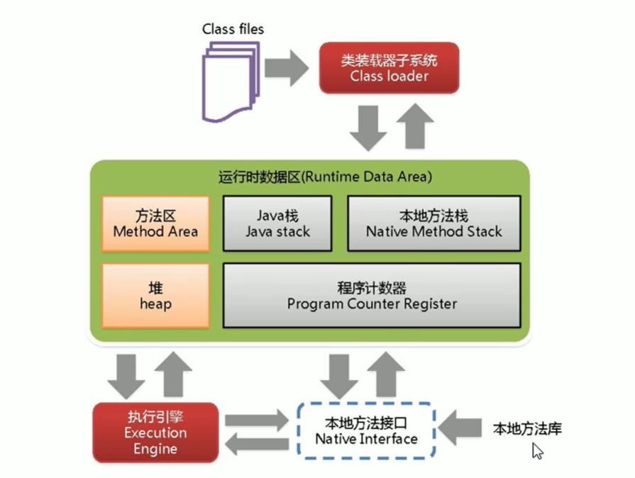

### 2. 解释说明

#### 2.1. 类加载器

- 负责加载class文件，class文件在文件开头有特定的文件标识（cafe babe），将class文件 字节码内容加载到内存中，并将这些内容转换成方法区中的运行时数据结构并且ClassLoader 只负责class文件的加载，至于它是否可以运行，则由Execution Engine决定 
- 虚拟机自带的加载器 
  - 1.启动类加载器（BootStrap） 
  - 2.扩展类加载器（Extension） 
  - 3.应用程序加载器（AppClassLoader）

- 双亲委派？
  -  往上捅，理解为我爸是李刚，有事找我爸，当一个类收到类加载请求，他不会自己去加载这个类， 而是把这个请求委派给父类完成，每一个层次类加载器都是如此，因此所有的加载请求都应该传 送到启动类加载中，只有当父类无法加载时，子类加载器才会尝试自己去加载        

#### 

#### 2.2. 程序计数器（Program Counter Register） 

-  每个线程都有一个程序计数器，是线程私有的，就是一个指针，指向方法区中的方法字节码 （用来存储向下一条指令的地址，也即将要执行的代码），由执行引擎读取下一条指令， 是一个非常小的内存空间，几乎可以忽略不记。 这块内存区域很小，它是当前线程所执行的字节码的行号指示器，字节码解释器通过改变这个 计数器的值来选取下一条需要执行的字节码指令。 如果执行的是一个Native方法，那这个计数器是空的。 用以完成分支、循环、跳转、异常处理、线程恢复等基础功能。 不会发生内存溢出（OutOfMemory =oom）错误 

#### 2.3. 方法区（Method Area）

-  供各线程共享的运行时内存区域。它存储了每一个类的结构信息。例如 运行时常量池（Runtime Constrant Pool）、字段和方法数据、 构造函数和普通方法的字节码内容。上面讲的是规范，在不同虚拟机里头实现 是不一样的，最典型的就是永久代（PermGen space）和元空间（Metaspace）. 但是实例变量存在堆内存中，和方法区无关          


#### 2.4. 栈（stack）

- 先进后出，后进先出 (子弹夹)
- 栈管运行，堆管存储
-  栈也叫栈内存，主管java程序的运行，是在线程创建时创建，它的生命期是随线程的生命期， 线程结束栈内存也就释放，对于栈来说不存在垃圾回收问题，只要线程一结束该栈就Over, 生命周期和线程一致，是线程私有的。8种基本类型的变量+对象的引用变量+实例方法都是 在函数的栈内存中分配 
-  栈存储什么？ 
  - 1.本地变量（Local Variables）: 输入参数和输出参数以及方法内的变量 
  - 2.栈操作（Operand Stack）:记录出栈、入栈的操作 
  - 3.栈帧数据（Frame Data）: 包括类文件、方法等待              

- 栈报的错误？

  - 错误  java.lang.StackOverflowError           

  

#### 2.5. 堆（heap） 

-  一个jvm实例只存在一个堆内存，堆内存的大小是可以调节的。类加载器读取了类文件后， 需要把类、方法、常变量放在堆内存中，保存所有引用类型的真实信息，以方便执行器执行 ，堆分为三部分  
  - 1.Young Generation Space 新生区    Young/New 
  - 2.Tenure generation space 养老区   Old/Tenure 
  - 3.Permanent Space         永久区   Perm  

-  java7之前？
  -  堆内存逻辑上分为三部分： 新生+养老+永久 新生区： 伊甸区（Eden Space）、 幸存者0区（Survivor 0 Space）、幸存者1区（Survivor 1 Space）              

- java 堆从gc的角度还可以细分为？
  -  新生代（Eden 区、From Survivor区 和To Survivor区）和老年区 新生代比例 8：1：1              

- 如果出现java.lang.OutOfMemoryError: java heap space异常？
  - 1.java虚拟机的堆内存设置不够，可以通过参数-Xms、-Xmx来调整 
  - 2.代码中创建了大量大对象，并且长时间不能被垃圾收集器收集（存在被引用）              


#### 2.6 内存分配和回收原则

- 大对象直接进入老年代
- 长期存活的对象将进入老年代

### 3. 垃圾判别阶段算法

#### 3.1 引用计数法

- 给对象添加一个引用计数器
  - 每当有引用+1，引用失效减1
  - 存在循环依赖问题

#### 3.2 可达性分析算法

- 这个算法的基本思想就是通过一系列的称为 **“GC Roots”** 的对象作为起点，从这些节点开始向下搜索，节点所走过的路径称为引用链，当一个对象到 GC Roots 没有任何引用链相连的话，则证明此对象是不可用的，需要被回收
- 解决循环依赖问题
- **哪些对象可以作为 GC Roots 呢？**
  - 虚拟机栈(栈帧中的局部变量表)中引用的对象
  - 本地方法栈(Native 方法)中引用的对象
  - 方法区中类静态属性引用的对象
  - 方法区中常量引用的对象
  - 所有被同步锁持有的对象
  - JNI（Java Native Interface）引用的对象

### 4. 垃圾清除阶段算法

#### 4.1 标记清除（Mark-Sweep）

- 标记：Collector从引用根节点开始遍历，**标记所有被引用的对象**。一般是在对象的Header中记录为可达对象

- 清除：Collector对堆内存从头到尾进行线性的遍历，如果发现某个对象在其Header中没有标记为可达对象，则将其回收

- **很多书、视频讲错了！说是标记的垃圾对象。这里要注意了**

  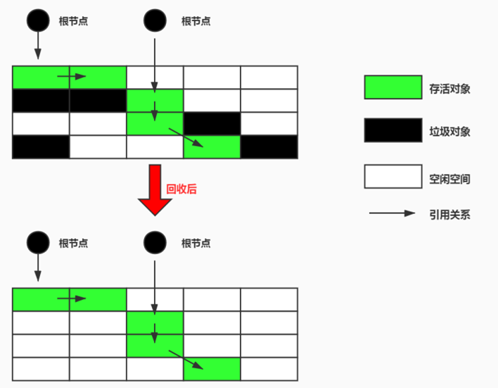

- 缺点
  - 在进行GC的时候，需要停止整个应用程序
  - **产生内存碎片**

#### 4.2 复制算法

- 年轻代

- -XX:MaxTenuringThreshold -- 设置对象在新生代中存活的次数        

- 将堆内存分为两个区域，每次只使用其中一个区域，当该区域满时，将存活的对象复制到另一个区域，然后清除整个区域。这样可以避免内存碎片问题  

  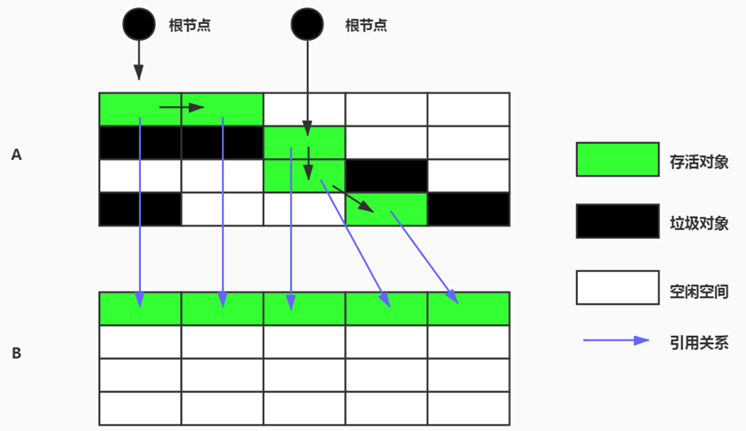

- 优点
  - 没有标记和清除过程，实现简单，运行高效
  - 复制过去以后保证空间的连续性，不会出现“碎片”问题

- 缺点
  - 需要两倍的内存空间

#### 4.3 标记压缩

- 适用于老年代

- 背景

  - 复制算法的高效性是建立在存活对象少、垃圾对象多的前提下的。这种情况在新生代经常发生，但是在老年代，更常见的情况是大部分对象都是存活对象。如果依然使用复制算法，由于存活对象较多，复制的成本也将很高。因此，基于老年代垃圾回收的特性，需要使用其他的算法

  - 标记－清除算法的确可以应用在老年代中，但是该算法不仅执行效率低下，而且在执行完内存回收后还会产生内存碎片，所以JVM 的设计者需要在此基础之上进行改进。标记 - 压缩（Mark - Compact）算法由此诞生

    

- 执行过程

  - 第一阶段和标记-清除算法一样，从根节点开始标记所有被引用对象

  - 第二阶段将所有的存活对象压缩到内存的一端，按顺序排放

  - 最后，清理边界外所有的空间

  - 标记-压缩算法的最终效果等同于标记-清除算法执行完成后，再进行一次内存碎片整理，因此，也可以把它称为标记-清除-压缩(Mark-Sweep-Compact)算法

    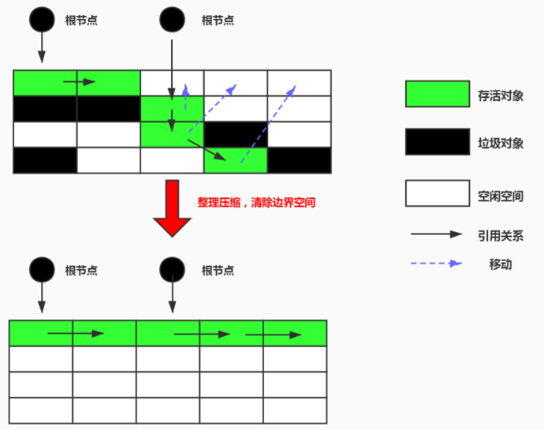


- 优点

  - 此算法消除了“标记-清除”和“复制”两个算法的弊端

- 缺点

  - 从效率上来说，标记-压缩算法要低于复制算法
    - 效率不高，不仅要标记所有存活对象，还要整理所有存活对象的引用地址
    - 对于老年代每次都有大量对象存活的区域来说，极为负重

  - 移动过程中，需要全程暂停用户应用程序。即：STW


#### 4.4   分代收集算法

- 根据对象的存活周期将堆内存分为新生代和老年代。新生代使用复制算法，老年代使用标记-清除或标记-整理算法，**针对不同存活特性采用不同的垃圾回收算法**

  

#### 4.5 增量收集算法

- 前面四种算法，在垃圾回收都会让应用程序所有的线程都会挂起，暂停一切正常的工作，等待垃圾回收的完成（Stop the World）
- 为了解决这个问题，即对实时垃圾收集算法的研究直接导致了增量收集（Incremental Collecting）算法的诞生
- 基本思想
  - 如果一次性将所有的垃圾进行处理，需要造成系统长时间的停顿，那么就可以让垃圾收集线程和应用程序线程**交替执行**。每次，垃圾收集线程只收集一小片区域的内存空间，接着切换到应用程序线程。依次反复，直到垃圾收集完成
  - 总的来说，增量收集算法的基础仍是传统的标记-清除和复制算法。增量收集算法通过对线程间冲突的妥善处理，允许垃圾收集线程以分阶段的方式完成标记、清理或复制工作
- 缺点
  - 使用这种方式，由于在垃圾回收过程中，间断性地还执行了应用程序代码，所以能减少系统的停顿时间。但是，因为线程切换和上下文转换的消耗，会使得垃圾回收的总体成本上升，造成系统吞吐量的下降

#### 4.6 分区算法

- G1收集器使用的算法
- 分代算法将按照对象的生命周期长短划分成两个部分，分区算法将整个堆空间划分成连续的不同小区间
- 每一个小区间都独立使用，独立回收。这种算法的好处是可以控制一次回收多少个小区间
- 一般来说，在相同条件下，堆空间越大，一次GC时所需要的时间就越长，有关GC产生的停顿也越长。为了更好地控制GC产生的停顿时间，将一块大的内存区域分割成多个小块，根据目标的停顿时间，每次合理地回收若干个小区间，而不是整个堆空间，从而减少一次GC所产生的停顿

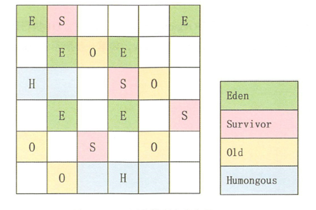


### 5. 垃圾回收器分类

#### 5.1  串行垃圾回收器

-  Serial   串行垃圾回收器，它为单线程环境设计且只使用一个线程进行垃圾回收，会暂停所有的用户线程，所以不适合服务器环境  
-  主要有
   - Serial
   - Serial Old

#### 5.2 并行垃圾回收器 

- Parallel 并行垃圾回收器，多个垃圾收集线程并行工作，此时用户线程是暂停的,适用于科学计算/大数据处理首页处理等弱交互场景
- 主要有
  - ParNew
  - Parallel Scavenge
  - Parallel Old

#### 5.3 并发垃圾收集器

-  CMS  并发垃圾收集器，用户线程和垃圾收集线程同时执行（不一定是并行，可能交替执行） 不需要停顿用户线程，适用对响应时间有要求的场景
-  主要有
   - CMS
   - G1

#### 5.4 收集器和垃圾分代之间的关系

​          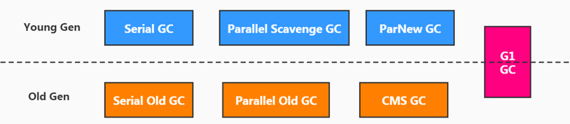  

#### 5.5 如何查看默认垃圾收集器

- java -XX:+PrintCommandLineFlags -version 
- jinfo -flag 相关垃圾回收器参数 进程ID
- 默认并行垃圾收集器                    


### 6. 垃圾收集器落地实现

**如果说收集算法是内存回收的方法论，那么垃圾收集器就是内存回收的具体实现**

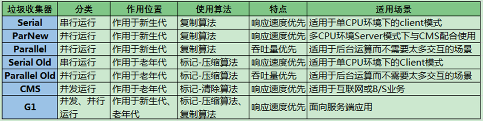

#### 6.1   Serial 收集器

- 串行回收

- -XX:+UseSerialGC

#### 6.2  ParNew 收集器

- 并行回收
- Par是Parallel的缩写，New：只能处理的是新生代
- 复制算法
- -XX:+UseParNewGC

####  6.3  Parallel Scavenge 收集器

- 吞吐量优先
- 和ParNew 的区别
  - 目标则是达到一个可控制的吞吐量（Throughput），它也被称为吞吐量优先的垃圾收集器
  - 自适应调节策略也是Parallel Scavenge与ParNew一个重要区别
- jdk8默认的垃圾回收器
- -XX:+UseParallelGC

#### 6.4   Serial Old 收集器

#### 6.5  Parallel Old 收集器 

####  6.6 CMS 收集器

- HotSpot虚拟机中第一款真正意义上的并发收集器，它第一次实现了让垃圾收集线程与用户线程同时工作

- CMS的垃圾收集算法采用标记-清除算法，并且也会”Stop-the-world”

- 收集过程分为四个阶段

  - 初始标记（STW）：暂时时间非常短，标记与GC Roots直接关联的对象
  - 并发标记（最耗时）：从GC Roots开始遍历整个对象图的过程。不会停顿用户线程
  - 重新标记：（STW）：修复并发标记环节，因为用户线程的执行，导致数据的不一致性问题
  - 并发清理（最耗时）

  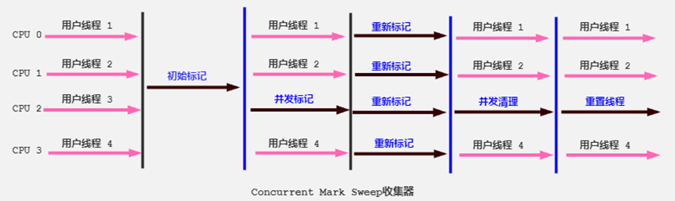

- 优点
  - 并发收集
  - 低延迟
- 缺点
  - 会产生内存碎片
  - CMS收集器对CPU资源非常敏感
  - CMS收集器无法处理浮动垃圾

#### 6.7 G1 收集器

- 为啥要有G1？
  - 垃圾收集经常造成STW的GC又跟不上实际的需求，所以才会不断地尝试对GC进行优化。G1（Garbage-First）垃圾回收器是在Java7 update 4之后引入的一个新的垃圾回收器，是当今收集器技术发展的最前沿成果之一。
  - 为了适应现在不断扩大的内存和不断增加的处理器数量，进一步降低暂停时间（pause time），同时兼顾良好的吞吐量
- jdk9默认的垃圾回收器
- -XX:+UseG1GC
- 特点
  - 并行与并发
    - 并行性：G1在回收期间，可以有多个GC线程同时工作，有效利用多核计算能力。此时用户线程STW
    - 并发性：G1拥有与应用程序交替执行的能力，部分工作可以和应用程序同时执行，因此，一般来说，不会在整个回收阶段发生完全阻塞应用程序的情况
  - 分代收集
    - 将堆空间分为若干个区域（Region）,这些区域中包含了逻辑上的年轻代和老年代
  - 空间整合
  - 可预测的停顿时间模型
- 垃圾回收过程
  - 年轻代GC
    - 当Eden空间耗尽时，G1会启动一次年轻代垃圾回收过程。
    - 年轻代垃圾回收只会回收Eden区和Survivor区
  - 并发标记过程
    - 当越来越多的对象晋升到老年代old region时，为了避免堆内存被耗尽，虚拟机会触发一个混合的垃圾收集器
  - 混合回收
  - FullGC
- G1收集器的垃圾回收过程主要分为以下几个步骤
  - **初始标记**：G1收集器首先会对整个堆内存进行初始标记。在此阶段，G1收集器会标记出所有存活的对象
  - **并发标记**：在初始标记之后，G1收集器会启动并发标记阶段。在此阶段，G1收集器会在应用程序运行的同时继续标记存活的对象
  - **最终标记**：在并发标记阶段结束后，G1收集器会对整个堆内存进行最终标记。在此阶段，G1收集器会标记出所有存活的对象，并计算出每个Region中存活对象的总大小
  - **混合回收**：在最终标记之后，G1收集器会根据每个Region中存活对象的总大小来决定采用哪种回收方式。如果一个Region中存活对象的总大小超过了该Region容量的50%，那么G1收集器就会对该Region进行回收。否则，G1收集器就会将该Region标记为可回收的Region
  - **并发清理**：在混合回收阶段之后，G1收集器会启动并发清理阶段。在此阶段，G1收集器会在应用程序运行的同时清理可回收的Region
  - **并发重置**：在并发清理阶段结束后，G1收集器会对堆内存进行并发重置。在此阶段，G1收集器会将可回收的Region标记为可用Region

#### 6.8 ZGC 收集器

- 在尽可能对吞吐量影响不大的前提下，实现在任意堆内存大小下都可以把垃圾收集的停顿时间限制在十毫秒以内的低延迟
- ZGC：是一款基于Region内存布局的，（暂时）不设分代的，使用了读屏障、染色指针和内存多重映射等技术来实现可并发的标记-压缩算法的，以低延迟为首要目标的一款垃圾收集器
- ZGC的工作过程可以分为4个阶段：并发标记-并发预备重分配-并发重分配-并发重映射等


### 7 . STW

- Stop-the-World ，简称STW，指的是GC事件发生过程中，会产生应用程序的停顿。停顿产生时整个应用程序线程都会被暂停，没有任何响应，有点像卡死的感觉，这个停顿称为STW
- 可达性分析算法中枚举根节点（GC Roots）会导致所有Java执行线程停顿。
  - 分析工作必须在一个能确保一致性的快照中进行
  - 一致性指整个分析期间整个执行系统看起来像被冻结在某个时间点上
  - 如果出现分析过程中对象引用关系还在不断变化，则分析结果的准确性无法保证
- STW是JVM在后台自动发起和自动完成的。在用户不可见的情况下，把用户正常的工作线程全部停掉
- 开发中不要用System.gc();会导致Stop-the-world的发生


### 8. 类加载过程

#### 8.1 类的生命周期

- 7个阶段，其中验证、准备、解析这三个阶段称为连接

  - 加载（loading）
    - 简而言之就是将Java类的字节码文件加载到机器内存中，并在内存中构建出Java类的原型——类模板对象
  - 验证（Verification）
    - 保证加载的字节码是合法、合理并符合规范的
    - 格式检查、语义检查、字节码验证、符合引用验证
  - 准备 (Preparation)
    - 为类的静态变量分配内存，并将其初始化为默认值
  - 解析 (Resolution)
    - 将类、接口、字段和方法的符号引用转为直接引用
    - 也就是得到类、字段、方法在内存中的指针或者偏移量
  - 初始化 (Initialization)
    - 为类的静态变量赋予正确的初始值
    - **父类的static块优先级高于子类**
  - 使用 (Using)
    - 使用new关键字为其创建对象实例
  - 卸载 (Unloading)

  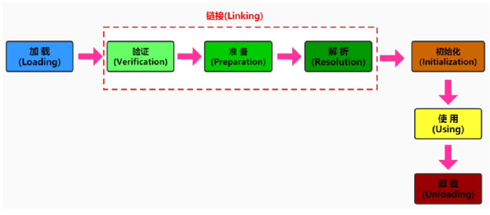

#### 8.2 类加载过程

- 五个阶段
  - 加载
  - 验证
  - 准备
  - 解析
  - 初始化

#### 8.3 类加载器

- 作用
  - **类加载器的主要作用就是加载 Java 类的字节码（ `.class` 文件）到 JVM 中（在内存中生成一个代表该类的 `Class` 对象）**

- jvm内置三个加载器
  - **`BootstrapClassLoader`(启动类加载器)**
    - 最顶层的加载类，由 C++实现，通常表示为 null，并且没有父级，主要用来加载 JDK 内部的核心类库（ `%JAVA_HOME%/lib`目录下的 `rt.jar`、`resources.jar`、`charsets.jar`等 jar 包和类）以及被 `-Xbootclasspath`参数指定的路径下的所有类
  - **`ExtensionClassLoader`(扩展类加载器)**
    - 主要负责加载 `%JRE_HOME%/lib/ext` 目录下的 jar 包和类以及被 `java.ext.dirs` 系统变量所指定的路径下的所有类
  - **`AppClassLoader`(应用程序类加载器)**
    - 面向我们用户的加载器，负责加载当前应用 classpath 下的所有 jar 包和类

 #### 8.4 双亲委派机制

- 定义
  - 如果一个类加载器在接到加载类的请求时，它首先不会自己尝试去加载这个类，而是把这个请求任务委托给父类加载器去完成，依次递归，如果父类加载器可以完成类加载任务，就成功返回。只有父类加载器无法完成此加载任务时，才自己去加载
- 本质
  - 引导类加载器先加载，若加载不到，由扩展类加载器加载，若还加载不到，才会由系统类加载器或自定义的类加载器进行加载
- 源码分析
  - 双亲委派机制在java.lang.ClassLoader**.loadClass**(String,boolean)接口中体现
    - 先在当前加载器的缓存中查找有无目标类，如果有，直接返回
    - 判断当前加载器的父加载器是否为空，如果不为空，则调用parent.loadClass(name, false)接口进行加载
    - 反之，如果当前加载器的父类加载器为空，则调用findBootstrapClassOrNull(name)接口，让引导类加载器进行加载
    - 如果通过以上3条路径都没能成功加载，则调用findClass(name)接口进行加载。该接口最终会调用java.lang.ClassLoader接口的defineClass系列的native接口加载目标Java类
- 优点
  - 避免类的重复加载，确保一个类的全局唯一性
  - 保护程序安全，防止核心API被随意篡改
- 弊端
  - 顶层的ClassLoader无法访问底层的ClassLoader所加载的类


#### 8.5 tomcat 为啥要破坏双亲委派机制

- 为啥？

  - 在某些情况下，应用程序可能需要加载自己的特定版本的类库而不使用父类加载器提供的版本
  - 一个web容器可能要部署两个或者多个应用程序，不同的应用程序，可能会依赖同一个第三方类库的不同版本，因此要保证每一个应用程序的类库都是独立、相互隔离的

- tomcat类加载机制

  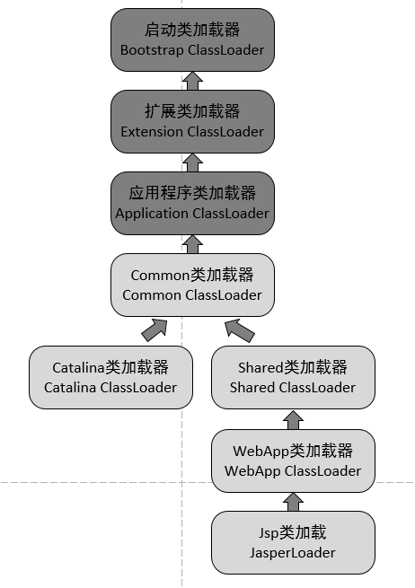


- CommonClassLoader：tomcat最基本的类加载器，加载路径中的class可以被tomcat和各个webapp访问

- CatalinaClassLoader：tomcat私有的类加载器，webapp不能访问其加载路径下的class，即对webapp不可见

- SharedClassLoader：各个webapp共享的类加载器，对tomcat不可见

- WebappClassLoader：webapp私有的类加载器，只对当前webapp可见
- 每一个web应用程序对应一个WebappClassLoader，每一个jsp文件对应一个JspClassLoader，所以这两个类加载器有多个实例
- 每个webappClassLoader加载自己的目录下的class文件，不会传递给父类加载器

####          

### 9. jvm常见参数总结

#### 9.1 打印设置的XX选项及值

- -XX:+PrintCommandLineFlags

  - 可以让在程序运行前打印出用户手动设置或者JVM自动设置的XX选项

  - java -XX:+PrintCommandLineFlags -version 

    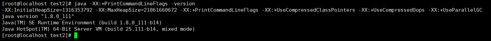

- -XX:+PrintFlagsInitial

  - 表示打印出所有XX选项的默认值

  - java -XX:+PrintFlagsInitial

    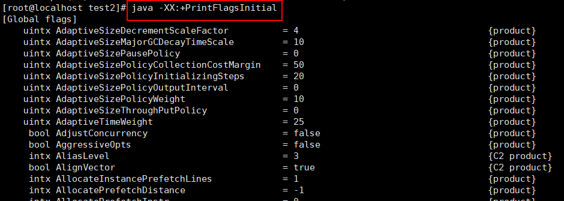

- -XX:+PrintFlagsFinal

  - 表示打印出XX选项在运行程序时生效的值

  - java -XX:+PrintFlagsFinal -version

    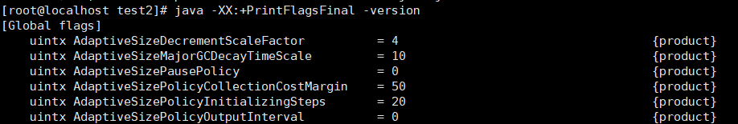

- -XX:+PrintVMOptions
  - 打印jvm的参数
  - java -XX:+PrintVMOptions -version

​           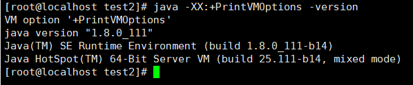


#### 9.2 栈

- -Xss128k
  - 设置每个线程的栈大小为128k
  - 等价于 -XX:ThreadStackSize = 128k
  - jinfo -flag +Xss128k 1234

#### 9.3 堆

- -Xms4000m

  - 设置jvm初始堆内存为4000m
  - 等价于：-XX:InitialHeapSize

- -Xmx4000m

  - 设置jvm最大堆内存为4000m
  - 等价于：-XX:MaxHeapSize

  - eg：设置某个服务的初始堆内存和最大堆内存的大小
    - java -Xms2g -Xmx4g -jar YourApplication.jar
  - eg: 查看某个服务的初始堆内存和最大堆内存的大小
    - jinfo -flags  pid(对应的进程编号)

- -XX:MaxTenuringThreshold=15

  - 默认值是15
  - 新生代每次MinorGC后，还存活的对象年龄+1，当对象的年龄大于设置的这个值时就进入老年代

- -Xmn2g

  - 设置年轻代大小为2g
  - 官方推荐配置为整个堆大小的3/8

#### 9.4 方法区

- 元空间
  - -XX:MetaspaceSize
    - 初始空间大小

#### 9.5 垃圾回收器相关

- 查看默认垃圾回收器

  - jinfo -flags pid

    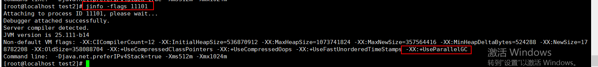

- 串行回收
  - -XX:+UseSerialGC
- ParNew
  - -XX:+UseSerialGC
- G1
  - -XX：+UseG1GC 

#### 9.6 GC相关的内容

- -XX:+PrintGCDetails
  - 在发生垃圾回收时打印内存回收详细的日志，
    并在进程退出时输出当前内存各区域分配情况
  - eg
    - java -XX:+PrintGCDetails -jar your_application.jar

### 10. jdk监控和故障工具总结

#### 10.1 jps

- 查看所有java进程
- 命令
  - jps -l
    - 输出主类的全名，如果进程执行的是 Jar 包，输出 Jar 路径
  - jps -v
    - 输出虚拟机进程启动时 JVM 参数
    - 比如：-Xms20m -Xmx50m是启动程序指定的jvm参数
  - jps -m
    - 输出传递给 Java 进程 main() 函数的参数


#### 10.2 jstat

- JVM Statistics Monitoring Tool 简称jstat

- 监视虚拟机各种运行状态信息

- 可以显示本地或者远程虚拟机进程中的类装载、内存、垃圾收集、JIT编译等运行数据

- 基本语法

   ```java
   jstat -<option> [-t] [-h<lines>] <vmid> [<interval> [<count>]]
   ```

  - option参数
    - 类加载相关的
      - -class: 显示ClassLoader的相关信息：类的装载、卸载数量、总空间、类装载所消耗的时间等
    - 垃圾回收相关的
      - -gc: 显示与GC相关的堆信息。包括Eden区、两个Survivor区、老年代、永久代等的容量、已用空间、GC时间合计等信息
    - JIT相关的
      - -compiler：显示JIT编译器编译过的方法、耗时等信息
  - interval参数
    - 用于指定输出统计数据的周期，单位为毫秒。即：查询间隔
  - count参数
    - 用于指定查询的总次数
  - -t参数
    - 可以在输出信息前加上一个Timestamp列，显示程序的运行时间。单位：秒
  - -h参数
    - 可以在周期性数据输岀时，输出多少行数据后输出一个表头信息

- 常见使用

  ```java
  jstat -gc <pid> 1000 10
      
  说明：这里的<pid>是Java进程的进程ID。该命令将每隔1秒（1000毫秒）输出一次垃圾回收相关的数据，共输出10次
      
  jstat -gcutil <pid> <interval> <count>：显示各代的内存使用情况
  ```

  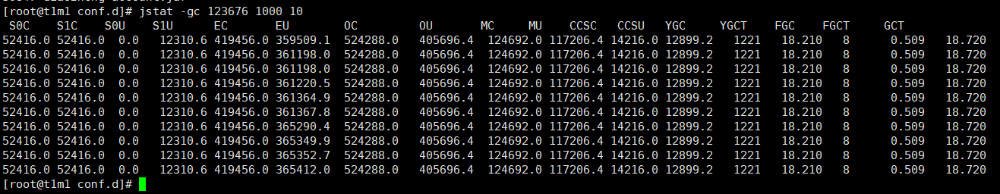


#### 10.3 jinfo

- 实时查看和调整虚拟机各项参数

- 基本语法

  ```java
  jinfo  [ options ] pid
      
  说明：java 进程ID 必须要加上
  ```

  - options
    - no option
      - 输出全部的参数和系统熟悉
    - -flag name
      - 输出对应名称的参数
    - -flag [+-]name
      - 开启或关闭对应名称的参数
    - -flag name=value
      - 设定对应名称的参数
    - -flags
      - 输出全部的参数
      
      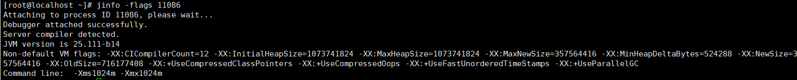

- 查看

  - 查看曾经赋值的参数

    - jinfo -flags pid

    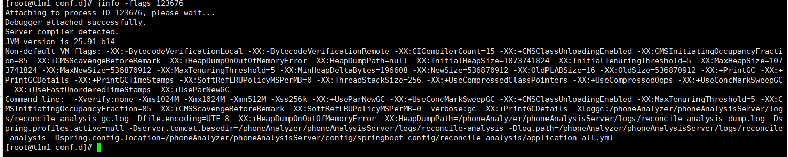

  - 查看某个java进程的具体参数的值

    - jinfo -flag 具体参数 pid

      

- 修改

  - boolean 类型
    - jinfo -flag [+|-]具体参数 PID
  - 非boolean类型
    - jinfo -flag 具体参数=具体参数值 PID

#### 10.4 jmap

- 生成堆转储快照

- 基本语法

  - ````java
    jmap [option] <pid>
    ````

  - option 包括

    - -dump: 生成dump文件
    - -heap: 输出整个堆空间的详细信息，包括GC的使用、堆配置信息

- 使用1

  - 导出内存映像文件

    - 手动方式

      ```java
      jmap -dump:format=b,file=<filename.hprof> <pid>
          
      jmap -dump:live,format=b,file=<filename.hprof> <pid>
      ```

    
    ​      eg: jmap -dump:format=b,file=test.hprof 11101
  
- 使用2

  - 显示堆内存相关信息

    - jmap -heap pid

    - jmap -histo pid

      

#### 10.5 jhat

- 全称：jvm heap analysis tool

- 分析heapdump文件
- jdk9以后已经被删除

#### 10.6 jstack

- 生成虚拟机当前时刻的线程快照
- 基本语法
  - jstack option pid
  - option参数
    - -F: 当正常输出的请求不被响应时，强制输出线程堆栈
    - -l: 除堆栈外，显示关于锁的附加信息
    - -m: 如果调用到本地方法的话，可以显示C/C++的堆栈
    - -h: 帮助操作
- eg
  - jstack -l 11121


#### 10.7 jconsole

- java监视与管理控制台
- 启动
  - jdk/bin目录下，启动jconsole.exe命令
  - 不需要使用jps命令来查询
- 主要作用
  - 监控内存
  - 监控线程
  - 监控死锁
  - 类加载与虚拟机信息


#### 10.8 Visual VM

- 多合一故障处理工具


### 11. 性能调优

#### 11.1 排查问题

- 打印GC日志，通过GCviewer或者 http://gceasy.io来分析日志信息
- 灵活运用 命令行工具，jstack，jmap，jinfo等
- dump出堆文件，使用内存分析工具分析文件
- 使用阿里Arthas，或jconsole，JVisualVM来实时查看JVM状态
- jstack查看堆栈信息

#### 11.2 解决问题

- 适当增加内存，根据业务背景选择垃圾回收器
- 优化代码，控制内存使用
- 增加机器，分散节点压力
- 合理设置线程池线程数量
- 使用中间件提高程序效率，比如缓存，消息队列等

#### 11.3 案例分析

- 案例1：堆溢出

  - 报错信息
    - java.lang.OutOfMemoryError: Java heap space
  - 原因分析
    - 代码可能存在大对象分配
    - 可能存在内存泄漏，导致多次GC后，还是无法找到一块足够大的内存容纳当前对象
  - 解决方法
    - 1. 检查是否存在大对象分配，最有可能是大数据分配
    - 2. 通过jmap命令，把堆内存dump下来，使用MAT等工具分析一下，检查是否存在内存泄漏的问题
    - 3. 如果没有找到明显的内存泄漏，使用 -Xmx 加大堆内存

- 案例2：元空间溢出

  - 报错信息
    - java.lang.OutOfMemoryError: Metaspace
  - 原因分析
    -  运行期间生成了大量的代理类，导致方法区被撑爆，无法卸载
    - 应用长时间运行，没有重启
    - 元空间内存设置过小

  - 解决方法
    - 1. 检查是否永久代空间或者元空间设置的过小
    - 2. 检查代码中是否存在大量的反射操作
    - 3. dump之后通过mat检查是否存在大量由于反射生成的代理类

- 案例3：GC overhead limit exceeded

  - 报错原因
    - 超过98%的时间用来做GC并且回收了不到2%的堆内存时会抛出此异常
  - 解决方法
    - 1. 检查项目中是否有大量的死循环或有使用大内存的代码，优化代码
    - 2. 添加参数 `-XX:-UseGCOverheadLimit` 禁用这个检查，其实这个参数解决不了内存问题，只是把错误的信息延后，最终出现 java.lang.OutOfMemoryError: Java heap space
    - 3. dump内存，检查是否存在内存泄漏，如果没有，加大内存

- 案例4：线程溢出

  - 报错信息
    - java.lang.OutOfMemoryError : unable to create new native Thread
  - 问题原因
    - 出现这种异常，基本上都是创建了大量的线程导致的
  - 解决方法
    - 1. 通过 -Xss 设置每个线程栈大小的容量
    - 2. 调大Linux- /proc/sys/vm/max_map_count的值


#### 11.4 性能调优案例

- 案例1：调整堆大小提高服务的吞吐量

- 案例2：jvm优化之JIT优化

- 案例3：合理配置堆内存

  - -Xms -Xmx

- 案例4：CPU占用很高排查方案(重要)

  - 排查思路

    1. 首先查看java进程id

       ```java
       jps -l
       ```

    2. 根据进程 ID 检查当前使用异常线程的pid

       ```java
       top -Hp 1111
           
       说明：
           1.-H：表示显示线程级别的信息
           2.-p: 标志后面跟着一个进程ID
               
       命令的含义是显示特定进程ID（PID）对应的进程以及其线程的详细信息，包括CPU占用、内存占用等
       ```

    3. 把线程pid变为16进制如 31695 -> 7bcf  然后得到0x7bcf

       ```java
       printf "%x" 31695 
       ```

    4. 把线程pid变为16进制如 31695 -> 7bcf  然后得到0x7bcf

       ```java
       jstack 1111 > jstack.log
       ```

    5. 打开jstask.log文件，查找刚刚转换16进制id是否存在

    6. 或者4，5步也可以使用以下命令

       ```java
       jstack pid | grep -A20 0x5555
           
           
       备注：-A20表示显示匹配行之后的20行文本内容
       ```

- 案例5：G1并发执行的线程数对性能的影响

  - -XX:ConcGCThreads=8

- 案例6：调整垃圾回收器提高服务的吞吐量

  - -XX:+UseG1GC

- 案例7：日均百万级订单交易系统如何设置JVM参数

  - 初始堆和最大堆Xms Xmx 要相对较高
  - 垃圾回收器选择G1  -XX:+UseG1GC
  - 并发线程数：-XX:ParallelGCThreads 或 -XX:ConcGCThreads
  - 元空间大小：-XX:MaxMetaspaceSize
  - 栈大小：-Xss 


​                                            
