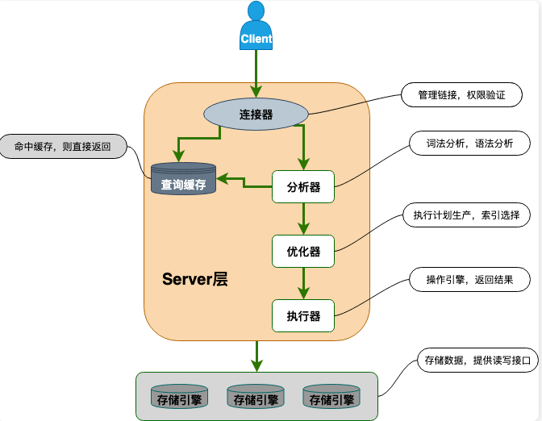
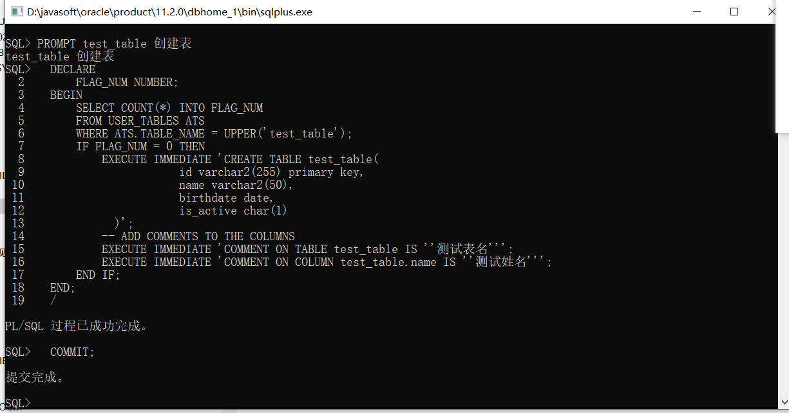

# 数据库
## 一. 基础知识

### 1.1  E-R图

- 全称：实体联系图，提供了表示实体类型、属性和联系的方法

- 主要有三个要素组成

  - 实体：用矩形框表示，通常是现场时间的业务对象。比如学生、课程、班级等实体
  - 属性：用椭圆形表示，即某个实体拥有的属性
  - 联系：用菱形表示，即实体与实体之间的关系

  

### 1.2 数据库三大范式

- 第一范式
  - 属性不可再分
- 第二范式
  - 第一范式基础上，消除了非主属性对于码的部分函数依赖
  - 通俗理解：在满足1NF的基础上，2NF要求表必须有主键，并且表中的其他数据（非键字段）必须完全依赖于主键
  - 举例：假如有个图书馆，假设我们记录每本书借出的时间，如果“书籍ID+借书日期”作为一个组合主键，那么其他信息，比如借书人的信息，就应该直接依赖于这个组合主键，而不是仅依赖其中的一部分（比如仅依赖书籍ID）
- 第三范式
  - 三范式在第二范式基础上，消除了非主属性对于码的传递函数依赖
  - 通俗理解：在满足1NF和2NF的基础上，3NF要求数据中不存在非主键字段之间的依赖。这意味着所有的非键信息都只能依赖于键信息，不能相互依赖
  - 举例：比方说，在一个记录了书籍和作者信息的表中，如果“作者国籍”实际上是和“作者名”相关联的，那么“作者国籍”就不应该直接出现在记录书籍的表中，因为这会导致与书籍直接相关的信息之外的冗余

### 1.3 drop、delete、truncate的区别

- drop
  - drop table 表名
  - 直接将表都删掉
- delete
  - delete from 表名 where 列名=值
  - 删除表里面的数据
- truncation
  - truncate table 表名
  - 只删除表中的数据

### 1.4 having 和 where的区别

- where: 过滤指定的行，后面不能加聚合函数，where在group by 前
- having: 过滤分组，一般都是和group by 连用，不能单独使用。having在group by之后

```sql
select cust_name,count(*) as num
from customs
where cust_age is not null
group by cust_name
having count(*) >= 1
```

### 1.5 ON 和 WHERE的区别

- 连接表时，sql会根据连接条件生成一张新的临时表。on就是连接条件，它决定临时表的生成
- where是在临时表生成后，再对临时表中的数据进行过滤，生成最终的结果集
- 总结
  - on是生成一张临时表，where是对临时表进行筛选

### 1.6 LEFT/RIGHT JOIN

- left join .. on
  - 返回左表中的所有行，即使右表中没有满足条件的行也是如此
- right join ..on
  - 返回右表中的所有行，即使左表中没有满足条件的行也是如此

## 二、MYSQL

mysql知识总结汇总

## 2.1. 常见脚本创建

### 2.1.1 创建表
```sql
create table if not exists `test_table` (
  id bigint(20) unsigned not null auto_increment comment '主键id',
  record_id int  comment '记录id',
  create_time datetime not null default current_timestamp comment '创建时间',
  update_time datetime NOT NULL DEFAULT CURRENT_TIMESTAMP ON UPDATE CURRENT_TIMESTAMP COMMENT '更新时间',
  test_name varchar(255) CHARACTER SET utf8mb4 COLLATE utf8mb4_general_ci not null comment '测试内容', 
  jyaq text CHARACTER SET utf8mb4 COLLATE utf8mb4_general_ci COMMENT '简要案情',

  primary key (id) using btree,
  key idx_test_index (test_name) using btree

) ENGINE = InnoDB CHARACTER SET = utf8mb4 COLLATE = utf8mb4_general_ci COMMENT = '测试表表名称' ROW_FORMAT = Dynamic;

```

### 2.1.2 更新表

### 2.1.3 修改表字段(可以重复执行，线上环境推荐)

- 新增字段
```mysql
drop procedure if exists add_field_test_table;
delimiter $$
create procedure add_field_test_table()
  begin
      if not exists (select 1 from information_schema.columns where table_schema='test' and table_name = 'test_table' and column_name = 'test_name2')
        then
        ALTER TABLE `test_table` add COLUMN `test_name2` varchar(255) DEFAULT NULL COMMENT '测试内容2添加';
        end if ;
  end $$
delimiter ;
call add_field_test_table;
drop procedure if exists add_field_test_table;

```

- 修改字段
  
```mysql
drop procedure if exists modify_field_test_table;
delimiter $$
create procedure modify_field_test_table()
  begin
      if exists (select 1 from information_schema.columns where table_schema='test' and table_name = 'test_table' and column_name = 'test_name2')
        then
        ALTER TABLE `test_table` modify COLUMN `test_name2` varchar(50) DEFAULT NULL COMMENT '测试内容2修改';
        end if ;
  end $$
delimiter ;
call modify_field_test_table;
drop procedure if exists modify_field_test_table;


```

### 2.1.4 添加列

```sql
alter table user add age int(10);
```


### 2.1.5 修改列

```java
alter table user modify column age tinyint;
```


### 2.1.5 删除列

```java
alter table user drop column age;
```

### 2.1.6 创建索引

```sql
create index user_index on user(id);
```

### 2.1.7 添加索引

```java
alter table user add index user_index(id);
```

### 2.1.8 创建唯一索引

```java
create unique index user_index on user(id);
```

### 2.1.9 删除索引

```java
alter table user drop index user_index;
```


## 2.2 mysql字符集

### 2.2.1 字符集

- 创建统一使用utf8mb4字符集


## 2.3 mysql基础

### 1. NULL 和 ‘’的区别是什么？

- NULL 代表一个不确定的之，就算是两个NULL,它两也不一定相等
- ‘’的长度是0，是不占用空间的，而NULL是需要占用空间的
- NULL会影响聚合函数的结果
- 查询NULL值时，必须使用is null 或is not null来判断

### 2. MyISAM 和InnoDB有什么区别？

1. 是否支撑行级锁
2. 是否支持事务
3. 是否支持外键
4. 是否支持mvcc

  总结：innodb都支持，myisam都不支持


## 2.4 mysql事务(重要)

### 1. 事务的特性

- 原子性
  - 事物是最小的执行单位，不允许分割
- 隔离性
  - 并发访问数据库时候，一个用户的事物不被其他事物所干扰，各并发事物之间数据库是独立的
- 持久性
  - 一个事物被提交之后，它对数据库中数据的改变是持久的
- 一致性
  - 执行事务前后，数据保持一致


### 2. 并发事务带来的问题

#### 1. 脏读

- 一个事务读取到了另外一个数据修改还未提交的数据

#### 2. 丢失修改

- 两个事务同时读取一个数据，第一个事务修改了这个数据后，第二个数据也修改了这个数据，这样第一个事务内的修改结果被丢失

#### 3. 不可重复读

- 一个事务内多次读取同一数据，在这个事务还没结束时，另外一个事务也访问该数据，在第一个事务中的两次读数据之间，由于第二个事务的修改导致第一个事务两次读取的数据可能不太一样。发生了在一个事务内两次读到的数据是不一样的情况

#### 4. 幻读

- 一个事务读取了几行数据，接着另外一个并发事务插入了一些数据，在随后的查询中，第一个事务就会发现多了一些原本不存在的记录，像发生了幻觉一样

#### 5. 不可重复读和幻读的区别？

- 不可重复读的重点是内容修改或者记录减少
- 幻读重点在新增


### 3. 如何解决并发事务带来的问题

#### 1. 加锁

- mysql中主要是通过读写锁来实现并发控制
- 共享锁
  - 又称读锁，事务在读取记录的时候获取共享锁，允许多个事务同时获取
- 排他锁
  - 又称写锁/独占锁，事务在修改记录的时候获取排他锁，不允许多个事务同时获取，如果一个记录已经被加了排他锁，那其他事务不能再对这条记录加任何类型的锁
- 表级锁
- 行级锁
  - 仅对相关的记录上锁


#### 2. MVCC

- 多版本并发控制的方法，即对一份数据会存储多个版本，通过事务的可见性来保证事务能看到自己应该看到的版本。
- 通常会有一个全局的版本分配器来为每一行数据设置版本号，版本号是唯一的
- 所依赖的手段主要是
  - 隐藏字段
    - 用来判断当前版本数据的可见性
  - read view
    - 用来判断当前版本数据的可见性
  - undo log
    - 用于记录某行数据的多个版本的数据


### 4. sql标准定义了哪些事务隔离级别

#### 1. 读未提交

- READ-UNCOMMITTED
- 最低的隔离级别，允许读取尚未提交的数据变更，可能会导致脏读、幻读、不可重复读

#### 2. 读已提交

- READ-COMMITTED
- 允许读取并发事务已经提交的数据，可以阻止脏读，但是幻读或不可重复读仍有可能发生

#### 3.可重复读（RR）

- REPEATABLE-READ
- 对同一个字段的多次读取结果都是一致的，除非数据是被本身事务自己所修改，可以阻止脏读和不可重复读，但幻读仍有可能发生

#### 4. 可串行化

- SERIALIZABLE
- 最高的隔离级别，完全服从ACID的隔离级别，所有的事物依次逐个执行，这样事物之间就完全不可能产生干扰，该级别可以防止脏读，不可重复读和幻读

#### 5. mysql默认隔离级别

- 可重复读

- 命令

  ```sql
  mysql8 以下
  select @@tx_isolation
  
  mysql8 以上
  select @@transaction_isolation
  
  ```

  

## 2.5. mysql锁

### 1. 表级锁

- 对整张表加锁

### 2. 行级锁

- 针对索引字段加的锁，只针对当前操作的行记录进行加锁
- 注意事项
  - 在执行update、delete语句时，如果where条件中字段没有命中唯一索引或索引失效的话，就会导致全部扫描
- 行锁分类
  - 记录锁
    - Record Lock
    - 属于单个行记录上的锁
  - 间隙锁
    - Gap Lock
    - 锁定一个范围，不包括记录本身
  - 临键锁
    - Next-Key Lock
    - Record Lock + Gap Lock, 锁定一个范围，包含记录本身，主要为了解决幻读
- 可重复读隔离级别下，默认的行锁？
  - 默认使用临键锁，如果操作的索引是唯一索引或主键，会对临键锁进行优化，降级为记录锁

### 3 .共享锁

- 读锁，允许多个事务同时获取


### 4. 排他锁

- 写锁，事务在修改记录的时候获取排他锁，不允许多个事务同时获取


### 5. 当前读和快照读的区别？

- 快照读

  - 一致性非锁定读，就是单纯的select语句
  - 快照即记录的历史版本，每行记录可能存在多个历史版本
  - 快照读情况下，如果读取的记录正在执行update/delete操作，读取操作不会因此去等待记录上X锁的释放，而是会去读取行的一个快照

- 当前读

  - 就是给行记录加X锁或S锁

  - ```sql
    # 对读的记录加一个X锁
    select ... for update
    
    # 对读的记录加一个S锁
    select ...LOCK IN SHARE MODE
    ```

### 6. 哪些操作会加表级锁，哪些操作会加行级锁

INNODB存储引擎下

- 表级锁
  - altert table， drop table 等ddl操作会隐式地对表加表级锁
- 行级锁
  - 默认情况下，dml操作（insert,update,delete) 进行行级锁定
  - 在查询时，通过select...for update可以显式获取行级锁

## 2.6 mysql索引

### 1. 索引介绍

- 索引是一种用于快速查询和检索数据的数据结构
- 其本质可以看成是一种排序好的数据结构

### 2. 索引的优缺点

- 优点
  - 大大加快数据的检索速度
  - 通过创建唯一性索引，可以保证数据库表中每一行数据的唯一性
- 缺点
  - 创建索引和维护索引需要耗费许多时间
  - 索引需要使用物理文件存储，也会耗费一定空间
- 索引一定能提高查询性能吗？
  - 大多数情况下，索引查询都会比全表扫描要快的，但是如果数据库的数据量不大，使用索引也不一定能够带来很大提升

### 3. 索引类型总结

- Mysql默认索引结构为B+ Tree
  - 为啥要使用b+ tree
    - 二叉树
      - 如果是递增的，会导致右边越来越多，变成了链表，不合适
    - 平衡二叉树
      - 要求左右子树的树高差绝对值不能超过1，如果数据太多，树的高度就会越来越高
    - Hash表
      - 哈希索引只支持等值查询（即给定一个确切的键值），对于范围查询则无效，因为它不具备顺序性
      - 哈希索引没有顺序性，无法进行高效扫描
      - 对于哈希索引，每当插入或删除数据时，可能导致哈希桶重新分配，成本较高
    - B-Tree B树
      - 多路平衡查找树，可以有多个子节点，每个节点可以存储多个值，解决了上面两种树的缺点，但是不适合区间查找
      - 为啥B树不适合区间查找？
        - 因为数据分布在整个树的各个层级，查询过程更复杂
    - B+Tree
      - 只有叶子节点才存储数据，非叶子节点只存储索引
      - B+Tree叶子节点使用了双向链表链接，并且使用从小到大排列，范围查找效率高，只需扫描一遍叶子节点即可
      - 由于非叶子节点没有存放数据，因此B+树比B树更矮更胖，减少了磁盘IO次数
- 聚簇索引
  - 索引结构和数据一起存放的索引，InnoDB中的主键索引就属于聚簇索引
  - .idb文件就包含了该表的索引和数据
  - 优点
    - 查询速度非常快,定位到索引的节点，就定位到了数据
    - 对排序查找和范围查找优化
  - 缺点
    - 依赖于有序的数据
    - 更新代价大
- 非聚簇索引
  - 索引结构和数据分开存放的索引，二级索引就数据非聚簇索引
  - 非聚簇索引的叶子节点并不一定存放数据的指针，因为二级索引的叶子节点存放的是主键，根据主键再回表查数据
  - 优点
    - 更新代价比聚簇索引要小
  - 缺点
    - 依赖于有序的数据
    - 可能会二次查询(回表)：这应该是非聚簇索引的最大缺点了，当查到索引对应的指针或主键后，可能还会根据指针或主键再到数据文件或表中查询
  - 非聚簇索引一定回表查询吗？
    - 不一定回表查询
- 覆盖索引
  - 如果一个索引包含(或者说覆盖)所有需要查询的字段的值，我们就称之为覆盖索引
  - 覆盖索引即需要查询的字段正好是索引的字段，那么直接根据该索引，就可以查到数据了，而无需回表查询
  - 在InnoDB存储引擎中，如果不是主键索引，叶子节点存储的是主键+列值，最终还是要回表，也就是通过主键再查找一次，这样就会比较慢，而覆盖索引就是把要查询出的列和索引是对应的，不做回表操作
- 联合索引
  - 使用表中的多个字段创建索引，就是联合索引，也叫组合索引或复合索引

### 4 . 最左前缀匹配原则

- 指的是查询从索引的最左前列开始并且不跳过索引中的列
- 口诀

  - 1.从最左开始，建立索引的第一个字段不能丢失，不然索引会失效哦，简称带头大哥不能死

  - 中间兄弟不能断
- 正确使用索引的一些建议
  - 不为NULL的字段：索引字段的数据应该尽量不为NULL
  - 被频繁查询的字段：创建索引的字段应该是查询操作非常频繁的字段
  - 被作为条件查询的字段：被作为where条件查询的字段，应该被考虑建立索引
  - 频繁需要排序的字段可以建立索引
  - 被经常频繁用于连接的字段可以使用索引
  - 尽可能的考虑建立联合索引而不是单列索引
  - 避免索引失效
    - 创建了组合索引，但查询条件未遵守最左匹配原则
    - 在索引列上进行计算、函数、类型转换
    - 以%开头的LIKE查询
    - in的取值范围较大时会导致索引失效

### 5. 为啥不对表中所有的列创建索引？

	1. 存储空间占用
	1. 写操作性能下降

## 2.7. explain

- explain

  - 获取执行计划相关信息

- 用法

  ```sql
  explain + select 查询语句
  ```

- 举例

  ```sql
  mysql> explain SELECT * FROM dept_emp WHERE emp_no IN (SELECT emp_no FROM dept_emp GROUP BY emp_no HAVING COUNT(emp_no)>1);
  +----+-------------+----------+------------+-------+-----------------+---------+---------+------+--------+----------+-------------+
  | id | select_type | table    | partitions | type  | possible_keys   | key     | key_len | ref  | rows   | filtered | Extra       |
  +----+-------------+----------+------------+-------+-----------------+---------+---------+------+--------+----------+-------------+
  |  1 | PRIMARY     | dept_emp | NULL       | ALL   | NULL            | NULL    | NULL    | NULL | 331143 |   100.00 | Using where |
  |  2 | SUBQUERY    | dept_emp | NULL       | index | PRIMARY,dept_no | PRIMARY | 16      | NULL | 331143 |   100.00 | Using index |
  +----+-------------+----------+------------+-------+-----------------+---------+---------+------+--------+----------+-------------+
  
  ```

- 解释
  - id : select 查询的序列标识符
    - select 标识符，是查询中select 的序号，用来标识整个查询中select 语句的顺序
    - id如果相同，从上往下依次执行。id不同，id值越大，执行优先级越高，如果行引用其他行的并集结果， 则该值可以为NULL
  - select_type : select 关键字对应的查询类型
    - 主要区分普通查询、联合查询、子查询等复杂的查询，常见的值有
      - SIMPLE : 简单查询，不包含UNION 或者子查询
      - PRIMARY: 查询中如果包含子查询或其他部分，外层的select 将被标记为primary
      - SUBQUERY: 子查询中的第一个select
      - UNION: 在union中，union 之后出现的select
      - DERIVED: 在from中出现的子查询将被标记为derived
      - UNION RESULT : UNION 查询的结果
  - table : 用到的表名
  - partitions : 匹配的分区，对于未分区的表，值为NULL
  - type : 表的访问方法（重要）
    - 查询执行的类型，描述了查询是如何执行的，所有值的顺序从最优到最差排序为：system > const > eq_ref > ref > fulltext > range > index > all
    - system
      - 如果表使用的引擎对于表行数统计是精确的，且表中只有一行记录的情况下，访问方法是system ，是const的一种特例
    - const
      - 表中最多只有一行匹配的记录，一次查询就可以找到
    - eq_ref
      - 当联表查询时，前一张表的行在当前这张表中只有一行与之对应。是除了system与const之外最好的join方式，常用于使用主键或唯一索引的所有字段作为连表条件
    - ref
      - 使用普通索引作为查询条件，查询结果可能找到多个符合条件的行
    - range
      - 对索引列进行范围查询，执行计划中的key列表示哪个索引被使用了
    - index
      - 查询遍历了整棵索引树，与ALL类似，只不过扫描的是索引，而索引一般在内存中，速度更快
    - all
      - 全表扫描
  - possible_keys : 可能用到的索引
    - 可能用到的索引，如果这一列为NULL,则表示没有可能用到的索引
  - key : 实际用到的索引（重要）
    - 表示实际用到的所有。如果为NULL ,则表示未用到索引
  - key_len : 所选索引的长度
    - 表示mysql实际使用的索引的最大长度，当使用到联合索引时，有可能是多个列的长度和
  - ref : 当使用索引等值查询时，与索引作比较的列或常量
  - rows : 预计要读取的行数
  - filtered : 按表条件过滤后，留存的记录数的百分比
  - Extra ：附加信息 （重要）
    - Using filesort
      - 在排序时使用了外部的索引排序，没有用到表内索引进行排序
    - Using temporary
      - mysql 需要创建临时表来存储查询的结果，常见于order by 和group by
    - Using index
      - 表明查询使用了覆盖索引，不用回表，查询效率非常高
    - Using index condition
      - 表示查询优化器选择使用了索引条件下推这个特性
    - Using where
      - 表明查询使用了where 子句进行条件过滤，一般在没有使用到索引的时候会出现
    - Using join buffer
      - 联表查询的方式，表示当被驱动表的没有使用索引的时候，mysql会先将驱动表读出来放到join buffer中，再遍历被驱动表进行查询


## 2.8 MVCC

- 多版本并发控制- Multi-Version Concurrency Control
- 用于在多个并发事务同时读写数据库时保持数据的一致性和隔离性
- InnoDB对MVCC的实现
  - 隐藏字段
    - DB_TRX_ID(6字节)：表示最后一次插入或更新该行的事务id。
    - DB_ROLL_PTR(7字节)：回滚指针，指向该行的undo log。如果该行未被更新，则为空
    - DB_ROW_ID(6字节)：如果没有设置主键且该表没有唯一非空索引时，InnoDB会使用该id来生成聚簇索引
  - Read View
    - 主要是用来做可见性判断，里面保持了当前对本事务不可见的其他活跃事务
  - undo log
    - 作用
      - 当事务回滚时用于将数据恢复到修改前的样子
      - 另一个作用是mvcc, 当读取记录时，若该记录被其他事务占用或当前版本对该事务不可见，则可以通过undo log读取之前的版本数据，以此实现非锁定读


## 2.9 什么是回表？

当SQL查询仅依赖于非聚集索引（又称二级索引、辅助索引）时，如果查询所需要的数据不在该非聚集索引中完全包含，那么数据库需要借助索引中存储的主键值，回到聚集索引（主键索引）中查找对应的完整行记录。


具体来说，假设一个表有主键`id`和若干其他列如`name`、`age`等，若存在一个基于`name`的非聚集索引。当执行如下查询：

Sql

```sql
1SELECT * FROM table WHERE name = 'John';
```

如果数据库首先使用`name`的索引来定位到`name='John'`的记录，但该索引只包含了`name`和对应的`id`值，并没有存储`age`等其他列的信息。为了得到完整的行数据，数据库就需要根据索引中查找到的主键`id`值，进一步回到聚集索引中去检索对应主键的行，这个过程就被形象地称为“回表”。


## 2.10 mysql三大日志

- binlog
  - 物理日志，记录内容修改情况，只要发生表数据更新，都会产生binlog日志，保证了mysql集群架构的数据一致性
- redolog
  - 重做日志：拥有崩溃恢复能力
- undolog
  - 回滚日志保证事物的原子性

## 2.11 mysql主从复制原理

MySQL的主从复制（Master-Slave Replication）是一种数据同步技术，它可以将主数据库（Master）的所有数据更改自动复制到一个或多个从数据库（Slave）上，从而实现数据的分布式存储和备份，以及读写分离等功能。主从复制的基本原理和配置步骤如下：

### 基本原理

1. **Binlog记录**：
   - 主数据库开启二进制日志（Binary Log），记录所有的数据更改操作，包括INSERT、UPDATE、DELETE以及其他DDL语句。
2. **复制流程**：
   - 从数据库通过I/O线程连接主数据库，请求并读取主数据库的二进制日志事件（binlog events）。
   - I/O线程将读取到的binlog events传输到从数据库的中继日志（Relay Log）中。
   - 从数据库的SQL线程读取中继日志，并按顺序重新执行（重做）这些事件，从而在从数据库上产生与主数据库相同的数据更改。

## 2.12 mysql是如何实现事物的

MySQL实现事务处理是通过底层数据库引擎的支持，特别是InnoDB存储引擎。InnoDB是MySQL中支持事务的标准引擎，它提供了ACID（Atomicity原子性、Consistency一致性、Isolation隔离性、Durability持久性）事务特性。以下是MySQL如何实现事务的简述：

1. **原子性（Atomicity）**：
   - MySQL通过将一系列SQL语句封装在一个事务中来保证原子性。在一个事务内的所有操作要么全部成功提交，要么全部失败回滚，不会存在部分执行的现象。

2. **一致性（Consistency）**：
   - 通过约束（如外键约束、唯一约束等）和预写日志（Write-Ahead Log, WAL，即Redo Log）来维持数据库的一致性状态。在事务提交前，所有对数据的修改都会先写入Redo Log中，确保即使在系统崩溃的情况下也能恢复数据至一致状态。

3. **隔离性（Isolation）**：
   - MySQL通过锁定机制和多版本并发控制（MVCC，Multiversion Concurrency Control）来实现事务的隔离性。
   - 锁定机制：InnoDB支持行级锁，包括共享锁（读锁）和排他锁（写锁），以此来防止多个事务对同一资源的并发访问引发的问题。
   - MVCC：在可重复读（Repeatable Read）隔离级别下，InnoDB不锁定正在读取的数据，而是为事务提供一个快照视图，每个事务只能看到自己开始时刻的数据库状态，避免了脏读、不可重复读和幻读等问题。

4. **持久性（Durability）**：
   - Redo Log（重做日志）和Undo Log（回滚日志）共同确保事务的持久性。
   - Redo Log记录了事务对数据库所做的修改，当事务提交时，Redo Log的内容会被刷入磁盘，即便发生宕机，也能通过Redo Log在系统重启时恢复未持久化的数据。
   - Undo Log保存了事务修改前的数据，用于在事务回滚时撤销对数据库的更改。

在实际操作中，用户通过`START TRANSACTION`、`COMMIT`和`ROLLBACK` SQL语句来手动控制事务的边界，而在自动提交模式下（默认模式），每条单独的SQL语句被视为一个隐式事务。在事务执行期间，MySQL会根据事务隔离级别采取相应的并发控制策略，以确保数据的正确性和完整性。


## 2.13 一条sql的执行过程？

1. 客户端提交请求

2. sql的解析与预处理

   - 对其进行词法分析和语法分析

3. 优化器生成执行计划

4. 锁定与并发控制

5. 执行查询

6. 数据检索

7. 排序和聚合

8. 结果集构建

9. 网络传输

10. 释放资源

    

## 三、ORACLE

## 3.1. 常见脚本创建

### 3.1.1  创建表
- 标准写法
```sql
CREATE TABLE test_table(
  id varchar2(255) primary key,
  name varchar2(50),
  birthdate date,
  is_active char(1)
);

COMMENT ON TABLE test_table IS '测试表名';
COMMENT ON COLUMN test_table.name IS '测试姓名';

```

- 生产环境执行-推荐写法(需要在命令窗口执行)
  ```
    PROMPT test_table 创建表
    DECLARE
        FLAG_NUM NUMBER;
    BEGIN
        SELECT COUNT(*) INTO FLAG_NUM
        FROM USER_TABLES ATS
        WHERE ATS.TABLE_NAME = UPPER('test_table');
        IF FLAG_NUM = 0 THEN
            EXECUTE IMMEDIATE 'CREATE TABLE test_table(
                        id varchar2(255) primary key,
                        name varchar2(50),
                        birthdate date,
                        is_active char(1)
              )';
            -- ADD COMMENTS TO THE COLUMNS
            EXECUTE IMMEDIATE 'COMMENT ON TABLE test_table IS ''测试表名''';
            EXECUTE IMMEDIATE 'COMMENT ON COLUMN test_table.name IS ''测试姓名''';
        END IF;
    END;
    /
    COMMIT;


  ```

  

### 1.2 更新表

- 修改表字段varchar为clob
alter table test_table rename column name to name_clob;
  alter table test_table add name clob;
  update test_table set name=trim(name_clob);
  alter table test_table drop column name_clob;
  comment  on  column  test_table.name   is  '测试修改';
  ```

  ```
- 表后面新增字段
  ```sql
  alter table test_table
  add (sms_type number(9) default null,
      bkry_id varchar2(255)  default null
  );

  comment  on  column  test_table.sms_type   is  '短信类型';
  comment  on  column  test_table.bkry_id    is  '布控人员id'
  ```

- 修改表字段长度
  ```sql
  
  alter table test_table modify (bkry_id varchar2(50));
  
  ```