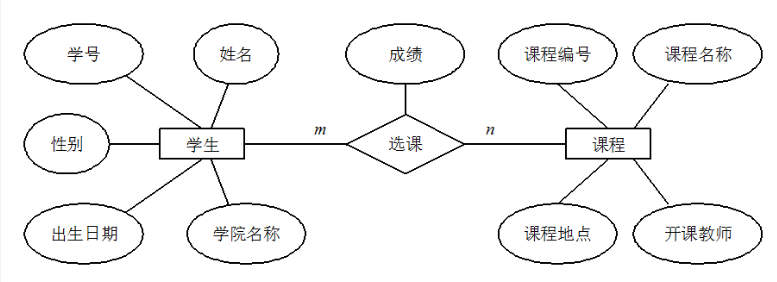
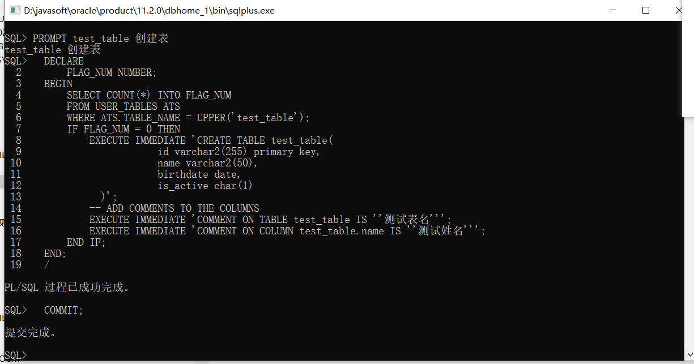

# 数据库
## 一. 基础知识

### 1.1  E-R图

- 全称：实体联系图，提供了表示实体类型、属性和联系的方法

- 主要有三个要素组成

  - 实体：用矩形框表示，通常是现场时间的业务对象。比如学生、课程、班级等实体
  - 属性：用椭圆形表示，即某个实体拥有的属性
  - 联系：用菱形表示，即实体与实体之间的关系

  

  ### 1.2 数据库三大范式

- 第一范式
  - 属性不可再分
- 第二范式
  - 第一范式基础上，消除了非主属性对于码的部分函数依赖
  - 通俗理解：在满足1NF的基础上，2NF要求表必须有主键，并且表中的其他数据（非键字段）必须完全依赖于主键
  - 举例：假如有个图书馆，假设我们记录每本书借出的时间，如果“书籍ID+借书日期”作为一个组合主键，那么其他信息，比如借书人的信息，就应该直接依赖于这个组合主键，而不是仅依赖其中的一部分（比如仅依赖书籍ID）
- 第三范式
  - 三范式在第二范式基础上，消除了非主属性对于码的传递函数依赖
  - 通俗理解：在满足1NF和2NF的基础上，3NF要求数据中不存在非主键字段之间的依赖。这意味着所有的非键信息都只能依赖于键信息，不能相互依赖
  - 举例：比方说，在一个记录了书籍和作者信息的表中，如果“作者国籍”实际上是和“作者名”相关联的，那么“作者国籍”就不应该直接出现在记录书籍的表中，因为这会导致与书籍直接相关的信息之外的冗余

### 1.3 drop、delete、truncate的区别

- drop
  - drop table 表名
  - 直接将表都删掉
- delete
  - delete from 表名 where 列名=值
  - 删除表里面的数据
- truncation
  - truncate table 表名
  - 只删除表中的数据

## 二、MYSQL

mysql知识总结汇总

## 2.1. 常见脚本创建

### 2.1.1 创建表
```sql
create table if not exists `test_table` (
  id bigint(20) unsigned not null auto_increment comment '主键id',
  record_id int  comment '记录id',
  create_time datetime not null default current_timestamp comment '创建时间',
  update_time datetime NOT NULL DEFAULT CURRENT_TIMESTAMP ON UPDATE CURRENT_TIMESTAMP COMMENT '更新时间',
  test_name varchar(255) CHARACTER SET utf8mb4 COLLATE utf8mb4_general_ci not null comment '测试内容', 
  jyaq text CHARACTER SET utf8mb4 COLLATE utf8mb4_general_ci COMMENT '简要案情',

  primary key (id) using btree,
  key idx_test_index (test_name) using btree

) ENGINE = InnoDB CHARACTER SET = utf8mb4 COLLATE = utf8mb4_general_ci COMMENT = '测试表表名称' ROW_FORMAT = Dynamic;

```

### 2.1.2 更新表

### 2.1.3 修改表字段(可以重复执行，线上环境推荐)

- 新增字段
```mysql
drop procedure if exists add_field_test_table;
delimiter $$
create procedure add_field_test_table()
  begin
      if not exists (select 1 from information_schema.columns where table_schema='test' and table_name = 'test_table' and column_name = 'test_name2')
        then
        ALTER TABLE `test_table` add COLUMN `test_name2` varchar(255) DEFAULT NULL COMMENT '测试内容2添加';
        end if ;
  end $$
delimiter ;
call add_field_test_table;
drop procedure if exists add_field_test_table;

```

- 修改字段
  
```mysql
drop procedure if exists modify_field_test_table;
delimiter $$
create procedure modify_field_test_table()
  begin
      if exists (select 1 from information_schema.columns where table_schema='test' and table_name = 'test_table' and column_name = 'test_name2')
        then
        ALTER TABLE `test_table` modify COLUMN `test_name2` varchar(50) DEFAULT NULL COMMENT '测试内容2修改';
        end if ;
  end $$
delimiter ;
call modify_field_test_table;
drop procedure if exists modify_field_test_table;


```

## 2.2 mysql字符集

### 2.2.1 字符集

- 创建统一使用utf8mb4字符集


## 三、ORACLE

## 3.1. 常见脚本创建

### 3.1.1  创建表
- 标准写法
```sql
CREATE TABLE test_table(
  id varchar2(255) primary key,
  name varchar2(50),
  birthdate date,
  is_active char(1)
);

COMMENT ON TABLE test_table IS '测试表名';
COMMENT ON COLUMN test_table.name IS '测试姓名';

```

- 生产环境执行-推荐写法(需要在命令窗口执行)
  ```
    PROMPT test_table 创建表
    DECLARE
        FLAG_NUM NUMBER;
    BEGIN
        SELECT COUNT(*) INTO FLAG_NUM
        FROM USER_TABLES ATS
        WHERE ATS.TABLE_NAME = UPPER('test_table');
        IF FLAG_NUM = 0 THEN
            EXECUTE IMMEDIATE 'CREATE TABLE test_table(
                        id varchar2(255) primary key,
                        name varchar2(50),
                        birthdate date,
                        is_active char(1)
              )';
            -- ADD COMMENTS TO THE COLUMNS
            EXECUTE IMMEDIATE 'COMMENT ON TABLE test_table IS ''测试表名''';
            EXECUTE IMMEDIATE 'COMMENT ON COLUMN test_table.name IS ''测试姓名''';
        END IF;
    END;
    /
    COMMIT;


  ```

  

### 1.2 更新表

- 修改表字段varchar为clob
  ```
  alter table test_table rename column name to name_clob;
  alter table test_table add name clob;
  update test_table set name=trim(name_clob);
  alter table test_table drop column name_clob;
  comment  on  column  test_table.name   is  '测试修改';
  ```
- 表后面新增字段
  ```sql
  alter table test_table
  add (sms_type number(9) default null,
      bkry_id varchar2(255)  default null
  );

  comment  on  column  test_table.sms_type   is  '短信类型';
  comment  on  column  test_table.bkry_id    is  '布控人员id'
  ```

- 修改表字段长度
  ```sql
  
  alter table test_table modify (bkry_id varchar2(50));
  
  ```