# Redis

## Redis知识梳理

## 1. redis 为什么这么快

- redis 基于内存，内存的访问速度是磁盘的上千倍
- redis 基于Reactor模式设计开发了一套高效的事件处理模型，主要是单线程事件循环和io多路复用
- redis 内置了多种优化过后的数据类型/结构实现，性能非常高


## 2. redis的应用

- 分布式锁
  - redisson
- 限流
  - redis + lua脚本的方式实现了限流
- 消息队列
- 缓存
- 复杂业务场景
  - 比如通过bitmap统计活跃用户
  - 通过sorted set维护排行榜


## 3. redis的数据类型

### 1. String(字符串)

- 命令

  - 最常用

    - set key value
    - get key

  - 数值增减

    - 递增数字
      - incr key
    - 增加指定的整数
      - incrby key increment
    - 递减数值
      - decr key
    - 减少指定的整数
      - decrby key decrement

  - 获取字符串长度

    - strlen key

  - 分布式锁

    - setnx key value

    - ```redis
      set key value [EX seconds] [PX milliseconds] [NX][XX]
      
      EX: key在多少秒之后过期
      PX: key在多少毫秒之后过期
      NX: 当key不存在的时候，才创建key，效果等同于setnx
      XX: 当key存在的时候，覆盖key
      
      
      eg:
      set lock order ex 10
      get lock
      ```

      

- 应用场景

  - 缓存

  - 访问数

  - 点赞

    ```redis
    INCR items:1
    ```

    

- 底层实现

  - sds(简单动态字符串)

### 2. List(列表)

- 介绍

  - 一个双端链表的结构，容量大概是40多亿，主要功能有push/pop等，一般用在栈、队列、消息队列等场景

- 常用命令

  - 向列表左边添加元素
    - lpush key value [value...]
  - 向列表右边添加元素
    - rpush key value [value...]
  - 查看列表
    - lrange key start stop
  - 获取列表中元素的个数
    - llen key

   ```redis
   lpush cxlist 1 2 3 4 5
   lrange cxlist 0 9
   llen cxlist
   ```

  

- 应用场景

  - 微信公众号订阅的消息

    ```redis
    我同时关注了人民日报和王者荣耀，假设两个公账号对应的id分别为11，22
    
    只要他们发布了新文章，都会到我的list
    lpush likearticle:cx的id 11 22
    
    查看我自己订阅的全部文章
    lrange likearticle:cx的id 0 9
    
    ```

    

### 3. Set(集合)

- 命令
  - 添加元素
    - sadd key member [member...]
  - 删除元素
    - srem key member[member...]
  - 遍历集合中的所有元素
    - smembers key
  - 判断元素是否在集合中
    - sismember key member
  - 获取集合中的元素总数
    - scard key
  - 从集合中随机弹出一个元素，元素不删除
    - srandmember key [数字]
  - 从集合中随机弹出一个元素，出一个删一个
    - spop key [数字]
  - 集合运算
    - 差集
      - 属于A但不属于B的元素构成的集合
      - SDIFF key [key...]
    - 交集
      - 属于A同时也属于B的共同拥有的元素构成的集合
      - SINTER key [key...]
    - 并集
      - 属于A或者属于B的元素合并后的集合
      - SUNION key [key...]

- 应用场景
  - 网站UV统计
  
  - 文章点赞
  
    ```redis
    1. 新增点赞
    sadd pub:msgid 点赞用户id1 点赞用户id2
    
    2. 取消点赞
    srem pub:msgid 点赞用户id
    
    3.展现所有点赞过的用户
    smembers pub:msgid
    
    4.点赞用户数统计，就是常见的点赞红色数字
    scard pub:msgid
    
    5.判断某个朋友是否对楼主点赞过
    sismember pub:msgid 用户id
    ```
  
    
  
  - 共同好友，好友推荐
  
    ```redis
    好友推荐
    
    sadd s1 1 2 3 4 5
    sadd s2 3 4 5 6 7
    sinter s1 s2
    sdiff s1 s2
    sdiff s2 s1
    ```
  
    
  
  - 抽奖
  
    ```redis
    1.用户id，立即参与按钮
    sadd key 用户id
    
    2.显示已经有多少人参与了
    scard key
    
    3.抽奖
    srandmember key 2 : 随机抽奖2个人，元素不删除
    spop key 3: 随机抽奖3个人，元素会删除
    
    ```
  
    
  
- 使用set实现抽奖系统如何做？
  - sadd key value1 value2 ....
    - 向指定集合添加一个元素
  - spop key count
    - 随机去除一个或多个，不允许重复
  - srandmember key count
    - 随机取出，允许重复

### 4. Hash(散列)

- 结构

  ```redis
  类似Map<String,Map<Object,Object>>
  ```

- 命令
  - 一次设置一个字段值
    - hset key field value
    
  - 一次获取一个字段的值
  
    - hget key field
  
  - 一次设置多个字段值
  
    - hmset key field value [field value...]
  
  - 一次获取多个字段值
  
    - hmget key field [field ...]
  
  - 获取所有字段值
  
    - hgetall key
  
  - 获取某个key内的全部数量
  
    - hlen
  
  - 删除一个key
  
    - hdel
  
    ```redis
    hset cxhash cx1 value1
    
    hget cxhash cx1
    
    hgetall cxhash
    
    hlen cxhash
    ```
  
    
  
- 应用场景

  - 购物车

    ```redis
    增加商品
    hset shopcar:uid:cx 33333 1
    hset shopcar:uid:cx 44444 1
    
    增加商品数量
    hincrby shopcar:uid:cx 44444 1
    
    商品总数
    hlen shopcar:uid:cx 
    
    全部选择
    hgetall shopcar:uid:cx
    ```

    


### 5. Zset(有序集合)

- 命令
  - 添加元素
    - zadd key score member [score member...]
  - 增加某个元素的分数
    - zincrby key increment member
  - 获取元素的排名
    - 从大到小
      - zrevrank key member
    - 从小到大
      - zrank key member
  - 获取有序集合中指定范围内的成员，按照成员的分数从大到小进行排序
    - zrevrange key start stop [withscores]
      -  可选的WITHSCORES参数表示是否同时返回成员的分数

- 应用场景
  - 抖音热搜

```redis
    1.点击视频

    zincrby hotvcr:20240211 1 飞驰人生2
    zincrby hotvct:20240211 15 飞驰人生2 3 熊出没

    2.展示当日排行前10条
    zrevrange hotvcr:20240211 0 9 withscores
```


### 6. HyperLogLog(基数统计)

- 是什么？
  - 去重复统计功能的基数估计算法就是hyperloglog
    - 基数
      - 是一种数据集，去重复后的真实个数
    - 基数统计
      - 用于统计一个集合中不重复的元素个数，就是对集合去重复后剩余元素的计算
  - hyperLogLog是一种概率算法的实现
  
- 原理说明
  - 只是进行不重复的基数统计，不是集合也不保存数据，只记录数量而不是具体内容
  - 有误差
    - 非精准统计
    - 牺牲准确率来换取空间，误差仅仅只是0.81%左右
  
- 基本命令
  - 将所有元素添加到key中
    - pfadd key element ...
  - 统计key的估算值
    - pfcount key
  - 合并key至新key
    - pgmerge new_key key1 key2...

- 应用场景
  - 页面UV统计
  
    ```java
    public void init()
        {
            log.info("------模拟后台有用户点击首页，每个用户来自不同ip地址");
            new Thread(() -> {
                String ip = null;
                for (int i = 1; i <=200; i++) {
                    Random r = new Random();
                    ip = r.nextInt(256) + "." + r.nextInt(256) + "." + r.nextInt(256) + "." + r.nextInt(256);
    
                    Long hll = redisTemplate.opsForHyperLogLog().add("hll", ip);
                    log.info("ip={},该ip地址访问首页的次数={}",ip,hll);
                    //暂停几秒钟线程
                    try { TimeUnit.SECONDS.sleep(3); } catch (InterruptedException e) { e.printStackTrace(); }
                }
            },"t1").start();
        }
    
    ```
  
- 底层实现

  Redis 的 HyperLogLog 数据结构底层实现主要依赖于概率算法，用于估计一个大规模集合中不重复元素的数量（即基数）。以下是 HyperLogLog 的关键实现原理：

  1. **哈希映射**：
     - 当向 HyperLogLog 添加元素时，Redis 首先会对元素进行哈希运算，将元素转化为一个长二进制串。
     - 这个哈希值会根据哈希空间大小被截断，进而映射到一个固定大小的桶（bucket）集合中。

  2. **存储桶结构**：
     - HyperLogLog 内部维护一个固定长度（例如 Redis 中为 16384）的数组，数组中的每个元素代表一个桶，存储一个称为“最大前缀零”的计数（即哈希值对应的二进制串中连续零的最大长度）。

  3. **前缀零计数**：
     - 根据哈希值映射到的桶位置，计算对应的二进制串中最长的连续零的个数，并将这个数字作为桶的计数值存储下来。
     - 桶中存储的计数值越大，表示映射到该桶的元素越多，但哈希碰撞的可能性就越小。

  4. **基数估算**：
     - 利用统计学原理，基于所有桶中存储的最大前缀零计数的分布，HyperLogLog 可以估算出大概率下集合基数的大小。
     - 通过公式转换，可以从这些计数中得出一个近似的基数，尽管这个估计值并非完全准确，但在标准误差范围内（通常为 0.81% 左右），能很好地反映出真实基数。

  5. **内存优化**：
     - 无论 HyperLogLog 存储了多少元素，其内存占用始终固定在 12KB 左右（在 Redis 的实现中），这是因为只需存储每个桶的计数值，无需存储实际的元素值。

  6. **合并操作**：
     - HyperLogLog 支持合并多个相同结构的 HyperLogLog，合并后的 HyperLogLog 能够估计所有输入 HyperLogLog 中元素的总基数。

  通过这样的设计，Redis 中的 HyperLogLog 实现了在有限内存中估算海量数据基数的功能，非常适合于大数据场景下的去重计数需求。

### 7. Bitmap (位图)

- 是什么？

  - 由0和1状态表现的二进制位的bit数据

  - 每一个格子里面只能放1或者0，用它来判断Y/N状态

    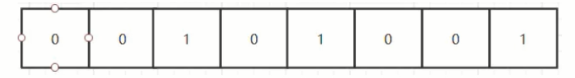

  - 用string类型作为底层数据结构实现的一种统计二值状态的数据类型，本质是数组，它是基于String数据类型的按位的操作。bitmap支持的最大位数是2的32位，极大的节约存储空间，使用512M内存就可以存储42.9亿的字节信息

- 能干嘛？

  - 主要用于状态统计
  - 可以解决下面类似需求
    - 用户是否登录过
    - 打卡上下班，签到统计
    - 日活统计
    - 最近一周的活跃用户

- 基本命令

  - setbit
    - setbit key offset value
      - setbit 键偏移位，只能0或者1
      - **bitmap的偏移量是从零开始算的**
  - getbit 
    - getbit key offset

  - strlen

    - 统计字节数占用多少

  -  bitcount

    - 全部键里面含有1的有多少个

      ```redis
      setbit k2 0 1
      setbit k2 1 1
      setbit k2 15 1
      bitcount k2
      
      输出 3
      ```

      

- 应用场景
  - 统计活跃用户
  
  - 京东签到领取京豆
  
    - 需求说明
      - 签到日历仅展示当月签到数据
        签到日历需展示最近连续签到天数
        假设当前日期是20240211，且20240211未签到
        若20240211已签到且0212未签到，则连续签到天数为1
        若20240211已签到且0612已签到，则连续签到天数为2
        连续签到天数越多，奖励越大
        所有用户均可签到
  
    
  
    - 解决思路
  
      - 传统的数据库存储，对于大量用户肯定是不适合的
      - 一个月最多31天，刚好int类型是32位，那一个int类型就可以搞定一个月
      - 一条数据直接存储一个月的签到记录，不再是存储一天的签到记录
  
    - 具体实现
  
      ```redis
      setbit sign:u1:202402 0 1
      setbit sign:u1:202402 1 1
      setbit sign:u1:202402 2 1
      setbit sign:u1:202402 3 1
      setbit sign:u1:202402 30 1
      
      getbit sign:u1:202402 0
      getbit sign:u1:202402 1
      getbit sign:u1:202402 15
      ```
  
      

### 8. Geospatial (地理位置)

- 命令

  - GEOADD  多个经度(longitude)、纬度(latitude)、位置名称(member)添加到指定的 key 中

    ```redis
    GEOADD city 116.403963 39.915119 "天安门" 116.403414 39.924091 "故宫" 116.024067 40.362639 "长城"
    ```

    

  - GEOPOS  从键里面返回所有给定位置元素的位置（经度和纬度）

    ```redis
    GEOPOS city 天安门 故宫
    ```

    

  - GEODIST 返回两个给定位置之间的距离

    ```redis
    GEODIST city 天安门 长城 km
    ```

    

  - GEORADIUS 以给定的经纬度为中心， 返回与中心的距离不超过给定最大距离的所有位置元素

- 应用案例

  - 美团附近酒店推送

    - 解题思路

      - GEORADIUS: 以给定的经纬度为中心，找出某一半径内的元素

    - 代码实现

      ```java
      @RestController
      public class GeoController
      {
          public  static final String CITY ="city";
      
          @Autowired
          private RedisTemplate redisTemplate;
      
          @RequestMapping("/geoadd")
          public String geoAdd()
          {
              Map<String, Point> map= new HashMap<>();
              map.put("天安门",new Point(116.403963,39.915119));
              map.put("故宫",new Point(116.403414 ,39.924091));
              map.put("长城" ,new Point(116.024067,40.362639));
      
              redisTemplate.opsForGeo().add(CITY,map);
      
              return map.toString();
          }
      
          @GetMapping(value = "/geopos")
          public Point position(String member) {
              //获取经纬度坐标
              List<Point> list= this.redisTemplate.opsForGeo().position(CITY,member);
              return list.get(0);
          }
      
          @GetMapping(value = "/geohash")
          public String hash(String member) {
              //geohash算法生成的base32编码值
              List<String> list= this.redisTemplate.opsForGeo().hash(CITY,member);
              return list.get(0);
          }
      
          @GetMapping(value = "/geodist")
          public Distance distance(String member1, String member2) {
              Distance distance= this.redisTemplate.opsForGeo().distance(CITY,member1,member2, RedisGeoCommands.DistanceUnit.KILOMETERS);
              return distance;
          }
      
          /**
           * 通过经度，纬度查找附近的
           * 北京王府井位置116.418017,39.914402
           */
          @GetMapping(value = "/georadius")
          public GeoResults radiusByxy() {
              //这个坐标是北京王府井位置
              Circle circle = new Circle(116.418017, 39.914402, Metrics.KILOMETERS.getMultiplier());
              //返回50条
              RedisGeoCommands.GeoRadiusCommandArgs args = RedisGeoCommands.GeoRadiusCommandArgs.newGeoRadiusArgs().includeDistance().includeCoordinates().sortAscending().limit(50);
              GeoResults<RedisGeoCommands.GeoLocation<String>> geoResults= this.redisTemplate.opsForGeo().radius(CITY,circle, args);
              return geoResults;
          }
      
          /**
           * 通过地方查找附近
           */
          @GetMapping(value = "/georadiusByMember")
          public GeoResults radiusByMember() {
              String member="天安门";
              //返回50条
              RedisGeoCommands.GeoRadiusCommandArgs args = RedisGeoCommands.GeoRadiusCommandArgs.newGeoRadiusArgs().includeDistance().includeCoordinates().sortAscending().limit(50);
              //半径10公里内
              Distance distance=new Distance(10, Metrics.KILOMETERS);
              GeoResults<RedisGeoCommands.GeoLocation<String>> geoResults= this.redisTemplate.opsForGeo().radius(CITY,member, distance,args);
              return geoResults;
          }
      }
      
      ```

      

## 4.  redis 如何判断数据是否过期？

### 1. 立刻删除

- 对cpu不友好，拿时间换空间

### 2. 惰性删除

- 只会在取出key的时候才对数据进行过期简称

### 3. 定期删除

- 每隔一段时间抽取一批key执行删除过期key操作

### 4. 总结

- redis采用定期删除+惰性/懒汉式删除
- 如果上面都没被删除到，有漏网之鱼，必须要有个兜底的方案，就是redis缓存淘汰策略


## 5. redis 内存淘汰机制了解么？

### 1. redis默认内存多少？在哪查看？如何设置修改？

- 查看redis最大内存
  - 打开redis配置文件，设置maxmemory参数，maxmemory是bytes字节类型，注意转换。
- redis默认内存多少可以用
  - 如果不设置最大内存大小或者设置最大内存大小为0，在64位操作系统下不限制内存大小
- 生产环境如何配置？
  - 一般推荐Redis设置内存为最大物理内存的四分之三
- 如何修改redis内存设置
  - 命令修改
    - config set maxmemory 104857600
    - config get maxmemory
  - 配置文件修改
- 如何查看redis内存情况
  - info memory

### 2. redis 缓存淘汰策略

- noeviction
  - 不会驱逐任何key
- allkeys-lru（最近最少使用）
  - 对所有key使用lru算法进行删除
- volatile-lru
  - 对所有设置了过期时间的key使用lru算法进行删除
- allkeys-random
  - 对所有key随机删除
- volatile-random
  - 对所有设置了过期时间的key随机删除
- volatile-ttl
  - 删除马上要过期的key
- allkeys-lfu
  - 对所有key使用lfu算法进行删除
- volatile-lfu
  - 对所有设置了过期时间的key使用lfu算法进行删除

总结

- 2个维度
  - 过期键在筛选
  - 所有键中筛选
- 4个方面
  - lru：最近最少使用
  - lfu： 最近最不经常使用
  - random
  - ttl


## 6. 布隆过滤器

- 是什么？

  - **由一个初值都为0的bit数组和多个哈希函数构成，主要用于判断一个元素是否在集合中**
  - 本质就是判断具体数据存不存在一个大的集合中
  - 布隆过滤器是一种类似set的数据结构，只是统计结果不太准确

- 特点

  - 高效地插入和查询
  - **一个元素如果判断结果为存在的时候元素不一定存在，但是判断结果为不存在的时候则一定不存在**
  - 布隆过滤器可以添加元素，但是不能删除元素，删除会导致误判率增加
  - 误判只会发生在过滤器没有添加过的元素，对于添加过的元素不会发生误判
  - 结论备注
    - 有，是可能有
    - 无，是肯定无
      - 可以保证的是，如果布隆过滤器判断一个元素不在一个集合中，那这个元素一定不会在集合中

- 原理

  - 初始化

    - 布隆过滤器本质上是由长度为m的位向量或位列表（仅包含0或1位值的列表）组成，最初所有的值均设置为0

       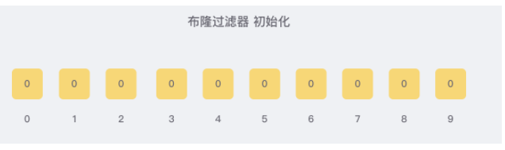

  - 添加

    - 向布隆过滤器添加数据时，为了尽量地址不冲突，**会使用多个hash函数对key进行运算，得到一个下标索引值**，然后对位数组长度进行取模运算得到一个位置，每个hash函数都会算得一个不同的位置，再把位数组的这几个位置都置为1就完成了add操作

      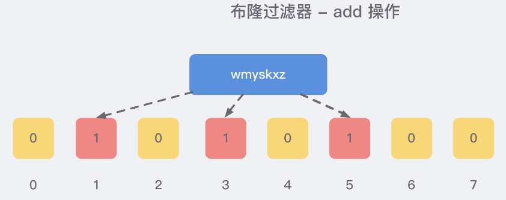

  - 判断是否存在

    - 查询某个key是否存在时，先把这个key通过相同的多个hash函数进行运算，查看对应的位置是否都为1，只要有一个位是0，就证明key不存在；如果这几个位置全都是1，说明极有可能存在的，**因为这些1可能是因为其他的key存在导致的，也就是hash冲突**

- 优缺点

  - 优点
    - 高效地插入和查询，占用空间少
  - 缺点
    - 不能删除元素
    - 存在误判：不同的数据可能出现相同的hash值

- 使用场景

  - 解决缓存穿透问题
  - 黑名单校验

- 扩展

  - 布谷鸟过滤器
    - 解决布隆过滤器不能删除元素的问题

- 代码实现

  - 使用guava库中的BloomFilter类（只能单机使用）

    ```java
    public static void main(String[] args) {
            BloomFilter<String> bloomFilter = BloomFilter.create(
                    Funnels.stringFunnel(),
                    1000,
                    0.01);
    
            bloomFilter.put("apple");
            bloomFilter.put("banana");
    
            System.out.println(bloomFilter.mightContain("apple"));  // true
            System.out.println(bloomFilter.mightContain("orange")); // false
        }
    ```

    

## 7. 缓存雪崩+缓存击穿+缓存穿透

### 1. 缓存雪崩

- 发生
  
  - 大批缓存同时到期
    - 比如多个缓存数据设置了相同的过期时间，在同一时刻失效
  
  - redis主机挂了，redis全盘崩溃
  
- 解决
  
  - 分散过期时间
  
  - redis缓存集群实现高可用
    - 主从+哨兵

### 2. 缓存穿透

- 是什么？
  - 查询一条记录，先redis后数据库都查询不到该条记录，但是请求每次都会打到数据库上面去，导致后台数据库压力暴增，redis成为了一个摆设
- 解决
  - 1. 空对象缓存
  - 2. 布隆过滤器


### 3. 缓存击穿

- 是什么？

  - 大量的请求同时查询一个key时，key正好失效了，导致大量的请求打到数据库上面去

  - 简单来说就是key突然失效了，暴打mysql

- 解决

  - 方案一：互斥更新、随机退避、差异失效时间

    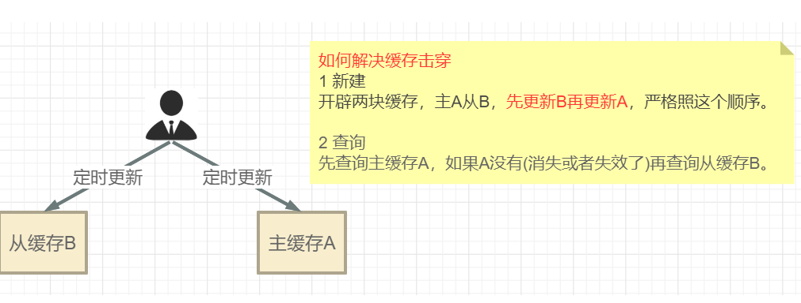

  - 方案二：对于频繁的热点key，不设置过期时间

  - 方案三：互斥独占锁防止击穿

    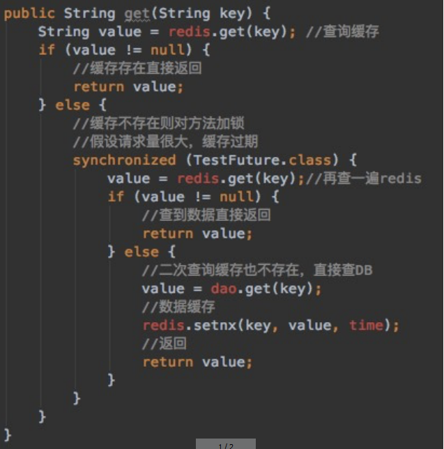


## 8. redis分布锁

### 1. 一个靠谱的分布锁锁需要具备的条件和刚需

- 独占性
  - 任何时刻只能有且仅有一个线程持有
- 高可用
  - 不能因为某一个节点挂了而出现获取锁和释放锁失败的情况
- 防死锁
  - 杜绝死锁，必须有超时机制或者撤销操作，有个兜底终止跳出方案
- 不乱抢
  - 防止张冠李戴，不能私下unlock别人的锁，只能自己加锁自己释放
- 重入性
  - 同一个节点的同一个线程如果获得锁之后，它也可用再次获取这个锁

### 2. 为啥要上分布锁？

- synchronized，单机版ok,上分布式
- nginx分布式微服务，单机锁不行
- 取消单机锁，上redis分布式锁setnx
- setnx只加了锁，没有释放锁，出异常的话，可能无法释放锁，必须要在代码层面finally释放锁

- 假设宕机了，代码没有走到finally这块，没办法保证解锁，这个key没有被删除，需要设置key的过期时间

- 为redis的分布锁锁key,增加过期时间，必须要setnx+过期时间在同一行（保证具备原子性）

  ```java
  Boolean flagLock = stringRedisTemplate.opsForValue().setIfAbsent(key,value,10L,TimeUnit.SECONDS);
  
  ```

- 必须规定只能自己删除自己的锁，你不能把别人的锁删除了，防止张冠李戴

- redis集群环境下，我们自己写的也不ok, 直接上redisson

### 3. redisson使用场景

- 多个服务间保证同一时刻同一时间段内同一用户只能有一个请求

### 4. redisson的看门狗缓存续命了解么？

问题：redis分布锁锁过期了，但是业务逻辑还没处理完怎么办？

- 答：守护线程续命

  - 额外起一个线程，定期检查线程是否还持有锁，如果有则延长过期时间
  - redisson里面使用"看门狗"定期检查（**每1/3的锁时间检查一次**），如果线程还持有锁，则刷新过期时间
  - 上面有bug，**受系统时钟影响**

- 通过redisson新建出来的锁key，**默认是30秒**

  ```java
  Config.java 中
  private long lockWatchdogTimeout = 30 * 1000;
  
  可以通过修改Config.lockWatchdogTimeout来另行指定
  ```

- **初始化了一个定时器，dely 的时间是 internalLockLeaseTime/3。**
  **在 Redisson 中，internalLockLeaseTime 是 30s，也就是每隔 10s 续期一次，每次 30s**

- 标准没有bug写法

  ```java
  RLock redissonLock = redisson.getLock(REDIS_LOCK_KEY);
          redissonLock.lock();
  try{
      
  }finally{
      if(redissonLock.isLocked() && redissonLock.isHeldByCurrentThread())
              {
                  redissonLock.unlock();
              }
  
  }
  ```

  

## 9. 数据双写一致性问题

### 1. 缓存双写一致性，谈谈你的理解？

- 如果redis中有数据- 需要和数据库中的值相同
- 如果redis中无数据-数据库中的值要是最新的值

### 2. 缓存操作分类

- 只读缓存
- 读写缓存
  - 同步直写策略：写缓存时也同步写数据库，缓存和数据库中的数据一致
  - 对于读写缓存来说，要想保证缓存和数据库中的数据一致，就要采用同步直写策略

### 3 .缓存一致性几种更新策略

- 目的：保证最终一致性
  - 给缓存设置过期时间，是保证最终一致性的解决方案

#### 1. 先更新数据库，在更新缓存

- 假设在更新redis缓存出现了异常，导致更新失败，会导致两边数据不一致，读到脏数据

#### 2.先删除缓存，再更新数据库

- 如果A线程正在更新数据库或更新数据库失败，此时B线程请求再次访问缓存时，发现redis里面没数据，缓存缺少，再次读取mysql时，**从数据库读取到的还是旧值**，将旧值写入了缓存
- 解决方案
  - 使用互斥锁
    - 多个线程同时去查询数据库的这条数据，那么我们可以在第一个查询数据的请求上使用一个 互斥锁来锁住它。
      其他的线程走到这一步拿不到锁就等着，等第一个线程查询到了数据，然后做缓存
  - 采用延时双删策略
    - 在第一次删除缓存值后，延迟一段时间再次进行删除
    - 这个延迟时间怎么确定呢？
      - 在业务程序运行的时候，统计下线程读数据和写缓存的操作时间，自行评估自己的项目的读数据业务逻辑的耗时，
        以此为基础来进行估算。然后写数据的休眠时间则在读数据业务逻辑的耗时基础上加百毫秒即可
      - 这么做的目的，就是确保读请求结束，写请求可以删除读请求造成的缓存脏数据
    - 性能下降怎么办？
      - 第二次删除可以作为异步，自己启一个线程，异步删除


#### 3.**先更新数据库，再删除缓存（推荐）**

- 异常问题
  - 假如缓存删除失败或者来不及，导致请求再次访问redis时缓存命中，读取到的是缓存旧值

- 解决方案

  - 可以把要删除或者要更新的值暂存消息队列中
  - 当程序没有成功删除或更新时，可以从消息队列中重新读取，然后再次进行删除或更新

  - 如果成功删除或更新，从消息队列去除
  - 如果重试一定次数没有成功，发送报警信息给运维人员

- 推荐理由

  - 先删除缓存值再更新数据库，有可能导致请求因缓存缺失而访问数据库，给数据库带来压力，严重导致打满mysql
  - 如果业务应用中读取数据库和写缓存的时间不好估算，那么，延迟双删中的等待时间就不好设置


## 10 . redis经典五种数据类型底层实现

### 1. 查看类型和编码命令

- 查看类型
  - type 键
- 查看编码
  - object encoding hello
- debug结构
  - debug object person


### 2. String底层结构

- 3大编码格式

  - int
    - 保存long型的64位有符合整数
    - 只有整数才会使用int

  - embstr
    - 代表embstr格式的sds(简单动态字符串)，保存长度小于44字节的字符串
    - embstr: embedded string,表示嵌入式的String
  - raw
    - 保存长度大于44字节的字符串

- 案例测试

  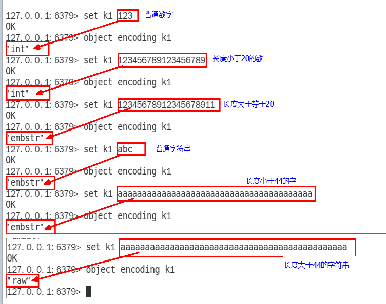

- SDS

  - 简单动态字符串

  - 包含

    - int len
      - 已用的字节长度
    - int alloc
      - 字符串最大字节长度
    - char flags
      - 用来表示sds的类型
    - char buf[]
      - 真正有效的字符串数据，长度由alloc控制

    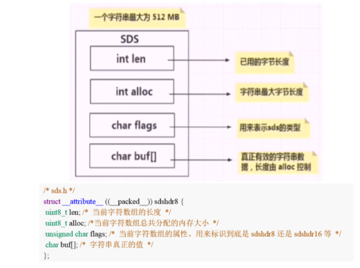

- redis为什么要重新设计一个sds数据结构？

  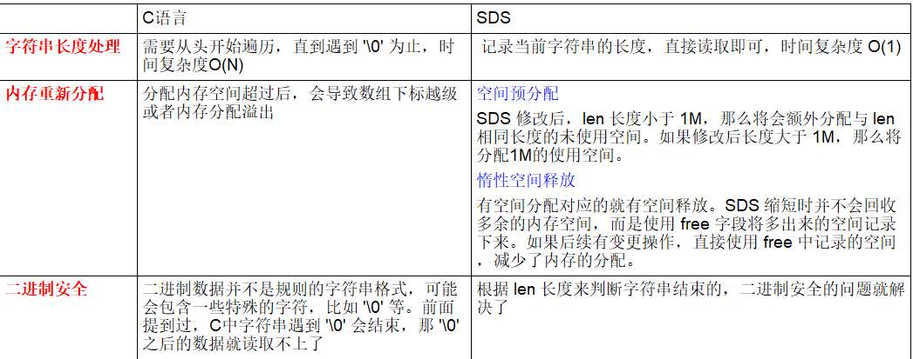

- 总结
  - Redis内部会根据用户给的不同键值而使用不同的编码格式，自适应地选择较优化的内部编码格式，而这一切对用户完全透明!

### 3. hash底层结构

- 两种编码格式

  - ziplist
  - hashtable

- 结构

  - hash-max-ziplist-entries
    - 使用压缩列表保存时哈希表集合中的最大元素个数(默认512)
  - hash-max-ziplist-value
    - 使用压缩列表保存时哈希集合中单个元素的最大长度(默认64)

  - 查看上述命令
    - config get hash*
    - config set hash-max-ziplist-entries 3
    - config set hash-max-ziplist-value 8

- 结论

  - 哈希对象保存的键值对数量小于 512 个
  - 所有的键值对的健和值的字符串长度都小于等于 64byte（一个英文字母一个字节） 时用ziplist，反之用hashtable
  - ziplist升级到hashtable可以，反过来降级不可以

- ziplist

  - ziplist是一个经过特殊编码的双向链表，**它不存储指向上一个链表节点和指向下一个链表节点的指针，而是存储上一个节点长度和当前长度**

    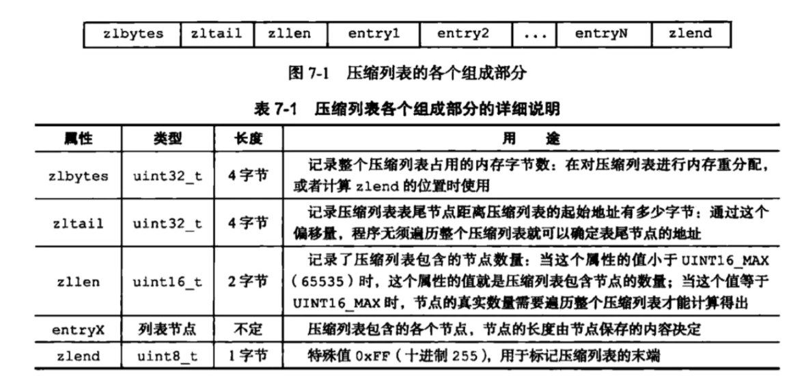

  - 已经有链表了，为什么出来一个压缩链表？
    - 普通的双向链表会有两个指针，在存储数据很小的情况下，我们存储的实际数据的大小可能还没有指针占用的内存大，得不偿失
    - 链表在内存中一般是不连续的，遍历相对比较慢
    - 压缩链表获取链表长度时不用再遍历整个链表，直接拿到len值就可以了，这个时间复杂度是 O(1)


### 4. list底层结构

- 命令

  - config get list*

  - list-max-ziplist-size

    - ziplist在entry配置

    - 默认为-2，当取负值的时候，表示按照占用字节数来限定每个quicklist节点上的ziplist的长度
    - -2: 每个quicklist节点上的ziplist大小不能超过8 Kb。（-2是Redis给出的默认值）

  - list-compress-depth

    - ziplist压缩配置
    - 表示一个quicklist两端不被压缩的节点个数，节点指的是quicklist双向链表的节点
    - 默认值是0,表示都不压缩

- 编码格式

  - quicklist

    - 是ziplist和linkedlist的结合体

      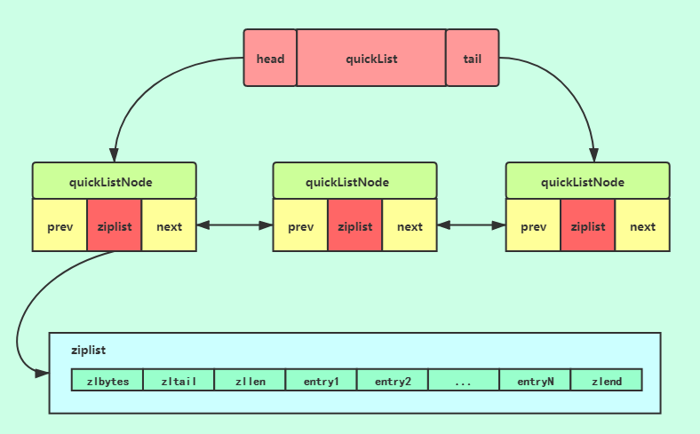


### 5. Set底层结构

- 编码格式
  - intset
    - 存储的元素都是整数类型
  - hashtable
    - 不是整数类型，就用hashtable
- 命令
  - config get set*

### 6. ZSet底层结构

- 编码格式
  - ziplist
  - skiplist
- 命令
  - config get zset*
  - zset_max_ziplist_entries(默认128)
  - zset_max_ziplist_value(默认值是64)
- 结论
  - 大于上面两个默认值时会使用跳表
  - 否则使用ziplist


### 7. 跳表

- 是什么？
  - 跳表=链表+多级索引
  - 跳表是可以实现二分查找的有序链表（由于链表无法进行二分查找，借用数据库索引思想，提取出链表中关键节点当索引，先在关键节点上查找，再进入下层链表查找）
- 为啥使用跳表而不使用B+树呢？
  - 跳表插入新元素时，只需修改几个指针就能完成，而B+树插入新节点可能导致节点分裂
  - 跳表支持高效的范围查询
  - 跳表的实现相对B+树更为简单，因为它没有节点分裂、合并等复杂操作，也不需要强制保持严格的平衡
  - 跳表的高度是动态调整的，可以根据数据规模的变化自动调整索引层次，以保持较高的查询效率


## 11. redis 持久化

### 1. 持久化方式

- RDB(快照 snapshotting)
- AOF(只追加文件，append-only file)
- RDB和AOF的混合持久化(4.0版本后新增)


  RDB是redis默认采用的持久化方式，在redis.conf配置文件中默认有此下配置

```text
save 900 1           #在900秒(15分钟)之后，如果至少有1个key发生变化，Redis就会自动触发bgsave命令创建快照。

save 300 10          #在300秒(5分钟)之后，如果至少有10个key发生变化，Redis就会自动触发bgsave命令创建快照。

save 60 10000        #在60秒(1分钟)之后，如果至少有10000个key发生变化，Redis就会自动触发bgsave命令创建快照。

```

### 2. RDB创建快照时会阻塞主线程吗？

redis提供了两个命令来生成RDB快照文件

- save
  - 同步保存操作，会阻塞redis主线程
- bgsave
  - fork出一个子线程，子线程执行，不会阻塞redis主线程，默认选项

### 3 . AOF持久化

- 什么是aof持久化

  - aof持久化的实时性更好，redis6.0以后默认开启

    ```redis
    appendonly yes
    ```

  - 开启aof持久化后每执行一条会更改redis中的数据的命令，redis就会将该命令写入aof缓存区，然后再写入文件中，最后再根据持久化方式（fsync策略）的配置来决定何时将系统内核缓存区的数据同步到硬盘中的

- 持久化方式
  - appendfsync always
  - appendfsync everysec(兼顾数据和写入性能，推荐)
  - appendsync no

### 4 . 如何选择RDB 和AOF?

- 如果redis保存的数据丢失一些也没有什么影响的化，可以选择使用rdb
- 不建议单独使用aof
- 如果保存的数据要求安全性比较高的话，建议同时开启RDB和AOF持久化或者开启RDB和AOF混合持久化

## 12. redis的I/O多路复用模型

### 1. 是什么？

- I/O: 网络I/O
- 多路：多个客户端连接（连接就是套接字描述符，即socket或者channel）
- 复用：复用一个或几个线程。也就是说一个或一组线程处理多个TCP连接，使用单进程就能实现同时处理多个客户端的连接
- 一句话：一个服务端进程可以同时处理多个套接字描述符；其发展可以分select->poll->epoll三个阶段来描述的


### 2. 概念

- 同步
  - 调用者要一直等待调用结果的通知后才能进行后续的执行，现在就要，我可以等，等出结果为止
- 异步
  - 指被调用方先返回应答让调用者先回去，然后再计算调用结果，计算完最终结果后再通知并返回给调用方
  - 异步调用要想获得结果一般通过回调
- 同步与异步的理解
  - 同步、异步的讨论对象是被调用者（服务提供者），重点在于获得调用结果的消息通知方式上
- 阻塞
  - 调用方一直在等待而且别的事情什么都不做，当前进/线程会被挂起，啥都不干
- 非阻塞
  - 调用在发出去后，调用方先去忙别的事情，不会阻塞当前进/线程，而会立即返回
- 阻塞与非阻塞的理解
  - 阻塞、非阻塞的讨论对象是调用者（服务请求者），重点在于等消息时候的行为，调用者是否能干其它事


### 3. I/O多路复用

- redis利用epoll来实现IO多路复用，将连接信息和事件放在队列中，依次放到文件事件分派器，事件分派器将事件分发给事件处理器
- 所谓 I/O 多路复用机制，就是说通过一种机制，可以监视多个描述符，一旦某个描述符就绪（一般是读就绪或写就绪），能够通知程序进行相应的读写操作。这种机制的使用需要 select 、 poll 、 epoll 来配合。多个连接共用一个阻塞对象，应用程序只需要在一个阻塞对象上等待，无需阻塞等待所有连接。当某条连接有新的数据可以处理时，操作系统通知应用程序，线程从阻塞状态返回，开始进行业务处理


### 4. select

- select方式，既做到了一个线程处理多个客户端连接（文件描述符），又减少了系统调用的开销（多个文件描述符只有一次 select 的系统调用 + N次就绪状态的文件描述符的 read 系统调用


### 5. poll

- poll使用pollfd数组来代替select中的bitmap，数组没有1024的限制，可以一次管理更多的client。它和 select 的主要区别就是，去掉了 select 只能监听 1024 个文件描述符的限制
- 当pollfds数组中有事件发生，相应的revents置位为1，遍历的时候又置位回零，实现了pollfd数组的重用
- 问题
  - poll 解决了select缺点中的前两条，其本质原理还是select的方法，还存在select中原来的问题
    - pollfds数组拷贝到了内核态，仍然有开销
    - poll并没有通知用户态哪一个socket有数据，仍然需要O(n)的遍历

### 6. epoll

- 三步调用
  - epoll_create
    - 创建一个epoll句柄
  - epoll_ctl
    - 像内核添加、修改或删除要监控的文件描述符
  - epoll_wait
    - 类似发起select()调用
- 结论
  - epoll是现在最先进的IO多路复用器，Redis、Nginx，linux中的Java NIO都使用的是epoll
  - 这里“多路”指的是多个网络连接，“复用”指的是复用同一个线程

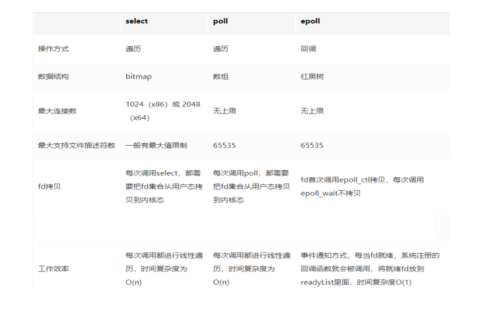

## 13. redis集群

### 1. redis 哨兵

- Redis Sentinel 简称 redis哨兵

- 什么是redis sentinel? 有什么用

  - Redis Sentinel是一个用于监控和管理Redis实例的工具。它可以自动发现Redis实例并监控它们的健康状况，一旦发现实例出现故障，它可以自动进行故障转移，将客户端流量引导到备用实例上，从而确保Redis服务的高可用性。

    Redis Sentinel还可以进行故障恢复、配置管理和通知等功能，使得Redis集群的管理更加简单和可靠

- redis sentinel 如何选择出新的master？

  - 监测：哨兵会不断地监听所有的redis实例，并收集关于它们健康状态的信息，包括主从关系，延迟等
  - 判断故障：当哨兵检测到主节点故障时，它会通过与其他哨兵节点进行投票来确认主节点是否真的故障
  - 选举：如果多个哨兵节点一致认为主节点故障，它们将会进行选举，选择出一个新的主节点
  - 故障转移：一旦新的主节点被选出，哨兵会通知客户端和其他redis实例，将流量引导到新的主节点
  - 在进行主节点选择时，Sentinel会考虑实例的健康状况、优先级、配置等因素，以选择最适合的实例作为新的主节点。这样可以确保新的主节点能够提供高性能和高可用性的服务。

- redis sentinel 可以防止脑裂么？

  - 脑裂
    - redis脑裂是指在redis集群中, 由于网络分区或故障，导致主节点和从节点之间出现数据不一致的情况
  - redis 脑裂可以通过哨兵来避免，但是不保证100%能解决

### 2. redis集群

- redis cluster的哈希槽为啥是16384个？

  - 16384 = 2的14次方，如果槽位是65536个，发送心跳信息的消息头是65536/8/1024 = 8k；如果槽位是16384个，发送心跳信息的消息头是16384/8/1024 = 2k。因为redis每秒都会发送一定数量的心跳包，如果消息头是8k,未免有些太大了，浪费网络资源

  - 其次redis集群的主节点一般都不会超过1000个，对于节点在1000个以内的redis集群，16384个槽位完全够用
  - 槽位越小，节点少的情况下，压缩比高，容易传输。redis主节点的配置信息中它所负责的哈希槽是通过一张bitmap的形式来保存的，在传输过程中会进行bitmap压缩，bitmap 填充率 = slots /N (N表示节点数)，也就是说slots越小，填充率就会越小，压缩率就会越高，传输效率就会越高
  - 补充
    - redis集群并没有使用一致性hash而是引入了哈希槽的概念，每个key通过crc16校验后对16384取模来决定放置哪个槽，CRC16实际有16bit，可以产生2的16次方=65536个

## 14. redis的大key

### 1. 排查大key

- 命令
  - bigkeys

### 2. 处理方法

1. 数据结构重新设计，将大key拆分为多个小key
2. 大key的数据迁移到数据库
3. 读取大key可以采用分页或流式读取的方法，逐步消费数据


## 15. redis事物

### 1. redis事物支持原子性吗

- 支持，Redis使用MULTI、EXEC、WATCH等命令来实现事务，当调用EXEC命令执行事务时，Redis会保证事务块内的命令序列是原子地被执行，中间不会被其他命令插队

### 2. redis事物有什么缺陷

- 不支持事物回滚
- WATCH命令用于实现CAS（Compare and Swap）操作，它可以监视一个或多个键，如果在EXEC命令执行前，被监视的键发生了变化，则整个事务会取消执行。但是，WATCH是乐观锁机制，不能保证在高并发场景下一定能成功锁定资源
- Redis在事务执行阶段（EXEC命令前）不会对命令进行语法校验，只有真正执行时才会发现错误。这在一定程度上降低了开发调试阶段的便利性


### 3. 解决方案？

- 事前检查
- **使用WATCH命令**： 对于需要依赖外部条件的事务，可以通过WATCH命令配合MULTI/EXEC来实现有条件的操作，确保在事务执行前数据未发生变化
- 手动补救措施
- 在事物执行失败后，编写相应的补救逻辑
- 设计事物时考虑幂等性

