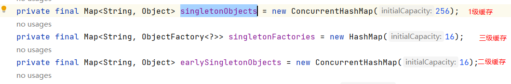

# Spring+SpringBoot

## 1. Sping Ioc

### 1. 谈谈你对spring ioc的理解？

- ioc
  - 控制反转（Inversion of Control）
  - IOC是一种设计思想，就是将原本在程序中手动创建对象的控制权，交给spring框架来管理
  - 控制
    - 指的是对象创建的权力
  - 反转
    - 控制权交给外部环境（Spring 框架，IOC容器）
  - 将对象之间的相互依赖关系交给ioc容器来管理，并由ioc容器完成对象的注入

### 2. Spring Bean

- 是指被IOC容器所管理的对象
- 通过xml或注解配置


### 3. 将一个类声明Bean的注解有哪些？

- @Component
- @Repository
- @Service
- @Controller


### 4. 注入Bean的注解有哪些？

- @Autowired
- @Resource
- @Inject

### 5. @Autowired和@Resource的区别是什么？

- @Autowired 是spring提供的注解，@Resource是jdk提供的注解
- **@Autowired默认的注入方式为byType(根据类型进行匹配)，@Resource默认注入方式为byName(根据名称进行匹配)**
- 当一个接口存在多个实现类的情况下，`@Autowired` 和`@Resource`都需要通过名称才能正确匹配到对应的 Bean。`Autowired` 可以通过 `@Qualifier` 注解来显式指定名称，`@Resource`可以通过 `name` 属性来显式指定名称
- `@Autowired` 支持在构造函数、方法、字段和参数上使用。`@Resource` 主要用于字段和方法上的注入，不支持在构造函数或参数上使用


### 5. Bean的作用域有哪些？

- singleton
  - 只存在一个实例
- prototype
  - 每次对该bean的请求都会创建一个新的实例
- request
  - 每个http请求都会创建一个新的实例，该实例仅在当前http请求内有效
- session
  - 每个http会话都会创建一个新的实例，该实例仅在当前会话内有效
- global session
  - 该实例仅在当前全局会话内有效
- application
  - 每个servletContext都会创建一个新的实例，该实例在整个web应用中有效
- websocket
  - 在当前websocket会话内有效


- 如何配置bean的作用域呢？

  - xml方式

    ```xml
    <bean id="..." class="..." scope="singleton"></bean>
    ```

  - 注解

    ```java
    @Bean
    @Scope(value = ConfigurableBeanFactory.SCOPE_PROTOTYPE)
    public Person personPrototype() {
        return new Person();
    }
    
    ```


### 6. Bean的生命周期了解么？

Spring框架中的bean生命周期包括以下几个阶段：

1. 实例化（Instantiation）：当Spring容器启动时，会根据配置文件或注解来实例化bean对象。
   - 通俗理解
     - 内存中申请一块内存空间
     - 租赁好房子，自己的家具东西还没搬家进去
2. 属性设置（Population）：在实例化之后，Spring容器会通过依赖注入或者调用setter方法来设置bean的属性。
3. 初始化（Initialization）：在属性设置完成后，Spring容器会调用bean的初始化方法（可以通过@PostConstruct注解或实现InitializingBean接口来定义初始化方法）。
   - 通俗理解
     - 完成属性的各种赋值
     - 装修、家电家具进场
4. 使用（In Use）：此时bean已经初始化完成，可以被其他bean或组件使用。
5. 销毁（Destruction）：当Spring容器关闭时，会调用bean的销毁方法（可以通过@PreDestroy注解或实现DisposableBean接口来定义销毁方法）。

通过实现InitializingBean和DisposableBean接口、使用@PostConstruct和@PreDestroy注解、配置init-method和destroy-method属性等方式，可以对bean的初始化和销毁过程进行定制化操作。


## 2. Spring Aop

### 1. 谈谈你对aop的理解？

- aop

  - aspect-oriented programming: 面向切面编程
  - 能够将与业务无关，却为业务模块所共同调用的逻辑（如事务处理、日志管理、权限控制）封装起来，便于减少系统的重复代码，降低模块间的耦合度

  - spring aop 是基于动态代理的，如果要代理的对象，实现了某个接口，那么spring aop就会使用jdk proxy, 去创建对象，而对于没有实现接口的对象，spring会使用cglib生成一个被代理对象的子类来作为代理
  - spring aop 的实现主要依赖于代理模式和反射模式

- 补充：jdk动态代理和cglib代理

  - jdk动态代理
    - 目标类和代理类要实现相同的接口
    - jdk的动态代理主要涉及java.lang.reflect包中的两个类：Proxy和InvocationHandler。其中InvocationHandler是一个接口，可以通过实现该接口定义横切逻辑；而Proxy为InvocationHandler实现类动态创建一个符合某一接口的代理实例
    - jdk动态代理是利用反射机制生成一个实现代理接口的匿名类，在调用具体方法前调用InvokeHandler来处理
  - cglib代理
    - 代理类是目标类的子类，依赖cglib.jar
    - cglib动态代理是利用asm开源包，对代理对象类的class文件加载进来，通过修改其字节码生成子类来处理

## 3. Spring MVC

### 1. spring mvc的核心组件

- dispatcherServlet: 核心的中央处理器，负责接收请求、分发
- handlerMapping: 处理器映射器，根据url去匹配查找能处理的handler，并会将请求涉及到的拦截器和handler一起封装’
- hadlerAdapter: 处理器适配器，根据HandlerMapping 找到的Handler,适配执行对应的Handler
- Handler: 请求处理器，处理实际请求的处理器
- ViewResolver: 视图解析器


### 2. Spring Mvc的原理？

Spring MVC是Spring框架中用于构建Web应用程序的一部分，它基于MVC（Model-View-Controller）设计模式，用于处理Web请求和响应。下面是Spring MVC的工作原理：

1. 客户端发送请求：客户端（通常是浏览器）发送HTTP请求到Web服务器。

2. DispatcherServlet接收请求：在Spring MVC中，所有的请求都会先经过DispatcherServlet，它充当前端控制器的角色。DispatcherServlet接收到请求后，会根据配置找到合适的处理器（Handler）来处理请求。

3. 处理器映射器（Handler Mapping）：处理器映射器负责将请求映射到相应的处理器（Controller）。它会根据请求的URL和其他条件找到合适的处理器来处理请求。

4. 执行处理器（Controller）：一旦找到了合适的处理器，DispatcherServlet会将请求转发给该处理器。处理器执行业务逻辑，可能会调用业务逻辑组件来处理请求，并返回一个ModelAndView对象，其中包含了处理结果和视图名称。

5. 视图解析器（View Resolver）：视图解析器负责将逻辑视图名称解析为实际的视图对象。它会根据视图名称找到对应的视图对象，通常是一个JSP、Thymeleaf、Freemarker等模板文件。

6. 渲染视图：一旦找到了视图对象，DispatcherServlet会将模型数据传递给视图对象，视图对象会将模型数据渲染为最终的HTML页面。

7. 响应客户端：渲染完视图后，DispatcherServlet将响应返回给客户端，完成一次请求-响应周期。

Spring MVC的核心是DispatcherServlet，它协调整个请求处理流程，通过处理器映射器、处理器适配器、视图解析器等组件来实现请求的分发和处理。通过这种方式，Spring MVC能够将业务逻辑和视图展示分离，使得Web应用程序的开发更加模块化和灵活。


### 3. 统一异常处理怎么做？

使用注解

- @ControllerAdvice + @ExceptionHandler

  ```java
  @ControllerAdvice
  @ResponseBody
  public class GlobalExceptionHandler {
  
      @ExceptionHandler(BaseException.class)
      public ResponseEntity<?> handleAppException(BaseException ex, HttpServletRequest request) {
        //......
      }
  
      @ExceptionHandler(value = ResourceNotFoundException.class)
      public ResponseEntity<ErrorReponse> handleResourceNotFoundException(ResourceNotFoundException ex, HttpServletRequest request) {
        //......
      }
  }
  
  ```

  

## 4. Spring 事务

### 1. spring事务的传播行为

1. REQUIRED（默认）：如果当前存在事务，则加入该事务；如果当前没有事务，则创建一个新的事务。
2. SUPPORTS：如果当前存在事务，则加入该事务；如果当前没有事务，则以非事务的方式执行。
3. MANDATORY：如果当前存在事务，则加入该事务；如果当前没有事务，则抛出异常。
4. REQUIRES_NEW：创建一个新的事务，如果当前存在事务，则将当前事务挂起。
5. NOT_SUPPORTED：以非事务方式执行操作，如果当前存在事务，则将当前事务挂起。
6. NEVER：以非事务方式执行操作，如果当前存在事务，则抛出异常。
7. NESTED：如果当前存在事务，则在嵌套事务内执行；如果当前没有事务，则创建一个新的事务。


### 2. spring的事务隔离级别

1. DEFAULT：使用数据库默认的隔禅级别，通常为数据库的默认隔离级别。

2. READ_UNCOMMITTED：允许一个事务读取另一个事务未提交的数据修改，会导致脏读、不可重复读和幻读的问题。

3. READ_COMMITTED：一个事务只能读取另一个事务已经提交的数据，可以避免脏读，但可能会出现不可重复读和幻读的问题。

4. REPEATABLE_READ：确保在事务执行期间多次读取相同数据时，会得到相同的结果，可以避免脏读和不可重复读，但仍可能出现幻读的问题。

5. SERIALIZABLE：最高的隔离级别，确保事务可以完全隔离，不会出现脏读、不可重复读和幻读的问题，但性能较差

   ```java
    DEFAULT(TransactionDefinition.ISOLATION_DEFAULT),
       READ_UNCOMMITTED(TransactionDefinition.ISOLATION_READ_UNCOMMITTED),
       READ_COMMITTED(TransactionDefinition.ISOLATION_READ_COMMITTED),
       REPEATABLE_READ(TransactionDefinition.ISOLATION_REPEATABLE_READ),
       SERIALIZABLE(TransactionDefinition.ISOLATION_SERIALIZABLE);
   ```

   

## 5. Spring 框架中用到的设计模式

- 工厂设计模式
  - BeanFactory、ApplicationContext 创建bean对象
- 代理设计模式
  - spring 中的bean默认都是单例的
- 模板方法模式
  - spring中的jdbcTemplate 等对数据库操作的类
- 观察者模式
  - spring 事件驱动模型
- 适配器模式
  - spring aop 的增强或通知以及mvc中适配controller

## 6. Spring&Springboot常用注解

### 1. @SpringBootApplication

- 加在主类上
- 等同于 @Configuration+@EnableAutoConfiguration +@ComponentScan
  - @EnableAutoConfiguration
    - 启用SpringBoot的自动配置机制
  - @ComponentScan
    - 扫描被`@Component` (`@Repository`,`@Service`,`@Controller`)注解的 bean，注解默认会扫描该类所在的包下所有的类
  - @Configuration
    - 允许在 Spring 上下文中注册额外的 bean 或导入其他配置类

### 2. Spring Bean相关

#### 2.1 @AutoWired

#### 2.2 @Component @Repository  @Service @Controller

- @Component
  - 通用的注解，可标注任意类为Spring组件


#### 2.3 @RestController

- @Controller + @ ResponseBody
- 将函数的返回值直接填入http响应体中，是Rest风格的控制器


#### 2.4 @Scope

- 声明spring bean 的作用域

  ```java
  @Bean
  @Scope("singleton")
  public Person personSingleton() {
      return new Person();
  }
  
  ```

#### 2.5 @Configuration

- 一般用来声明配置类，可以使用@Component注解替代

  ```java
  @Configuration
  public class AppConfig {
      @Bean
      public TransferService transferService() {
          return new TransferServiceImpl();
      }
  
  }
  ```


### 3. http相关

#### 3.1  @GetMapping

- get请求

  ```java
  @GetMapping("/users")
  public ResponseEntity<List<User>> getAllUsers() {
   return userRepository.findAll();
  }
  ```

#### 3.2 @PostMapping


#### 3.3 @PutMapping


#### 3.4 @DeleteMapping


### 4. 前后端传值

#### 4.1 @PathVariable 和 @RequestParam

- @PathVariable： 用于获取路径参数
- @RequestParam: 用于获取查询参数

- 举例

  - 假设请求url: /klasses/123456/teachers?type=web

    ```java
    @GetMapping("/klasses/{klassId}/teachers")
    public List<Teacher> getKlassRelatedTeachers(
             @PathVariable("klassId") Long klassId,
             @RequestParam(value = "type", required = false) String type ) {
    ...
    }
    
    获取到的数据为：klassId=123456,type=web
    ```

#### 4.2 @RequestBody

- **用于读取 Request 请求（可能是 POST,PUT,DELETE,GET 请求）的 body 部分并且Content-Type 为 application/json 格式的数据，接收到数据之后会自动将数据绑定到 Java 对象上去**

- 需要注意： 一个请求方法只可以有一个 @RequestBody

  

### 5. 读取配置文件

#### 5.1 @Value(常用)

- 使用 `@Value("${property}")` 读取比较简单的配置信息

```java
@Value("${test}")
String test;
```


#### 5.2 @ConfigurationProperties(常用)

```yaml
wuhan2020: 2020年初武汉爆发了新型冠状病毒，疫情严重，但是，我相信一切都会过去！武汉加油！中国加油！

my-profile:
  name: Guide哥
  email: koushuangbwcx@163.com

library:
  location: 湖北武汉加油中国加油
  books:
    - name: 天才基本法
      description: 二十二岁的林朝夕在父亲确诊阿尔茨海默病这天，得知自己暗恋多年的校园男神裴之即将出国深造的消息——对方考取的学校，恰是父亲当年为她放弃的那所。
    - name: 时间的秩序
      description: 为什么我们记得过去，而非未来？时间“流逝”意味着什么？是我们存在于时间之内，还是时间存在于我们之中？卡洛·罗韦利用诗意的文字，邀请我们思考这一亘古难题——时间的本质。
    - name: 了不起的我
      description: 如何养成一个新习惯？如何让心智变得更成熟？如何拥有高质量的关系？ 如何走出人生的艰难时刻？

```


```java
@Component
@ConfigurationProperties(prefix = "library")
class LibraryProperties {
    @NotEmpty
    private String location;
    private List<Book> books;

    @Setter
    @Getter
    @ToString
    static class Book {
        String name;
        String description;
    }
  省略getter/setter
  ......
}

```

#### 5.3 @PropertySource

- 读取指定properties文件

  ```java
  @Component
  @PropertySource("classpath:website.properties")
  
  class WebSite {
      @Value("${url}")
      private String url;
  
    省略getter/setter
    ......
  }
  
  ```

  

## 7 . Springboot 自动装配原理？

### 1. 什么是自动装配？

- 减去繁琐的配置，通过注解或者一些简单的配置就能在spring boot下实现某块功能

### 2. Springboot 是如何实现自动装配的

1. **@EnableAutoConfiguration**：Spring Boot的自动装配是通过@EnableAutoConfiguration注解来实现的。这个注解会触发Spring Boot的自动配置机制，根据项目的依赖和配置来自动配置应用程序的各种组件。
2. **条件化配置**：Spring Boot的自动装配是基于条件化配置的，通过@Conditional注解和条件化的配置类来决定是否应该应用某些配置。比如，根据类路径中是否存在某个类、是否存在某个Bean、是否满足某些条件等来决定是否自动配置某个组件。
3. **自动配置类**：Spring Boot中有大量的自动配置类，这些类用于根据条件来自动配置各种组件，比如数据源、JPA、Web应用程序等。这些自动配置类会根据条件来判断是否需要自动配置某个组件。
4. **自动扫描**：Spring Boot会自动扫描项目中的依赖和配置，根据扫描到的内容来决定是否需要自动配置某个组件

springboot 将自动装配的类放在spring-boot-autoconfigure包的META-INF/spring.factories文件中

总结：

- Spring Boot 通过`@EnableAutoConfiguration`开启自动装配，通过 SpringFactoriesLoader 最终加载`META-INF/spring.factories`中的自动配置类实现自动装配，自动配置类其实就是通过`@Conditional`按需加载的配置类，想要其生效必须引入`spring-boot-starter-xxx`包实现起步依赖

  


## 8. Spring 循环依赖？

- 定义
  - 多个bean之间相互依赖，形成了一个闭环。比如：A依赖B,B依赖C、C依赖于A   
- 两种依赖方式
  - 构造器循环依赖
    - spring 容器无法解决构造器级别的循环依赖，因为构造器注入必须在实例化阶段完成，而在实例化过程中遇到循环依赖会导致死锁，spring会抛出BeanCurrentlyInCreationException异常
  - setter属性循环依赖
    - setter属性循环依赖是指Bean A通过setter方法注入依赖于Bean B，而Bean B也通过setter方法注入依赖于Bean A
    - spring 通过三级缓存机制巧妙地解决了setter注入的循环依赖问题
- 两种注入方式对循环依赖的影响？
  - AB循环依赖问题只要A的注入方式是setter且singleton,就不会有循环依赖问题              

​           


## 9. Spring 三级缓存

- DefaultSingletonBeanRegistry 类

- 三个map 
  - 第一级缓存（也叫单例池）singletonObjects:存放已经经历 了完整生命周期的Bean对象 （成品）
  - 第二级缓存：earlySingletonObjects,存放早期暴露出来的Bean 对象，Bean的生命周期未结束  （半成品）
  - 第三级缓存：Map<String,ObjectFactory> singletonFactories, 存放可以生成Bean的工厂 （工厂）
  
  
  
- spring内部通过三级缓存来解决循环依赖 

- A/B两对象在三级缓存中的迁移说明

  - A创建过程中需要B，于是A将自己放到三级缓存里面，去实例化B
  - B实例化的时候发现需要A,于是B先查一级缓存，没有，再查二级缓存，还没没有，再查三级缓存，找到了A然后把三级缓存里面的这个A放到二级缓存里面，并删除三级缓存里面的A
  - B顺利初始化完毕，将自己放到一级缓存里面（此时B里面的A依然是创建中状态），然后回来接着创建A,此时B已经创建结束，直接从一级缓存里面拿到B, 然后完成创建，并将A自己放到一级缓存里面

- 四个方法 
  - getSingleton 
  - doCreateBean 
  - populateBean 
  - addSingleton               
