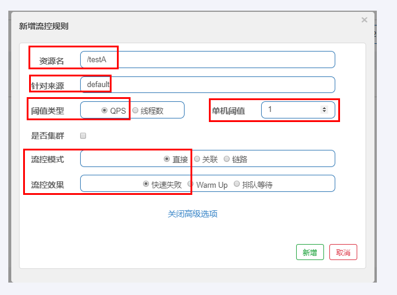
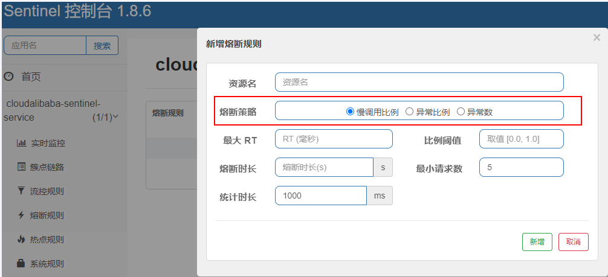

# SpringCloud

## 1. springcloud 对应的组件？

- 服务注册发现
  - nacos   （cloud alibaba）
  - consul （cloud最新）
  - eureka   (淘汰)

- 负载均衡
  - LoadBalancer (cloud最新)
  - ribbon (淘汰)
- 服务调用
  - openFeign
- 断路器
  - CircuitBreaker （cloud最新）
  - hystrix (淘汰)
- 网关
  - gateway
- 分布式链路追踪
  - Sleuth(Micrometer) + ZipKin
- SpringCloud Alibaba Nacos
  - 服务注册和配置中心
- SpringCloud Alibaba Sentinel
  - 服务的熔断和限流
- SpringCloud Alibaba Seata
  - 分布式事务


## 2. CAP&BASE理论

### 1. CAP

- Consistency
  - 一致性
  - 所有节点访问同一份最新的数据副本
- Availability
  - 可用性
  - 非故障的节点在合理的时间内返回合理的响应
- Partition Tolerance
  - 分区容错性
  - 分布式系统出现网络分区的时候，仍然能够对外提供服务
- **CAP 理论中分区容错性 P 是一定要满足的，在此基础上，只能满足可用性 A 或者一致性 C**


- 常见注册中心
  - zookeeper保证的是cp
    - 任何时刻对 ZooKeeper 的读请求都能得到一致性的结果
    - zookeeper 不保证每次请求的可用性
  - eureka保证的是ap
    -  Eureka 保证即使大部分节点挂掉也不会影响正常提供服务，只要有一个节点是可用的就行了
  - nacos 支持ap和cp

### 2. BASE理论

- Basically Available
  - 基本可用
  - 分布式系统在出现不可预知故障的时候，允许损失部分可用性。但是，这绝不等价于系统不可用
- Soft-state
  - 软状态
  - 允许系统中的数据存在中间状态（**CAP 理论中的数据不一致**），并认为该中间状态的存在不会影响系统的整体可用性，即允许系统在不同节点的数据副本之间进行数据同步的过程存在延时
- Eventually Consistent
  - 最终一致性
  - 最终一致性强调的是系统中所有的数据副本，在经过一段时间的同步后，最终能够达到一个一致的状态
- 核心思想
  - 即使无法做到强一致性，但每个应用都可以根据自身业务特点，采用适当的方式来使系统达到最终一致性


## 3. SpringCloud Gateway

### 1. spring cloud gateway 支持限流吗

- 支持，限流是一种常见的微服务网关功能，用于控制对后端服务的请求流量，以防止过载和保护后端服务

- 内置的限流过滤器是基于令牌桶算法或漏桶算法实现的

  - 令牌桶算法：允许一定的突发流量
  - 漏桶算法则可以平滑请求流量

- 实现

  - 方法一

    - 使用RequestRateLimiterGatewayFilterFactory来配置基于令牌桶算法的限流策略

      ```yaml
      spring:
        cloud:
          gateway:
            routes:
              - id: my_route
                uri: http://example.org
                predicates:
                  - Path=/foo/**
                filters:
                  - name: RequestRateLimiter
                    args:
                      key-resolver: "#{@userKeyResolver}"
                      redis-rate-limiter.replenishRate: 1
                      redis-rate-limiter.burstCapacity: 3
      
      ```

  - 方法二

    - 自定义限流过滤器，实现GatewayFilter接口

      ```java
      @Component
      public class CustomRateLimiterFilter implements GatewayFilter, Ordered {
          // 实现限流逻辑
      }
      
      ```

      

## 4. 分布式ID

### 1. 雪花算法

雪花算法（Snowflake）是一种分布式唯一ID生成算法，它的实现原理是基于Twitter的Snowflake算法。Snowflake算法的核心思想是将一个64位的整数ID分成三部分：时间戳、机器ID和序列号。具体实现如下：

1. 时间戳部分（41位）：记录生成ID的时间，精确到毫秒级，可以用69年。

2. 机器ID部分（10位）：记录机器的ID，可以分配1024台机器。

3. 序列号部分（12位）：记录同一毫秒内生成的ID序号，可以生成4096个ID。

Snowflake算法的优点包括：

1. 分布式唯一性：每个ID都是唯一的，且可以在分布式系统中生成。

2. 高性能：生成ID的速度很快，不会影响系统的性能。

3. 简单易用：Snowflake算法的实现比较简单，可以轻松集成到各种系统中。

Snowflake算法的缺点包括：

1. 时钟回拨问题：如果系统时钟发生回拨，可能会导致生成的ID不唯一。

2. 依赖机器ID：需要为每台机器分配一个唯一的ID，如果机器数量过多会增加管理成本。

3. 有限的时间范围：由于时间戳部分只有41位，所以Snowflake算法能够使用的时间范围是有限的。

总的来说，雪花算法是一种简单高效的分布式ID生成算法，适用于大多数分布式系统。但在实际应用中需要注意时钟回拨问题和机器ID的管理。

### 2. 美团叶子算法

- leaf- 解决了雪花算法时钟回拨问题

## 5. 分布式锁

- redisson


## 6. 分布式事务

### 1. 2PC 3PC TCC了解么

- 2pc

  - 两阶段提交，将事务的提交过程分为资源准备和资源提交提交两个阶段，并且由事务协调者来协调所有事物参与者；如果准备阶段所有事物参与者都预留资源成功，则进行第二阶段的资源提交，否则事物协调者回滚资源

  - 第一阶段：准备阶段
  - 第二阶段：提交阶段
    - 事物的提交
    - 事物的回滚
  - 缺点
    - 性能问题
    - 可靠性问题
    - 数据一致性问题
    - 二阶段无法解决的问题
      - 协调者在发出 commit 消息之后宕机，而唯一接收到这条消息的参与者同时也宕机了，那么即使协调者通过选举协议产生了新的协调者，这条事务的状态也是不确定的，没人知道事务是否被已经提交

- 3pc

  - 三阶段提交协议

  - 对2pc的改进，在第一阶段和第二阶段中插入了一个准备阶段
  - 在协调者和参与者中引入超时机制
  - 3pc会分为3个阶段
    - 准备阶段
    - 预提交阶段
      - 执行事务
      - 或者中断事务
    - 提交阶段
      - 提交事务
      - 或者中断事务
  - 优缺点
    - 优点
      - 降低了阻塞范围，并且在等待超时后，协调者或参与者会中断事务，避免了协调者单点问题，
    - 缺点
      - 数据不一致问题依然存在

- TCC

  - 全称：Try Confirm Cancel；是应用层的两阶段提交
  - 核心思想
    - 针对每个操作，都要实现对应的确认和补偿操作，也就是业务逻辑的每个分支都需要实现try、confirm、cancel三个操作

  - tcc的执行流程可以分为两个阶段
    - 第一阶段
      - try: 业务系统做检测并预留资源，比如常见的下单，在try阶段是将下单的库存给锁住
    - 第二阶段
      - 根据第一阶段的结果决定是执行confirm还是cancel
      - cnonfirm : 执行真正的业务
      - cancle: 是对try阶段预留资源的释放（出问题，释放锁）

## 7. 负载均衡

### 1. 负载均衡算法

- 随机法
- 轮询
- 加权轮询
- 加权随机
- 最小并发连接
- 哈希算法

## 8. 服务限流

### 1. 固定窗口计数器算法

- 固定窗口其实就是时间窗口，固定窗口计数器算法规定了单位时间处理的请求数量
- 不推荐使用，体验差

### 2. 滑动窗口计数器算法

- 是固定窗口计数器的升级版
- 它把时间以一定比例分配
- 当滑动窗口的格子划分的越多，滑动窗口的滚动就越平滑，限流的统计就会越精准

### 3.漏桶算法

- 我们可以把发请求的动作比作成注水到桶中，我们处理请求的过程可以比喻为漏桶漏水。我们往桶中以任意速率流入水，以一定速率流出水。当水超过桶流量则丢弃，因为桶容量是不变的，保证了整体的速率
- 漏桶算法强制限制数据的传输速率，使其保持稳定，不允许突发流量，即无论系统的处理能力如何，流出速率总是稳定的，无法处理超过预设速率的突发请求

### 4. 令牌桶算法

1. 基本原理：
   - 令牌桶算法维护一个固定容量的桶，桶中以固定速率生成令牌，每个令牌代表一个请求的处理权限。
   - 当请求到达时，需要从桶中获取一个令牌，如果桶中有足够的令牌，则允许处理该请求；如果桶中没有足够的令牌，则拒绝该请求或者将请求放入队列中等待令牌。
   - 桶中的令牌数量有上限，如果桶满了，新生成的令牌将被丢弃。
   
2. 实现限流的设计过程：
   - 初始化令牌桶，设置桶的容量和令牌生成速率。
   - 定时以固定速率向桶中添加令牌，直到桶满为止。
   - 当请求到达时，尝试从桶中获取一个令牌，如果成功则处理该请求，否则拒绝请求或者将请求放入队列中等待。
   
3. 不足之处：
   
   - 令牌桶算法需要定时地生成令牌，这可能会引入额外的系统开销。
   - 令牌过期问题
   - 令牌生成速率预先设定
   
4. 更好的方案：
   - 漏桶算法与令牌桶算法类似，也是用于流量整形和限速。不同的是，漏桶算法对流入的请求均匀流出，不管请求何时到达，都按固定速率处理。它可以严格控制数据发送速率，且不会允许突发流量，适用于对输出速率有稳定要求且不允许突刺的场景。
   
     


## 9 . openFeigin

### 1. 使用

- 主启动类增加 @EnableFeiginClients
- 业务逻辑接口 @FeignClient

```java
@Component
@FeignClient(value = "CLOUD-PAYMENT-SERVICE")
public interface PaymentFeignService
{
    @GetMapping(value = "/payment/get/{id}")
    CommonResult<Payment> getPaymentById(@PathVariable("id") Long id);
}

```

### 2. 超时时间

- openFeigin默认的超时时间是1秒钟。这意味着如果调用的服务在1秒内没有响应，openFeign将会抛出超时异常，需要修改配置

 ```yaml
 feign:
   client:
     config:
       default:
        ## 连接超时时间，设置了5秒
         connectTimeout: 5000
         ## 读取的超时时间，设置了10秒
         readTimeout: 10000
 
 ```

### 3. feign调用的底层原理

Feign是一个声明式的HTTP客户端，它使得编写Web服务客户端变得非常容易。在Spring Cloud中，Feign被用来实现服务间的调用，即微服务之间的RPC（Remote Procedure Call）通信。

Feign的底层主要依赖于 Ribbon 和 HTTP 客户端（如 Apache HttpClient 或 OkHttp）。其工作原理可以简单描述为：

1. **动态代理**：Feign通过JDK或CGLIB动态代理技术创建一个接口的实现类，这个实现类会包装请求方法，当调用这个方法时，实际上是在执行一个HTTP请求。
2. **编码/解码**：对于方法参数，Feign会通过Encoder进行编码转换成适合HTTP传输的格式（如JSON、XML等），然后通过HTTP客户端发送请求。接收到响应后，再通过Decoder将HTTP响应内容解码成Java对象返回。
3. **负载均衡**：Feign集成了Ribbon，能够实现客户端负载均衡，即在调用远程服务时，可以根据配置的负载均衡策略选择目标服务实例。
4. **Hystrix支持**：默认情况下，Feign集成了Hystrix（可选配置），可以实现服务降级、熔断以及隔离等功能，提高系统的稳定性和容错性。
5. **超时与重试**：通过Ribbon，Feign可以设置请求的超时时间和重试次数等策略。

总结来说，Feign利用了Ribbon的客户端负载均衡和多种HTTP客户端库的能力，结合自己强大的API声明式定义和处理机制，使得服务间调用变得更加简洁、高效且易于维护。

### 4. feign 优化

- 超时设置优化
- 默认HttpClient修改为Apache HttpClient
- 对请求和响应进行GZIP压缩

## 10 Hystrix

### 1. 服务降级

- 定义
  - 服务器忙，请稍后再试，不让客户端等待并立刻返回一个友好提示，fallback
- 哪些情况会发生降级
  - 程序运行异常
  - 超时
  - 服务熔断触发服务降级
  - 线程池/信号量打满也会导致服务降级
  - **配置的降级策略生效**：在一些框架（如Hystrix、Sentinel）中，可以根据预先设定的规则（如RT响应时间、QPS请求数量等）自动触发服务降级

### 2. 服务熔断

- 定义

  - 类似保险丝达到最大服务访问后，直接拒绝访问，拉闸限电，然后调用服务降级的方法并返回友好提示

  - 服务的降级-->进而熔断-->恢复调用链路

### 3. 服务限流

- 定义
  - 秒杀高并发等操作，严禁一窝蜂的过来拥挤，大家排队，一秒钟N个，有序进行


### 4. 注解

#### 1. @HystrixCommand

- 服务降级
- 需要有一个兜底的方法

```java
@HystrixCommand(fallbackMethod = "paymentInfo_TimeOutHandler",commandProperties = {
            @HystrixProperty(name="execution.isolation.thread.timeoutInMilliseconds",value="3000")
    })
public String paymentInfo_TimeOut(Integer id){}

```


#### 2. @DefaultProperties(defaultFallback = "")

- @HystrixCommand 需要在每个方法配置一个，太繁琐

```java
@DefaultProperties(defaultFallback = "payment_Global_FallbackMethod")
public class PaymentHystirxController{}

```


## 11. sentinel

### 1. @SentinelResource

- 可以对资源进行限流、熔断、降级等操作

  ```java
  @SentinelResource(value = "resourceName", blockHandler = "handleBlock")
  public String getResource() {
      // 方法逻辑
  }
  
  ```

  在上面的例子中，`@SentinelResource` 注解标识了 `getResource` 方法为 Sentinel 的资源，其中 `value` 属性指定了资源的名称。另外，通过 `blockHandler` 属性指定了当资源被流控时的处理方法，即 `handleBlock` 方法。这样就可以实现对资源的限流操作。

  除了 `blockHandler` 属性外，`@SentinelResource` 注解还支持其他属性，比如 `fallback`、`defaultFallback` 等，用于指定资源被降级或熔断时的处理方法

### 2. 限流规则

- 流控

  - 直接
  - 关联

  

- 熔断

  

- 热点规则
- 授权规则

## 12 . Seata

### 1. 使用

- @GlobalTransactional

### 2. 三大组件

- TC
  - 全局事务协调器，负责全局事务的协调和管理
  - Transaction Coordinator
- TM
  - 事务管理器，负责全局事务的发起、提交和回滚
  - Transaction Manager
- RM
  - 资源管理器，负责管理分支事务的生命周期
  - Resource Manager

- 流程
  - TM 开启分布式事务（TM 向 TC 注册全局事务记录）；
  - 按业务场景，编排数据库、服务等事务内资源（RM 向 TC 汇报资源准备状态 ）；
  - TM 结束分布式事务，事务一阶段结束（TM 通知 TC 提交/回滚分布式事务）；
  - TC 汇总事务信息，决定分布式事务是提交还是回滚；
  - TC 通知所有 RM 提交/回滚 资源，事务二阶段结束。

  

### 3. 底层原理

Seata 提供了多种分布式事务模式，包括 AT（Automatic Transaction）、TCC（Try-Confirm-Cancel）、Saga 和 XA。以下是 Seata 在 AT 模式下解决分布式事务的基本原理：

 Seata AT 模式的底层原理：

1. **全局事务协调器（TC，Transaction Coordinator）**：
   - TC 组件负责维护全局事务的生命周期，包括开启事务、提交事务或回滚事务，并记录全局事务状态。
2. **分支事务协调器（TM & RM，Transaction Manager & Resource Manager）**：
   - TM 是全局事务的发起者，通常嵌入在应用服务中，负责开启全局事务并将本地事务转换为全局事务。
   - RM 是资源管理器，每个数据库作为一个RM，Seata提供了RM代理，将其对接到数据库，负责单机事务的提交和回滚。
3. **事务上下文和undo/redo日志**：
   - 开启全局事务后，Seata 会在每个参与分布式事务的数据库实例上注册分支事务，并在执行SQL前保存原始数据到Undo Log（用于回滚）和在执行后保存已更新的数据到Redo Log（用于重做）。
4. **事务提交与回滚**：
   - 全局提交时，TC 通知所有RM提交分支事务，RM根据Redo Log提交更改。
   - 若任何RM提交失败，则TC通知所有RM回滚，RM根据Undo Log还原事务执行前的状态。
5. **一致性保障**：
   - 通过两阶段提交（2PC）的过程，确保所有分支事务要么全部提交，要么全部回滚，以此来保证分布式事务的一致性。

 流程概览：

1. **开启全局事务**：TM 向 TC 发起全局事务的开启请求，并获得全局事务ID（XID）。
2. **分支事务注册**：在每个数据库操作之前，TM 将本地事务与全局事务关联，并将操作前的原始数据存入 Undo Log。
3. **执行本地事务**：应用正常执行本地 SQL。
4. **分支事务报告**：在本地事务提交前，TM 把分支事务的状态报告给 TC。
5. **全局提交/回滚决策**：TC 根据所有分支事务的状态作出全局提交或回滚的决定，并通知所有RM执行相应的动作。

通过这种方式，Seata AT模式能够在分布式环境下模拟出类似于传统数据库ACID特性的一致性事务行为。


## 13 . nacos

### 1. nacos的心跳机制？

1. **客户端心跳**
   - 对于临时实例（租约模式），Nacos 使用客户端主动上报心跳的方式。每个服务实例在其启动后，通过集成的 Nacos 客户端 SDK 向 Nacos Server 发送心跳，通常是周期性的 HTTP 请求或者 TCP 协议的数据包。
   - 心跳包通常包含服务实例的基本信息和当前状态，比如服务ID、IP地址、端口、权重等信息。
   - 如果服务实例在指定的时间间隔内没有向 Nacos Server 报告心跳，则会被标记为不健康或下线，不再对外提供服务发现，从而防止客户端调用已失效的服务实例。
2. **服务端探测**
   - 对于持久实例（非租约模式），Nacos 采用服务端主动探测的方式来进行健康检查。服务端会按照预设的时间间隔向服务实例发起探测请求，例如发送 HTTP GET 或者 TCP PING 请求。
   - 如果服务实例能正确响应探测请求，那么认为该实例是健康的；如果连续多次探测失败，则服务端会认为该实例不健康，并从服务列表中剔除。


   nacos的心跳默认是5秒，即服务实例默认每隔5秒向nacos服务器发送一次心跳。默认超时时间可能是15秒或者30秒，那么如何通过配置文件修改呢

```java
# Spring Boot 应用中的 application.yml 或 application.properties 文件
spring:
  cloud:
    nacos:
      discovery:
        # 设置服务实例心跳间隔
        heartbeat:
          interval: 5000 # 单位：毫秒，这里设置为5秒，可根据实际需要调整
          timeout: 15000 # 单位：毫秒，这是心跳超时时间，超过这个时间未收到心跳，服务将被视为不健康

        # 根据某些版本或特定场景的配置项，可能会使用如下形式：
        # metadata:
        #   preserved.heart.beat.interval: 5000 # 用于设置心跳间隔
        #   preserved.heart.beat.timeout: 15000 # 设置心跳超时时间

        # Nacos 服务注册中心地址
        server-addr: localhost:8848

注意：上述配置的具体键值可能会随着 Nacos 和 Spring Cloud Alibaba 版本的变化而变化，请根据所使用的 Nacos 客户端版本文档进行准确配置。

如果你不是使用 Spring Cloud 集成而是直接使用 Nacos 客户端 SDK，则需要参考对应的 SDK 文档来配置心跳间隔等参数，通常是在初始化客户端时通过 API 进行设置。
```

### 2. nacos服务注册发现的原理

Nacos 作为阿里巴巴开源的一款集成了服务注册与发现、配置管理、动态DNS服务于一体的中间件，其底层实现服务注册和发现的过程主要包括以下几个关键步骤和技术要点：

1. **服务注册**：
   - 当服务实例启动时，通过集成Nacos SDK，服务实例会向Nacos Server发起注册请求，提交自身的服务ID、IP地址、端口、元数据等信息。
   - Nacos Server接收这些信息并存储在内部的数据结构中，通常是基于内存的高性能数据存储方案，以保证服务注册和查询的高效率。
   - Nacos Server还支持持久化到磁盘或数据库（如MySQL），以便在服务器重启或集群环境下保持服务实例列表的一致性。

2. **服务心跳**：
   - 注册成功后，服务实例会维持一个心跳机制，定期向Nacos Server发送心跳，表明自己的存活状态。
   - 若Nacos Server在指定时间内未收到服务实例的心跳，则认为该实例已下线，并从服务列表中移除。

3. **服务发现**：
   - 当客户端（消费者）需要调用服务时，它会通过Nacos SDK向Nacos Server发起服务发现请求，请求指定服务名下的可用服务实例列表。
   - Nacos Server根据服务名查找对应的服务实例集合，筛选出健康在线的服务实例，并将这些信息返回给客户端。
   - 如果配置了健康检查和负载均衡策略，Nacos还会根据策略进一步过滤和排序服务实例列表。

4. **健康检查**：
   - Nacos支持主动健康检查，通过健康检查插件可以检测服务实例的实际健康状况，例如通过TCP、HTTP等方式验证服务是否可用。

5. **数据同步**：
   - 在集群部署模式下，Nacos Server之间的数据同步采用Raft一致性算法保证数据的强一致性，从而确保各个节点上的服务注册信息和服务发现结果是一致的。

6. **DNS服务**：
   - 另外，Nacos还提供了DNS服务发现模式，客户端可以直接通过DNS协议获取服务实例的IP地址和端口，无需直接调用Nacos API，简化了服务发现过程。

总的来说，Nacos通过一套高效可靠的消息通信机制、数据存储与同步策略以及服务健康监测机制，实现了微服务架构中的服务注册与发现的核心功能。


### 3. nacos动态刷新底层实现

`@RefreshScope` 是 Spring Cloud 体系中用来实现实时刷新配置的一种注解，特别在结合 Nacos 作为配置中心时，能够使得应用在无需重启的情况下，动态更新从 Nacos 中获取的配置。

**@RefreshScope 工作原理概览：**

1. **注入 Bean 时的代理机制：**
   - 当一个类或者方法被标记为 `@RefreshScope` 注解时，Spring 容器不会直接实例化该 Bean，而是通过 CGLIB 或 JDK 动态代理创建一个代理对象。
   - 当其他组件依赖这个 Bean 时，实际上是依赖于这个代理对象。

2. **监听配置变化：**
   - Nacos 客户端（如 `NacosConfigService`）会周期性地或通过长轮询方式从 Nacos 服务器拉取配置信息，检测是否有变更。
   - 当配置发生变更时，Nacos 客户端会接收到通知。

3. **触发刷新：**
   - 配置变化后，Nacos 客户端会通过某种机制（例如发布一个 `RefreshEvent` 事件到 Spring Cloud 的事件广播系统）通知到所有带有 `@RefreshScope` 的 Bean。
   - 在 Spring Cloud 生态中，有一个 `RefreshScope` 类，它实现了 ApplicationListener 接口，因此它可以监听到 `RefreshScopeRefreshedEvent` 或 `RefreshEvent`，并在接收到这些事件时，重新加载并刷新代理对象中的配置属性值。

4. **属性注入更新：**
   - 对于那些通过 `@Value` 注解从配置中心读取的属性，一旦配置刷新，相应的 Bean 属性值也会随之更新。

5. **主动刷新接口：**
   - 除了被动监听配置变化外，也可以通过访问 `/refresh` 端点主动触发整个应用程序范围内的配置刷新。

总结来说，`@RefreshScope` 的作用是配合配置中心（如 Nacos）实现配置的热更新，确保应用在运行时能响应外部配置的变化，从而增强了微服务架构下的灵活性和可运维性。


## 14. xxl-job

### 1.xxl-job 和elastic-job的区别

xxl-job 和 elastic-job 都是用于解决分布式环境下的定时任务调度问题，但它们的设计理念和适用场景有所不同：

**xxl-job**：
- 出自大众点评，后来由阿里云继续维护和开发。
- 它是一个分布式的任务调度框架，采用中心化的设计，调度中心通过数据库锁来保证集群分布式调度的一致性。
- 易于管理和监控，提供友好的Web界面，支持任务失败后的报警功能。
- 依赖MySQL数据库作为持久化存储，不依赖Zookeeper等分布式协调服务。
- 优势在于其简洁易用，对于中小规模的分布式任务调度场景非常适合。

**elastic-job**：
- 原先是由当当网开发，现在属于Apache ShardingSphere生态的一部分。
- 分为Elastic-Job-Lite和Elastic-Job-Cloud两种模式，分别对应轻量级和云原生的解决方案。
- Elastic-Job-Lite是去中心化的解决方案，无需中心节点，基于Zookeeper实现分布式协调。
- 强调弹性和可扩展性，支持任务分片和作业失败的转移执行，提供丰富的容错策略。
- 对于大规模分布式任务调度，尤其是需要高性能和高度弹性的场景，Elastic-Job的功能更加全面和强大。

选择哪一个更好主要取决于您的实际需求：

- 如果你的任务调度需求比较简单，部署规模较小，对运维界面友好度和易于入门有较高要求，那么xxl-job可能是更好的选择。
- 如果你需要处理大量分布式任务，强调任务的弹性分配、高可用性和强大的容错机制，且愿意接受更高的学习成本，那么Elastic-Job可能更适合。

总的来说，两者都是优秀的产品，关键在于评估自身项目的技术栈、任务规模、扩展性需求以及团队对相关技术的熟悉程度等因素，从而做出合适的选择。


### 2. xxl-job是如何保证分布式下只有一个任务执行的，原理是什么？

XXL-JOB 为了保证分布式环境下同一个任务只有一个执行器执行，采用了中心化调度和分布式锁机制来防止任务重复执行。具体原理如下：

1. **中心化调度**：
   - XXL-JOB 设计了一个调度中心（xxl-job-admin），所有的任务调度指令都由调度中心统一发出。
   - 所有执行器（xxl-job-executor）会向调度中心注册自己及其所能执行的任务列表。
   - 当调度中心根据CRON表达式计算出某个任务应该被执行时，它会选择一个执行器（通常是轮询或基于权重选择）来执行该任务。

2. **分布式锁**：
   - 调度中心在数据库中存储任务调度的相关信息，其中包括任务的执行状态、下次执行时间等。
   - 在确定执行任务的执行器时，调度中心会使用数据库锁（如悲观锁或者乐观锁）来确保同一时刻只有一个执行器获得执行任务的权利。
   - 当一个执行器领取到任务准备执行时，会在数据库中标记任务为锁定状态，其他执行器此时尝试领取同一任务时就会发现任务已被锁定，从而避免了重复执行。

3. **任务唯一标识与执行记录**：
   - 每个任务都有唯一的标识符，执行器在执行任务前会检查任务是否已经被执行或正在执行，这是通过查询数据库中任务调度记录表实现的。
   - 如果发现任务正在执行或已完成，则不会再执行该任务。

4. **数据库原子操作**：
   - 在任务调度过程中，调度中心通过数据库事务来保证任务分配和执行状态更新的原子性，确保无论何时只有一个执行器成功领到任务并执行。

总结来说，XXL-JOB通过中心化的调度策略结合数据库的原子操作和分布式锁机制，有效防止了分布式环境下任务的并发执行问题，确保了任务的幂等性。


## 15. skywalking 底层是如何实现分布式链路追踪的

### 1. skywalking 底层是如何实现分布式链路追踪的

Apache SkyWalking 是一个开源的可观测性平台，用于分布式系统的链路追踪、性能监控和诊断。其底层实现分布式链路追踪的核心原理主要包括以下几个方面：

1. **探针(Agent)**：
   - SkyWalking 使用探针（Agent）植入到各个服务的进程中，这些探针通常是以Javaagent的形式存在，也可以是语言特定的SDK。探针的主要作用是在服务的方法调用前后插入追踪点，记录span（基本追踪单元）数据，包括请求的开始时间、结束时间、跨度、操作类型、调用关系、以及相关的元数据（如HTTP请求头、响应码、错误信息等）。

2. **Span与Trace概念**：
   - 在SkyWalking中，一个完整的调用链路称为一个Trace，Trace由一系列的Span组成，每个Span代表一次服务间的调用或一次服务内部的操作。
   - Span包含了操作的详细信息，例如服务名称、操作名、开始和结束时间戳、执行耗时等，并且每个Span都有一个全局唯一的Trace ID和Span ID，以及可选的Parent Span ID来标识调用层级和父子关系。

3. **采样与上报**：
   - Agent会对服务产生的Spans进行采样，即根据配置的采样策略决定哪些Span需要被记录并上报给OAP服务器。采样策略既可以是全量记录，也可以是基于比例或条件触发的。
   - 上报的数据通常经过高效的序列化之后，通过gRPC或者HTTP等方式发送给OAP服务器。

4. **OAP服务(Observability Analysis Platform)**：
   - OAP服务器负责接收来自各服务探针的Span数据，将它们存储在一个集中的存储系统中，如Elasticsearch、H2、MySQL、TiDB等。
   - OAP还负责对收集的数据进行聚合、分析和索引，以便于后续查询和展示。

5. **跟踪上下文传递**：
   - 在分布式系统中，SkyWalking通过传递跟踪上下文（通常是通过ThreadLocal或者其他语言特性的上下文传播机制）来串联整个请求链路中的各个Span，确保跨进程、跨服务的调用能够形成完整的调用链。

6. **可视化展示**：
   - 最终，SkyWalking提供了一个UI界面，可以将收集到的分布式链路信息以拓扑图和调用链详情等形式展现出来，帮助开发者和运维人员直观理解系统间的调用关系、识别性能瓶颈和定位问题。

通过以上的方式，SkyWalking实现了跨越分布式系统各个服务和组件的链路追踪，使得复杂的微服务架构中的请求路径变得透明和可追溯。
